# DETAILED SYSTEM DESIGN (DSD)
## Cloud-Native Library Management System (LMS)

---

**Document Version**: 1.1.0  
**Phase**: Phase 2 – Detailed System Design  
**Status**: BASELINE LOCKED FOR FINAL APPROVAL  
**Author**: Principal Software Architect & Senior Systems Designer  
**Approved Baselines**: 
- [Phase 0 Master Project Architecture Document (v1.1.0)](../02-architecture/MASTER_ARCHITECTURE.md)
- [Phase 1 Software Requirements Specification (v1.1.0)](../01-requirements/SOFTWARE_REQUIREMENTS_SPECIFICATION.md)  
**Classification**: System Architecture & Interaction Design  
**Implementation Policy**: *STRICT GATE — Implementation (Phase 14) must not begin until all planning and architecture phases (Phases 1 through 13) have been fully completed and approved.*

---

## TABLE OF CONTENTS
1. [Document Control & Diagram Inventory](#1-document-control--diagram-inventory)
2. [Purpose and Scope](#2-purpose-and-scope)
3. [System Component Model](#3-system-component-model)
4. [System Context Diagram](#4-system-context-diagram)
5. [Logical Runtime Interaction Model](#5-logical-runtime-interaction-model)
6. [Component Responsibility Matrix](#6-component-responsibility-matrix)
7. [End-to-End Request Lifecycle](#7-end-to-end-request-lifecycle)
8. [Authentication Flow Design](#8-authentication-flow-design)
9. [Authorization Flow Design](#9-authorization-flow-design)
10. [User Management Interaction Design](#10-user-management-interaction-design)
11. [Book Catalog Interaction Design](#11-book-catalog-interaction-design)
12. [Borrowing Workflow Design](#12-borrowing-workflow-design)
13. [Book Return Workflow Design](#13-book-return-workflow-design)
14. [Circulation State Machine](#14-circulation-state-machine)
15. [Book Availability State Model](#15-book-availability-state-model)
16. [Administrative Action Design](#16-administrative-action-design)
17. [Error and Failure Propagation Model](#17-error-and-failure-propagation-model)
18. [Data Flow Design](#18-data-flow-design)
19. [Trust Boundaries](#19-trust-boundaries)
20. [Failure Mode and Recovery Overview](#20-failure-mode-and-recovery-overview)
21. [Scalability Interaction Model](#21-scalability-interaction-model)
22. [Observability Interaction Model](#22-observability-interaction-model)
23. [System Design Decisions and Rationale](#23-system-design-decisions-and-rationale)
24. [Technical Decisions Deferred to Downstream Phases](#24-technical-decisions-deferred-to-downstream-phases)
25. [Requirements Traceability Matrix](#25-requirements-traceability-matrix)
26. [Phase 2 Acceptance Criteria](#26-phase-2-acceptance-criteria)

---

## 1. Document Control & Diagram Inventory

### 1.1 Document Metadata
| Field | Value |
|---|---|
| **Document Title** | Detailed System Design (DSD) - Cloud-Native Library Management System |
| **Document Version** | 1.1.0 |
| **Document Status** | BASELINE LOCKED FOR FINAL APPROVAL |
| **Project Name** | Cloud-Native Library Management System (LMS) |
| **Author** | Principal Software Architect & Senior Systems Designer |
| **Current Phase** | Phase 2 – Detailed System Design |
| **Next Phase** | Phase 3 – Database Architecture |
| **Architectural Model**| Modular Application Architecture (Modular Monolith) |

### 1.2 Revision History
| Version | Date | Author | Summary of Changes |
|---|---|---|---|
| 1.0.0 | 2026-09-07 | Systems Design Team | Initial draft of Phase 2 Detailed System Design. |
| 1.1.0 | 2026-09-07 | Systems Design Team | Final baseline correction: <br/>1. Generalize all implementation-specific decisions (HTTP status codes, RFC error formats, container configs, database mechanisms, specific monitoring tools) to downstream phases.<br/>2. Redefine frontend delivery component as a logical delivery service.<br/>3. Generalize authentication, authorization, and circulation consistency requirements.<br/>4. Standardize circulation state terminology to `ACTIVE`, `OVERDUE`, and `RETURNED`.<br/>5. Establish verified 12-diagram inventory with exact titles and document sections.<br/>6. Update traceability and verify strict phase boundaries. |

### 1.3 Related Approved Documents
- [Phase 0 Master Project Architecture Document (v1.1.0)](MASTER_ARCHITECTURE.md)
- [Phase 1 Software Requirements Specification (v1.1.0)](../01-requirements/SOFTWARE_REQUIREMENTS_SPECIFICATION.md)
- [Project Repository Master README](../../README.md)

### 1.4 Verified Diagram Inventory
This document contains exactly **12 formal Mermaid design diagrams**:

| Diagram # | Diagram Title | Document Section | Diagram Purpose |
|---|---|---|---|
| **1** | System Context Diagram (C4 Context) | Section 4 | Illustrates external actors, cloud ingress boundary, application boundary, database tier, and platform services. |
| **2** | Logical Runtime Interaction Model | Section 5 | Details runtime interaction between browser client, ingress routing, frontend delivery, backend processing, and persistent storage. |
| **3** | End-to-End Request Lifecycle Sequence | Section 7 | Traces a complete user request across client, gateway, middleware verification, business logic, consistency management, and response formatting. |
| **4** | User Registration Interaction Sequence | Section 8.1 | Models registration submission, syntax validation, uniqueness check, secure credential storage, and user redirection. |
| **5** | Authentication and Session Renewal Sequence | Section 8.2 | Models identity verification, session establishment, protected request evaluation, session renewal, and replay intrusion revocation. |
| **6** | Authorization Decision Flow | Section 9 | Logic tree modeling access token evaluation, user status validation, administrative role checking, and ownership scoping. |
| **7** | Catalog Search and Administrative Book Creation | Section 11 | Models public catalog querying with filtering and administrative catalog item insertion with audit logging. |
| **8** | Borrowing Workflow Activity & Decision Flow | Section 12.1 | Comprehensive activity model verifying patron status, active loan limits, stock availability, consistency boundaries, and failure branches. |
| **9** | Book Return Workflow Interaction Sequence | Section 13 | Models circulation return processing for both patron self-returns and authorized administrative returns on behalf of patrons. |
| **10** | Circulation Record State Machine | Section 14 | Formal state model defining valid and invalid transitions between `ACTIVE`, `OVERDUE`, and `RETURNED`. |
| **11** | Logical Error and Failure Propagation Model | Section 17 | Flowchart categorizing system faults into logical error types and routing them to standardized client feedback. |
| **12** | High-Level Data Flow Model | Section 18 | Data pipeline mapping data origins, application processing boundaries, and persistent storage boundaries. |

---

## 2. Purpose and Scope

### 2.1 Purpose of Detailed System Design
This document translates the approved requirements from Phase 1 into a clear, implementation-independent system interaction model. It defines:
- The logical components comprising the system and their respective boundaries.
- How components collaborate and communicate to execute core circulation and administrative workflows.
- Where trust boundaries exist and how security controls are logically positioned.
- The state machines governing circulation lifecycles and physical book copy balances.
- How failures and errors propagate through the system to guarantee stability and user transparency.

### 2.2 Relationship to Approved Baselines
- **Phase 0 Master Project Architecture**: Inherits the three-tier architectural separation, the modular application model, and the dual infrastructure profiles (Production Reference vs. Cost-Optimized Student Deployment).
- **Phase 1 Software Requirements Specification**: Fulfills functional requirements (`FR-AUTH`, `FR-USER`, `FR-BOOK`, `FR-BORROW`, `FR-ADMIN`) and confirmed business rules (`BR-001` through `BR-016`).

### 2.3 Explicit Phase Boundaries & Exclusions
In strict compliance with engineering lifecycle governance, this document does not specify implementation-level mechanics. The following concerns are formally deferred:
- Database schemas, collection models, and indexing strategies are deferred to **Phase 3 (Database Architecture)**.
- REST API endpoint routes, HTTP status codes, RFC error envelope formats, request/response DTOs, and controller implementations are deferred to **Phase 4 (Backend Architecture)**.
- Component JSX trees, UI layouts, and styling tokens are deferred to **Phase 5 (Frontend Architecture)**.
- Token signing algorithms, cookie attribute parameters, and cryptographic implementation mechanics are deferred to **Phase 6 (Security Architecture)**.
- Container base images, Dockerfiles, and web-server configs are deferred to **Phase 8 (Docker Containerization Design)**.
- Cloud networking, VPC CIDRs, subnets, and load balancer provisioning are deferred to **Phase 9 (AWS Infrastructure Architecture)**.
- Kubernetes deployment manifests, pod specs, and autoscaling triggers are deferred to **Phase 10 (Kubernetes & EKS Architecture)**.
- CI/CD workflow YAML pipelines are deferred to **Phase 11 (CI/CD Architecture)**.
- Monitoring agents, telemetry scrapers, and dashboard tools are deferred to **Phase 12 (Monitoring, Logging & Scalability)**.
- Implementation source code is strictly barred until **Phase 14 (Implementation)**.

---

## 3. System Component Model

The system decomposes into cohesive logical components across five architectural tiers:

```
+-----------------------------------------------------------------------------+
|                            SYSTEM COMPONENT MODEL                           |
+-----------------------------------------------------------------------------+
| 1. CLIENT LAYER                                                             |
|    - Patron Web Client (Interactive application runtime in patron browser)  |
|    - Administrator Web Client (Administrative console in admin browser)     |
|                                                                             |
| 2. PRESENTATION / GATEWAY LAYER                                             |
|    - Frontend Delivery Component (Secure delivery of compiled client app)   |
|    - Backend Application Gateway (Request dispatching, correlation, ingress)|
|                                                                             |
| 3. LOGICAL BACKEND SUBSYSTEMS (Modular Monolith)                            |
|    - Authentication Subsystem (Identity verification, session credentials)  |
|    - Authorization Subsystem (Role verification, resource ownership scoping)|
|    - User Management Subsystem (Profile updates, account status governance) |
|    - Book Catalog Subsystem (Catalog discovery, filtering, metadata CRUD)   |
|    - Circulation Subsystem (Consistent borrow/return, loan rules, status)   |
|    - Audit Subsystem (Append-only administrative and security audit logging)|
|                                                                             |
| 4. PERSISTENCE LAYER                                                        |
|    - Operational Data Storage (Users, Books, Borrowings, Session Records)   |
|    - Audit Data Storage (Immutable event logs)                              |
|                                                                             |
| 5. PLATFORM & INFRASTRUCTURE SERVICES                                       |
|    - Secure Ingress & Routing (Network perimeter, request routing)          |
|    - Application Orchestration (Workload hosting, self-healing, scaling)    |
|    - Centralized Observability (Operational logging, security metrics)      |
|    - Delivery Platform (Automated build, test, and deployment automation)   |
+-----------------------------------------------------------------------------+
```

### 3.1 Detailed Component Specifications

| Component Identifier | Primary Responsibility | Logical Inputs | Logical Outputs | Primary Dependencies | Trust Level | Failure Impact |
|---|---|---|---|---|---|---|
| **Patron Web Client** | Renders patron interface, captures user gestures, maintains session state. | User interactions, API responses. | Operational service requests, rendered views. | Frontend Delivery, Backend Gateway. | Untrusted (Runs in public browser). | Degraded user experience for single client. |
| **Admin Web Client** | Renders administrative console, captures catalog and patron management inputs. | Admin interactions, API responses. | Privileged service requests, rendered management views. | Frontend Delivery, Backend Gateway. | Untrusted (Runs in admin browser). | Administrative operational disruption. |
| **Frontend Delivery Component** | Securely delivers compiled web application assets to browser clients. | Ingress HTTP requests for client assets. | Static web application bundles, fallback routing. | Application Orchestration Platform. | Semi-Trusted (Protected network boundary). | Inability to load application interface. |
| **Backend Application Gateway** | Dispatches incoming requests, establishes correlation contexts, manages edge protection. | Inbound service requests. | Standardized responses, structured error envelopes. | Ingress Routing, Middleware Pipeline. | Trusted Internal Gateway. | Total API service unavailability. |
| **Authentication Subsystem** | Verifies user credentials, issues session credentials, manages session invalidation. | Login/registration inputs, session renewal requests. | Session credentials, user identity profiles. | Operational Data Storage. | High Trust (Handles credentials). | Inability to authenticate or maintain sessions. |
| **Authorization Subsystem** | Enforces Role-Based Access Control; verifies entity ownership boundaries. | User identity claims, target resource identifiers. | Authorization grant / denial decisions. | Authentication Subsystem. | High Trust (Enforces access control). | Unauthorized resource access or denial. |
| **User Management Subsystem** | Governs profile viewing, password modification, and administrative status changes. | Profile updates, status toggle commands. | User profile data, status confirmations. | Auth Subsystem, Data Storage, Audit. | High Trust. | Inability to view or manage patron accounts. |
| **Book Catalog Subsystem** | Manages catalog searches, filtering, catalog item CRUD, and stock readouts. | Search parameters, filter criteria, book data. | Paginated book summaries, book detail records. | Operational Data Storage, Audit Subsystem. | High Trust. | Catalog discovery and inventory CRUD outage. |
| **Circulation Subsystem** | Enforces loan limits, executes consistent borrow and return operations. | Borrow/Return commands with entity identifiers. | Circulation records, inventory availability updates. | Operational Data Storage, Audit Subsystem. | Critical Trust (Core business consistency). | Inventory inconsistencies, phantom loans. |
| **Audit Subsystem** | Records append-only event logs for administrative and security actions. | Audit event payloads (actor, action, timestamp, diff).| Append confirmations, audit query streams. | Audit Data Storage. | High Trust. | Loss of administrative traceability. |
| **Operational Data Storage** | Persists users, books, circulation records, and session records with consistency. | Storage queries, transactional write operations. | Document state, query results. | Managed Persistence Engine. | Critical Trust (Authoritative state). | Complete application failure. |
| **Audit Data Storage** | Persists append-only security and administrative audit records. | Append-only write operations. | Query results for audit inspection. | Managed Persistence Engine. | Critical Trust (Immutable audit trail). | Inability to audit historical actions. |

---

## 4. System Context Diagram

```mermaid
C4Context
    title Diagram 1: System Context Diagram - Cloud-Native Library Management System

    Person(patron, "Library Patron", "Registered student or member borrowing and returning books.")
    Person(admin, "Library Administrator", "Staff member managing catalog, patrons, and circulation.")

    Enterprise_Boundary(cloud_boundary, "Cloud Infrastructure Boundary (Protected Network)") {
        System_Boundary(ingress_boundary, "Secure Ingress & Perimeter Routing") {
            System(ingress_lb, "Load Balancing & Ingress Routing", "Edge termination, secure request routing to application services.")
        }

        System_Boundary(app_boundary, "Application Orchestration Platform") {
            System(frontend_svc, "Frontend Delivery Component", "Responsible for securely delivering compiled web application to browsers.")
            System(backend_svc, "Backend Application Services", "Modular application executing authentication, catalog, circulation, and audit logic.")
        }

        System_Boundary(telemetry_boundary, "Centralized Observability Platform") {
            System(monitoring, "Centralized Logging & Monitoring", "Aggregates operational logs, security metrics, and health telemetry.")
        }

        System_Boundary(security_boundary, "Cloud Identity & Access Platform") {
            System(cloud_iam, "Identity & Access Control", "Provides dynamic, scoped credentials for workload execution.")
        }
    }

    Enterprise_Boundary(data_boundary, "Managed Database Tier (Secure Network Isolation)") {
        SystemDb(operational_db, "Operational & Audit Persistence", "Authoritative persistence for library data, transactions, and append-only audit records.")
    }

    Enterprise_Boundary(devops_boundary, "Continuous Delivery Platform") {
        System(cicd_platform, "Automated CI/CD Pipeline", "Automates testing, container image publishing, and deployment rollouts.")
    }

    %% Relationships
    Rel(patron, ingress_lb, "Interacts via secure web protocol")
    Rel(admin, ingress_lb, "Interacts via secure web protocol")

    Rel(ingress_lb, frontend_svc, "Routes static client requests to")
    Rel(ingress_lb, backend_svc, "Routes operational API requests to")

    Rel(backend_svc, operational_db, "Executes consistent queries & transactions")
    Rel(backend_svc, monitoring, "Emits structured logs and operational metrics")
    Rel(backend_svc, cloud_iam, "Acquires scoped execution permissions")

    Rel(cicd_platform, app_boundary, "Executes automated rolling application deployments")
```

---

## 5. Logical Runtime Interaction Model

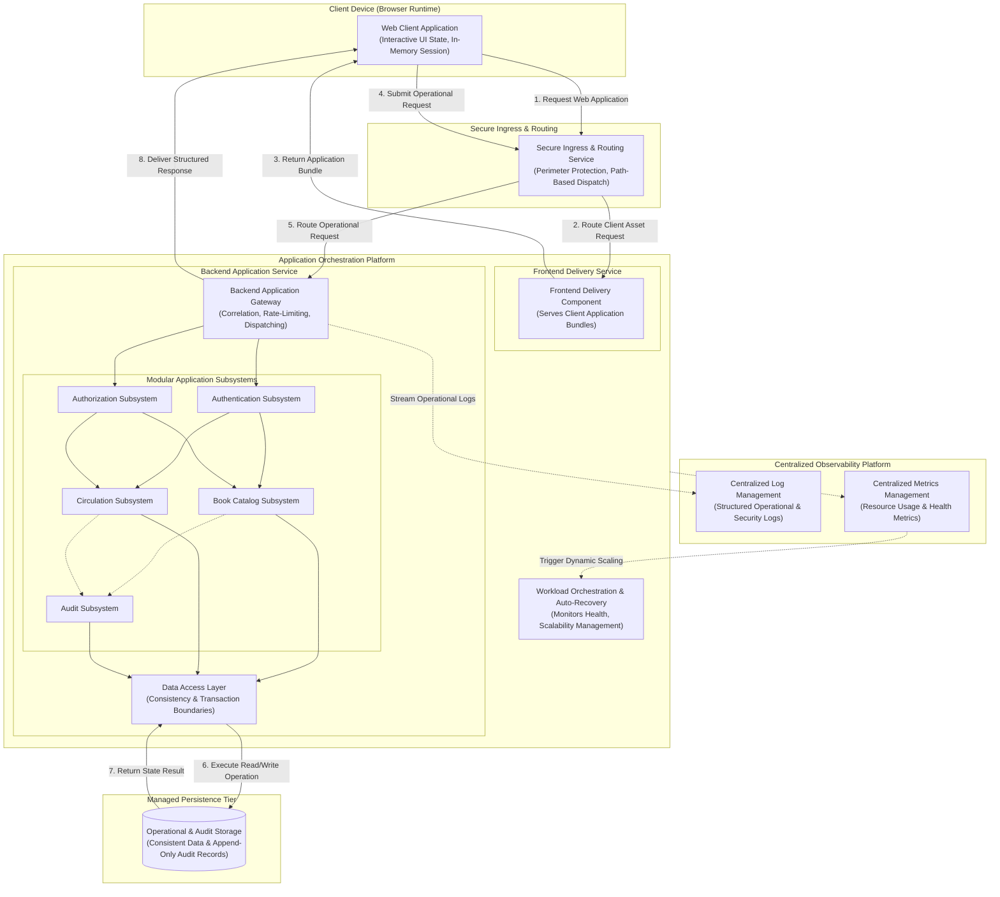

---

## 6. Component Responsibility Matrix

| Logical Component | Owned Responsibilities | Responsibilities Explicitly Excluded | Upstream Callers | Downstream Callees | Failure Consequences |
|---|---|---|---|---|---|
| **Authentication Subsystem** | - User identity verification<br/>- Password hash comparison<br/>- Session credential issuance<br/>- Session revocation and termination<br/>- Replay intrusion detection | - Storing unhashed plaintext passwords<br/>- Enforcing role-based authorization<br/>- Modifying catalog stock<br/>- External email notifications | Backend Gateway, User Management | Operational Data Storage, Audit Subsystem | Users cannot log in, register, or renew sessions. |
| **Authorization Subsystem** | - Role verification (`ROLE_PATRON`, `ROLE_ADMIN`)<br/>- Ownership boundary verification (`user == owner`)<br/>- Privileged administrative route protection | - Validating credentials<br/>- Formatting client responses<br/>- Executing data queries | Backend Gateway, Subsystems | Business Subsystems, Audit Subsystem | Unauthorized privilege escalation or universal request denial. |
| **User Management Subsystem** | - User profile viewing and updates<br/>- Authenticated password modification<br/>- Administrative user search & status toggles | - Unauthenticated password resets<br/>- Self-service account deletion<br/>- Direct database connection management | Client via Backend Gateway | Operational Data Storage, Auth Subsystem, Audit | Inability to update personal info or suspend delinquent patrons. |
| **Book Catalog Subsystem** | - Catalog search execution across metadata<br/>- Genre and availability filtering<br/>- Book metadata CRUD operations<br/>- Soft-deactivation lifecycle<br/>- Real-time stock status readouts | - Enforcing patron borrowing limits<br/>- Managing active loan records<br/>- Barcode/RFID hardware translation | Client via Backend Gateway, Circulation Subsystem | Operational Data Storage, Audit Subsystem | Catalog becomes unsearchable; librarians cannot add or update books. |
| **Circulation Subsystem** | - Enforcing active loan limits (max 5)<br/>- Consistent stock updates during checkout/return<br/>- Standard loan duration assignment (14 days)<br/>- Processing self-returns & administrative returns<br/>- Active loans & historical record assembly | - Financial fine or fee calculations<br/>- Payment processing & payment gateways<br/>- Book reservation / waitlist queues<br/>- External SMS or email dispatch | Client via Backend Gateway, Admin Console | Operational Data Storage, Audit Subsystem | Circulation operations halt; potential stock inconsistencies if atomic boundary breaks. |
| **Audit Subsystem** | - Recording append-only audit event logs<br/>- Capturing actor, action, timestamp, entity ID, and IP<br/>- Providing read-only audit streams to administrators | - Modifying or deleting audit records<br/>- Directing business decisions | Auth, User, Catalog, Circulation Subsystems | Audit Data Storage | Loss of administrative traceability and operational accountability. |
| **Operational Data Storage** | - Durable document persistence<br/>- Transactional consistency guarantees<br/>- Indexing execution for fast discovery | - Business logic validation<br/>- Direct client communication | Data Access Layer (DAL) | Managed Disk Storage | Complete application outage; data retrieval failure. |

---

## 7. End-to-End Request Lifecycle

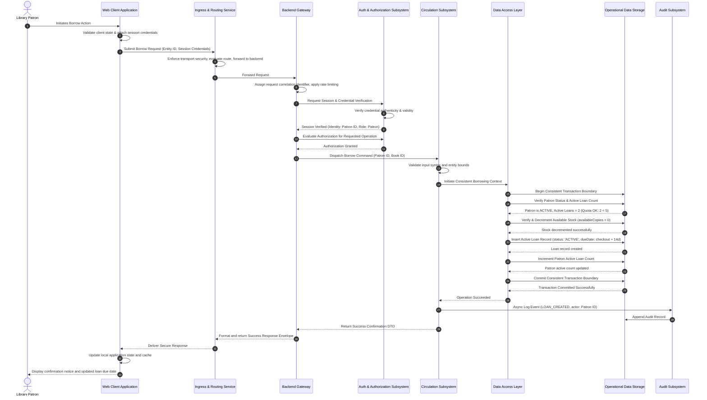

---

## 8. Authentication Flow Design

### 8.1 Registration Flow
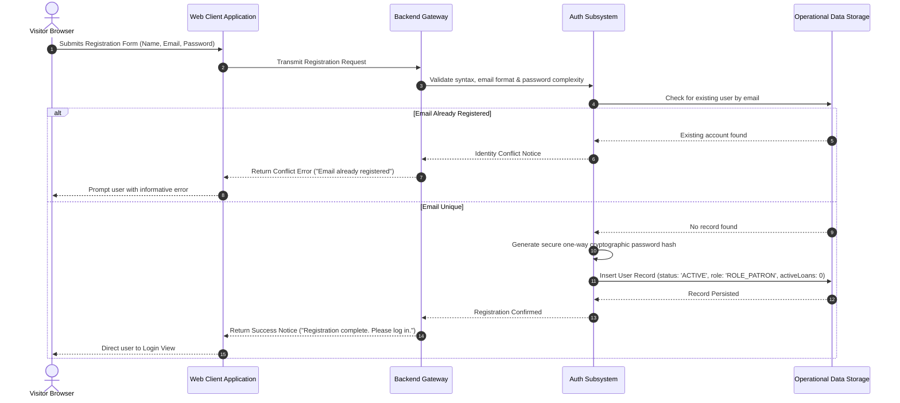

### 8.2 Authentication & Session Renewal Flow (With Replay Intrusion Detection)
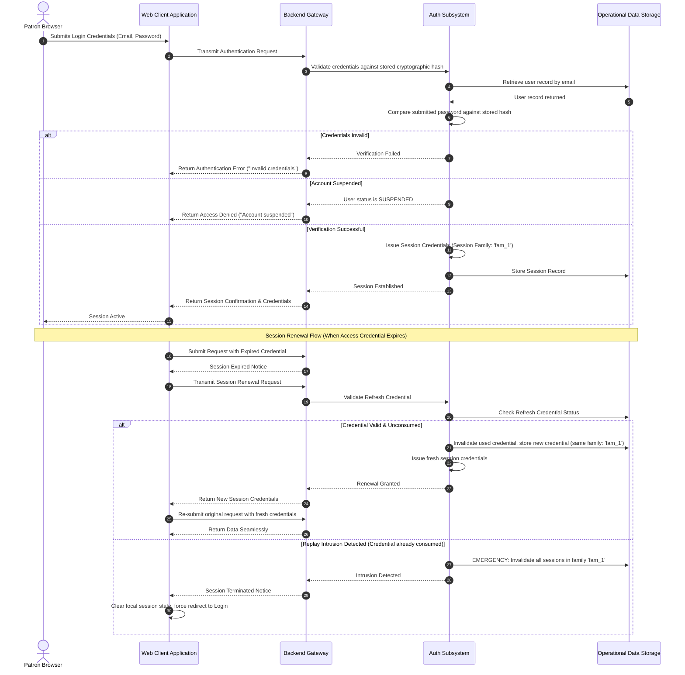

### 8.3 Authenticated Password Change
- **Preconditions**: User possesses an active, authenticated session.
- **Workflow**:
  1. Patron navigates to profile security view, submits current password and new password.
  2. Gateway routes request to User Management and Auth Subsystems.
  3. Auth Subsystem verifies current password against the stored cryptographic hash. If incorrect, rejects with an authentication failure.
  4. System validates that the new password meets complexity rules.
  5. System generates a new one-way cryptographic hash and updates the persistent user record.
  6. System revokes all other active session credentials for that user account to terminate potentially compromised sessions on other devices.
  7. System issues fresh session credentials for the current active client.

---

## 9. Authorization Flow Design

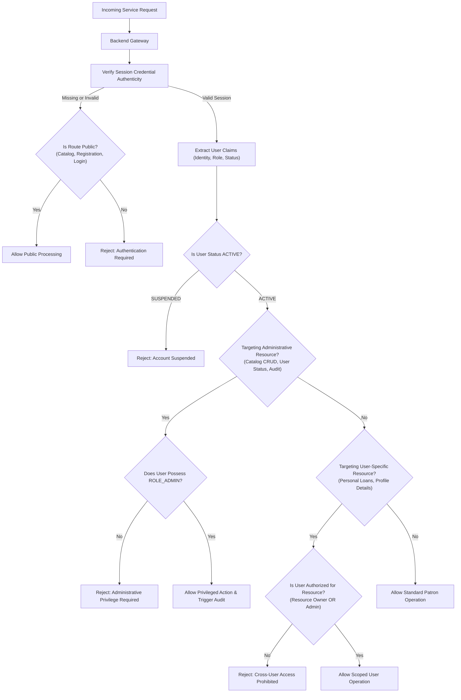

---

## 10. User Management Interaction Design

### 10.1 Patron Profile Inspection & Modification
- **Interaction Flow**: `Patron Client -> Gateway -> User Subsystem -> Operational Data Storage`.
- **Authorization Boundary**: Scoped strictly to the authenticated user. Patrons cannot modify their assigned role, status, or active loan count.
- **Data Mutated**: Personal contact details (Name, Phone Number).

### 10.2 Administrative Patron Oversight & Status Toggling
- **Interaction Flow**: `Admin Client -> Gateway -> User Subsystem -> Operational Storage & Audit Subsystem`.
- **Authorization Boundary**: Requires verified `ROLE_ADMIN`.
- **Status Transitions**:
  - `ACTIVE -> SUSPENDED`: Sets status to `SUSPENDED`; terminates all active sessions for that patron; logs an append-only audit event (`USER_SUSPENDED`).
  - `SUSPENDED -> ACTIVE`: Restores status to `ACTIVE`; logs an audit event (`USER_ACTIVATED`).
  - *Self-Suspension Guard*: System checks that the administrator is not targeting their own account. Self-suspension is strictly prevented.

---

## 11. Book Catalog Interaction Design

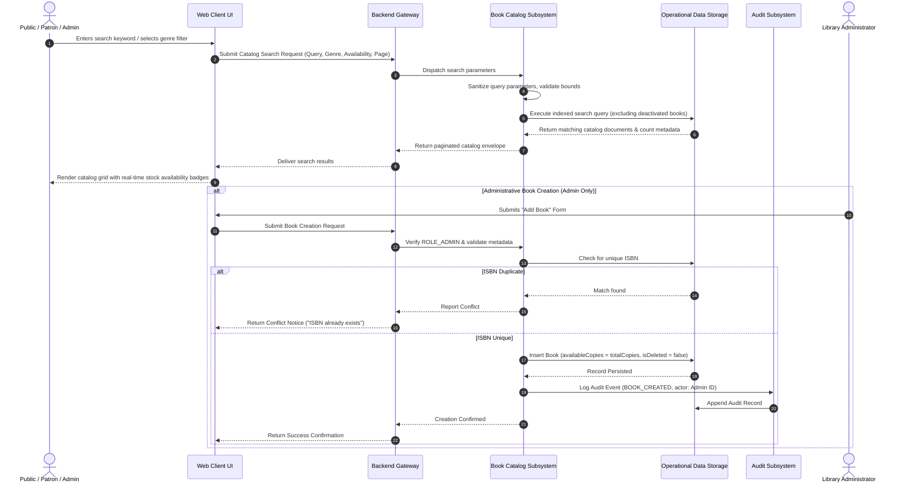

---

## 12. Borrowing Workflow Design

### 12.1 Detailed Activity & Decision Flow
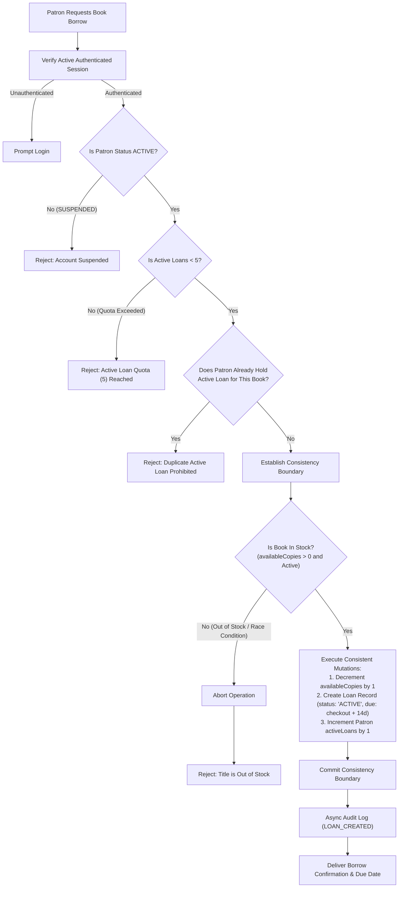

### 12.2 Borrowing Failure Scenario Matrix

| Failure ID | Scenario Trigger | Detection Point | Logical System Response | Consistency Guarantee |
|---|---|---|---|---|
| **FS-BORROW-01** | Patron holds 5 active loans | Quota verification | Rejection: Active loan quota of 5 books reached. | Zero state mutation; quota unchanged. |
| **FS-BORROW-02** | Patron holds active loan for same title | Duplicate check | Rejection: Duplicate active loan prohibited. | Zero state mutation; quota unchanged. |
| **FS-BORROW-03** | Final copy claimed concurrently | Stock decrement step | Rejection: Book is currently out of stock. | Operation aborts; available stock remains 0; zero phantom loan. |
| **FS-BORROW-04** | Patron account suspended | Account status step | Rejection: Account is suspended. | Operation blocked; zero state mutation. |
| **FS-BORROW-05** | Storage connection drop midway | Commit step | Operation aborts cleanly; prompt user retry. | Consistency boundary rolls back all partial writes automatically. |

---

## 13. Book Return Workflow Design

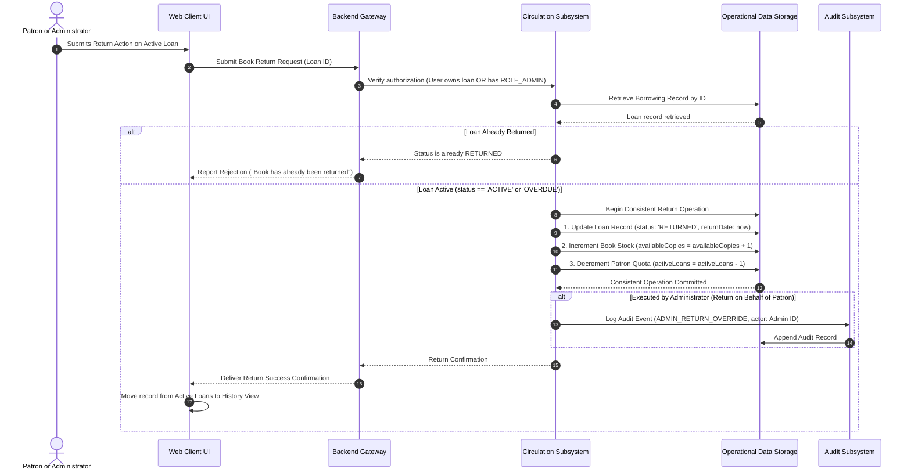

---

## 14. Circulation State Machine

The lifecycle of every borrowing record conforms to a strict, non-reversible state machine:

```mermaid
stateDiagram-v2
    [*] --> ACTIVE : Borrow Operation Completed\n(Triggered by Patron;\nSet dueDate = checkout + 14d)
    
    ACTIVE --> RETURNED : Return Operation Completed\n(Triggered by Patron or Admin;\nExecuted before or on dueDate;\nSets returnDate = now)
    
    ACTIVE --> OVERDUE : Due Date Breached\n(Evaluated dynamically when\ncurrentDate > dueDate)
    
    OVERDUE --> RETURNED : Late Return Operation Completed\n(Triggered by Patron or Admin;\nSets returnDate = now;\nRestores inventory stock)
    
    RETURNED --> [*] : Terminal State\n(Immutable historical archive record)
```

### 14.1 State Transition Rules
1. **`ACTIVE`**: The loan is open and within its standard 14-day borrowing period. The physical copy is in the patron's possession.
2. **`OVERDUE`**: The loan has passed its due date (`currentDate > dueDate`) without being returned. **`OVERDUE` remains an active borrowing obligation** and continues to count against the patron's 5-book quota.
3. **`RETURNED`**: The physical book has been returned to library custody. Stock availability is restored, and patron active loan count is decremented. **`RETURNED` is a terminal state**.
4. **Invalid Transitions**: An already `RETURNED` record cannot transition back to `ACTIVE` or `OVERDUE` under any circumstances. Invalid transitions are strictly rejected.

---

## 15. Book Availability State Model

The relationship between physical book volumes, inventory counters, and public availability is mathematically bound by the following invariant:

$$\text{totalCopies} = \text{availableCopies} + \text{issuedCopies}$$

Where:
- $\text{totalCopies} \ge 1$ (Total physical copies owned by the library).
- $\text{availableCopies} \ge 0$ (Copies currently physically present on the shelf).
- $\text{issuedCopies} = \sum \text{Loans in } (\text{ACTIVE} \cup \text{OVERDUE})$ (Copies currently checked out by patrons).

```
+-----------------------------------------------------------------------------+
|                         BOOK INVENTORY STATE MATRIX                         |
+-----------------------------------------------------------------------------+
| State Identifier    | Condition                   | Public Catalog Visibility |
+---------------------+-----------------------------+---------------------------+
| IN_STOCK            | availableCopies > 0         | Visible: "In Stock"       |
|                     | and isDeleted == false      | (Borrowing Enabled)       |
+---------------------+-----------------------------+---------------------------+
| OUT_OF_STOCK        | availableCopies == 0        | Visible: "Out of Stock"   |
|                     | and isDeleted == false      | (Borrowing Disabled)      |
+---------------------+-----------------------------+---------------------------+
| DEACTIVATED         | isDeleted == true           | Hidden from Public View   |
| (Soft-Deleted)      | (Requires issuedCopies == 0)| (Admin View Only)         |
+---------------------+-----------------------------+---------------------------+
| INVALID / ILLEGAL   | availableCopies < 0 OR      | Strictly Prohibited by    |
|                     | totalCopies < issuedCopies  | Consistency Controls      |
+---------------------+-----------------------------+---------------------------+
```

---

## 16. Administrative Action Design

| Administrative Operation | Required Role | Preconditions | Data Mutation Impact | Audit Record Required? | Failure Behavior |
|---|---|---|---|---|---|
| **Create Book Title** | `ROLE_ADMIN` | Valid unique ISBN; positive copies count. | Inserts new Book record (`availableCopies = totalCopies`, `isDeleted = false`). | **YES** (`BOOK_CREATED`) | Duplicate ISBN returns Conflict Notice. |
| **Modify Book Metadata** | `ROLE_ADMIN` | Target book exists; valid metadata payload. | Updates fields; adjusts stock verifying `newTotal >= issuedCopies`. | **YES** (`BOOK_UPDATED`) | Reducing copies below issued loans rejected. |
| **Deactivate Book Title** | `ROLE_ADMIN` | Target book exists; `issuedCopies == 0`. | Sets `isDeleted = true`. Hides title from public search. | **YES** (`BOOK_DEACTIVATED`) | Active loans exist causes operation rejection. |
| **Suspend Patron Account**| `ROLE_ADMIN` | Target user exists; `targetUserId !== adminId`. | Sets status to `SUSPENDED`; invalidates active patron sessions. | **YES** (`USER_SUSPENDED`) | Self-suspension is strictly rejected. |
| **Activate Patron Account**| `ROLE_ADMIN`| Target user exists in `SUSPENDED` status. | Sets status to `ACTIVE`. | **YES** (`USER_ACTIVATED`) | Already active returns idempotent success. |
| **Return on Behalf of Patron**| `ROLE_ADMIN`| Target loan exists in `ACTIVE` or `OVERDUE` status. | Sets loan `RETURNED`, increments book stock, decrements patron active count. | **YES** (`ADMIN_RETURN_OVERRIDE`)| Already returned causes operation rejection. |

---

## 17. Error and Failure Propagation Model

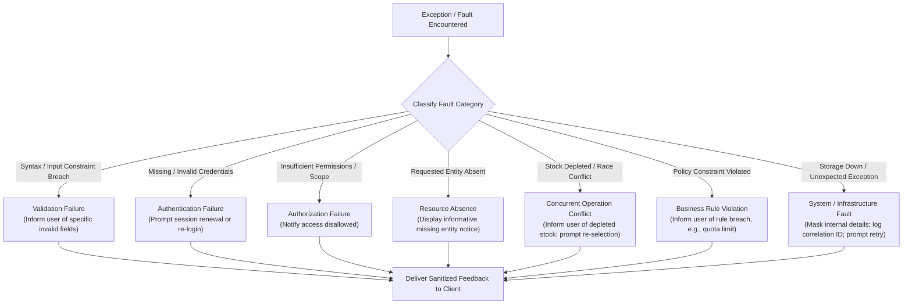

---

## 18. Data Flow Design

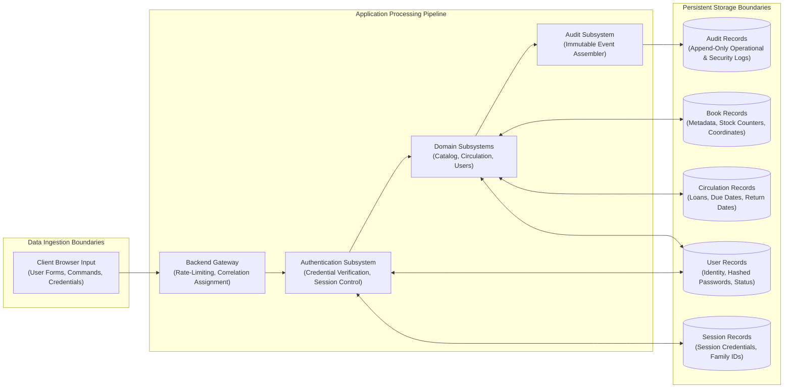

---

## 19. Trust Boundaries

```
+-----------------------------------------------------------------------------+
|                            SYSTEM TRUST BOUNDARIES                          |
+-----------------------------------------------------------------------------+

[BOUNDARY 1: BROWSER RUNTIME (UNTRUSTED)]
  - Untrusted client devices, public networks, arbitrary JavaScript execution.
  - Controls: Ephemeral access credentials in memory; secure session cookies.

═══════════════════════════════════════════════════════════════════════════════
[BOUNDARY 2: PUBLIC NETWORK & EDGE INGRESS (PERIMETER)]
  - Public traffic entering cloud load balancer and ingress routing.
  - Controls: Secure transport encryption; edge rate limiting and filtering.

═══════════════════════════════════════════════════════════════════════════════
[BOUNDARY 3: PRIVATE APPLICATION CLUSTER (TRUSTED INTERNALLY)]
  - Private subnet workloads running Frontend Delivery and Backend Services.
  - Controls: Network isolation; unprivileged non-root execution profiles.

═══════════════════════════════════════════════════════════════════════════════
[BOUNDARY 4: PERSISTENCE & DATABASE TIER (CRITICAL TRUST)]
  - Managed database replica set accessible only through private cloud routing.
  - Controls: Strict network access controls; least-privilege credentials.

═══════════════════════════════════════════════════════════════════════════════
[BOUNDARY 5: ADMINISTRATIVE PRIVILEGE BOUNDARY (RESTRICTED TRUST)]
  - Operations reserved strictly for users with verified `ROLE_ADMIN` status.
  - Controls: Gateway authorization guards; mandatory append-only audit logs.
+-----------------------------------------------------------------------------+
```

---

## 20. Failure Mode and Recovery Overview

| Failure Mode | Scenario Description | Immediate System Behavior | Recovery Mechanism | Responsible Downstream Phase |
|---|---|---|---|---|
| **Frontend Delivery Outage** | Process termination or node failure. | Ingress health check detects failure; traffic diverted to healthy delivery replicas. | Orchestration platform automatically spawns replacement delivery instance. | **Phase 8 (Docker) & Phase 10 (EKS)** |
| **Backend API Outage** | Uncaught process exception or deadlock. | Ingress routing drains connections; liveness check flags process unhealthy. | Process restarted automatically by orchestration platform; zero session loss. | **Phase 4 (Backend) & Phase 10 (EKS)** |
| **Database Primary Node Failure** | Hardware fault at primary persistence node. | Application connection pool catches disconnect; in-flight transactions abort safely. | Database replica set elects new primary automatically in < 30 seconds. | **Phase 3 (Database Architecture)** |
| **Concurrent Borrow Conflict** | Multiple patrons borrow final copy simultaneously. | One operation succeeds; conflicting requests abort cleanly. | Client informed book is out of stock; stock counts remain consistent. | **Phase 3 (DB) & Phase 4 (Backend)** |
| **Replay Intrusion Attempt** | Stolen session credential replayed. | System detects reuse of an invalidated credential. | Emergency family revocation terminates all active sessions for that family. | **Phase 6 (Security Architecture)** |
| **Traffic Spike** | Surging user checkouts before deadlines. | System resource consumption increases. | Horizontal autoscaling automatically expands backend application replicas. | **Phase 10 (EKS) & Phase 12 (Scale)** |

---

## 21. Scalability Interaction Model

1. **Stateless Compute Decoupling**: All backend application instances are completely stateless. No user session state, transaction locks, or uploaded files reside on local application filesystems. Any backend instance can satisfy any patron request.
2. **Horizontal Elasticity**: Workload scaling is managed dynamically by application orchestration autoscaling based on real-time resource pressure metrics.
3. **Database Connection Governance**: To prevent horizontally expanding application instances from overwhelming database connection limits, each backend instance maintains a bounded internal connection pool.
4. **Logarithmic Discovery Scaling**: Catalog searches and circulation lookups scale logarithmically ($O(\log N)$) through structured indexing, avoiding unindexed collection scans.

---

## 22. Observability Interaction Model

The system enforces clear separation across four distinct categories of operational observability:

```
+-----------------------------------------------------------------------------+
|                        SYSTEM OBSERVABILITY TAXONOMY                        |
+-----------------------------------------------------------------------------+
| 1. OPERATIONAL LOGS                                                         |
|    - Structured single-line logs containing correlation IDs and timings.    |
|    - Shipped to centralized logging for debugging and audit inspection.     |
|                                                                             |
| 2. SECURITY EVENTS                                                          |
|    - Captured logs for authentication failures, intrusion replays, and      |
|      unauthorized access attempts; drives security alerting.                |
|                                                                             |
| 3. APPEND-ONLY AUDIT RECORDS                                                |
|    - Persistent business audit records stored in dedicated audit storage.   |
|    - Captures: Book CRUD, user status toggles, return overrides.            |
|    - Read-only access reserved strictly for administrators.                 |
|                                                                             |
| 4. SYSTEM HEALTH METRICS                                                    |
|    - CPU, memory utilization, network I/O, and error rate telemetry.        |
|    - Drives horizontal autoscaling and proactive operational alerts.        |
+-----------------------------------------------------------------------------+
```

---

## 23. System Design Decisions and Rationale

| Decision ID | Logical Design Decision | Architectural Rationale | Alternatives Considered | Downstream Phase Impact |
|---|---|---|---|---|
| **DSD-01** | Modular Monolith Backend Architecture | Avoids distributed microservice network overhead and operational complexity while preserving modular domain separation. | Distributed Microservices, Serverless Functions | Phase 4 (Backend Architecture) |
| **DSD-02** | Ephemeral Access + Secure Session Strategy | Prevents credential theft in client runtimes while maintaining backend statelessness for standard API calls. | Pure LocalStorage tokens, Stateful server sessions | Phase 4 (Backend) & Phase 6 (Security) |
| **DSD-03** | Consistency Boundaries for Circulation | Prevents inventory overselling and negative copy counts under concurrent checkout spikes. | Pessimistic locking, Eventual consistency | Phase 3 (Database Architecture) |
| **DSD-04** | Dual Deployment Infrastructure Profiles | Enables practical, low-cost student deployment (~$35–$65/mo) while documenting an ideal enterprise reference design. | Forcing high-cost multi-AZ AWS setup exclusively | Phase 9 (AWS) & Phase 10 (EKS) |
| **DSD-05** | Append-Only Operational Audit Logging | Ensures accountability for administrative actions without introducing heavyweight external compliance engines. | Modifying historical entities in-place, External SIEM tooling | Phase 3 (DB) & Phase 4 (Backend) |

---

## 24. Technical Decisions Deferred to Downstream Phases

In strict accordance with Phase 2 governance, concrete implementation mechanics are formally deferred as follows:

```
+-----------------------------------------------------------------------------+
|               TECHNICAL DECISIONS DEFERRED TO DOWNSTREAM PHASES             |
+-----------------------------------------------------------------------------+
| Technical Decision Category                  | Target Downstream Phase      |
+----------------------------------------------+------------------------------+
| Database Schemas, Collection Types & Indexes | Phase 3 – Database Arch      |
| Persistence Concurrency & Locking Strategy   | Phase 3 – Database Arch      |
| REST API Routes, DTOs & HTTP Status Codes    | Phase 4 – Backend Arch       |
| RFC Error Envelope Implementations           | Phase 4 – Backend Arch       |
| Backend Middleware Pipeline Assembly         | Phase 4 – Backend Arch       |
| React Component Hierarchy & Layout Shells    | Phase 5 – Frontend Arch      |
| Token Cryptographic Keys & Hashing Algorithms| Phase 6 – Security Arch      |
| Cookie Configuration & Replay Mechanics      | Phase 6 – Security Arch      |
| Container Base Images & Dockerfile Specs     | Phase 8 – Docker Design      |
| AWS VPC CIDRs, Subnets, NAT & ALB Config     | Phase 9 – AWS Infrastructure |
| Kubernetes Manifests, HPA & Ingress Specs    | Phase 10 – Kubernetes & EKS  |
| GitHub Actions CI/CD Pipeline YAMLs          | Phase 11 – CI/CD Arch        |
| Monitoring Agents & Centralized Log Tooling  | Phase 12 – Observability     |
| Automated Test Suites (Unit, E2E, Load)      | Phase 13 – Testing Strategy  |
| Physical Source Code Implementation          | Phase 14 – Implementation    |
+----------------------------------------------+------------------------------+
```

---

## 25. Requirements Traceability Matrix

| Approved Phase 1 Requirement | Logical System Component | Interaction Workflow Reference | Target Downstream Phase |
|---|---|---|---|
| **FR-AUTH-001 (Registration)** | Authentication Subsystem | Section 8.1 (Registration Flow) | **Phase 4** (Auth Service)<br/>**Phase 6** (Security Arch) |
| **FR-AUTH-002 (Login)** | Authentication Subsystem | Section 8.2 (Authentication Flow) | **Phase 4** (Auth API)<br/>**Phase 6** (Security Arch) |
| **FR-AUTH-003 (Logout)** | Authentication Subsystem | Section 8.2 (Session Termination) | **Phase 4** (Auth API) |
| **FR-AUTH-004 (Token Refresh)**| Authentication Subsystem | Section 8.2 (Session Renewal Flow)| **Phase 4** (Auth Service)<br/>**Phase 6** (Security Arch) |
| **FR-USER-001 (View Profile)** | User Management Subsystem | Section 10.1 (Profile Inspection) | **Phase 4** (User API)<br/>**Phase 5** (Profile UI) |
| **FR-USER-002 (Password Change)**| User Management Subsystem | Section 8.3 (Password Change Flow) | **Phase 4** (User Service)<br/>**Phase 6** (Security Arch) |
| **FR-BOOK-001 (Catalog Search)**| Book Catalog Subsystem | Section 11 (Catalog Discovery Flow)| **Phase 3** (Search Index)<br/>**Phase 5** (Search UI) |
| **FR-BOOK-002 (Filter)** | Book Catalog Subsystem | Section 11 (Catalog Filtering Flow)| **Phase 3** (Index Design)<br/>**Phase 5** (Filter UI) |
| **FR-BOOK-003 (Details)** | Book Catalog Subsystem | Section 11 (Book Details View) | **Phase 4** (Book API)<br/>**Phase 5** (Details UI) |
| **FR-BOOK-004 (Availability)** | Book Catalog Subsystem | Section 15 (Book Availability Model)| **Phase 3** (Stock Schema)<br/>**Phase 4** (Book Service) |
| **FR-BORROW-001 (Borrow Book)**| Circulation Subsystem | Section 12 (Borrowing Workflow) | **Phase 3** (Consistency)<br/>**Phase 4** (Loan Service) |
| **FR-BORROW-002 (Return Book)**| Circulation Subsystem | Section 13 (Book Return Workflow) | **Phase 3** (Consistency)<br/>**Phase 4** (Loan Service) |
| **FR-BORROW-003 (Active Loans)**| Circulation Subsystem | Section 12 & Section 14 (State Machine)| **Phase 4** (Loan API)<br/>**Phase 5** (Dashboard UI) |
| **FR-BORROW-004 (History)** | Circulation Subsystem | Section 14 (Terminal State Archive)| **Phase 4** (History API)<br/>**Phase 5** (History UI) |
| **FR-ADMIN-001 (KPIs)** | Admin Subsystem | Section 6 (Responsibility Matrix) | **Phase 4** (Metrics API)<br/>**Phase 5** (Admin Dashboard) |
| **FR-ADMIN-002 (Add Book)** | Book Catalog Subsystem | Section 11 & Section 16 (Admin Action)| **Phase 3** (Book Schema)<br/>**Phase 4** (Admin Book API) |
| **FR-ADMIN-003 (Edit Book)** | Book Catalog Subsystem | Section 11 & Section 16 (Admin Action)| **Phase 3** (Book Schema)<br/>**Phase 4** (Admin Book API) |
| **FR-ADMIN-004 (Deactivate)** | Book Catalog Subsystem | Section 11 & Section 15 (Soft Delete) | **Phase 3** (Index / Flag)<br/>**Phase 4** (Admin Book API) |
| **FR-ADMIN-005 (Manage Users)**| User Management Subsystem | Section 10.2 (Patron Status Toggles)| **Phase 4** (User Service)<br/>**Phase 6** (RBAC Enforcement) |
| **FR-ADMIN-006 (Global Loans)**| Circulation Subsystem | Section 13 & Section 16 (Circulation)| **Phase 4** (Admin Loan API)<br/>**Phase 5** (Admin Views) |
| **FR-ADMIN-007 (Admin Return)**| Circulation Subsystem | Section 13 & Section 16 (Staff Return)| **Phase 4** (Loan Service)<br/>**Phase 6** (RBAC) |
| **FR-ADMIN-008 (Audit Logs)** | Audit Subsystem | Section 16 & Section 22 (Audit Model)| **Phase 3** (Audit Store)<br/>**Phase 4** (Audit API) |

---

## 26. Phase 2 Acceptance Criteria

The Detailed System Design phase shall be formally complete and locked when:
1. **Component Completeness**: All logical components across client, application, backend subsystems, and persistence layers are identified with explicit inputs, outputs, and failure impacts.
2. **Interaction Rigor**: Sequence diagrams and activity models are documented for all major user journeys.
3. **State Consistency Models**: Formal state models are defined using the approved terminology (`ACTIVE`, `OVERDUE`, `RETURNED`) and mathematical inventory bounds.
4. **Governance Compliance**: Zero source code, database schemas, Dockerfiles, Kubernetes manifests, or infrastructure scripts have been created.
5. **Phase Separation Integrity**: All implementation-specific details (HTTP codes, RFC formats, container configurations, database commands, specific monitoring tools) are cleanly generalized and deferred to downstream phases.
6. **Traceability**: All major system workflows trace directly to approved Phase 1 requirements.

---
*End of Detailed System Design (Version 1.1.0). Phase 2 design is complete, internally consistent, implementation-independent, and baseline locked pending formal stakeholder approval to begin Phase 3 (Database Architecture).*
