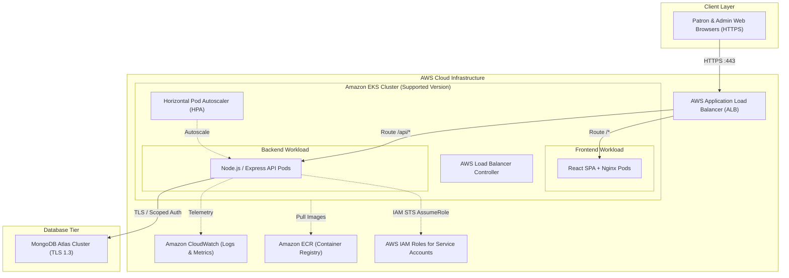

# MASTER PROJECT ARCHITECTURE DOCUMENT
## Cloud-Native Library Management System (LMS)

---

**Document Version**: 1.1.0  
**Author**: Principal Software Architect & Senior DevOps Engineer  
**Classification**: Engineering Architecture & Blueprint  
**Status**: PHASE 0 BASELINE (APPROVED WITH CORRECTIONS)  
**Current Phase**: Phase 0 – Master Project Architecture  
**Next Phase**: Phase 1 – Software Requirements Specification  
**Implementation Policy**: *STRICT GATE — Implementation (Phase 14) must not begin until all planning and architecture phases (Phases 1 through 13) have been fully completed and approved.*

---

## TABLE OF CONTENTS
1. [Executive Summary](#1-executive-summary)
2. [Project Objectives](#2-project-objectives)
3. [Complete Functional Requirements & Scope Control](#3-complete-functional-requirements--scope-control)
4. [Non-Functional Requirements & Scalability Charter](#4-non-functional-requirements--scalability-charter)
5. [User Roles and Permissions](#5-user-roles-and-permissions)
6. [High-Level System Architecture](#6-high-level-system-architecture)
7. [Three-Tier Architecture Explanation](#7-three-tier-architecture-explanation)
8. [Frontend Architecture Overview](#8-frontend-architecture-overview)
9. [Backend Architecture Overview](#9-backend-architecture-overview)
10. [Database Architecture & Connectivity Profiles](#10-database-architecture--connectivity-profiles)
11. [AWS Infrastructure Overview & Dual Deployment Profiles](#11-aws-infrastructure-overview--dual-deployment-profiles)
12. [Docker and Container Architecture](#12-docker-and-container-architecture)
13. [Kubernetes and EKS Architecture](#13-kubernetes-and-eks-architecture)
14. [CI/CD Architecture](#14-cicd-architecture)
15. [Security Architecture Overview](#15-security-architecture-overview)
16. [Scalability Strategy](#16-scalability-strategy)
17. [High Availability Strategy](#17-high-availability-strategy)
18. [Monitoring and Logging Strategy](#18-monitoring-and-logging-strategy)
19. [Disaster Recovery Considerations](#19-disaster-recovery-considerations)
20. [Development Environment Strategy](#20-development-environment-strategy)
21. [Production vs. Student Deployment Profiles](#21-production-vs-student-deployment-profiles)
22. [Repository and Project Structure](#22-repository-and-project-structure)
23. [Technology Selection Justification & Mandatory vs Optional Breakdown](#23-technology-selection-justification--mandatory-vs-optional-breakdown)
24. [Major Technical Decisions and Their Rationale (ADRs)](#24-major-technical-decisions-and-their-rationale-adrs)
25. [Risks and Mitigation Strategies](#25-risks-and-mitigation-strategies)
26. [Governance, Lifecycle Alignment & Complete 15-Phase Roadmap](#26-governance-lifecycle-alignment--complete-15-phase-roadmap)

---

## 1. Executive Summary

### 1.1 Document Scope and Intent
This document establishes the Master Project Architecture for the **Cloud-Native Library Management System (LMS)**. It serves as the governing technical blueprint and baseline for all subsequent planning, design, and architecture phases.

> [!IMPORTANT]
> **Strict Lifecycle Governance**: In strict accordance with engineering governance, this project is structured across **15 discrete phases**. We are currently concluding **Phase 0 (Master Project Architecture)**. Application implementation, backend development, and database provisioning are strictly barred until all planning and architecture phases (Phases 1 through 13) are complete and formally approved.

### 1.2 Technology Stack Summary
- **Client Presentation**: Single Page Application (SPA) built with React 18+ and TypeScript, bundled with Vite, served via unprivileged Nginx alpine reverse proxy containers.
- **Application Services**: Stateless RESTful API service running on Node.js v20 LTS and Express.js with TypeScript, structured using layered clean architecture (Controllers, Services, Repositories).
- **Persistence Tier**: Cloud-hosted MongoDB Atlas with multi-document ACID transactions, indexing, and strict schema validation via Mongoose.
- **Authentication & Authorization**: Stateless JWT access tokens paired with sliding-window, cryptographically signed refresh tokens stored in `httpOnly`, `Secure`, `SameSite=Strict` cookies, with token-family reuse detection.
- **Container Infrastructure**: Hardened, multi-stage Docker images adhering to CIS benchmarks, pushed to private Amazon Elastic Container Registry (Amazon ECR) with automated vulnerability scanning on push.
- **Orchestration**: Managed Kubernetes on Amazon Elastic Kubernetes Service (Amazon EKS) deploying workloads with AWS Load Balancer Controller and Horizontal Pod Autoscalers (HPA).
- **Cloud Infrastructure & Networking**: AWS Virtual Private Cloud (VPC), AWS Application Load Balancers (ALB) with ACM TLS termination, AWS IAM Roles for Service Accounts (IRSA), and AWS CloudWatch Container Insights.
- **Delivery Pipelines**: GitHub Actions monorepo CI/CD pipelines implementing automated static analysis, security scanning, unit/integration testing, container builds, and rolling deployment rollouts to EKS.

### 1.3 Architectural Principles
1. **Separation of Concerns & Modularity**: Presentation, logic, persistence, and deployment boundaries are decoupled cleanly.
2. **Secure by Default**: Zero-Trust network boundaries, least-privilege IAM policies, defense-in-depth security, and OWASP compliance.
3. **Dual Deployment Profiles**: Dedicated specifications for both an ideal Enterprise Production Reference Architecture and a Cost-Optimized Student Deployment.
4. **Pragmatic Scope Discipline**: Strict delineation of Mandatory V1 features versus Future Enhancements to avoid scope bloat.
5. **Standardized Evolution**: EKS/Kubernetes versions, database connectivity mechanisms, and final scaling capacities are governed dynamically by environmental compatibility and empirical metrics rather than hard-coded premature assumptions.

### 1.4 Unresolved Architectural Assumptions Requiring Formal Approval
The following architectural parameters remain open for stakeholder confirmation and will be formally resolved during upcoming design phases:

| ID | Subject | Architecture Assumption & Open Question | Target Resolution Phase |
|---|---|---|---|
| **REQ-01** | Patron Quotas | Initial assumption: Maximum 5 concurrent active loans per patron and 14-day loan duration. Needs library policy sign-off. | Phase 1 (SRS) |
| **REQ-02** | Catalog Attributes | Initial assumption: Core metadata includes Title, Author, ISBN, Genre, Description, Shelf Location. Need confirmation if Dewey Decimal or Barcode/RFID fields are required. | Phase 1 (SRS) & Phase 3 (Database) |
| **INF-01** | AWS Account Profile | Confirmation of student AWS account limits (vCPU quotas, maximum NAT Gateways, educational credit restrictions). | Phase 9 (AWS Infrastructure) |
| **INF-02** | Custom Domain & TLS | Confirmation whether a custom domain with Route 53 and ACM will be provided, or if the student deployment will utilize the default AWS ALB DNS name with self-signed/staging TLS. | Phase 9 (AWS Infrastructure) & Phase 10 (EKS) |
| **DAT-01** | MongoDB Atlas Tier | Selection of MongoDB Atlas M0 (Free Tier for cost-optimized student deployment) vs. M10+ (Dedicated for production reference VPC peering). | Phase 3 (Database) & Phase 9 (AWS Infrastructure) |

---

## 2. Project Objectives

### 2.1 Core Objectives
- **Digital Transformation**: Transition manual catalog discovery and physical borrowing ledgers into a reliable, modern cloud-native system.
- **Transactional Consistency**: Eliminate phantom inventory and book over-borrowing via atomic database operations.
- **Educational & Professional Demonstration**: Serve as a reference model for production-grade DevOps, demonstrating Docker containerization, Amazon ECR, Amazon EKS, ALB Ingress, HPA autoscaling, GitHub Actions CI/CD, and CloudWatch telemetry under a cost-conscious model.
- **Zero Premature Scale Bloat**: Base all scaling provisions on dynamic metrics and clear elasticity patterns rather than speculative static capacity numbers.

---

## 3. Complete Functional Requirements & Scope Control

To guarantee delivery focus and engineering rigor, system features are strictly categorized into **Mandatory Version 1 Features**, **Optional Features**, and **Future Enhancements**.

```
+-----------------------------------------------------------------------------+
|                          SCOPE CLASSIFICATION MATRIX                        |
+-----------------------------------------------------------------------------+
|  [A. MANDATORY VERSION 1]     [B. OPTIONAL (V1.1)]   [C. FUTURE ENHANCEMENTS]|
|  - User Registration          - Book Cover Upload    - Automated Overdue Fines|
|  - Login / Logout (JWT)       - Advanced Multi-Tag   - Payment Processing / GW|
|  - Catalog Search & Filter      Faceted Search       - Lost/Damaged Surcharges|
|  - Book Borrowing (Atomic)    - Export History CSV   - AWS SES Notifications  |
|  - Book Returning (Atomic)    - Patron Self-Profile  - Barcode / RFID Scanning|
|  - Active Loans & History       Avatar Customization - Advanced Analytics & BI|
|  - Admin Book CRUD                                   - Multi-Branch Inventory |
|  - Admin User Management                                                      |
|  - Admin Loan & Inventory Mon.                                                |
+-----------------------------------------------------------------------------+
```

### 3.1 Category A: Mandatory Version 1 Features

#### A.1 Patron / User Features
- **FR-M01: User Registration**: Registration with First Name, Last Name, Email, and Password. Email uniqueness enforced at API and database layers. Password complexity validated and hashed using `bcrypt` (salt factor 12).
- **FR-M02: Authentication & Session**: Login generating ephemeral in-memory JWT Access Tokens (15-minute TTL) and HttpOnly, Secure, SameSite=Strict Refresh Tokens (7-day TTL). Explicit logout invalidating active refresh token.
- **FR-M03: Catalog Search & Discovery**: Real-time search across Title, Author, ISBN, and Synopsis via MongoDB text/compound indexing. Filtering by Genre and Availability (In-Stock vs. Out-of-Stock). Standard offset pagination.
- **FR-M04: Book Borrowing**: Self-service borrowing of available copies (`availableCopies > 0`). Enforces patron active borrowing limit (max 5 active loans). Atomic decrement of stock and loan record creation.
- **FR-M05: Book Returning**: Self-service return of active loans. Atomic increment of stock and loan status update from `ISSUED` to `RETURNED`.
- **FR-M06: Active Loans & Borrowing History**: Patron dashboard displaying current active loans, due dates, overdue status indicators, and complete chronological borrowing history.
- **FR-M07: Profile Management**: Patron view of account details, active loan count, and secure password change (requiring verification of current password).

#### A.2 Administrator Features
- **FR-M08: Admin Operational Dashboard**: Summary metrics for Total Books, Total Physical Copies, Total Active Loans, Overdue Loan Count, and Total Registered Users.
- **FR-M09: Book Inventory CRUD**: Full administrative lifecycle: Add book, View book details, Update book metadata, Update stock copy counts, and Soft-delete books (prevented if active loans exist). Shelf location tracking (Aisle/Shelf).
- **FR-M10: Patron User Management**: Administrative view of all registered patrons, search by name/email, view patron borrowing records, and toggle account status (`ACTIVE` vs. `SUSPENDED`).
- **FR-M11: Circulation & Loan Oversight**: Administrative view of all system-wide borrowing transactions with filtering by status (`ISSUED`, `RETURNED`, `OVERDUE`) and manual check-in override.
- **FR-M12: Audit Logging**: Automated capture of security and state mutation events (user registration, login failures, book creation/deletion, loan check-in/out) with actor ID, timestamp, and IP address.

---

### 3.2 Category B: Optional Features (Deferred to Post-V1 Review)
- **FR-O01: Book Cover Image File Upload**: Direct image file upload to AWS S3 via pre-signed URLs (V1 will rely on external image URL strings).
- **FR-O02: Extended Faceted Search**: Multi-tag filtering by publication year range and language.
- **FR-O03: Borrowing History Export**: Download personal borrowing records as CSV.

---

### 3.3 Category C: Future Enhancements (Strictly Excluded from V1)
The following capabilities are **explicitly excluded from Version 1** and will not be built without separate project charter approval:
- **Fine Calculation & Tracking**: Automated daily fine calculation logic ($X/day overdue) is excluded from V1. Loans will simply display an `OVERDUE` boolean status flag.
- **Payment Processing & Payment Gateways**: Third-party payment gateway integration (Stripe, PayPal, Razorpay) is excluded.
- **Lost or Damaged Book Financial Surcharges**: Surcharge ledgers and book replacement fee invoicing are excluded.
- **Automated External Notifications (AWS SES / SMS)**: Automated email reminders and dispatch via AWS SES or third-party providers are excluded. Notifications in V1 are confined to in-app dashboard alerts.
- **Advanced Business Intelligence Analytics**: Predictive circulation forecasting, machine-learning-based book recommendations, and complex BI graphs are excluded.
- **Physical Hardware Integrations**: Barcode scanners, RFID gates, and thermal receipt printing are excluded.

---

## 4. Non-Functional Requirements & Scalability Charter

### 4.1 Scaling as an Architectural Property (No Arbitrary Figures)
Rather than asserting unconfirmed static capacities (e.g., 10,000 users or 100 requests/sec), the architecture specifies **scalability as an inherent architectural property**:
1. **Stateless Compute**: Backend services maintain zero session state in local memory or file system. Any pod replica can process any patron request interchangeably.
2. **Horizontal Elasticity**: Workloads scale dynamically based on real-time resource pressure metrics (CPU and Memory) via Kubernetes Horizontal Pod Autoscaling (HPA).
3. **Capacity Baseline Deferral**: Final capacity targets, load profiles, and stress testing thresholds will be formalized in **Phase 1 (Software Requirements Specification)** and tested during **Phase 13 (Testing Strategy)**.

### 4.2 Performance Standards
- **Read Operations**: P95 latency < 200ms on catalog searches and user loan views under standard operational load.
- **Write Operations**: P95 latency < 500ms for atomic transactional borrow and return operations.
- **Client Asset Optimization**: Initial frontend bundle load time < 2.0s over standard 4G connections; gzip/brotli compression enabled on Nginx.

### 4.3 Security Standards
- Zero plain-text credentials in source repositories or container images.
- Enforced TLS 1.3 in transit across all external endpoints.
- OWASP Top 10 mitigation baseline across API, middleware, and database layers.

---

## 5. User Roles and Permissions

The system implements Role-Based Access Control (RBAC) enforced via JWT claim verification at the API middleware layer.

```
                    +------------------------------------+
                    |        RBAC ACCESS MATRIX          |
                    +------------------------------------+
                    |  Resource / Action  | Patron | Admin |
                    +---------------------+--------+-------+
                    | Browse / Search     |  ALLOW | ALLOW |
                    | Borrow Book         |  ALLOW | ALLOW |
                    | Return Book         |  ALLOW | ALLOW |
                    | View Own History    |  ALLOW | ALLOW |
                    | Update Own Profile  |  ALLOW | ALLOW |
                    | Book CRUD (Create)  |  DENY  | ALLOW |
                    | Book CRUD (Edit)    |  DENY  | ALLOW |
                    | Book CRUD (Delete)  |  DENY  | ALLOW |
                    | View All Users      |  DENY  | ALLOW |
                    | Suspend/Enable User |  DENY  | ALLOW |
                    | View All Loans      |  DENY  | ALLOW |
                    | View System KPIs    |  DENY  | ALLOW |
                    | View Audit Logs     |  DENY  | ALLOW |
                    +---------------------+--------+-------+
```

---

## 6. High-Level System Architecture



---

## 7. Three-Tier Architecture Explanation

1. **Presentation Tier**:
   - Packaged as a lightweight Nginx Alpine container serving compiled React SPA assets.
   - Completely decoupled from backend data models; interacts solely via standardized JSON REST APIs.
2. **Application (Logic) Tier**:
   - Stateless Node.js / Express.js application handling routing, token authentication, Zod input validation, loan business logic, and error sanitization.
   - Scales horizontally without session affinity or sticky sessions.
3. **Data Tier**:
   - Managed MongoDB Atlas database providing document persistence, indexing, and multi-document ACID transactions for borrowing and returns.

---

## 8. Frontend Architecture Overview

- **Framework**: React 18+ with TypeScript in strict mode.
- **Build Tool**: Vite (providing sub-second HMR and optimized production Rollup bundling).
- **Routing**: React Router v6 with declarative route guards (`ProtectedRoute`, `AdminRoute`, `PublicOnlyRoute`).
- **Server State Management**: TanStack Query (React Query) v5 for automated caching, background refetching, and optimistic UI updates for loans and returns.
- **HTTP Client**: Axios instance configured with request interceptors (attaches in-memory Bearer token) and response interceptors (catches 401, invokes `/api/v1/auth/refresh`, and retries failed requests transparently).
- **Design System**: Responsive Vanilla CSS design token system with component-scoped modules, accessible interactive controls, and glassmorphic aesthetic accents.

---

## 9. Backend Architecture Overview

- **Runtime & Language**: Node.js v20 LTS with TypeScript.
- **Framework**: Express.js configured with strict middleware ordering.
- **Layered Clean Architecture**:
  - `Routes`: Map HTTP methods and URLs, attaching validation schemas and auth guards.
  - `Controllers`: Extract HTTP request data and invoke business services; return uniform HTTP response envelopes.
  - `Services`: Contain 100% of business rules (e.g., loan limits, active loan checks, transaction boundaries). Completely decoupled from HTTP request/response objects.
  - `Repositories`: Abstract Mongoose queries, atomic increments (`$inc`), and session management.
- **Error Handling**: Centralized error middleware converting application exceptions into standardized RFC 7807 problem details responses without exposing internal stack traces.

---

## 10. Database Architecture & Connectivity Profiles

### 10.1 Core Collections & Schema Summary
1. **`users`**: `firstName`, `lastName`, `email` (unique index), `passwordHash`, `role` (`ROLE_PATRON`, `ROLE_ADMIN`), `status` (`ACTIVE`, `SUSPENDED`), `activeBorrowCount` (0 to 5), timestamps.
2. **`books`**: `title`, `author`, `isbn` (unique index), `genre`, `description`, `totalCopies`, `availableCopies`, `location` (`aisle`, `shelf`), `isDeleted`, timestamps. Text index across `title`, `author`, `description`.
3. **`borrowings`**: `userId` (ref User), `bookId` (ref Book), `borrowDate`, `dueDate`, `returnDate`, `status` (`ISSUED`, `RETURNED`, `OVERDUE`), `issuedBy`, timestamps. Compound indexes on `(userId, status)` and `(bookId, status)`.
4. **`refresh_tokens`**: `userId`, `tokenHash`, `familyId`, `isRevoked`, `expiresAt` (TTL index for automatic purging).
5. **`audit_logs`**: `actorId`, `action`, `entityType`, `entityId`, `ipAddress`, `userAgent`, `timestamp`.

### 10.2 Database Connectivity Profiles

To balance production isolation with student educational budgets, database connectivity is formally split into two architectural models:

```
+-----------------------------------------------------------------------------+
|                     MONGODB ATLAS CONNECTIVITY PROFILES                     |
+-----------------------------------------------------------------------------+

[PROFILE A: PRODUCTION REFERENCE ARCHITECTURE]
  Amazon EKS Private Subnet
        │
        ▼ (AWS VPC Peering / AWS PrivateLink Endpoint)
  MongoDB Atlas Dedicated Cluster (M10+)
  - Complete private network isolation; zero public internet exposure.
  - Requires dedicated AWS VPC Peering routes or PrivateLink Endpoint Services.

[PROFILE B: COST-OPTIMIZED STUDENT DEPLOYMENT]
  Amazon EKS Cluster / Local Workstation
        │
        ▼ (Public TLS 1.3 over TCP 27017)
  MongoDB Atlas M0 Free Tier / Shared Cluster
  - Access restricted via Atlas IP Access List (EKS NAT Gateway IP / student IP).
  - Scoped, least-privilege database user credentials with scram-sha-256 auth.
  - Zero AWS VPC Peering / PrivateLink hourly infrastructure costs.
+-----------------------------------------------------------------------------+
```

*The final connectivity mechanism will be formally selected during Phase 3 (Database Architecture) and Phase 9 (AWS Infrastructure Architecture) based on account permissions, available budget, and cloud quotas.*

---

## 11. AWS Infrastructure Overview & Dual Deployment Profiles

### 11.1 Dual Infrastructure Profiles Specification

To satisfy production architectural excellence while guaranteeing feasibility for student cloud environments, the architecture explicitly defines two distinct profiles:

| Dimension | Profile A: Production Reference Architecture | Profile B: Cost-Optimized Student Deployment |
|---|---|---|
| **Target Audience** | Enterprise Production / High Availability Benchmark | Practical Student Demonstration & Evaluation |
| **AWS Availability Zones** | 3 Availability Zones (`us-east-1a`, `1b`, `1c`) | 2 Availability Zones (Minimum required by EKS/ALB) |
| **NAT Gateways** | 3 Managed NAT Gateways (1 per AZ, High HA) | 1 Managed NAT Gateway (Shared across private subnets) |
| **EKS Compute Nodes** | 3x `m6i.large` EC2 instances across 3 AZs | 2x `t3.medium` or `t3.small` EC2 instances across 2 AZs |
| **Replica Baseline** | Frontend: 3 replicas; Backend: 3 replicas | Frontend: 2 replicas; Backend: 2 replicas |
| **Ingress & Load Balancer**| AWS Application Load Balancer with Route 53 + ACM | AWS Application Load Balancer with default AWS DNS |
| **Database Tier** | MongoDB Atlas Dedicated M10+ with VPC Peering | MongoDB Atlas M0 (Free Tier) with IP whitelist |
| **Estimated AWS Cost** | ~$250 - $400 / month | ~$35 - $65 / month (or educational credit friendly) |
| **Demonstrated Capabilities**| Full Multi-AZ disaster tolerance, strict peering | Docker, ECR, EKS, Deployments, Services, Ingress, ALB, HPA, GitHub Actions CI/CD, CloudWatch |

> [!NOTE]
> **Deployment Designation**: **Profile B (Cost-Optimized Student Deployment)** is designated as the primary implementation target for hands-on execution. **Profile A (Production Reference Architecture)** represents the theoretical enterprise design benchmark.

### 11.2 AWS VPC Subnet Layout (Profile B - Student Model)
- VPC CIDR: `10.0.0.0/16`
- **Public Subnets** (for ALB & single NAT Gateway):
  - `Public Subnet AZ-a`: `10.0.1.0/24`
  - `Public Subnet AZ-b`: `10.0.2.0/24`
- **Private Subnets** (for EKS Worker Nodes):
  - `Private Subnet AZ-a`: `10.0.10.0/24` (routes outbound via NAT Gateway)
  - `Private Subnet AZ-b`: `10.0.20.0/24` (routes outbound via NAT Gateway)

---

## 12. Docker and Container Architecture

- **Multi-Stage Builds**: Discards build dependencies and package managers in final runtime layers.
- **Unprivileged Users**:
  - Frontend: Runs as `nginx` (UID 101).
  - Backend: Runs as `node` (UID 1000).
- **Minimal Image Footprint**: Based on `node:20-alpine` and `nginxinc/nginx-unprivileged:alpine-slim`.
- **Health Checks**: Standard container-level `HEALTHCHECK` instructions baked into images.

---

## 13. Kubernetes and EKS Architecture

### 13.1 Version Management Policy
> [!IMPORTANT]
> **Dynamic Version Specification**: The system is not statically locked to a hard-coded Kubernetes or EKS version. At the time of implementation (Phase 10), **use a currently supported Amazon EKS/Kubernetes version compatible with the required AWS components, Kubernetes add-ons, and application dependencies.**

### 13.2 Workload Specifications
- **Deployments**:
  - `frontend-deployment`: 2 replicas (Student Profile) / 3 replicas (Production Profile), rolling updates (`maxSurge: 25%`, `maxUnavailable: 0`).
  - `backend-deployment`: 2 replicas (Student Profile) / 3 replicas (Production Profile), rolling updates.
- **Services**: Kubernetes `ClusterIP` services exposing port 8080 (frontend) and port 5000 (backend).
- **Ingress**: AWS Application Load Balancer via AWS Load Balancer Controller:
  - `/*` routes to `frontend-service:8080`.
  - `/api/*` routes to `backend-service:5000`.
- **Autoscaling**: HorizontalPodAutoscaler (HPA) configured on backend pods (Min: 2, Max: 6 for Student; Min: 3, Max: 15 for Production) targeting 70% CPU and 80% Memory.

---

## 14. CI/CD Architecture

The delivery pipeline operates via GitHub Actions with distinct quality gates:
1. **Continuous Integration (PR to `develop` / `main`)**:
   - Automated linting (ESLint, Prettier).
   - Strict TypeScript typechecking (`tsc --noEmit`).
   - Backend unit and integration tests using in-memory MongoDB.
   - Vulnerability scanning with Trivy and `npm audit`.
2. **Continuous Deployment (Merge to `main`)**:
   - Build hardened multi-stage Docker images for frontend and backend.
   - Authenticate with Amazon ECR via AWS IAM OIDC (no stored AWS keys).
   - Push tagged images (Git commit SHA and semantic release tag).
   - Rollout update to Amazon EKS cluster: `kubectl rollout status` with automated rollback on failure.

---

## 15. Security Architecture Overview

- **Authentication & Token Strategy**:
  - Access Token: 15-minute expiration, in-memory client storage, Bearer Authorization header.
  - Refresh Token: 7-day expiration, stored in `httpOnly`, `Secure`, `SameSite=Strict` cookie.
  - **Token Family Rotation**: Every refresh generates a new token pair and revokes the old refresh token. Replay of an invalidated token triggers immediate family-wide revocation, protecting against session hijacking.
- **OWASP Top 10 Mitigation**:
  - NoSQL Injection: Zod payload schemas + `mongo-sanitize` middleware.
  - Broken Access Control: Centralized RBAC middleware with scoped entity ownership checks (`userId === req.user.id`).
  - Cross-Site Scripting (XSS): React automatic HTML encoding + strict Helmet Content Security Policy (CSP).
  - Denial of Service / Brute Force: IP and user-based rate limiting on sensitive auth endpoints (5 attempts/15 min).

---

## 16. Scalability Strategy

- **Horizontal Pod Autoscaling**: Automated dynamic scale-out of backend pods driven by metrics server data.
- **Connection Pool Bounds**: Node.js Mongoose connection pool capped at 10 connections per pod replica (Student Profile) or 15 connections (Production Profile), preventing database connection saturation.
- **Capacity Definition Roadmap**: Explicit scale thresholds and load capacities will be defined through empirical testing in Phase 13 (Testing Strategy) rather than speculative assumptions.

---

## 17. High Availability Strategy

- **Production Reference Profile**: Active-active multi-AZ distribution across 3 AZs with Pod Anti-Affinity ensuring pod distribution across separate physical failure domains.
- **Student Profile**: Dual-AZ distribution across 2 AZs providing basic zone fault tolerance while containing EC2 compute and network expenses.
- **Health Probes**: Explicit Kubernetes `startupProbe`, `livenessProbe`, and `readinessProbe` ensuring traffic is routed only to completely initialized, healthy pods.

---

## 18. Monitoring and Logging Strategy

- **Structured Logging**: Standardized single-line JSON logs emitted to `stdout` containing `timestamp`, `level`, `correlationId` (`x-request-id`), `service`, `userId`, `method`, `path`, `statusCode`, and `responseTimeMs`.
- **Metrics & Container Insights**: AWS CloudWatch Container Insights collecting pod CPU, memory, network, and disk utilization.
- **Alerting Thresholds**: CloudWatch metric alarms for high 5XX error rates (> 1%) and container crash-loops.

---

## 19. Disaster Recovery Considerations

- **Recovery Objectives**: RPO < 15 minutes, RTO < 60 minutes for production reference operations.
- **Database Backups**: MongoDB Atlas automated cloud backups and point-in-time recovery.
- **Infrastructure as Code**: 100% of AWS infrastructure (VPC, EKS, ECR, IAM, ALB) codified in modular Terraform scripts, enabling reproducible cluster recreation in any AWS region if catastrophic failure occurs.

---

## 20. Development Environment Strategy

- **Workstation Parity**: Local development orchestrated via `infrastructure/docker/docker-compose.dev.yml`:
  - Frontend: Vite dev server with Hot Module Replacement on port 5173.
  - Backend: Express API running via `tsx` watch mode on port 5000.
  - Database: Local MongoDB container running on port 27017 initialized with a single-node replica set to support multi-document ACID transactions locally.
  - UI Tool: Mongo Express on port 8081 for rapid database visual inspection.
- **Database Seeding**: Developer script (`npm run db:seed`) to generate mock books, genres, test patrons, and an admin user for immediate local feature testing.

---

## 21. Production vs. Student Deployment Profiles

```
+-----------------------------------------------------------------------------+
|                     DEPLOYMENT PROFILE COMPARISON MATRIX                    |
+-----------------------------------------------------------------------------+
| Architectural Aspect     | Profile A: Production Reference | Profile B: Student Deployment  |
+--------------------------+---------------------------------+--------------------------------+
| Primary Objective        | Enterprise Zero-Downtime HA     | Maximum Learning & Minimal Cost|
| AWS Monthly Cost         | ~$250 - $400 / month            | ~$35 - $65 / month             |
| AWS Availability Zones   | 3 Zones                         | 2 Zones                        |
| EKS Node Group           | 3x m6i.large (Dedicated AZs)    | 2x t3.medium / t3.small        |
| NAT Gateways             | 3 Managed Gateways              | 1 Managed Gateway              |
| MongoDB Atlas Tier       | M10+ Dedicated (VPC Peering)    | M0 Free Tier (TLS + IP Access) |
| Ingress DNS & TLS        | Route 53 + ACM Public Cert      | ALB DNS (Custom domain opt.)   |
| Core Demonstrated Tech   | All                             | All (Docker, EKS, ALB, CI/CD)  |
+--------------------------+---------------------------------+--------------------------------+
```

---

## 22. Repository and Project Structure

```text
library-management-system/
│
├── apps/
│   ├── frontend/                    # Modern React 18+ Single Page Application
│   └── backend/                     # Node.js 20 LTS, Express.js RESTful API
│
├── infrastructure/
│   ├── docker/                      # Dockerfiles and Docker Compose local stacks
│   ├── kubernetes/                  # Kubernetes manifests, Kustomize overlays & ALB Ingress
│   ├── aws/                         # Terraform IaC modules (VPC, EKS, ECR, IAM, ALB)
│   └── scripts/                     # Cluster setup & maintenance automation scripts
│
├── docs/
│   ├── 01-requirements/             # Functional and non-functional specifications (Phase 1)
│   ├── 02-architecture/             # Master Project Architecture Document (Phase 0)
│   ├── 03-database/                 # MongoDB Atlas schemas, indexes, and transactions (Phase 3)
│   ├── 04-backend/                  # Layered architecture, error handling, API specs (Phase 4)
│   ├── 05-frontend/                 # Component hierarchy, routing, state management (Phase 5)
│   ├── 06-security/                 # Threat modeling, OWASP mitigation, JWT token lifecycle (Phase 6)
│   ├── 07-devops/                   # AWS, EKS, Docker, ALB, CloudWatch, and CI/CD blueprints
│   └── 08-testing/                  # Test pyramid, coverage gates, and QA strategies (Phase 13)
│
├── .github/
│   └── workflows/                   # GitHub Actions CI/CD automation workflows (Phase 11)
│
├── scripts/                         # Developer utility scripts (seed data, env checks)
│
├── README.md                        # Master project documentation & quick-start guide
└── .gitignore                       # Root git ignore specification
```

---

## 23. Technology Selection Justification & Mandatory vs Optional Breakdown

Every technology included in the architecture is strictly audited to prevent scope creep:

| Technology | Purpose in System | Reason for Selection | Alternatives Considered | Classification |
|---|---|---|---|---|
| **React 18+ (TypeScript)** | Presentation SPA | Declarative UI, reactive state, component reusability, strict compile-time types | Vue.js, Angular, Next.js | **Mandatory** |
| **Vite** | Frontend Bundler | Sub-second HMR, fast Rollup production builds, zero SSR complexity | Webpack, Create-React-App | **Mandatory** |
| **Node.js 20 LTS** | Backend Runtime | Non-blocking asynchronous event loop, unified TS ecosystem with frontend | Python/Django, Java/Spring | **Mandatory** |
| **Express.js** | Backend Web Framework | Minimalist, unopinionated, robust middleware ecosystem, lightweight footprint | Fastify, NestJS | **Mandatory** |
| **MongoDB Atlas** | Document Database | Flexible document schema for books/loans, managed backups, multi-document ACID | PostgreSQL, MySQL | **Mandatory** |
| **Docker** | Containerization | 100% build reproducibility across local dev, CI, and cloud production | Podman, Bare VMs | **Mandatory** |
| **Amazon ECR** | Container Registry | Secure private image registry integrated natively with AWS IAM and EKS | Docker Hub, GitHub Packages | **Mandatory** |
| **Amazon EKS** | Container Orchestration | Industry-standard managed Kubernetes control plane, native HPA autoscaling | Amazon ECS, AWS App Runner | **Mandatory** |
| **AWS ALB** | Ingress & Routing | Native EKS ingress controller integration, path routing (`/api/*` vs `/*`), TLS | AWS API Gateway, Nginx Ingress | **Mandatory** |
| **AWS VPC** | Network Isolation | Enterprise private networking, subnet segregation, security group enforcement | Default AWS VPC | **Mandatory** |
| **AWS IAM (IRSA)** | Pod Access Control | Eliminates hardcoded long-lived credentials; short-lived STS tokens for pods | Static IAM Access Keys | **Mandatory** |
| **Amazon CloudWatch** | Metrics & Logging | Centralized EKS Container Insights and Fluent Bit structured log streaming | Self-hosted Prometheus/ELK | **Mandatory** |
| **GitHub Actions** | CI/CD Automation | Native GitHub repository integration, OIDC AWS authentication, zero maintenance | Jenkins, GitLab CI | **Mandatory** |
| **TanStack Query** | Client Server State | Automatic background caching, query invalidation, optimistic loan updates | Redux Toolkit, SWR | **Mandatory** |
| **Zod** | Schema Validation | Runtime type validation for API request bodies and environment variables | Joi, Yup | **Mandatory** |
| **Amazon Route 53** | DNS Management | Automated public DNS routing to AWS ALB with ACM certificate binding | External DNS Registrar | **Optional** (Free default ALB DNS used in Student Profile) |
| **AWS SES** | Email Notification | Automated email dispatch for registration and overdue loan alerts | SendGrid, Mailgun | **Future Enhancement** (Excluded from V1) |

---

## 24. Major Technical Decisions and Their Rationale (ADRs)

- **ADR-01: Monorepo vs. Multi-Repo**: Unified monorepo chosen to synchronize frontend, backend, and infrastructure code under atomic commits, simplifying CI/CD and cross-stack feature coordination.
- **ADR-02: Stateless JWT Access Tokens + Cookie Refresh Tokens**: In-memory access tokens (15m) + HttpOnly, Secure, SameSite=Strict refresh tokens (7d) with family rotation. Prevents XSS token theft while preserving backend statelessness.
- **ADR-03: Multi-Document ACID Transactions for Book Loans**: Guarantees zero phantom inventory and prevents negative stock counts during concurrent borrowing attempts.
- **ADR-04: AWS ALB via AWS Load Balancer Controller**: Path-based routing directly to Kubernetes ClusterIP services without paying per-million request API Gateway fees.
- **ADR-05: IAM Roles for Service Accounts (IRSA)**: Prohibits long-lived AWS secret keys inside containers; pods assume scoped IAM roles dynamically via STS.
- **ADR-06: Dual Deployment Infrastructure Profiles**: Enables student deployment execution within budget constraints while maintaining an uncompromised enterprise reference design.

---

## 25. Risks and Mitigation Strategies

1. **Risk: Excessive AWS Costs from Cloud Resources (NAT Gateways, Compute)**
   - *Mitigation*: Implementation of **Profile B (Cost-Optimized Student Deployment)** utilizing 1 NAT Gateway, 2 smaller EC2 instances (`t3.medium`), and MongoDB Atlas M0 free tier.
2. **Risk: Concurrent Book Borrowing Race Conditions**
   - *Mitigation*: MongoDB Multi-Document ACID Transactions with optimistic inventory checks (`availableCopies: { $gt: 0 }`). Fails conflicting requests with `409 Conflict`.
3. **Risk: Stolen Refresh Token Replay**
   - *Mitigation*: Refresh Token Family Rotation invalidates all tokens in a family immediately if an already-consumed token is replayed.
4. **Risk: Kubernetes Version Incompatibility with Add-ons**
   - *Mitigation*: Version Management Policy specifies selecting a currently supported, mutually compatible EKS/Kubernetes version at the time of Phase 10 execution.
5. **Risk: Scope Creep Degrading Project Timelines**
   - *Mitigation*: Strict scope boundaries established in Section 3, permanently deferring payments, fines, SES, and advanced analytics to Future Enhancements.

---

## 26. Governance, Lifecycle Alignment & Complete 15-Phase Roadmap

### 26.1 Strict Engineering Governance
Implementation must not begin until all required planning and architecture phases have been completed and approved. Development follows a rigorous 15-phase lifecycle:

```mermaid
gantt
    title Complete 15-Phase Engineering Lifecycle
    dateFormat  YYYY-MM-DD
    section Architectural Planning
    Phase 0: Master Project Architecture (Current) :done, p0, 2026-09-01, 2026-09-07
    Phase 1: Software Requirements Spec (SRS)      :active, p1, 2026-09-08, 2026-09-12
    Phase 2: Detailed System Design               :p2, 2026-09-13, 2026-09-17
    Phase 3: Database Architecture                :p3, 2026-09-18, 2026-09-22
    Phase 4: Backend Architecture & API Design    :p4, 2026-09-23, 2026-09-27
    Phase 5: Frontend Architecture & UI Design    :p5, 2026-09-28, 2026-10-02
    Phase 6: Security Architecture                :p6, 2026-10-03, 2026-10-07
    Phase 7: Engineering Standards & Code Quality :p7, 2026-10-08, 2026-10-11
    
    section Infrastructure & DevOps Planning
    Phase 8: Docker Containerization Design       :p8, 2026-10-12, 2026-10-15
    Phase 9: AWS Infrastructure Architecture      :p9, 2026-10-16, 2026-10-21
    Phase 10: Kubernetes & EKS Architecture       :p10, 2026-10-22, 2026-10-27
    Phase 11: CI/CD Architecture                  :p11, 2026-10-28, 2026-11-01
    Phase 12: Monitoring, Logging & Scalability   :p12, 2026-11-02, 2026-11-06
    Phase 13: Testing Strategy                    :p13, 2026-11-07, 2026-11-11

    section Execution & Implementation
    Phase 14: Implementation (Strict Gate)        :crit, p14, 2026-11-12, 2026-12-05
```

### 26.2 Detailed 15-Phase Roadmap Descriptions
- **Phase 0 – Master Project Architecture (Current Phase)**: Global architectural blueprint, technology selection, dual deployment profiles, scope boundaries, and repository scaffolding. *(Conditionally Approved with this update)*.
- **Phase 1 – Software Requirements Specification (SRS)**: Formal functional and non-functional requirements, detailed user stories, acceptance criteria, entity interaction models, and capacity baseline requirements.
- **Phase 2 – Detailed System Design**: Component interaction diagrams, state machines for book/loan lifecycles, sequence diagrams for authentication and circulation, and API envelope contracts.
- **Phase 3 – Database Architecture**: Formal Mongoose schemas, field data types, compound indexes, text indexes, TTL token policies, multi-document ACID transaction boundaries, and MongoDB Atlas connectivity mechanism selection.
- **Phase 4 – Backend Architecture and API Design**: Express middleware pipeline, controller-service-repository pattern, dependency injection, RFC 7807 error formatting, and OpenAPI/Swagger specification.
- **Phase 5 – Frontend Architecture and UI Design**: Component hierarchy, React Router v6 route guards, TanStack Query cache policies, Axios token interceptors, responsive Vanilla CSS design tokens, and accessibility (WCAG 2.1).
- **Phase 6 – Security Architecture**: Threat modeling (STRIDE), OWASP Top 10 mitigation design, JWT access/refresh token lifecycle, Refresh Token Family Rotation algorithm, and input sanitization policies.
- **Phase 7 – Engineering Standards and Code Quality**: TypeScript compiler standards (`noImplicitAny`), ESLint and Prettier configurations, Git commit conventions (Conventional Commits), and PR review checklist.
- **Phase 8 – Docker Containerization Design**: Multi-stage Dockerfile specifications, non-root user execution standards, minimal Alpine runtime bases, `.dockerignore` optimization, and local `docker-compose.dev.yml` specs.
- **Phase 9 – AWS Infrastructure Architecture**: Modular Terraform blueprints for AWS VPC (subnets, route tables, NAT Gateways), IAM Roles for Service Accounts (IRSA), Security Groups, and cost optimization boundaries for Student vs. Production profiles.
- **Phase 10 – Kubernetes and EKS Architecture**: EKS cluster provisioning, AWS Load Balancer Controller, ALB Ingress manifests, Deployments, ClusterIP Services, HPA, PodDisruptionBudgets, and compatibility verification for supported Kubernetes versions.
- **Phase 11 – CI/CD Architecture**: GitHub Actions workflow specifications for automated linting, typechecking, unit testing, Trivy container security scanning, Amazon ECR image push via OIDC, and automated rolling rollout to EKS with rollback.
- **Phase 12 – Monitoring, Logging and Scalability**: Winston structured JSON logging format, CloudWatch Fluent Bit daemonset, Container Insights metrics, alarm policies, and HPA threshold configurations.
- **Phase 13 – Testing Strategy**: Test pyramid specification: Unit testing standards (Jest/Vitest >= 85%), Integration tests (Supertest with in-memory MongoDB), End-to-End tests (Playwright), and Load testing (k6 P95 verification).
- **Phase 14 – Implementation**: Physical coding, container building, infrastructure provisioning, pipeline deployment, and verification. **Execution is strictly prohibited until Phases 0 through 13 have received formal stakeholder sign-off.**

---
*End of Updated Master Project Architecture Document (Version 1.1.0). Master Architecture is updated and locked pending stakeholder approval to proceed to Phase 1 (Software Requirements Specification).*
