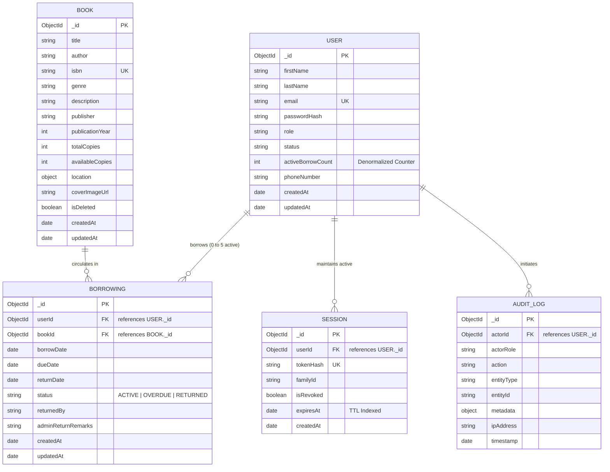

# DATABASE ARCHITECTURE SPECIFICATION
## Cloud-Native Library Management System (LMS)

---

**Document Version**: 1.2.0  
**Phase**: Phase 3 – Database Architecture  
**Status**: BASELINE LOCKED AND APPROVED  
**Author**: Principal Database Architect & Senior Backend Systems Engineer  
**Approved Baselines**:
- [Phase 0 Master Project Architecture Document (v1.1.0)](../02-architecture/MASTER_ARCHITECTURE.md)
- [Phase 1 Software Requirements Specification (v1.1.0)](../01-requirements/SOFTWARE_REQUIREMENTS_SPECIFICATION.md)
- [Phase 2 Detailed System Design (v1.1.0)](../02-architecture/DETAILED_SYSTEM_DESIGN.md)  
**Classification**: Persistence Architecture & Data Design  
**Implementation Policy**: *STRICT GATE — Implementation (Phase 14) must not begin until all planning and architecture phases (Phases 1 through 13) have been fully completed and approved.*

---

## TABLE OF CONTENTS
1. [Document Control](#1-document-control)
2. [Purpose and Database Scope](#2-purpose-and-database-scope)
3. [Database Design Principles](#3-database-design-principles)
4. [Database Technology Architecture](#4-database-technology-architecture)
5. [Logical Data Domain Model](#5-logical-data-domain-model)
6. [Collection Architecture](#6-collection-architecture)
7. [Detailed Document Structures](#7-detailed-document-structures)
8. [Relationship Design & Entity-Relationship Model](#8-relationship-design--entity-relationship-model)
9. [Embedding vs. Referencing Analysis](#9-embedding-vs-referencing-analysis)
10. [Circulation Data Model & Invariants](#10-circulation-data-model--invariants)
11. [Inventory Consistency Architecture](#11-inventory-consistency-architecture)
12. [Concurrency, Transaction & Audit Consistency Strategy](#12-concurrency-transaction--audit-consistency-strategy)
13. [Database Index Architecture](#13-database-index-architecture)
14. [Search Architecture](#14-search-architecture)
15. [Data Validation Architecture](#15-data-validation-architecture)
16. [Data Lifecycle and Deletion Strategy](#16-data-lifecycle-and-deletion-strategy)
17. [Audit Log Data Architecture](#17-audit-log-data-architecture)
18. [Data Security and Privacy Architecture](#18-data-security-and-privacy-architecture)
19. [Backup and Recovery Architecture](#19-backup-and-recovery-architecture)
20. [Database Scalability Architecture](#20-database-scalability-architecture)
21. [Data Access Boundaries & Ownership Matrix](#21-data-access-boundaries--ownership-matrix)
22. [Database Failure Scenarios & Resilience](#22-database-failure-scenarios--resilience)
23. [Data Architectural Decisions (ADRs)](#23-data-architectural-decisions-adrs)
24. [Technical Decisions Deferred to Downstream Phases](#24-technical-decisions-deferred-to-downstream-phases)
25. [Requirements Traceability Matrix](#25-requirements-traceability-matrix)
26. [Phase 3 Acceptance Criteria](#26-phase-3-acceptance-criteria)

---

## 1. Document Control

### 1.1 Document Metadata
| Field | Value |
|---|---|
| **Document Title** | Database Architecture Specification - Cloud-Native Library Management System |
| **Document Version** | 1.2.0 |
| **Document Status** | BASELINE LOCKED AND APPROVED |
| **Project Name** | Cloud-Native Library Management System (LMS) |
| **Author** | Principal Database Architect & Senior Backend Systems Engineer |
| **Current Phase** | Phase 3 – Database Architecture |
| **Next Phase** | Phase 4 – Backend Architecture and API Design (Ready to Begin) |
| **Database Platform** | MongoDB Atlas (Multi-Deployment Profile Support) |

### 1.2 Revision History
| Version | Date | Author | Summary of Changes |
|---|---|---|---|
| 1.0.0 | 2026-09-07 | Database Architecture Team | Initial baseline release of Phase 3 Database Architecture. |
| 1.1.0 | 2026-09-07 | Database Architecture Team | Targeted correction pass addressing stakeholder review: <br/>1. Replaced static MongoDB server and Enterprise declarations with architecture-neutral platform wording supporting currently supported Atlas versions across both deployment profiles.<br/>2. Removed unvalidated performance (P95 < 200ms) and arbitrary capacity figures (500MB, 500GB, 10k writes/sec), replacing them with architectural scaling principles.<br/>3. Generalized premature implementation parameters (exact ports, TLS version numbers, connection pool counts, specific backup scripts).<br/>4. Added formal decision (DBD-07) on denormalized `activeBorrowCount`, identifying `borrowings` as authoritative source of truth, atomic synchronization mechanism, and drift reconciliation.<br/>5. Verified and grounded Invariant INV-06 against approved requirement `FR-BORROW-001` and business rule `BR-CIRC-005`.<br/>6. Explicitly defined the borrowing unit of record as one physical copy of one catalog title.<br/>7. Established formal audit consistency policy, separating atomic business audit operations from decoupled audit recording.<br/>8. Replaced absolute audit immutability claims with accurate application-level append-only definitions.<br/>9. Reframed backup/recovery targets as architectural objectives validated through testing, maintaining profile separation.<br/>10. Accurately defined the search index as a multi-field text-search index with filtering, relevance, and pagination considerations.<br/>11. Standardized collection count language to "five primary collections for Version 1". |
| 1.2.0 | 2026-09-07 | Principal Database Architect & Senior Backend Systems Engineer | Final clarification, consistency verification, and baseline lock pass: <br/>1. **RC-12**: Formulated formal Decision **DBD-08** and Hazard 5 establishing that duplicate active borrowing prevention (INV-06) is concurrency-sensitive and must not rely exclusively on preliminary application-level existence checks (check-then-act race hazard); mandated persistence-level compound unique partial indexing (`idx_borrowings_active_user_book`) or transactional conditional serialization, defining clear phase boundaries across Phase 3, Phase 4, and Phase 14.<br/>2. **RC-13**: Formally established Decision **DBD-09** adopting the Authoritative Hybrid Overdue Evaluation Model, distinguishing real-time temporal business truth ($returnDate == null \land currentDate > dueDate$) from indexed persistence representation (`borrowings.status`) and operational background synchronization; demonstrated quota and duplicate prevention invariance across active states; defined phase boundaries across Phase 3, Phase 4, later operational phases, and Phase 14.<br/>3. Added index `idx_borrowings_active_user_book` (Compound Unique Partial) to Section 13.<br/>4. Updated downstream technical decisions in Section 24 and traceability in Section 25.<br/>5. Formally locked Phase 3 baseline as COMPLETE AND APPROVED. |

### 1.3 Related Approved Documents
- [Phase 0 Master Project Architecture Document (v1.1.0)](../02-architecture/MASTER_ARCHITECTURE.md)
- [Phase 1 Software Requirements Specification (v1.1.0)](../01-requirements/SOFTWARE_REQUIREMENTS_SPECIFICATION.md)
- [Phase 2 Detailed System Design (v1.1.0)](../02-architecture/DETAILED_SYSTEM_DESIGN.md)

---

## 2. Purpose and Database Scope

### 2.1 Purpose of Database Architecture
This specification establishes the authoritative data persistence architecture for the Cloud-Native Library Management System. It translates the functional requirements from Phase 1 and the system interaction models from Phase 2 into logical document structures, consistency invariants, transaction boundaries, index profiles, and data lifecycle policies.

### 2.2 Relationship to Prior Baselines
- **Phase 0 Master Architecture**: Adopts MongoDB Atlas as the managed cloud persistence platform, adhering to the dual infrastructure profiles (**Profile A: Production Reference Architecture** vs. **Profile B: Cost-Optimized Student Deployment Profile**).
- **Phase 1 SRS**: Implements data structures supporting patron accounts, catalog items, active and historical borrowings, and append-only audit records while strictly complying with confirmed business rules (`BR-001` through `BR-016`).
- **Phase 2 Detailed System Design**: Provides durable persistence, consistency boundaries, and mathematical invariants supporting the borrowing and return workflows and the standardized circulation state machine (**`ACTIVE`**, **`OVERDUE`**, **`RETURNED`**).

### 2.3 Explicit Phase Boundaries & Exclusions
In strict compliance with project lifecycle governance:
- Database architecture is defined conceptually and structurally in this phase.
- **Zero application source code, Mongoose schema code, or model classes** are created in this phase.
- REST API endpoint contracts, query parameter mappings, and controller logic belong to **Phase 4 (Backend Architecture)**.
- Detailed cryptographic algorithms, token signing mechanisms, and IAM policies belong to **Phase 6 (Security Architecture)**.
- Infrastructure automation, network peering configuration, and cluster provisioning belong to **Phase 9 (AWS Infrastructure)** and **Phase 10 (EKS Architecture)**.
- Physical schema creation, seed scripts, and repository coding are deferred to **Phase 14 (Implementation)**.

---

## 3. Database Design Principles

The database architecture is governed by eleven foundational engineering principles:

1. **Data Integrity & Invariant Enforcement**: The database model mathematically enforces system invariants (e.g., non-negative available stock, active loan limits) to ensure data cannot become corrupt under concurrent access.
2. **Predictable Consistency**: High-concurrency circulation operations (borrowing and returning) execute within defined consistency boundaries, preventing inventory overselling and race-condition discrepancies.
3. **Judicious Referencing vs. Embedding**: Document referencing is chosen when independent lifecycles, unbounded growth, or cross-entity relationships exist. Embedding is restricted to tightly coupled, bounded sub-documents.
4. **Query-Driven Data Modeling**: Document structures and denormalized counters are engineered specifically to satisfy high-frequency application access patterns with minimal join overhead.
5. **Index-Aware Performance**: Every production query pattern (catalog search, user lookup, active loan tracking) is supported by targeted indexes, ensuring logarithmic ($O(\log N)$) search efficiency.
6. **Minimal Unnecessary Redundancy**: Redundancy is minimized. Where a denormalized counter is justified (e.g., `activeBorrowCount`), the authoritative source of truth is explicitly documented, and synchronization is guaranteed within atomic transaction boundaries.
7. **Clear Domain Ownership**: Each collection maps directly to a discrete business domain, preventing arbitrary cross-domain mutations.
8. **Application-Level Append-Only Auditing**: Administrative mutations and security-sensitive events generate append-only audit entries that cannot be updated or deleted via normal application functionality.
9. **Zero-Trust Credential Protection**: Sensitive authentication data (passwords, session tokens) is never stored in plaintext and is protected by one-way cryptographic hashing.
10. **Lifecycle Discipline**: Soft deletion is implemented for catalog items to preserve historical loan referential integrity, while automated TTL expiration manages ephemeral session lifecycles.
11. **Cost-Conscious Cloud Engineering**: Storage structures, index counts, and connection bounds are optimized to execute reliably within the **Cost-Optimized Student Deployment Profile** while remaining fully forward-compatible with the **Production Reference Profile**.

---

## 4. Database Technology Architecture

### 4.1 Persistence Platform Specification
The approved persistence platform is **MongoDB Atlas**, utilizing a currently supported MongoDB release compatible with the application drivers and selected deployment profile at the time of implementation. MongoDB is selected because:
- The flexible document model naturally represents literary metadata (dynamic descriptions, multi-valued attributes, nested shelf coordinates).
- Native support for Multi-Document ACID Transactions satisfies the strict consistency demands of concurrent book checkout and return operations.
- Native Text Search indexing fulfills catalog discovery requirements without requiring a separate external search cluster.
- Native Time-To-Live (TTL) indexing automates background session cleanup without external cron jobs.

### 4.2 Deployment Profile Alignment
The database architecture supports two distinct operational profiles without requiring schema modifications:

1. **Profile A: Production Reference Architecture**:
   - Hosted on dedicated MongoDB Atlas tiers (M10+).
   - Multi-AZ replica set architecture across 3 availability zones.
   - Private network connectivity via AWS VPC Peering or AWS PrivateLink.
   - Continuous cloud backups with Point-in-Time Recovery (PITR).
2. **Profile B: Cost-Optimized Student Deployment Profile**:
   - Hosted on MongoDB Atlas shared or free tiers (e.g., M0).
   - Secure TLS connectivity over standard MongoDB connection protocol.
   - Access strictly restricted via Atlas IP Access List (EKS NAT Gateway IP and developer IPs).
   - Scheduled logical backup exports; $0 recurring cloud infrastructure fees.

---

## 5. Logical Data Domain Model

The system organizes its persistence layer into seven logical data domains:

| Domain | Purpose | Primary Owner | Access Patterns | Sensitivity Level |
|---|---|---|---|---|
| **User Identity** | Patron & administrator profiles, status, active loan counts. | User Subsystem | Frequent read-by-ID/email, rare status writes. | Confidential |
| **Authentication & Session** | Password verification hashes, refresh session tokens, family IDs. | Auth Subsystem | High-frequency read/write at login and token refresh. | Highly Sensitive |
| **Book Catalog** | Literary metadata (Title, Author, ISBN, Genre, Synopsis). | Book Catalog Subsystem | Heavy read searches, low-frequency admin CRUD. | Public |
| **Inventory Stock** | Physical volume counts (`totalCopies`, `availableCopies`), shelf coordinates. | Book Catalog & Circulation | Read on search, high-frequency atomic updates on checkout/return. | Internal Operational |
| **Circulation Transactions** | Loan records, checkout dates, due dates, return dates, statuses. | Circulation Subsystem | Frequent user-scoped reads, high-concurrency writes on borrow/return. | Confidential |
| **Administrative Metadata** | Dashboard metric aggregations, system-wide transaction streams. | Administrative Subsystem | Read-only analytic queries, status modification triggers. | Internal Operational |
| **Audit Logs** | Historical ledger of administrative and security events. | Audit Subsystem | Append-only writes on mutations, read-only admin inspection. | Confidential |

---

## 6. Collection Architecture

The Version 1 database architecture defines **five primary collections**:

```
MongoDB Database: library_management_system
│
├── users            (User accounts, patron credentials, roles, quotas)
├── books            (Book catalog metadata, inventory counts, shelf coordinates)
├── borrowings       (Circulation loan records, checkout/due/return dates, states)
├── sessions         (Session refresh tokens, family rotation tracking, TTL cleanup)
└── audit_logs       (Append-only administrative and security event ledger)
```

### 6.1 Collection Justification Matrix

| Collection Name | Justification for Primary Collection | Document Lifecycle | Expected Growth Characteristics | Retention Strategy |
|---|---|---|---|---|
| **`users`** | Centralizes identity, credential hashes, roles, and patron quota counters. Must be independently queried by email and user ID. | Created at registration; updated on profile changes, password changes, and loan count updates. | Scales with registered patron population. | Retained permanently. Deactivation handled via status flag (`SUSPENDED`). Hard deletion prohibited to preserve loan history. |
| **`books`** | Stores catalog entries and physical stock counts. Searched publicly and managed administratively. | Created by admin; updated on metadata/stock changes; soft-deleted when retired. | Scales with catalog acquisitions. | Retained permanently. Soft-deleted via `isDeleted: true` to prevent breaking historical loan references. |
| **`borrowings`** | Manages circulation transactions. Independent lifecycle from books and users. High-concurrency updates on borrow and return. | Created at checkout (`ACTIVE`); transitioned to `OVERDUE` or `RETURNED`. | Linear growth with every circulation transaction. | Retained permanently as historical archive records for patron borrowing history and library circulation audits. |
| **`sessions`** | Manages session refresh tokens and token family rotation tracking. Decoupled from user documents to prevent write contention and unbounded array growth. | Created at login; rotated on session refresh; invalidated on logout or replay. | Ephemeral (bounded by active user count). | Automated TTL expiration. Documents automatically purged by MongoDB upon `expiresAt` timestamp. |
| **`audit_logs`** | Captures records of administrative actions and security events. Completely decoupled to guarantee non-repudiation. | Write-once on administrative or security mutation; never updated. | Scales with administrative mutation frequency. | Retained permanently as an append-only historical trail. No application-level delete route. |

---

## 7. Detailed Document Structures

### 7.1 Collection: `users`
Represents registered patrons and administrative staff.

| Field Name | Purpose | Logical Data Type | Req? | Default | Validation & Constraints | Sensitivity | Mutability | Index Consideration |
|---|---|---|---|---|---|---|---|---|
| `_id` | Unique user identifier | ObjectId | Yes | Auto | 12-byte BSON ObjectId | Internal | Immutable | Primary Key (Clustered) |
| `firstName` | Patron given name | String | Yes | None | 1 to 50 characters, trimmed | Confidential | Mutable | None |
| `lastName` | Patron family name | String | Yes | None | 1 to 50 characters, trimmed | Confidential | Mutable | None |
| `email` | Unique login identity | String | Yes | None | Valid email syntax, lowercase, max 255 chars | Confidential | Mutable (Admin only) | Unique Index (`{ email: 1 }`) |
| `passwordHash` | One-way cryptographic hash | String | Yes | None | Stored cryptographic hash string | Highly Sensitive | Mutable (Password change) | None |
| `role` | Authorization role | String | Yes | `ROLE_PATRON` | Enum: `['ROLE_PATRON', 'ROLE_ADMIN']` | Internal | Mutable (Admin only) | Compound Index (`{ role: 1, status: 1 }`) |
| `status` | Account operational state | String | Yes | `ACTIVE` | Enum: `['ACTIVE', 'SUSPENDED']` | Internal | Mutable (Admin only) | Compound Index (`{ role: 1, status: 1 }`) |
| `activeBorrowCount` | Denormalized active loan counter | Integer | Yes | `0` | Range: `0 <= activeBorrowCount <= 5` | Internal | Mutable (On borrow/return) | None |
| `phoneNumber` | Contact phone number | String | No | `null` | Optional formatted phone string, max 20 chars | Confidential | Mutable | None |
| `createdAt` | Account creation timestamp | Date | Yes | Auto (Now) | UTC Date | Internal | Immutable | None |
| `updatedAt` | Last modification timestamp | Date | Yes | Auto (Now) | UTC Date | Internal | Mutable | None |

### 7.2 Collection: `books`
Represents literary works and physical stock counts.

| Field Name | Purpose | Logical Data Type | Req? | Default | Validation & Constraints | Sensitivity | Mutability | Index Consideration |
|---|---|---|---|---|---|---|---|---|
| `_id` | Unique book identifier | ObjectId | Yes | Auto | 12-byte BSON ObjectId | Public | Immutable | Primary Key (Clustered) |
| `title` | Title of the literary work | String | Yes | None | 1 to 255 characters, trimmed | Public | Mutable | Multi-field Text Index |
| `author` | Primary author/contributor | String | Yes | None | 1 to 150 characters, trimmed | Public | Mutable | Multi-field Text Index |
| `isbn` | International Standard Book Number | String | Yes | None | Unique, valid ISBN-10 or ISBN-13 format, uppercase | Public | Mutable (Admin only) | Unique Index (`{ isbn: 1 }`) |
| `genre` | Taxonomic classification | String | Yes | None | Predefined category enum (Fiction, Technology, Science, History, etc.) | Public | Mutable | Compound Index (`{ genre: 1 }`) |
| `description` | Book synopsis & summary | String | Yes | None | Text, max 2000 characters | Public | Mutable | Multi-field Text Index |
| `publisher` | Publishing house | String | Yes | None | 1 to 100 characters, trimmed | Public | Mutable | None |
| `publicationYear` | Year of publication | Integer | Yes | None | 1000 <= publicationYear <= Current Year + 1 | Public | Mutable | Single Index (`{ publicationYear: -1 }`) |
| `totalCopies` | Total physical copies owned | Integer | Yes | None | Integer >= 1 | Internal | Mutable (Stock edits) | None |
| `availableCopies` | Physical copies on shelf | Integer | Yes | None | Integer; Invariant: `0 <= availableCopies <= totalCopies` | Public | Mutable (On borrow/return) | Compound Index (`{ availableCopies: 1 }`) |
| `location` | Physical shelving location | Object | Yes | None | Embedded sub-document: `{ aisle: String, shelf: String }` | Public | Mutable | None |
| `location.aisle` | Physical aisle identifier | String | Yes | None | 1 to 30 characters (e.g., "Aisle 4") | Public | Mutable | None |
| `location.shelf` | Physical shelf coordinates | String | Yes | None | 1 to 30 characters (e.g., "Shelf B-2") | Public | Mutable | None |
| `coverImageUrl` | Link to cover art graphic | String | No | `null` | Optional valid HTTPS URL string | Public | Mutable | None |
| `isDeleted` | Soft-deletion lifecycle flag | Boolean | Yes | `false` | Boolean flag | Public | Mutable (Deactivation) | Partial / Compound Index |
| `createdAt` | Catalog creation timestamp | Date | Yes | Auto (Now) | UTC Date | Internal | Immutable | None |
| `updatedAt` | Last modification timestamp | Date | Yes | Auto (Now) | UTC Date | Internal | Mutable | None |

### 7.3 Collection: `borrowings`
Represents circulation transactions between patrons and books.

| Field Name | Purpose | Logical Data Type | Req? | Default | Validation & Constraints | Sensitivity | Mutability | Index Consideration |
|---|---|---|---|---|---|---|---|---|
| `_id` | Unique loan identifier | ObjectId | Yes | Auto | 12-byte BSON ObjectId | Internal | Immutable | Primary Key (Clustered) |
| `userId` | Reference to patron | ObjectId | Yes | None | Foreign reference matching a valid `users._id` | Confidential | Immutable | Compound Index (`{ userId: 1, status: 1 }`) |
| `bookId` | Reference to borrowed book | ObjectId | Yes | None | Foreign reference matching a valid `books._id` | Public | Immutable | Compound Index (`{ bookId: 1, status: 1 }`) |
| `borrowDate` | Checkout timestamp | Date | Yes | Auto (Now) | UTC Date | Confidential | Immutable | Sorting Index (`{ borrowDate: -1 }`) |
| `dueDate` | Loan return deadline | Date | Yes | Checkout + 14d| Exactly 14 calendar days from borrowDate | Confidential | Immutable (No renewals in V1)| Compound Index (`{ dueDate: 1, status: 1 }`) |
| `returnDate` | Check-in timestamp | Date | No | `null` | UTC Date; Set upon return completion | Confidential | Mutable (Set once on return)| None |
| `status` | Circulation state | String | Yes | `ACTIVE` | Enum: `['ACTIVE', 'OVERDUE', 'RETURNED']` | Confidential | Mutable (Transition rules) | Compound Index (`{ status: 1, dueDate: 1 }`) |
| `returnedBy` | Actor completing return | String | No | `null` | Enum: `['PATRON', 'ADMINISTRATOR']` | Internal | Mutable (Set once on return)| None |
| `adminReturnRemarks`| Staff return override notes | String | No | `null` | Text, max 500 characters | Internal | Mutable (Set on admin return)| None |
| `createdAt` | Record creation timestamp | Date | Yes | Auto (Now) | UTC Date | Internal | Immutable | None |
| `updatedAt` | Last modification timestamp | Date | Yes | Auto (Now) | UTC Date | Internal | Mutable | None |

### 7.4 Collection: `sessions`
Represents persistent session records and refresh token rotation families.

| Field Name | Purpose | Logical Data Type | Req? | Default | Validation & Constraints | Sensitivity | Mutability | Index Consideration |
|---|---|---|---|---|---|---|---|---|
| `_id` | Unique session record ID | ObjectId | Yes | Auto | 12-byte BSON ObjectId | Internal | Immutable | Primary Key (Clustered) |
| `userId` | Reference to user | ObjectId | Yes | None | Foreign reference matching a valid `users._id` | Internal | Immutable | Compound Index (`{ userId: 1, familyId: 1 }`) |
| `tokenHash` | Cryptographic hash of token | String | Yes | None | One-way cryptographic hash of issued refresh token | Highly Sensitive | Immutable | Unique Index (`{ tokenHash: 1 }`) |
| `familyId` | Rotation family identifier | String | Yes | None | Standard UUID v4 string grouping rotated tokens | Internal | Immutable | Compound Index (`{ userId: 1, familyId: 1 }`) |
| `isRevoked` | Invalidation flag | Boolean | Yes | `false` | True if consumed or revoked via intrusion detection | Internal | Mutable (On rotation/replay) | Single Index (`{ isRevoked: 1 }`) |
| `expiresAt` | Token expiration timestamp | Date | Yes | Defined TTL | UTC Date (e.g., 7 days from issue) | Internal | Immutable | **TTL Index** (`expireAfterSeconds: 0`) |
| `createdAt` | Session creation timestamp | Date | Yes | Auto (Now) | UTC Date | Internal | Immutable | None |

### 7.5 Collection: `audit_logs`
Represents append-only records of administrative actions and security-sensitive events.

| Field Name | Purpose | Logical Data Type | Req? | Default | Validation & Constraints | Sensitivity | Mutability | Index Consideration |
|---|---|---|---|---|---|---|---|---|
| `_id` | Unique audit event ID | ObjectId | Yes | Auto | 12-byte BSON ObjectId | Internal | Immutable | Primary Key (Clustered) |
| `actorId` | User executing action | ObjectId | Yes | None | Reference to `users._id` (Admin, Patron, or System) | Confidential | Immutable | Single Index (`{ actorId: 1 }`) |
| `actorRole` | Role of actor at event time | String | Yes | None | Enum: `['ROLE_ADMIN', 'ROLE_PATRON', 'SYSTEM']` | Internal | Immutable | None |
| `action` | Operational action category | String | Yes | None | Enum: `['BOOK_CREATED', 'BOOK_UPDATED', 'BOOK_DEACTIVATED', 'USER_STATUS_UPDATED', 'ADMIN_RETURN_OVERRIDE', 'SECURITY_ALERT']` | Internal | Immutable | Single Index (`{ action: 1 }`) |
| `entityType` | Target entity category | String | Yes | None | Enum: `['BOOK', 'USER', 'BORROWING', 'SESSION', 'SYSTEM']` | Internal | Immutable | Compound Index (`{ entityType: 1, entityId: 1 }`) |
| `entityId` | Identifier of modified record | String | Yes | None | Target record identifier string | Internal | Immutable | Compound Index (`{ entityType: 1, entityId: 1 }`) |
| `metadata` | Contextual diff or payload | Object | No | `{}` | Arbitrary key-value metadata or state difference | Confidential | Immutable | None |
| `ipAddress` | Client IP address | String | Yes | None | Client network address string | Confidential | Immutable | None |
| `timestamp` | Event execution timestamp | Date | Yes | Auto (Now) | UTC Date | Internal | Immutable | Sorting Index (`{ timestamp: -1 }`) |

---

## 8. Relationship Design & Entity-Relationship Model



---

## 9. Embedding vs. Referencing Analysis

| Relationship | Persistence Strategy | Design Rationale & Access Pattern Justification |
|---|---|---|
| **Book Location (`location`)** | **Embedded Sub-document** (`{ aisle, shelf }` inside `books`) | Physical shelf coordinates are 1-to-1 attributes uniquely describing placement of that book. Bounded in size (< 100 bytes). Embedding eliminates foreign key lookups and ensures atomic retrieval with book metadata. |
| **User $\to$ Borrowings** | **Referenced Collection** (`borrowings.userId`) | A patron's borrowing history grows unboundedly over years. Embedding borrowing history inside `users` violates the 16MB document limit and creates massive read overhead when loading basic user profiles. Referencing allows paginated historical queries. |
| **Book $\to$ Borrowings** | **Referenced Collection** (`borrowings.bookId`) | Popular titles circulate continuously. Embedding loan history inside books creates severe write contention on catalog documents during peak checkout hours. Referencing decouples circulation mutations from catalog read traffic. |
| **User $\to$ Sessions** | **Referenced Collection** (`sessions.userId`) | Sessions are ephemeral with high update frequency. Decoupling into a dedicated collection enables native MongoDB TTL background index purging and avoids memory fragmentation on user documents. |
| **Audit Log $\to$ Entities** | **Referenced Attributes** (`actorId`, `entityType`, `entityId`) | Audit logs are write-once, append-only records with linear growth characteristics. Embedding audit entries inside operational documents causes rapid document bloat and violates the requirement that audit logs must be independently queryable and immutable. |

---

## 10. Circulation Data Model & Invariants

### 10.1 Borrowing Unit of Record Clarification
> [!IMPORTANT]
> **Unit of Record Definition**: In accordance with the approved requirements, **one borrowing record represents the loan of exactly one physical copy of one catalog book**. Circulation tracking is transaction-based rather than individual barcode-serialized; stock availability is tracked via aggregate volume counters (`totalCopies`, `availableCopies`) tied directly to active loan records.

### 10.2 Circulation States & Transitions
Circulation records conform strictly to three approved states:
1. **`ACTIVE`**: The loan is currently open and within its standard 14-day borrowing duration.
2. **`OVERDUE`**: An active borrowing obligation whose due date has passed without the book being returned (`returnDate == null` and `currentDate > dueDate`). **`OVERDUE` remains an active borrowing obligation** and counts against the patron's 5-book quota and single-title restriction.
3. **`RETURNED`**: The terminal completed state. Physical possession has returned to the library. `returnDate` is populated, stock availability is incremented, and patron active loan count is decremented.

#### 10.2.1 Authoritative Overdue Status Evaluation Model (RC-13)
The system adopts an **Authoritative Hybrid Evaluation Model** (see [DBD-09](#dbd-09-authoritative-overdue-status-evaluation-model)) distinguishing between business truth and storage representation:
- **Business Truth (Authoritative Source of Truth)**: A borrowing obligation is overdue if and only if:
  $$\text{isOverdue}(loan) \iff (loan.\text{returnDate} == \text{null} \land \text{currentDate} > loan.\text{dueDate})$$
  This temporal formula is the authoritative determination of overdue status across the entire system. At runtime, whenever any backend service evaluates patron borrowing eligibility or constructs API responses, this business truth governs dynamically without dependency on asynchronous jobs.
- **Persistence Representation**: The persisted `status` field in the `borrowings` collection stores an indexed enumeration (`ACTIVE`, `OVERDUE`, `RETURNED`) to support efficient query filtering (e.g., admin dashboard rosters, overdue scanning).
- **Operational Synchronization**: A background task (specified in later operational phases) or lazy update during read operations synchronizes the persisted `status` to `OVERDUE` for offline reporting. However, **core business invariants, patron quotas, and checkout permissions NEVER depend on the timing or availability of background synchronization**.
- **Active Obligation & Quota Invariance**: Both `ACTIVE` and `OVERDUE` represent active, unreturned borrowing obligations. Under all circulation invariants (INV-03, INV-04, INV-05, INV-06), loans where `status IN ['ACTIVE', 'OVERDUE']` (or `returnDate == null`) are mathematically treated identically:
  - They decrement book availability and hold a loan slot against total stock.
  - They increment and occupy a unit of the patron's quota (`user.activeBorrowCount`).
  - They satisfy the duplicate active borrowing condition, prohibiting subsequent checkouts of the same title.

### 10.3 Formal Circulation Consistency Invariants
The persistence architecture mathematically guarantees six formal system invariants:

- **Invariant INV-01 (Non-Negative Stock)**:
  $$\forall \text{ book } b: b.\text{availableCopies} \ge 0$$
- **Invariant INV-02 (Stock Conservation)**:
  $$\forall \text{ book } b: b.\text{availableCopies} \le b.\text{totalCopies}$$
- **Invariant INV-03 (Active Loan Balance)**:
  $$\forall \text{ book } b: b.\text{totalCopies} = b.\text{availableCopies} + \sum \text{borrowings}(b.\_id, \text{status} \in \{\text{ACTIVE}, \text{OVERDUE}\})$$
- **Invariant INV-04 (Patron Quota Bound)**:
  $$\forall \text{ user } u: u.\text{activeBorrowCount} \le 5$$
- **Invariant INV-05 (User Quota Synchronization)**:
  $$\forall \text{ user } u: u.\text{activeBorrowCount} = \sum \text{borrowings}(u.\_id, \text{status} \in \{\text{ACTIVE}, \text{OVERDUE}\})$$
- **Invariant INV-06 (Single Active Loan Per Title)**:
  $$\forall \text{ user } u, \text{ book } b: \sum \text{borrowings}(u.\_id, b.\_id, \text{status} \in \{\text{ACTIVE}, \text{OVERDUE}\}) \le 1$$
  *(Directly derived from and enforced by approved requirements `FR-BORROW-001`, edge case `EC-03`, and business rule `BR-CIRC-005`).*

#### 10.3.1 Concurrency-Safe Enforcement Specification for INV-06 (RC-12)
> [!IMPORTANT]
> **Concurrency-Sensitive Invariant Rule**: Duplicate active borrowing prevention is a concurrency-sensitive business invariant and must **not** rely exclusively on a preliminary application-level existence check.

Two simultaneous borrowing requests for the same book by the same patron must not be able to bypass Invariant INV-06 simply because both requests execute a preliminary availability or duplicate-loan check before either request commits (classic check-then-act race condition).

The persistence architecture defines the following architectural responsibility boundaries across project phases (see [DBD-08](#dbd-08-concurrency-safe-enforcement-of-duplicate-active-borrowing-prevention-inv-06)):
1. **Phase 3 (Database Architecture) Responsibility**:
   - Defines Invariant INV-06 mathematically and conceptually.
   - Defines the authoritative data state determining whether a duplicate active loan exists: any record in `borrowings` matching `{ userId: u._id, bookId: b._id }` where `status IN ['ACTIVE', 'OVERDUE']` (or `returnDate == null`).
   - Defines the concurrency requirement: enforcement must remain completely safe against simultaneous requests executing in parallel across distributed application instances.
   - Defines persistence-level architectural constraints: The persistence layer mandates either:
     - A **compound unique partial index** on `borrowings`: `{ userId: 1, bookId: 1 }` with `partialFilterExpression: { status: { $in: ["ACTIVE", "OVERDUE"] } }` (or `{ returnDate: null }`), delegating race-condition arbitration to the MongoDB storage engine; OR
     - Transaction-level serialization / conditional guards within the Multi-Document ACID Transaction.
2. **Phase 4 (Backend Architecture) Responsibility**:
   - Defines the backend service and transaction orchestration strategy.
   - Defines the sequence of validation and mutation operations within the circulation checkout service.
   - Defines how concurrency conflicts (e.g., duplicate key write errors or transaction write conflicts) are caught and surfaced through the API contract using standard RFC 7807 problem details (HTTP 409 Conflict with code `DUPLICATE_ACTIVE_LOAN`).
3. **Phase 14 (Implementation) Responsibility**:
   - Implements the approved strategy using the selected MongoDB, Mongoose, transaction, and indexing mechanisms.

---

## 11. Inventory Consistency Architecture

### 11.1 Concurrency Hazard Analysis & Structural Mitigations

1. **Final-Copy Checkout Race**: Competing patrons attempt to borrow the last available copy (`availableCopies == 1`) simultaneously.
   - *Mitigation*: Optimistic conditional matching at the database layer requiring `availableCopies > 0`. The first operation decrements stock; the competing operation fails the query condition and aborts cleanly.
2. **Borrow-and-Return Race**: Simultaneous checkout and return of copies of the same title.
   - *Mitigation*: Multi-document ACID transaction boundaries ensure updates execute sequentially against the book's authoritative document state.
3. **Multi-Device Quota Breach**: A patron with 4 active loans attempts to check out two books simultaneously across two devices.
   - *Mitigation*: The transaction boundary evaluates `activeBorrowCount < 5`. Only one transaction can claim the 5th loan slot; the competing transaction encounters `activeBorrowCount == 5` and aborts.
4. **Administrative Reduction Conflict**: Staff reduces `totalCopies` while copies are actively checked out.
   - *Mitigation*: Database validation verifies `newTotalCopies >= (b.totalCopies - b.availableCopies)`. Reducing total stock below actively checked-out loans is strictly rejected.
5. **Concurrent Duplicate Active Borrowing Race (Check-then-Act Race Hazard)**: Competing checkout requests for the same book title submitted simultaneously by the same patron (e.g., multi-tab or automated double-click).
   - *Hazard*: If the system relies solely on an application-level pre-check (`find`), both concurrent operations may execute the pre-check before either commits, discover zero active loans, and proceed to insert duplicate active loan records, violating Invariant INV-06.
   - *Mitigation*: The persistence layer prohibits exclusive reliance on check-then-act pre-checks. Structural mitigation is enforced at write time via a compound unique partial index on active loans (`idx_borrowings_active_user_book`) or transaction-level serialization. The second competing write is rejected by the database engine with a unique constraint or write conflict error, guaranteeing Invariant INV-06 under all concurrent conditions.

---

## 12. Concurrency, Transaction & Audit Consistency Strategy

### 12.1 Concurrency Strategy Selection
To balance high throughput with absolute data integrity, the persistence layer adopts a hybrid consistency model:
- **Single-Document Atomic Operations**: Used for single-document mutations (user profile edits, book metadata updates, session invalidations).
- **Multi-Document ACID Transactions**: Used when business mutations span multiple collections that must succeed or fail as a single atomic unit (circulation checkouts and returns).

### 12.2 Formal Audit Consistency Policy
To prevent unnecessary transaction overhead while ensuring accountability, operations are classified into two distinct audit consistency tiers:

1. **Tier 1: Atomic Business-Audit Operations**:
   - The business state mutation and the audit event **must share an atomic consistency boundary**.
   - Applies to: **Administrative Patron Account Suspension** (`USER_STATUS_UPDATED`) and **Administrative Return Overrides** (`ADMIN_RETURN_OVERRIDE`).
   - *Failure Behavior*: If the audit record cannot be written, the business mutation rolls back completely. Non-repudiation is mandatory.
2. **Tier 2: Decoupled / Eventually Consistent Audit Operations**:
   - The business state mutation commits immediately; the audit event is persisted reliably outside the primary transactional boundary.
   - Applies to: **Patron Self-Service Checkout / Return** (`LOAN_CREATED`, `LOAN_RETURNED`) and **Catalog Browsing / Discovery Events**.
   - *Failure Behavior*: A transient audit write failure must **never** roll back a legitimate patron book borrow or return. Operational circulation takes precedence.

### 12.3 Transaction Boundary Matrix

| Operation | Collections Affected | Consistency Boundary Strategy | Audit Consistency Tier | Rationale & Rollback Behavior |
|---|---|---|---|---|
| **Borrow Book** | `books`, `borrowings`, `users`, `audit_logs` | **Multi-Document ACID Transaction** (Business) | Tier 2 (Decoupled Audit) | Atomically decrements book stock, verifies quota, creates loan record, and increments user quota. Audit event is recorded reliably post-commit. |
| **Return Book (Patron)** | `books`, `borrowings`, `users`, `audit_logs` | **Multi-Document ACID Transaction** (Business) | Tier 2 (Decoupled Audit) | Atomically increments book stock, updates loan status to `RETURNED`, stamps return date, and decrements user quota. |
| **Return Book (Admin Override)**| `books`, `borrowings`, `users`, `audit_logs` | **Multi-Document ACID Transaction** (Unified) | Tier 1 (Atomic Audit) | Staff override modifying patron records must be tied atomically to the return audit record. |
| **Admin Book Creation** | `books`, `audit_logs` | **Single-Document Atomic Write** + Audit | Tier 2 (Decoupled Audit) | Single book insert. Failure of audit does not corrupt catalog state. |
| **Admin Book Modification** | `books`, `audit_logs` | **Single-Document Atomic Write** + Audit | Tier 2 (Decoupled Audit) | Conditional update on total copies. |
| **Admin Book Deactivation** | `books`, `borrowings`, `audit_logs` | **Conditional Query + Atomic Update** | Tier 2 (Decoupled Audit) | Verifies active loans == 0 before soft-deleting. |
| **Patron Account Suspension** | `users`, `sessions`, `audit_logs` | **Multi-Document ACID Transaction** (Unified) | Tier 1 (Atomic Audit) | User suspension, session termination, and audit log must commit atomically to ensure legal non-repudiation. |

---

## 13. Database Index Architecture

Every index is engineered to support specific application query patterns with minimal write overhead:

| Collection | Index Name | Indexed Fields & Direction | Index Type | Supported Application Query Pattern | Overhead | Classification |
|---|---|---|---|---|---|---|
| **`users`** | `idx_users_email_unique` | `{ email: 1 }` | Unique | User login lookup by email; registration uniqueness validation. | Low | **Mandatory** |
| **`users`** | `idx_users_role_status` | `{ role: 1, status: 1 }` | Compound | Admin patron roster filtering by role and account status. | Low | **Mandatory** |
| **`books`** | `idx_books_isbn_unique` | `{ isbn: 1 }` | Unique | Single book lookup by ISBN; administrative duplicate prevention. | Low | **Mandatory** |
| **`books`** | `idx_books_text_search` | `{ title: "text", author: "text", description: "text" }` | Multi-field Text | Full-text catalog discovery across title, author, and synopsis. | Medium | **Mandatory** |
| **`books`** | `idx_books_genre_avail` | `{ genre: 1, availableCopies: 1, isDeleted: 1 }` | Compound | Faceted catalog search filtering by genre and in-stock status. | Medium | **Mandatory** |
| **`books`** | `idx_books_pub_year` | `{ publicationYear: -1 }` | Single | Sorting catalog items chronologically by publication year. | Low | Optional |
| **`borrowings`** | `idx_borrowings_user_status` | `{ userId: 1, status: 1 }` | Compound | Patron active loans list (`status: 'ACTIVE'`); quota validation check. | Medium | **Mandatory** |
| **`borrowings`** | `idx_borrowings_active_user_book` | `{ userId: 1, bookId: 1 }` | Compound Unique Partial | Enforces Invariant INV-06 at the storage engine level (`partialFilterExpression: { status: { $in: ['ACTIVE', 'OVERDUE'] } }`), preventing duplicate active loans under concurrent checkout races. | Medium | **Mandatory** |
| **`borrowings`** | `idx_borrowings_user_history`| `{ userId: 1, borrowDate: -1 }` | Compound | Patron historical borrowing archive sorted chronologically. | Medium | **Mandatory** |
| **`borrowings`** | `idx_borrowings_book_status` | `{ bookId: 1, status: 1 }` | Compound | Active loan check prior to book deactivation; stock audits. | Medium | **Mandatory** |
| **`borrowings`** | `idx_borrowings_overdue_scan`| `{ status: 1, dueDate: 1 }` | Compound | System overdue identification, dynamic temporal overdue range scans, and administrative filters. | Medium | **Mandatory** |
| **`sessions`** | `idx_sessions_token_hash` | `{ tokenHash: 1 }` | Unique | Refresh token lookup during session renewal. | Low | **Mandatory** |
| **`sessions`** | `idx_sessions_user_family` | `{ userId: 1, familyId: 1 }` | Compound | Token family revocation during replay intrusion detection. | Low | **Mandatory** |
| **`sessions`** | `idx_sessions_ttl_expiry` | `{ expiresAt: 1 }` | TTL | Automated background purging of expired session tokens. | Low | **Mandatory** |
| **`audit_logs`** | `idx_audit_timestamp_desc` | `{ timestamp: -1 }` | Single | Administrative audit console chronological log stream. | Low | **Mandatory** |
| **`audit_logs`** | `idx_audit_entity_lookup` | `{ entityType: 1, entityId: 1 }` | Compound | Historical audit trail inspection for specific book or patron. | Low | **Mandatory** |
| **`audit_logs`** | `idx_audit_actor_lookup` | `{ actorId: 1, timestamp: -1 }` | Compound | Tracking actions executed by a specific administrator. | Low | Optional |

---

## 14. Search Architecture

### 14.1 Multi-Field Text Search Index Specification
Catalog search is supported natively via a **multi-field MongoDB text-search index (`$text`)** spanning `{ title: "text", author: "text", description: "text" }`. It operates under the following architectural considerations:
1. **Searchable Fields & Weighting**: Text queries evaluate matches across Title, Author, and Synopsis. Field weights may be tuned during implementation (e.g., Title: 10, Author: 5, Description: 1) to prioritize exact title matches.
2. **Filtering Compatibility**: MongoDB allows combining `$text` expressions with equality match filters (e.g., `{ genre: 'Technology', isDeleted: false, $text: { $search: 'Cloud' } }`), satisfying the faceted search requirements of `FR-BOOK-001` and `FR-BOOK-002`.
3. **Relevance Scoring vs. Field Sorting**: When a text search query is present, results are ordered by text relevance score (`{ score: { $meta: "textScore" } }`). When browsing without a text query, results sort by standard indexed fields (e.g., `publicationYear: -1` or `title: 1`).
4. **Pagination Implications**: Text searches support standard skip/limit pagination. For large result sets, query planners utilize index-supported bounds to avoid unindexed memory sorting.

---

## 15. Data Validation Architecture

The system enforces two-tier validation: persistence-layer schema validation and application-layer payload validation:

- **Tier 1 (Application Gateway Validation - Phase 4)**: Validates incoming HTTP request bodies, parameter syntax, and string sanitization before invoking business services.
- **Tier 2 (Persistence Schema Validation - Phase 3)**: Enforced via Mongoose Schema definitions and MongoDB JSON schema validation rules. Rejects illegal types, out-of-bounds numeric values, and unapproved enumeration entries directly at the database engine level.

---

## 16. Data Lifecycle and Deletion Strategy

| Collection | Ingestion Lifecycle | Update Policy | Deactivation / Soft Deletion | Hard Deletion Policy | Historical Preservation Guarantee |
|---|---|---|---|---|---|
| **`users`** | Created at registration. | Profile updates, password changes, status modifications. | Account deactivation via `status = 'SUSPENDED'`. | **Prohibited**. Hard deletion is barred to preserve historical loan integrity and audit logs. | Complete loan and audit history preserved permanently. |
| **`books`** | Administrative book creation. | Updates to metadata and total physical copy counts. | Soft-deletion via `isDeleted = true`. Blocked if active loans exist. | **Prohibited** for titles with circulation history. | Soft-deleted records retained permanently to satisfy historical loan foreign key references. |
| **`borrowings`** | Patron checkout transaction. | State transitions (`ACTIVE` $\to$ `OVERDUE` $\to$ `RETURNED`). | Not applicable. Completed loans transition to `RETURNED`. | **Prohibited**. Circulation records are immutable legal records of library lending. | Retained permanently in database to provide patron history and administrative circulation metrics. |
| **`sessions`** | User login or session refresh. | Token rotation updates `isRevoked` flag. | Explicit logout marks session token as revoked immediately. | **Automated TTL Purging**. MongoDB background thread removes expired documents after TTL period. | Historical session tracking is handled via `audit_logs`. Ephemeral session store is pruned. |
| **`audit_logs`** | Administrative action or security event. | **Write-Once**. Updates strictly prohibited by application architecture. | Not applicable. | **Prohibited**. Audit records cannot be deleted via operational application APIs. | Retained permanently as an append-only historical trail. |

---

## 17. Audit Log Data Architecture

### 17.1 Application-Level Append-Only Audit Model
In accordance with system design governance:
- The audit log architecture provides an **application-level append-only audit trail** with restricted write and administrative access controls.
- The `audit_logs` collection exposes zero update or delete methods in application repositories or API controllers.
- Access to query the audit log is strictly restricted to authenticated users holding verified `ROLE_ADMIN` privileges.
- *Future Security Consideration*: If cryptographic non-repudiation or tamper-proof compliance is mandated in future phases, write-once-read-many (WORM) storage or cryptographic hash chains may be introduced in Phase 6.

---

## 18. Data Security and Privacy Architecture

```
+-----------------------------------------------------------------------------+
|                         DATA SENSITIVITY CLASSIFICATION                     |
+-----------------------------------------------------------------------------+
| 1. PUBLIC DATA                                                              |
|    - Book Title, Author, ISBN, Genre, Description, Shelf Location, In-Stock |
|    - Storage: Cleartext; Publicly accessible via catalog discovery APIs.    |
|                                                                             |
| 2. INTERNAL OPERATIONAL DATA                                                |
|    - Total Copies, Internal Location Codes, Dashboard Aggregate Metrics     |
|    - Storage: Cleartext; Accessible only to authenticated library roles.    |
|                                                                             |
| 3. CONFIDENTIAL PERSONAL DATA                                               |
|    - Patron Name, Email Address, Phone Number, Personal Loan History        |
|    - Storage: Cleartext; Scoped strictly to resource owner & administrators;|
|      Excluded from public logs; Protected by cloud storage encryption.      |
|                                                                             |
| 4. HIGHLY SENSITIVE AUTHENTICATION DATA                                     |
|    - Passwords, Session Refresh Tokens                                      |
|    - Storage: One-way cryptographic hash;                                   |
|      Strictly excluded from API response bodies, audit logs, and error dumps|
+-----------------------------------------------------------------------------+
```

---

## 19. Backup and Recovery Architecture

The database backup architecture establishes conceptual recovery objectives and operational capabilities across both deployment profiles:

| Dimension | Profile A: Production Reference Architecture | Profile B: Cost-Optimized Student Deployment Profile |
|---|---|---|
| **Target Platform** | MongoDB Atlas Dedicated Tier (M10+) | MongoDB Atlas Free Tier (M0) / Shared Cluster |
| **Backup Capability** | Automated continuous cloud backups with Point-in-Time Recovery | Scheduled logical backup exports |
| **Recovery Objectives** | Target RPO < 15 minutes; Target RTO < 60 minutes | Target RPO < 24 hours; Target RTO < 60 minutes |
| **Validation Strategy** | Periodic automated cluster restoration drill to staging environment | Periodic manual restoration drill verifying data integrity |

*Note*: Stated RPO and RTO figures represent **architectural recovery objectives** to be formally validated through operational restoration drills during Phase 13 (Testing Strategy). Concrete backup automation scripts and cloud snapshot schedules belong to Phase 9 and Phase 14.

---

## 20. Database Scalability Architecture

The database scalability model adheres to four architectural principles:
1. **Bounded Connection Management**: Application workloads enforce strict connection pool limits per backend instance, preventing horizontal pod autoscaling from saturating Atlas connection thresholds.
2. **Logarithmic Index Scaling**: All operational read paths are indexed, ensuring query execution cost scales logarithmically ($O(\log N)$) rather than linearly ($O(N)$) as collection size expands.
3. **Atlas Cluster Scaling**: MongoDB Atlas supports seamless vertical tier scaling without application downtime, allowing clusters to scale resources dynamically in response to sustained workload growth.
4. **Sharding Reassessment Criteria**: Sharding is intentionally avoided in Version 1 to prevent unnecessary operational complexity. Sharding will be formally re-evaluated only if empirical production monitoring demonstrates:
   - Collection storage volume exceeding single-replica hardware capacity.
   - Sustained write throughput saturating primary node I/O bandwidth.

---

## 21. Data Access Boundaries & Ownership Matrix

| Application Subsystem | Primary Data Owner | Read Access Allowed | Write Access Allowed | Access Strictly Prohibited |
|---|---|---|---|---|
| **Authentication Subsystem** | `sessions` | `users`, `sessions` | `sessions`, `users` (password update) | Direct write to `books`, `borrowings`, `audit_logs` |
| **Authorization Subsystem** | None (Stateless) | `users` (role verification) | None | Modifying any collection |
| **User Management Subsystem**| `users` | `users`, `borrowings` | `users` (profile, status) | Direct write to `books`, `sessions` |
| **Book Catalog Subsystem** | `books` | `books` | `books` (metadata CRUD) | Modifying `users`, `borrowings`, `sessions` |
| **Circulation Subsystem** | `borrowings` | `books`, `borrowings`, `users` | `borrowings`, `books` (copies), `users` (quota) | Modifying `sessions`, modifying book metadata |
| **Audit Subsystem** | `audit_logs` | `audit_logs` (Admin only) | `audit_logs` (Append only) | Modifying operational collections; updating audit logs |

---

## 22. Database Failure Scenarios & Resilience

| Failure Scenario | Root Cause | Immediate Application Behavior | Data Integrity & Consistency Outcome | Recovery Procedure |
|---|---|---|---|---|
| **Database Disconnection** | Cloud network transient partition or Atlas maintenance. | Database driver buffers commands; if timeout breaches, API returns a sanitized system error notice. | **Zero Data Corruption**. In-flight transactions abort cleanly. Completed transactions remain durable. | Database driver automatically reconnects upon network restoration. |
| **Transaction Conflict / Abort**| Concurrent borrow race on the final physical copy. | Database engine aborts the competing transaction; returns write conflict. | **Complete Consistency**. Optimistic check prevents stock from decrementing below zero. | Client notified book is out of stock; user prompted to re-select. |
| **Index Degradation** | Abnormal node restart or storage fault. | Slow query alerts triggered; query latency increases. | Data records remain intact; queries execute via collection scan fallback. | Replica set automatically resynchronizes or rebuilds index from secondary. |
| **Storage Threshold Breach** | Unmonitored document accumulation. | Atlas triggers storage capacity threshold alert. | Database enters read-only mode if disk reaches 100% capacity. | Storage auto-expansion triggers, or administrator scales storage tier. |

---

## 23. Data Architectural Decisions (ADRs)

### DBD-01: Document Referencing for Circulation Transactions
- **Decision**: Persist borrowing transactions in a dedicated `borrowings` collection referencing `userId` and `bookId`, rather than embedding loans inside user or book documents.
- **Rationale**: Prevents document size explosion (MongoDB 16MB document limit), eliminates write contention on catalog books during peak circulation hours, and allows independent, paginated querying of borrowing history.
- **Alternatives Considered**: Embedding loan arrays inside `users` or `books`. Rejected due to unbounded array growth and document bloat.
- **Consequences**: Requires application-level population or `$lookup` aggregation for joined views, which is efficiently mitigated by compound foreign key indexing.

### DBD-02: Multi-Document ACID Transactions for Circulation Operations
- **Decision**: Wrap book borrowing and return workflows in MongoDB Multi-Document ACID Transactions.
- **Rationale**: Guarantees that stock decrements, patron loan counter increments, and borrowing record creations succeed or fail as a single atomic unit. Prevents phantom loans and negative inventory.
- **Alternatives Considered**: Two-phase commits, eventual consistency with compensation events. Rejected due to unnecessary architectural complexity for a centralized library application.
- **Consequences**: Slight transactional latency overhead, fully acceptable given operational requirements.

### DBD-03: Dedicated Ephemeral Sessions Collection with TTL Indexing
- **Decision**: Store session refresh tokens and rotation family IDs in a dedicated `sessions` collection with a MongoDB native Time-To-Live (TTL) index.
- **Rationale**: Isolates high-churn session writes from the core `users` collection, eliminates manual cleanup cron jobs, and natively purges expired tokens at zero operational cost.
- **Alternatives Considered**: Storing session tokens in an array inside the `user` document. Rejected because repeated token updates cause frequent document re-allocation and memory fragmentation.
- **Consequences**: Introduces one additional lightweight collection that is automatically pruned by the database engine.

### DBD-04: Multi-Field Text Indexing for Catalog Search
- **Decision**: Implement a multi-field MongoDB `$text` search index across `title`, `author`, and `description` rather than deploying MongoDB Atlas Search or Elasticsearch.
- **Rationale**: Satisfies full-text catalog search requirements natively within MongoDB, eliminates third-party infrastructure dependencies, and costs $0 in student deployment.
- **Alternatives Considered**: MongoDB Atlas Search (Lucene), External Elasticsearch cluster. Rejected as unnecessary over-engineering for a baseline library catalog.
- **Consequences**: Does not support complex fuzzy typographical matching in V1, which is fully acceptable under approved requirements.

### DBD-05: Application-Level Append-Only Audit Logging
- **Decision**: Implement the `audit_logs` collection as an application-level append-only store with zero application update or delete interfaces.
- **Rationale**: Guarantees operational traceability for administrative actions (book CRUD, user suspension, return overrides) without requiring expensive enterprise compliance infrastructure.
- **Alternatives Considered**: Logging solely to text logs. Rejected because text logs are difficult to surface dynamically within the library administrative web interface.
- **Consequences**: Audit collection grows linearly with administrative mutations, safely managed by standard database storage capacity.

### DBD-06: Soft Deletion for Catalog Items
- **Decision**: Implement catalog deactivation via an explicit `isDeleted: true` boolean flag, prohibiting physical document deletion for books that have circulation history.
- **Rationale**: Prevents dangling foreign key references in historical borrowing records and audit logs while hiding retired titles from public search.
- **Alternatives Considered**: Hard deletion with cascade nullification. Rejected because it destroys historical reporting and library accountability.
- **Consequences**: Public search queries must include an `isDeleted: false` filter, which is efficiently indexed.

### DBD-07: Denormalized Active Borrow Count Synchronization & Reconciliation
- **Decision**: Retain the denormalized `users.activeBorrowCount` integer counter on the user document while establishing the active records in the `borrowings` collection (`status IN ['ACTIVE', 'OVERDUE']`) as the **authoritative source of truth**.
- **Rationale**: Enables instant $O(1)$ patron quota validation during checkout pre-condition checks without executing a costly count query against the `borrowings` collection on every borrow attempt.
- **Synchronization Boundary**: The counter is incremented/decremented strictly within the **same multi-document ACID transaction** that inserts or updates the borrowing record. If the transaction aborts, the counter change is rolled back automatically.
- **Drift Detection & Reconciliation**: In the event of an abnormal system recovery or data migration, a reconciliation query compares `user.activeBorrowCount` against $\text{count}(\text{borrowings where } \text{userId} = \text{user.\_id} \text{ and } \text{status} \in [\text{'ACTIVE'}, \text{'OVERDUE'}])$ and updates the counter to match the authoritative circulation records.
- **Alternatives Considered**: Calculating active loans dynamically via `countDocuments()` on every checkout. Rejected due to unnecessary read amplification under high checkout concurrency.
- **Consequences**: Requires strict transaction discipline in Phase 4 (Backend Architecture) to ensure the counter is never mutated outside the circulation transaction boundary.

### DBD-08: Concurrency-Safe Enforcement of Duplicate Active Borrowing Prevention (INV-06)
- **Problem & Context**: Invariant INV-06 prohibits a user from holding more than one active or overdue borrowing record for the same book title. If the system relies exclusively on an application-level existence check (`findOne({ userId, bookId, status: { $in: ['ACTIVE', 'OVERDUE'] } })`), two simultaneous requests from the same user across multiple tabs or automated calls can pass the existence check before either commits, creating a check-then-act race condition that produces duplicate active loans.
- **Decision**: Formally prohibit exclusive reliance on preliminary application-level existence checks. Mandate persistence-level concurrency-safe enforcement via a compound unique partial index on active loans (`idx_borrowings_active_user_book`: `{ userId: 1, bookId: 1 }` with `partialFilterExpression: { status: { $in: ['ACTIVE', 'OVERDUE'] } }` or `{ returnDate: null }`) or strict transaction-level serialization.
- **Phase Responsibilities**:
  - *Phase 3 (Database Architecture)*: Formally defines Invariant INV-06, establishes active loans as the authoritative state, and specifies the persistence-level unique constraint.
  - *Phase 4 (Backend Architecture)*: Defines the checkout service transaction orchestration, sequence of validation, and mapping of database unique-violation errors to RFC 7807 problem details (HTTP 409 Conflict with code `DUPLICATE_ACTIVE_LOAN`).
  - *Phase 14 (Implementation)*: Implements the exact partial unique index and transaction error handling in Mongoose/MongoDB.
- **Rationale**: Delegates atomic uniqueness arbitration directly to the database storage engine, ensuring the invariant cannot be breached regardless of application concurrency or cluster horizontal scaling.
- **Alternatives Considered**: Application-level distributed lock (e.g., Redis lock). Rejected to avoid unnecessary third-party infrastructure dependencies in the Student Deployment Profile.
- **Consequences**: Competing duplicate requests will receive a database-level write conflict/duplicate key error, which the backend must intercept and translate into a clean client conflict response.

### DBD-09: Authoritative Overdue Status Evaluation Model
- **Problem & Context**: The borrowing lifecycle transitions through `ACTIVE -> OVERDUE -> RETURNED`. The architecture requires clarification regarding whether overdue status is evaluated dynamically, transitioned proactively via background workers, or governed via a hybrid model.
- **Decision**: Adopt an **Authoritative Hybrid Evaluation Model**:
  1. *Authoritative Source of Truth*: The temporal condition $(loan.\text{returnDate} == \text{null} \land \text{currentDate} > loan.\text{dueDate})$ represents the authoritative business truth of an overdue obligation across all system layers. Runtime business logic, borrowing eligibility evaluations, and API responses dynamically apply this condition, ensuring immediate real-time accuracy without dependency on background jobs.
  2. *Persistence Representation*: The persisted `borrowings.status` enumeration (`ACTIVE`, `OVERDUE`, `RETURNED`) is maintained in storage to enable efficient indexed filtering (e.g., admin dashboard filters, overdue reports via `idx_borrowings_overdue_scan`).
  3. *Operational Synchronization*: Persisted `status` flags may be updated lazily during API interactions or periodically synchronized by background operational automation (deferred to operational phases). Crucially, core business invariants (INV-01 through INV-06), patron quotas, and checkout authorization NEVER depend on background sync timing.
  4. *Active Loan Invariance*: Both `ACTIVE` and `OVERDUE` represent active, unreturned borrowing obligations ($returnDate == null$). Both states decrement book availability, occupy a slot in `users.activeBorrowCount`, and enforce duplicate loan prevention identically.
- **Phase Responsibilities**:
  - *Phase 3 (Database Architecture)*: Defines the authoritative persistence model, circulation states, consistency invariants, and index requirements.
  - *Phase 4 (Backend Architecture)*: Defines domain entity evaluation, dynamic status mapping in API responses, and overdue patron borrowing restrictions.
  - *Later Phases (Phases 10, 12, 14)*: Defines background scheduling mechanisms (e.g., Kubernetes CronJob or internal runner) for operational status synchronization.
- **Rationale**: Guarantees absolute real-time correctness with zero operational infrastructure overhead for the Student Profile, while preserving high-performance indexed queries for administrative reporting.
- **Alternatives Considered**: 
  - *Pure Proactive Batch Transition*: Rejected because batch lag causes overdue status inconsistencies between scheduled runs.
  - *Pure Dynamic Evaluation with no persisted status*: Rejected because it precludes indexed queries for administrative overdue filtering.
- **Consequences**: Query logic in Phase 4 must evaluate active loans using `status IN ['ACTIVE', 'OVERDUE']` or `returnDate == null`.

---

## 24. Technical Decisions Deferred to Downstream Phases

In strict accordance with Phase 3 governance, the following technical concerns are formally deferred to their designated downstream phases:

```
+-----------------------------------------------------------------------------+
|               TECHNICAL DECISIONS DEFERRED TO DOWNSTREAM PHASES             |
+-----------------------------------------------------------------------------+
| Technical Decision Category                  | Target Downstream Phase      |
+----------------------------------------------+------------------------------+
| REST API Query DTOs & Pagination Parsing     | Phase 4 – Backend Arch       |
| Express Controller & Repository Classes      | Phase 4 – Backend Arch       |
| API Conflict Error Mapping (RFC 7807 - 409)  | Phase 4 – Backend Arch       |
| Dynamic Overdue Status Domain Mapping        | Phase 4 – Backend Arch       |
| Specific Password Hashing Algorithms & Salts | Phase 6 – Security Arch      |
| TLS Cipher Suites & Network Security Config  | Phase 6 – Security Arch      |
| AWS VPC Peering & Network Access Routing     | Phase 9 – AWS Infrastructure |
| Background Overdue Status Sync Workload      | Phase 10 / Phase 12          |
| Database Metric Alarms & Slow-Query Filters  | Phase 12 – Observability     |
| Backup Restoration Testing & Load Validation | Phase 13 – Testing Strategy  |
| Mongoose Schema Code & Model Implementations | Phase 14 – Implementation    |
| Partial Unique Index & Seed Scripts          | Phase 14 – Implementation    |
+----------------------------------------------+------------------------------+
```

---

## 25. Requirements Traceability Matrix

| Approved Phase 1 Requirement | Logical Data Domain | Collection(s) | Consistency Rule & Invariant | Index / Access Pattern | Downstream Implementation Responsibility |
|---|---|---|---|---|---|
| **FR-AUTH-001 (Registration)** | User Identity | `users` | Unique email constraint; default `ACTIVE` status. | `idx_users_email_unique` | Phase 4 (Auth Service) / Phase 14 |
| **FR-AUTH-002 (Login)** | Auth & Session | `users`, `sessions` | Password hash comparison; session family issue. | `idx_users_email_unique`, `idx_sessions_token_hash` | Phase 4 (Auth Service) / Phase 14 |
| **FR-AUTH-003 (Logout)** | Auth & Session | `sessions` | Invalidate refresh token in persistent store. | `idx_sessions_token_hash` | Phase 4 (Auth Controller) / Phase 14 |
| **FR-AUTH-004 (Token Refresh)**| Auth & Session | `sessions` | Single-use rotation; family invalidation on replay. | `idx_sessions_user_family` | Phase 4 (Auth Service) / Phase 14 |
| **FR-USER-001 (View Profile)** | User Identity | `users` | Scoped read of user document. | Primary Key (`_id`) | Phase 4 (User Service) / Phase 14 |
| **FR-USER-002 (Password Change)**| User Identity | `users`, `sessions` | Update password hash; revoke other sessions. | Primary Key (`_id`), `idx_sessions_user_family` | Phase 4 (User Service) / Phase 14 |
| **FR-BOOK-001 (Catalog Search)**| Book Catalog | `books` | Exclude `isDeleted: true`; text matching. | `idx_books_text_search` | Phase 4 (Book Service) / Phase 14 |
| **FR-BOOK-002 (Filter)** | Book Catalog | `books` | Filter by genre and availability (`availableCopies > 0`).| `idx_books_genre_avail` | Phase 4 (Book Service) / Phase 14 |
| **FR-BOOK-003 (Details)** | Book Catalog | `books` | Retrieve full metadata and physical shelf coordinates. | Primary Key (`_id`) | Phase 4 (Book Service) / Phase 14 |
| **FR-BOOK-004 (Availability)** | Book Inventory | `books` | Real-time readout of `availableCopies > 0`. | `idx_books_genre_avail` | Phase 4 (Book Service) / Phase 14 |
| **FR-BORROW-001 (Borrow Book)**| Circulation & Inventory | `books`, `borrowings`, `users`, `audit_logs` | Invariants INV-01 to INV-06; Concurrency-Safe Enforcement; Multi-Doc ACID Tx. | `idx_borrowings_active_user_book`, `idx_borrowings_user_status`, `idx_books_genre_avail` | Phase 4 (Circulation Service) / Phase 14 |
| **FR-BORROW-002 (Return Book)**| Circulation & Inventory | `books`, `borrowings`, `users`, `audit_logs` | Invariants INV-01 to INV-05; Multi-Document ACID Tx. | Primary Key (`_id`), `idx_borrowings_book_status` | Phase 4 (Circulation Service) / Phase 14 |
| **FR-BORROW-003 (Active Loans)**| Circulation | `borrowings` | Filter by `userId` and active obligations (`status IN ['ACTIVE', 'OVERDUE']`). | `idx_borrowings_user_status` | Phase 4 (Circulation Service) / Phase 14 |
| **FR-BORROW-004 (History)** | Circulation | `borrowings` | Query loans by `userId` sorted descending by date. | `idx_borrowings_user_history` | Phase 4 (Circulation Service) / Phase 14 |
| **FR-ADMIN-001 (KPIs)** | Administrative | `books`, `borrowings`, `users` | Aggregation of titles, copies, loans, and overdue counts.| Compound status indexes | Phase 4 (Metrics Service) / Phase 14 |
| **FR-ADMIN-002 (Create Book)** | Book Catalog | `books`, `audit_logs` | Unique ISBN validation; initial stock assignment. | `idx_books_isbn_unique` | Phase 4 (Book Service) / Phase 14 |
| **FR-ADMIN-003 (Edit Book)** | Book Catalog | `books`, `audit_logs` | Invariant: `totalCopies >= issuedCopies`. | Primary Key (`_id`) | Phase 4 (Book Service) / Phase 14 |
| **FR-ADMIN-004 (Deactivate)** | Book Catalog | `books`, `audit_logs` | Blocked if active loans exist; sets `isDeleted = true`.| `idx_borrowings_book_status` | Phase 4 (Book Service) / Phase 14 |
| **FR-ADMIN-005 (Manage Users)**| User Identity | `users`, `sessions`, `audit_logs` | Atomic status toggle; session revocation if suspended. | Primary Key (`_id`), `idx_sessions_user_family` | Phase 4 (User Service) / Phase 14 |
| **FR-ADMIN-006 (Global Loans)**| Circulation | `borrowings` | Paginated query across all loans with status filters; supports dynamic & indexed overdue states. | `idx_borrowings_overdue_scan` | Phase 4 (Circulation Service) / Phase 14 |
| **FR-ADMIN-007 (Admin Return)**| Circulation & Inventory | `books`, `borrowings`, `users`, `audit_logs` | Staff return override; Multi-Document ACID Tx. | Primary Key (`_id`) | Phase 4 (Circulation Service) / Phase 14 |
| **FR-ADMIN-008 (Audit Logs)** | Audit Subsystem | `audit_logs` | Append-only persistence; immutable chronological record. | `idx_audit_timestamp_desc` | Phase 4 (Audit Service) / Phase 14 |

---

## 26. Phase 3 Acceptance Criteria

The Database Architecture phase is formally complete, validated, and baseline locked when:
1. **Platform Neutrality**: Persistence platform wording specifies currently supported MongoDB Atlas deployments without locking static server versions or falsely characterizing shared tiers as Enterprise.
2. **Realistic Capacity Framing**: Arbitrary performance and storage thresholds are removed, reframing scalability around architectural principles validated through load testing.
3. **Operational Parameter Generalization**: Premature parameters (exact ports, TLS version numbers, connection pool sizes) are generalized and deferred to downstream phases.
4. **Denormalization Governance**: `activeBorrowCount` is formally justified (DBD-07), establishing `borrowings` as the authoritative source of truth, atomic synchronization within transaction boundaries, and drift reconciliation.
5. **Invariant Rigor**: Invariant INV-06 is formally grounded in approved requirement `FR-BORROW-001` and business rule `BR-CIRC-005`.
6. **Borrowing Unit of Record**: Logically defined as one physical copy of one catalog title.
7. **Audit Consistency Policy**: Clearly separates atomic business-audit operations from decoupled audit recording.
8. **Qualified Audit Immutability**: Absolute claims are reframed as application-level append-only architecture.
9. **Realistic Backup Objectives**: RPO and RTO are framed as architectural recovery objectives validated through testing, preserving profile separation.
10. **Accurate Search Terminology**: Search index is accurately defined as a multi-field text-search index with filtering, relevance, and pagination considerations.
11. **Collection Count Phrasing**: Standardized to "five primary collections for Version 1".
12. **Concurrency-Safe Duplicate Prevention (RC-12)**: Formally establishes that duplicate active borrowing prevention (INV-06) cannot rely exclusively on application pre-checks, mandating persistence-level unique constraints (`idx_borrowings_active_user_book`) with defined phase responsibilities (DBD-08).
13. **Authoritative Hybrid Overdue Model (RC-13)**: Distinguishes real-time temporal business truth ($returnDate == null \land currentDate > dueDate$) from indexed storage representation (`borrowings.status`), guaranteeing quota and invariant consistency without background scheduler dependencies (DBD-09).
14. **Governance Compliance**: Zero application source code, Mongoose schema files, or database queries have been written.

---
*End of Database Architecture Specification (Version 1.2.0). Phase 3 baseline is complete, internally consistent, implementation-independent, formally locked, and approved for hand-off to Phase 4.*
