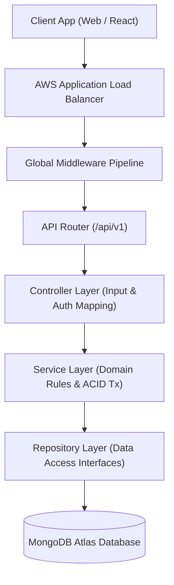
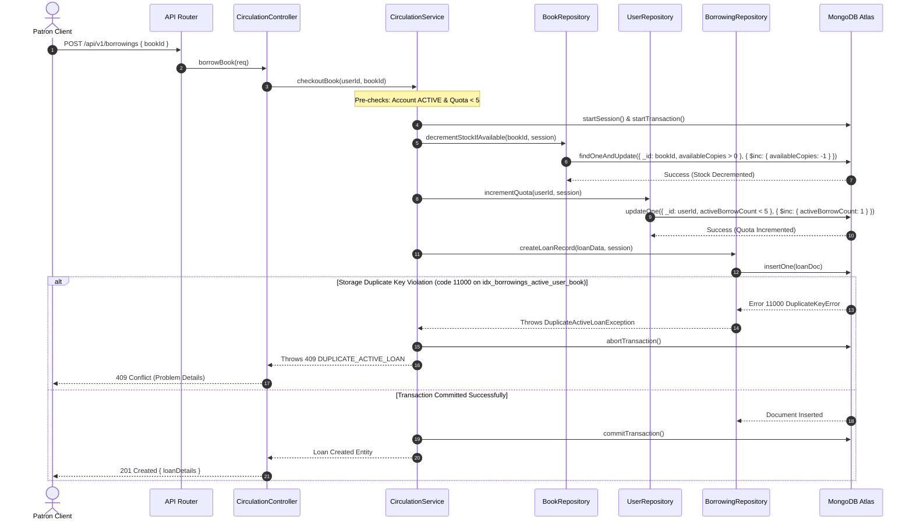
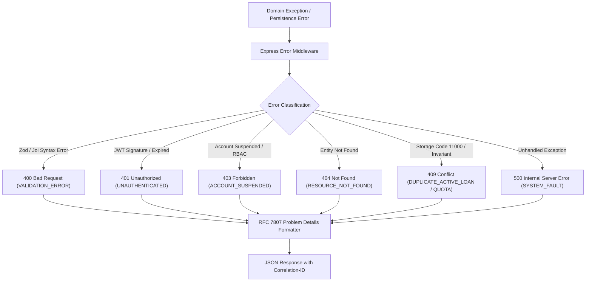

# BACKEND ARCHITECTURE AND API DESIGN SPECIFICATION
## Cloud-Native Library Management System (LMS)

---

**Document Version**: 1.1.0  
**Phase**: Phase 4 – Backend Architecture and API Design  
**Status**: BASELINE LOCKED AND APPROVED  
**Author**: Principal Backend Architect, Senior API Designer & Production Systems Engineer  
**Approved Baselines**:
- [Phase 0 Master Project Architecture Document (v1.1.0)](../02-architecture/MASTER_ARCHITECTURE.md)
- [Phase 1 Software Requirements Specification (v1.1.0)](../01-requirements/SOFTWARE_REQUIREMENTS_SPECIFICATION.md)
- [Phase 2 Detailed System Design (v1.1.0)](../02-architecture/DETAILED_SYSTEM_DESIGN.md)
- [Phase 3 Database Architecture Specification (v1.2.0)](../03-database/DATABASE_ARCHITECTURE.md)  
**Classification**: Software Architecture, Service Boundaries & API Specifications  
**Implementation Policy**: *STRICT GATE — Implementation (Phase 14) must not begin until all planning and architecture phases (Phases 1 through 13) have been fully completed and approved.*

---

## TABLE OF CONTENTS
1. [Document Control & Governance](#1-document-control--governance)
2. [Primary Objective & Architectural Scope](#2-primary-objective--architectural-scope)
3. [Authoritative Input Baselines & Invariant Preservation](#3-authoritative-input-baselines--invariant-preservation)
4. [Backend Architectural Layers](#4-backend-architectural-layers)
   - 4.1 [API & Routing Boundary](#41-api--routing-boundary)
   - 4.2 [Controller Layer](#42-controller-layer)
   - 4.3 [Service Layer (Domain & Application Services)](#43-service-layer-domain--application-services)
   - 4.4 [Repository & Persistence Boundary](#44-repository--persistence-boundary)
   - 4.5 [Middleware Architecture & Request Pipeline](#45-middleware-architecture--request-pipeline)
5. [API Resource Architecture](#5-api-resource-architecture)
6. [Standardized API Error Architecture (RFC 7807)](#6-standardized-api-error-architecture-rfc-7807)
7. [Authentication, Authorization & Context Propagation](#7-authentication-authorization--context-propagation)
8. [Circulation Service Architecture](#8-circulation-service-architecture)
   - 8.1 [Borrowing Workflow Orchestration](#81-borrowing-workflow-orchestration)
   - 8.2 [Return Workflow Orchestration & Idempotency](#82-return-workflow-orchestration--idempotency)
   - 8.3 [Concurrency-Safe Duplicate Loan Prevention (INV-06 / DBD-08)](#83-concurrency-safe-duplicate-loan-prevention-inv-06--dbd-08)
9. [Authoritative Overdue Status Architecture (DBD-09)](#9-authoritative-overdue-status-architecture-dbd-09)
10. [Transaction Orchestration Architecture](#10-transaction-orchestration-architecture)
11. [Layered Validation Architecture](#11-layered-validation-architecture)
12. [API Endpoint Specifications (All 22 Functional Requirements)](#12-api-endpoint-specifications-all-22-functional-requirements)
    - 12.1 [Authentication & Session Endpoints (FR-AUTH-001 to FR-AUTH-004)](#121-authentication--session-endpoints-fr-auth-001-to-fr-auth-004)
    - 12.2 [User Identity & Profile Endpoints (FR-USER-001 to FR-USER-002)](#122-user-identity--profile-endpoints-fr-user-001-to-fr-user-002)
    - 12.3 [Book Catalog & Discovery Endpoints (FR-BOOK-001 to FR-BOOK-004)](#123-book-catalog--discovery-endpoints-fr-book-001-to-fr-book-004)
    - 12.4 [Patron Circulation Endpoints (FR-BORROW-001 to FR-BORROW-004)](#124-patron-circulation-endpoints-fr-borrow-001-to-fr-borrow-004)
    - 12.5 [Administrative Management & Oversight Endpoints (FR-ADMIN-001 to FR-ADMIN-008)](#125-administrative-management--oversight-endpoints-fr-admin-001-to-fr-admin-008)
13. [Pagination, Filtering & Search Query Contracts](#13-pagination-filtering--search-query-contracts)
14. [Audit Integration Architecture](#14-audit-integration-architecture)
15. [Backend Component Interaction Diagrams (Mermaid)](#15-backend-component-interaction-diagrams-mermaid)
16. [Backend Architectural Decisions (ADRs)](#16-backend-architectural-decisions-adrs)
17. [Technical Decisions Deferred to Downstream Phases](#17-technical-decisions-deferred-to-downstream-phases)
18. [Requirements Traceability Matrix](#18-requirements-traceability-matrix)
19. [Phase 4 Acceptance Criteria & Verification](#19-phase-4-acceptance-criteria--verification)

---

## 1. Document Control & Governance

### 1.1 Document Metadata
| Field | Value |
|---|---|
| **Document Title** | Backend Architecture and API Design Specification |
| **Document Version** | 1.1.0 |
| **Document Status** | BASELINE LOCKED AND APPROVED |
| **Project Name** | Cloud-Native Library Management System (LMS) |
| **Author** | Principal Backend Architect, Senior API Designer & Production Systems Engineer |
| **Current Phase** | Phase 4 – Backend Architecture and API Design |
| **Next Phase** | Phase 5 – Frontend Architecture and UI/UX Design (Ready to Begin) |
| **Implementation Gate** | Strictly blocked until Phases 0 through 13 are approved |

### 1.2 Revision History
| Version | Date | Author | Summary of Changes |
|---|---|---|---|
| 1.0.0 | 2026-09-07 | Backend Architecture Team | Initial baseline release of Phase 4 Backend Architecture and API Design. |
| 1.1.0 | 2026-09-07 | Principal Backend Architect & Senior API Designer | Final clarification, consistency verification, and baseline lock pass addressing review items RC-01 through RC-22 and DCS-01 through DCS-06:<br/>1. **RC-01**: Reconciled requirement-to-endpoint mapping (22 FRs mapped to 21 distinct HTTP route paths; `GET /books` satisfies both FR-BOOK-001 and FR-BOOK-002).<br/>2. **RC-02**: Standardized `/api/v1/admin/audit-logs` path and action-style state transition routes (`/return`, `/return-override`).<br/>3. **RC-03 & RC-04**: Decoupled middleware pipeline into Global Infrastructure, Route-Group, Auth/RBAC Guards, Ownership Checks, and Transport Validation.<br/>4. **RC-05 & RC-07**: Confirmed Service-Layer Unit of Work transaction demarcation; clarified multi-document rollback sequencing.<br/>5. **RC-06**: Rigorously distinguished between preliminary read checks, transactional conditional queries, and database unique key violations (error 11000) vs. write conflicts (code 112).<br/>6. **RC-08**: Standardized return workflow idempotency to return HTTP 409 Conflict (`ALREADY_RETURNED`) for duplicate returns, preventing inventory double-adjustments.<br/>7. **RC-09**: Re-verified DBD-09 hybrid overdue model; dynamic temporal truth governs runtime logic.<br/>8. **RC-10 & RC-11**: Qualified 15-minute token lifetime as provisional; classified refresh endpoint as credential-bearing.<br/>9. **RC-12**: Standardized HTTP status taxonomy (400 for input schema, 409 for domain state conflict, 503 for transient write collisions).<br/>10. **RC-13**: Standardized offset-based pagination (`page`, `limit`) with stable tie-breaker sorting, eliminating premature cursor claims.<br/>11. **RC-14**: Preserved multi-field `$text` search behavior aligned with Phase 3 indexes.<br/>12. **RC-15**: Specified Tier 2 in-process event dispatcher reliability strategy for decoupled audit logs.<br/>13. **RC-16**: Defined account suspension semantics (blocks checkout, preserves staff return override).<br/>14. **RC-17**: Enforced service-layer ownership verification.<br/>15. **RC-18**: Enforced stock invariant `newTotalCopies >= (oldTotalCopies - oldAvailableCopies)` on admin book edits.<br/>16. **RC-19**: Clarified soft deletion semantics (`DELETE` sets `isDeleted: true`, blocked if active loans exist).<br/>17. **RC-20**: Defined real-time aggregated dashboard KPI query architecture without unapproved caching.<br/>18. **RC-21 & RC-22**: Completed Clean Architecture dependency audit and verified zero executable code.<br/>19. **DCS-01 to DCS-06**: Completed final documentation consistency sweep: canonicalized explicit route parameter names (`:borrowingId`, `:userId`, `:bookId`) across traceability and narratives; standardized offset pagination bounds (`default 20, max 100`) across all paginated endpoints; verified suspended patron read access to active loans/history; reinforced repository transaction isolation rules; and synchronized root roadmap governance. Formally locked baseline. |

### 1.3 Strict Governance Rule
In compliance with project lifecycle rules:
- **Phase 4 is an architecture, design, and interface specification phase only.**
- **Zero executable application code, Express routes, controllers, services, repositories, Mongoose schemas/models, Dockerfiles, or Kubernetes manifests are created in this phase.**
- Implementation is formally gated until Phase 14.

---

## 2. Primary Objective & Architectural Scope

The primary objective of Phase 4 is to establish a rigorous, modular, and cloud-native backend architecture that maps the approved functional requirements (Phase 1), interaction workflows (Phase 2), and persistence invariants (Phase 3) into formal software component boundaries, service contracts, and RESTful API specifications.

### 2.1 Scope Boundaries
- **In-Scope**:
  - Layered Clean Architecture (API, Controller, Service, Repository, Middleware).
  - Component responsibilities, dependency rules, and interface boundaries.
  - Complete RESTful API contracts for all 22 approved functional requirements across 21 HTTP routes.
  - Standardized RFC 7807 Problem Details error specification.
  - Concurrency-safe circulation service orchestration (borrowing and returns).
  - Authoritative dynamic overdue status evaluation and API representation.
  - Multi-document ACID vs. single-document atomic transaction boundary management.
  - Layered validation model (Transport Schema, Domain Business, Persistence-Level).
  - Two-tier audit integration policy (Atomic Business-Audit vs. Decoupled Audit).
- **Explicitly Out-of-Scope (Deferred to Later Phases)**:
  - Executable TypeScript/JavaScript application source files $\to$ Phase 14.
  - Exact cryptographic algorithms, key lengths, and salt rounds $\to$ Phase 6 (Security Architecture).
  - Containerization and multi-stage Docker builds $\to$ Phase 8.
  - AWS VPC Peering, ALB Ingress controllers, and Kubernetes manifests $\to$ Phases 9 and 10.
  - Automated integration and load testing scripts $\to$ Phase 13.

---

## 3. Authoritative Input Baselines & Invariant Preservation

Phase 4 strictly preserves and enforces all architectural constraints established in earlier locked baselines:

1. **Phase 0 Master Architecture**:
   - Dual-profile compliance: Works seamlessly on **Profile B (Cost-Optimized Student Profile)** with $0 infrastructure dependencies while remaining fully forward-compatible with **Profile A (Production Reference Profile)**.
   - Stateless backend nodes allowing horizontal pod autoscaling under Kubernetes (EKS).
2. **Phase 1 Software Requirements Specification**:
   - Complete coverage of all 22 functional requirements (`FR-AUTH-001` through `FR-ADMIN-008`).
   - Strict enforcement of circulation business rules (`BR-CIRC-001` to `BR-CIRC-006`) and patron quotas ($\le 5$ active loans).
3. **Phase 2 Detailed System Design**:
   - Adheres to approved component boundaries (Auth, User, Catalog, Circulation, Audit, Admin Dashboard).
   - Preserves circulation lifecycle states: **`ACTIVE`**, **`OVERDUE`**, **`RETURNED`**.
4. **Phase 3 Database Architecture (v1.2.0)**:
   - **Invariants INV-01 to INV-06**: Mathematically preserved in all circulation service flows.
   - **Decision DBD-02**: Multi-Document ACID Transactions mandatory for circulation borrow/return.
   - **Decision DBD-07**: Denormalized `users.activeBorrowCount` maintained atomically within circulation transactions, with `borrowings` active records as the authoritative source of truth.
   - **Decision DBD-08**: Concurrency-safe duplicate active loan prevention; application pre-checks are non-exclusive, with persistence-level unique constraints (`idx_borrowings_active_user_book`) acting as the ultimate race-condition arbiter.
   - **Decision DBD-09**: Authoritative hybrid overdue status model; dynamic real-time temporal evaluation $(returnDate == null \land now > dueDate)$ is the authoritative business truth.

---

## 4. Backend Architectural Layers

The backend system is designed around a **Layered Clean Architecture** where dependencies flow unidirectionally inward from the HTTP transport boundary toward core business logic and persistence abstractions.

```
+-----------------------------------------------------------------------------+
|                            HTTP / TRANSPORT BOUNDARY                        |
|   Reverse Proxy (AWS ALB) -> Express Application -> Global Middleware Pipeline |
+-----------------------------------------------------------------------------+
                                       │
                                       ▼
+-----------------------------------------------------------------------------+
| 1. API & ROUTING LAYER                                                      |
|    - Route Definitions (/api/v1/...)                                         |
|    - Request Correlation (X-Correlation-ID)                                 |
|    - Route-Level Authentication & Authorization Guards (RBAC)               |
|    - Transport Schema Validation Middleware (Zod / Joi Schemas)             |
+-----------------------------------------------------------------------------+
                                       │
                                       ▼
+-----------------------------------------------------------------------------+
| 2. CONTROLLER LAYER                                                         |
|    - Validated Input Extraction (Params, Query, Body)                       |
|    - User Identity Context Extraction (req.user)                            |
|    - Domain Service Invocation                                              |
|    - HTTP Response Envelope Formatting & Status Mapping                     |
|    * STRICT RULE: Zero business logic; Zero direct persistence calls        |
+-----------------------------------------------------------------------------+
                                       │
                                       ▼
+-----------------------------------------------------------------------------+
| 3. SERVICE LAYER (CORE APPLICATION & DOMAIN LOGIC)                          |
|    - Pure Business Rule Enforcement (Quotas, Eligibility, Invariants)       |
|    - Multi-Entity Orchestration (Borrow, Return, Account Suspension)        |
|    - Transaction Unit of Work Demarcation (ACID Session Management)         |
|    - Audit Event Emission (Tier 1 Atomic vs. Tier 2 Decoupled)              |
|    * STRICT RULE: Protocol agnostic (no req/res references)                 |
+-----------------------------------------------------------------------------+
                                       │
                                       ▼
+-----------------------------------------------------------------------------+
| 4. REPOSITORY & PERSISTENCE BOUNDARY                                        |
|    - Abstract Data Access Interfaces (IUserRepository, IBookRepository...)   |
|    - Database Query Construction & Atomic Updates                           |
|    - Mongoose / MongoDB Session Passing                                     |
|    - Entity Mapping (BSON / Document -> Domain Model)                      |
|    * STRICT RULE: No HTTP concerns; No business decision branching          |
+-----------------------------------------------------------------------------+
                                       │
                                       ▼
+-----------------------------------------------------------------------------+
| 5. PERSISTENCE ENGINE: MongoDB Atlas (Multi-AZ Replica Set / Cluster)        |
+-----------------------------------------------------------------------------+
```

### 4.1 API & Routing Boundary
The API layer exposes RESTful HTTP resources under the `/api/v1` namespace. It is strictly responsible for:
- Mapping incoming HTTP method and path combinations to specific controller methods.
- Enforcing route-level security guards (authentication verification and role authorization).
- Triggering input validation pipelines before controller entry.
- Associating each request with a unique `X-Correlation-ID` for end-to-end tracing.

### 4.2 Controller Layer
Controllers act as stateless adapters between HTTP transport protocols and domain services:
- **Input Extraction**: Extracts strongly validated payloads from `req.body`, `req.params`, and `req.query`.
- **Identity Context Binding**: Injects the authenticated actor's context (`req.user: { id, email, role, status }`) into service method arguments.
- **Service Invocation**: Delegates execution to domain services.
- **Response Dispatch**: Translates service return values into HTTP success responses (`200 OK`, `201 Created`, `204 No Content`).
- **Error Delegation**: Forwards unhandled exceptions directly to the centralized error middleware via `next(error)`.
- **Controller Constraints**: Controllers **must never** execute business calculations, enforce domain invariants, or invoke database driver methods directly.

### 4.3 Service Layer (Domain & Application Services)
The service layer encapsulates the core business rules and domain workflows of the library system. It is strictly decoupled from HTTP and transport concepts:
- **Domain Invariant Enforcement**: Evaluates active loan limits ($\le 5$), catalog stock availability, user account operational states, and circulation state transitions.
- **Transaction Demarcation**: Coordinates transactional Units of Work, acquiring and passing database transaction sessions for multi-document ACID operations.
- **Service Inventory**:
  1. `AuthService`: Authentication, password verification, token issuance, token family rotation, and session invalidation.
  2. `UserService`: Patron profile retrieval, credential updates, and account status transitions.
  3. `CatalogService`: Public catalog search, faceted filtering, book detail retrieval, and stock inspection.
  4. `CirculationService`: High-integrity borrow and return orchestration, duplicate loan prevention, and inventory consistency enforcement.
  5. `AdminBookService`: Administrative catalog item creation, metadata edits, stock adjustments, and soft deletion.
  6. `AdminCirculationService`: Global loan oversight and administrative return overrides with staff remarks.
  7. `AdminDashboardService`: Aggregate KPI metrics calculation across catalog, circulation, and user collections.
  8. `AuditService`: Ingestion, persistence, and querying of immutable system audit trails.

### 4.4 Repository and Persistence Boundary
Repositories encapsulate all persistence-specific query syntax, indexing patterns, and document hydration:
- **Abstraction**: Services interact exclusively with repository interfaces, ensuring persistence details (such as MongoDB aggregation stages or Mongoose query options) remain isolated.
- **Session Awareness & Transaction Boundary**: Repositories must accept an active transaction/session (`clientSession`) when provided and execute persistence operations within that session. Repositories must **never independently begin a transaction**, **never independently commit a transaction**, and **never independently define business transaction boundaries**. The Application Service Layer is the sole owner of transaction orchestration and Unit of Work demarcation.
- **Repository Inventory**:
  - `UserRepository`: Queries and persists user identities, credentials, roles, and denormalized `activeBorrowCount`.
  - `BookRepository`: Queries and updates book catalog metadata, stock counts (`totalCopies`, `availableCopies`), shelf coordinates, and soft-delete flags.
  - `BorrowingRepository`: Creates, queries, and updates loan records across `ACTIVE`, `OVERDUE`, and `RETURNED` states.
  - `SessionRepository`: Manages refresh token documents, family tracking, and explicit revocations.
  - `AuditLogRepository`: Handles append-only writes and administrative query streams for historical audit events.

### 4.5 Middleware Architecture & Request Pipeline
To prevent unnecessary processing, ensure security boundaries, and avoid redundant database lookups, the middleware architecture is organized into **five discrete, architectural execution phases** (RC-03, RC-04):

```
                       INCOMING HTTP REQUEST
                                 │
                                 ▼
+-----------------------------------------------------------------------------+
| PHASE 1: GLOBAL INFRASTRUCTURE MIDDLEWARE (EVERY REQUEST)                   |
| 1. Correlation Middleware: Reads/Generates 'X-Correlation-ID'.              |
| 2. Security Headers (Helmet): Enforces CSP, HSTS, X-Content-Type-Options.    |
| 3. CORS Policy: Validates Origin header against approved domains.            |
| 4. Body Parser: Conditionally parses JSON payloads (max 100kb; POST/PUT/PATCH)|
| 5. Global Rate Limiter: IP-based sliding window throttle.                   |
+-----------------------------------------------------------------------------+
                                 │
                                 ▼
                     ROUTE CATEGORY DISPATCH
                                 │
         ┌───────────────────────┴───────────────────────┐
         │                                               │
         ▼                                               ▼
[PUBLIC ROUTE GROUP]                           [PROTECTED ROUTE GROUP]
- /api/v1/books (Browse/Search)                - /api/v1/borrowings (Circulation)
- /api/v1/auth/register                        - /api/v1/users (Profile/Password)
- /api/v1/auth/login                           - /api/v1/admin/* (Management)
         │                                               │
         ▼                                               ▼
+----------------------------------+   +--------------------------------------+
| PHASE 2: TRANSPORT VALIDATION    |   | PHASE 2: AUTHENTICATION & SECURITY   |
| - Validates query & path params  |   | 1. Authentication Guard:             |
| - Validates JSON body schema     |   |    Verifies Bearer JWT access token. |
| - 400 VALIDATION_ERROR on syntax |   |    Extracts & binds 'req.user'.      |
+----------------------------------+   | 2. Account Status Guard:             |
         │                             |    Rejects 'SUSPENDED' (403).        |
         ▼                             | 3. RBAC Guard:                       |
+----------------------------------+   |    Enforces required role (403).     |
| PHASE 3: CONTROLLER INVOCATION   |   +--------------------------------------+
| - Dispatches to Domain Service   |                     │
+----------------------------------+                     ▼
                                       +--------------------------------------+
                                       | PHASE 3: RESOURCE OWNERSHIP & SCHEMA |
                                       | 1. Ownership Guard:                  |
                                       |    Verifies req.user.id owns entity  |
                                       | 2. Transport Schema Validation:      |
                                       |    Validates params & body schema.   |
                                       +--------------------------------------+
                                                         │
                                                         ▼
                                       +--------------------------------------+
                                       | PHASE 4: CONTROLLER & SERVICE        |
                                       | - Domain Business Validation         |
                                       | - Unit of Work Transaction Demarcation|
                                       | - Persistence Operations             |
                                       +--------------------------------------+
                                                         │
                                                         ▼
+-----------------------------------------------------------------------------+
| PHASE 5: CENTRALIZED ERROR HANDLING MIDDLEWARE                              |
| - Intercepts all rejected promises / next(error) calls                      |
| - Classifies exception (Validation, Auth, Conflict, Write Conflict, Fault)  |
| - Emits RFC 7807 Problem Details JSON with correlationId & timestamp        |
+-----------------------------------------------------------------------------+
```

---

## 5. API Resource Architecture

The RESTful API is structured around six cohesive resource domains. In accordance with RC-01 and RC-02, all 22 approved functional requirements map cleanly to 21 distinct HTTP endpoints:

| Resource Path | Domain | Primary Responsibilities | Authorized Actors | Governing Rules & Requirements |
|---|---|---|---|---|
| `/api/v1/auth` | Authentication & Sessions | Registration, login, logout, credential-bearing token refresh. | Public, Authenticated Users | `BR-001`–`003`, `FR-AUTH-001` to `004` |
| `/api/v1/users` | User Identity | Profile inspection, authenticated password updates. | Resource Owner (`ROLE_PATRON`), `ROLE_ADMIN` | `FR-USER-001`, `FR-USER-002` |
| `/api/v1/books` | Book Catalog | Public search, faceted filtering, details, real-time availability. | Public, Authenticated Users | `BR-CAT-001`, `FR-BOOK-001` to `004` |
| `/api/v1/borrowings`| Patron Circulation | Borrowing books, returning books, active loans, history archive. | Authenticated Patrons (`ROLE_PATRON`) | Invariants INV-01 to INV-06, `BR-CIRC-001` to `006`, `FR-BORROW-001` to `004` |
| `/api/v1/admin` | Administrative Operations | Catalog CRUD, user status management, global circulation, dashboard KPIs, return overrides. | Authenticated Administrators (`ROLE_ADMIN` only) | `FR-ADMIN-001` to `007` |
| `/api/v1/admin/audit-logs`| Audit Inspection | Historical audit trail query stream. | Authenticated Administrators (`ROLE_ADMIN` only) | `FR-ADMIN-008`, Decision DBD-05 |

*Note on Endpoint Count (RC-01)*: The 22 approved Functional Requirements map to 21 distinct HTTP route paths because `GET /api/v1/books` unifies both full-text catalog search (`FR-BOOK-001`, via `?q=`) and faceted catalog filtering (`FR-BOOK-002`, via `?genre=&available=`).

---

## 6. Standardized API Error Architecture (RFC 7807)

To ensure seamless client integration and clear error diagnostics, all error responses adhere strictly to the **RFC 7807 (Problem Details for HTTP APIs)** standard.

### 6.1 Standard Error Envelope
```json
{
  "type": "https://api.library.cloud/errors/DUPLICATE_ACTIVE_LOAN",
  "title": "Conflict - Business Invariant Violation",
  "status": 409,
  "code": "DUPLICATE_ACTIVE_LOAN",
  "detail": "Patron already holds an active or overdue loan for book title 'Clean Architecture'. Competing checkout rejected.",
  "instance": "/api/v1/borrowings",
  "timestamp": "2026-09-07T16:45:00.000Z",
  "correlationId": "c8f1e0d2-9b24-4a5f-8c31-7b89d42e12a0",
  "errors": []
}
```

### 6.2 Error Classification and HTTP Status Mapping Matrix (RC-12)
| Domain Error Code | HTTP Status | RFC 7807 Title | Description / Trigger Condition |
|---|:---:|---|---|
| `VALIDATION_ERROR` | **400** | Bad Request | Request body, query parameter, or path parameter failed structural/type validation. Details contained in `errors` array. |
| `MALFORMED_JSON` | **400** | Bad Request | Request payload is unparseable or violates JSON syntax. |
| `UNAUTHENTICATED` | **401** | Unauthorized | Bearer token is missing, expired, malformed, or cryptographic signature verification failed. |
| `SESSION_REVOKED` | **401** | Unauthorized | Refresh token family reuse detected or session has been explicitly revoked. |
| `ACCOUNT_SUSPENDED`| **403** | Forbidden | Authenticated user account is in `SUSPENDED` status. Operational borrowing and profile mutations are barred. |
| `INSUFFICIENT_PERMISSIONS`| **403**| Forbidden | Authenticated actor lacks required role (`ROLE_ADMIN`) for the requested endpoint. |
| `RESOURCE_ACCESS_DENIED`| **403** | Forbidden | Patron attempted to access a loan, history, or profile belonging to another user. |
| `RESOURCE_NOT_FOUND`| **404** | Not Found | Requested entity (`bookId`, `userId`, `borrowingId`) does not exist in the database. |
| `BOOK_DEACTIVATED` | **404** | Not Found | Requested book exists but has been soft-deleted (`isDeleted: true`). Inaccessible to public routes. |
| `EMAIL_ALREADY_REGISTERED`| **409**| Conflict | User registration attempted with an email that is already registered. |
| `ISBN_ALREADY_EXISTS`| **409** | Conflict | Administrative book creation attempted with an existing catalog ISBN. |
| `DUPLICATE_ACTIVE_LOAN`| **409**| Conflict | Patron already holds an `ACTIVE` or `OVERDUE` loan for the requested book title (Invariant INV-06). |
| `BORROWING_QUOTA_EXCEEDED`| **409**| Conflict | Patron has reached the maximum borrowing limit of 5 active books (Invariant INV-04). |
| `BOOK_UNAVAILABLE` | **409** | Conflict | Requested book has zero available copies in stock (`availableCopies == 0`, Invariant INV-01). |
| `ALREADY_RETURNED` | **409** | Conflict | Borrowing record is already in terminal `RETURNED` state. Duplicate return rejected. |
| `ACTIVE_LOANS_EXIST`| **409** | Conflict | Administrative deactivation of a book rejected because copies are currently checked out. |
| `TOTAL_COPIES_BELOW_LOANS`| **409**| Conflict | Administrative reduction of `totalCopies` rejected because it falls below active loans. |
| `RATE_LIMIT_EXCEEDED`| **429**| Too Many Requests | Client exceeded request rate limit window. Includes `Retry-After` response header. |
| `TRANSACTION_CONFLICT`| **503**| Service Unavailable | Database engine experienced concurrent transaction write collision (code 112) exceeding retry bounds. Client may retry safely. |
| `INTERNAL_SERVER_ERROR`| **500**| Internal Server Error | Unhandled exception or database outage. Sensitive stack trace omitted from client response. |

---

## 7. Authentication, Authorization & Context Propagation

### 7.1 Authentication Architecture & Token Lifecycle (RC-10, RC-11)
Authentication integration conforms to the requirements of Phase 1 and Phase 2 while respecting the cryptographic boundaries reserved for Phase 6:
- **Dual-Token Model**:
  1. **Short-Lived Access Token**: Signed JWT encapsulating actor identity. Transmitted via HTTP `Authorization: Bearer <token>` header. Evaluated statelessly by backend middleware. *(Note: The 15-minute access token lifespan is a provisional architectural parameter; exact lifetimes, signing algorithms [RS256 vs HS256], and key management are governed by Phase 6).*
  2. **Long-Lived Refresh Token**: Opaque cryptographically random token string stored in the `sessions` collection. Used exclusively at `/api/v1/auth/refresh` to issue new token pairs.
- **Refresh Token Security Semantics (RC-11)**:
  - `POST /api/v1/auth/refresh` is **credential-bearing**: it requires an authentic, cryptographically secure, HTTP-only refresh token cookie (`refreshToken`). It is never treated as an open unauthenticated public endpoint.
  - Each login session generates a unique `familyId`.
  - Every successful refresh operation invalidates the presented refresh token and issues a new one within the same family (Single-Use Token Rotation).
  - If an already-invalidated token is presented, the system triggers **Replay Detection**: the entire `familyId` is revoked immediately in the database, terminating all associated active sessions.

### 7.2 Identity Context Propagation (`req.user`)
Upon successful verification of the access token, the authentication middleware populates an immutable identity context attached to the request object:
```javascript
req.user = {
  id: "64a7f9b8c2d5e1f0a1b2c3d4",       // User ObjectId string
  email: "patron@university.edu",          // Canonical lowercase email
  role: "ROLE_PATRON",                    // 'ROLE_PATRON' | 'ROLE_ADMIN'
  status: "ACTIVE",                       // 'ACTIVE' | 'SUSPENDED'
  sessionId: "64a7f9b8c2d5e1f0a1b2c3d5"   // Associated active session ID
};
```

### 7.3 Authorization Architecture & Account Suspension Semantics (RC-16, RC-17, DCS-04)
1. **Role-Based Access Control (RBAC)**:
   - Evaluated by `authorizeRoles('ROLE_ADMIN')` middleware. Rejects unauthorized callers with `403 Forbidden` (`INSUFFICIENT_PERMISSIONS`).
2. **Account Operational Status Guard (RC-16)**:
   - Evaluated immediately after token verification.
   - If `req.user.status === 'SUSPENDED'`:
     - Patron is **barred** from initiating new checkouts (`POST /api/v1/borrowings`), renewing session tokens, or updating profile/passwords (`PATCH /api/v1/users/password`).
     - Patron **retains read access** to inspect their active loans (`GET /api/v1/borrowings/my-active`) and loan history (`GET /api/v1/borrowings/my-history`) to verify outstanding obligations.
     - To ensure library inventory is returned, a suspended patron **is permitted** to return their outstanding books via the standard return endpoint (`POST /api/v1/borrowings/:borrowingId/return`), or staff can execute an administrative return override (`POST /api/v1/admin/borrowings/:borrowingId/return-override`).
3. **Resource Ownership Guard (RC-17)**:
   - Evaluated at the **Service Layer** and route guards based on verified `req.user.id`.
   - For user-scoped resources (e.g., `/api/v1/borrowings/my-active`, `/api/v1/users/profile`), the service layer automatically scopes queries to `req.user.id`, preventing parameter tampering or BSON injection.

---

## 8. Circulation Service Architecture

The Circulation Service is the most concurrency-critical subsystem in the application. It is engineered to mathematically preserve all Phase 3 consistency invariants.

### 8.1 Borrowing Workflow Orchestration (RC-06, RC-07)
The self-service borrowing workflow executes through a strict 13-stage deterministic orchestration pipeline:

```
Patron Request: POST /api/v1/borrowings { bookId }
   │
   ├─► 1. Authenticate Request & Verify Access Token (Extract req.user)
   ├─► 2. Validate Input Payload Syntax (Valid 24-character hex ObjectId)
   ├─► 3. Enforce Account Operational Status (Verify status === 'ACTIVE')
   ├─► 4. Fast-Fail Preliminary Business Checks (Read-Phase):
   │        a. Verify patron activeBorrowCount < 5 (Invariant INV-04)
   │        b. Verify book exists and isDeleted === false
   │        c. Verify book availableCopies > 0 (Invariant INV-01)
   │        d. Preliminary check for existing active loan for this book title
   │
   ├─► 5. Acquire MongoDB Client Session & Start Multi-Document ACID Transaction
   │        │
   │        ▼
   │   [TRANSACTION BOUNDARY - ACID]
   │   ├─► 6. Lock & Decrement Book Stock Atomically:
   │   │        UPDATE books 
   │   │        SET availableCopies = availableCopies - 1
   │   │        WHERE _id = bookId AND availableCopies > 0 AND isDeleted = false
   │   │        * If matchedCount === 0: ABORT TX -> Throw BOOK_UNAVAILABLE (409)
   │   │
   │   ├─► 7. Re-Verify & Increment Patron Quota Atomically:
   │   │        UPDATE users 
   │   │        SET activeBorrowCount = activeBorrowCount + 1
   │   │        WHERE _id = userId AND activeBorrowCount < 5 AND status = 'ACTIVE'
   │   │        * If matchedCount === 0: ABORT TX -> Throw BORROWING_QUOTA_EXCEEDED (409)
   │   │
   │   ├─► 8. Insert Borrowing Record:
   │   │        INSERT borrowings {
   │   │          userId: userId,
   │   │          bookId: bookId,
   │   │          borrowDate: now,
   │   │          dueDate: now + 14 days,
   │   │          status: 'ACTIVE',
   │   │          returnDate: null
   │   │        }
   │   │        * If Storage Duplicate Key Violation (code 11000 on idx_borrowings_active_user_book):
   │   │            ABORT TX -> Throw DUPLICATE_ACTIVE_LOAN (409)
   │   │        * If Concurrent Write Conflict (code 112):
   │   │            ABORT TX -> Retry Transaction (up to 3x) -> Throw TRANSACTION_CONFLICT (503)
   │   │
   │   └─► 9. Commit Multi-Document ACID Transaction
   │
   ├─► 10. Tier 2 Decoupled Audit Event Dispatch (LOAN_CREATED)
   ├─► 11. Invalidate Catalog Availability Cache (if applicable)
   └─► 12. Return HTTP 201 Created with Borrowing Resource Representation
```

*Transaction Ordering & Rollback Guarantee (RC-07)*: Steps 6, 7, and 8 occur within a single WiredTiger ACID session. If Step 8 encounters a duplicate active loan collision at the storage engine index level, the transaction is **aborted completely**, automatically rolling back steps 6 and 7. Zero partial inventory decrement or quota increment can commit.

### 8.2 Return Workflow Orchestration & Idempotency (RC-08)
The return workflow supports both patron self-service returns and administrative overrides:

1. **Borrowing Entity Retrieval**: Looks up the target borrowing record by `borrowingId`.
2. **Resource Existence Check**: Throws `404 Not Found` (`RESOURCE_NOT_FOUND`) if the loan does not exist.
3. **State Invariance Check & Idempotency Specification (RC-08)**:
   - Verifies that the loan `status` is currently `ACTIVE` or `OVERDUE`.
   - **Idempotency Contract**: If `status === 'RETURNED'`, the service **rejects the mutation with HTTP 409 Conflict (`ALREADY_RETURNED`)**.
   - *Rationale*: A return operation has strict inventory side effects ($availableCopies \gets availableCopies + 1, activeBorrowCount \gets activeBorrowCount - 1$). Returning `409 Conflict` prevents client ambiguity, ensures that inventory is not double-incremented, and guarantees that patron quotas are not double-decremented.
4. **Actor Authorization & Ownership**:
   - For patron self-service: Verifies that `borrowing.userId === req.user.id`.
   - For administrative return: Verifies `req.user.role === 'ROLE_ADMIN'`. Requires mandatory `adminRemarks` string.
5. **ACID Transaction Execution**:
   - Starts Multi-Document Transaction session.
   - **Update Borrowing Record**: Sets `status = 'RETURNED'`, `returnDate = now`, `returnedBy = req.user.role`, and optional `adminReturnRemarks`.
   - **Restore Inventory Stock**: Increments `books.availableCopies` by 1 where `_id = borrowing.bookId` (guaranteed $\le totalCopies$).
   - **Decrement Patron Quota**: Decrements `users.activeBorrowCount` by 1 where `_id = borrowing.userId` (guaranteed $\ge 0$).
   - **Audit Integration**:
     - *Admin Return Override*: Tier 1 Atomic Audit record inserted inside the transaction session.
     - *Patron Return*: Tier 2 Decoupled Audit dispatched post-commit.
   - Commits Transaction.
6. **Response Generation**: Returns `200 OK` with updated borrowing details and inventory confirmation.

### 8.3 Concurrency-Safe Duplicate Loan Prevention (INV-06 / DBD-08 / RC-06)
To prevent race conditions when two checkout requests arrive simultaneously:
- **The Problem**: A client initiates concurrent requests across two devices. Both pass the preliminary read check (`find`) because neither has committed.
- **The Solution (Two-Tier Defense)**:
  1. *Tier 1 (Application Guard)*: A preliminary query filters out non-concurrency requests early.
  2. *Tier 2 (Authoritative Persistence Guard)*: Phase 3 established a **compound unique partial index** on `borrowings`:
     ```javascript
     { userId: 1, bookId: 1 } where status IN ['ACTIVE', 'OVERDUE']
     ```
  3. *Error Distinction*:
     - **Duplicate Key Error (code 11000)**: Indicates an attempt to insert a duplicate active loan. Aborts transaction and maps to `409 DUPLICATE_ACTIVE_LOAN`.
     - **Write Conflict (code 112)**: Indicates concurrent transactions attempting to modify the same book or user document. Automatically retried up to 3 times before failing with `503 TRANSACTION_CONFLICT`.

---

## 9. Authoritative Overdue Status Architecture (DBD-09 / RC-09)

In accordance with Phase 3 Decision **DBD-09**, the backend architecture establishes a strict separation between **real-time business truth** and **indexed persistence representation**:

### 9.1 The Authoritative Business Truth Formula
A loan is overdue if and only if:
$$\text{isOverdue}(loan) \iff (loan.\text{returnDate} == \text{null} \land \text{currentDate} > loan.\text{dueDate})$$

### 9.2 Dynamic Runtime Evaluation
- **Zero Scheduler Dependency**: The system **does not require an asynchronous cron job or scheduler** to evaluate loan status correctly.
- **Dynamic API Mapping**: Whenever a loan entity is loaded from the repository, the service layer evaluates the temporal formula:
  - If `returnDate === null` and `now > dueDate`, the entity's computed status is authoritatively set to `OVERDUE` in the API response DTO, regardless of the stored database string.
- **Borrowing Eligibility Enforcement**: When evaluating a patron's eligibility to borrow new titles, the service queries:
  ```javascript
  count({ userId: patronId, returnDate: null, dueDate: { $lt: now } })
  ```
  If this count is $> 0$, the patron has overdue obligations and checkout is blocked with `409 Conflict`. Stale stored statuses **cannot** cause incorrect checkout eligibility decisions.

### 9.3 Persistence Synchronization
- For high-performance administrative filtering and reporting, the compound index `{ status: 1, dueDate: 1 }` allows the system to query overdue records efficiently.
- An optional background maintenance worker (specified in Phase 10/12) may periodically synchronize the persisted `status` field to `'OVERDUE'` for reporting tools. However, core circulation correctness never depends on this background task.

---

## 10. Transaction Orchestration Architecture (RC-05)

The backend establishes a clear distinction between multi-document transactional workflows and single-document atomic mutations:

| Operation | Affected Collections | Transaction Type | Isolation / Concurrency Strategy | Rollback Action on Failure |
|---|---|---|---|---|
| **Borrow Book** | `books`, `borrowings`, `users` | **Multi-Document ACID** | Read Committed; write locks on book, user, loan documents. | Stock restored, user quota restored, loan aborted. |
| **Return Book (Patron)** | `books`, `borrowings`, `users` | **Multi-Document ACID** | Write locks on book, user, loan documents. | Status unchanged, stock untouched, quota untouched. |
| **Return Book (Admin)** | `books`, `borrowings`, `users`, `audit_logs` | **Multi-Document ACID** | Unified business & Tier 1 audit write lock. | Entire operation aborted if audit write fails. |
| **User Suspension** | `users`, `sessions`, `audit_logs` | **Multi-Document ACID** | User status locked, session tokens revoked, Tier 1 audit log created. | User remains active if sessions cannot be revoked. |
| **Password Change** | `users`, `sessions` | **Multi-Document ACID** | User password hash updated; all active session tokens revoked. | Password unchanged if session revocation fails. |
| **Create Catalog Item**| `books` | **Single-Document Atomic** | Atomic collection insert; unique index on ISBN. | Insert rejected on duplicate ISBN. |
| **Update Book Metadata**| `books` | **Single-Document Atomic** | Conditional atomic update with stock floor guard. | Update rejected if totalCopies < active loans. |
| **Deactivate Book** | `books` | **Single-Document Atomic** | Conditional atomic update requiring zero active loans. | Update rejected if active loans exist. |
| **User Logout** | `sessions` | **Single-Document Atomic** | Atomic document delete or `isRevoked: true` flag update. | Session remains valid on connection failure. |

*Service Layer Demarcation & Ownership Rule (RC-05, DCS-03)*: The Application Service Layer is the sole owner of transaction and Unit of Work orchestration. All multi-document ACID transactions are initiated, committed, and aborted strictly within the Service Layer. Repositories must accept an active transaction/session (`clientSession`) when provided, execute persistence operations, never independently begin a transaction, never independently commit a transaction, and never independently define business transaction boundaries.

---

## 11. Layered Validation Architecture (RC-04)

To eliminate security vulnerabilities, data corruption, and race conditions, the backend implements a three-tier validation architecture:

```
[ HTTP Request Payload ]
           │
           ▼
+-----------------------------------------------------------------------------+
| LAYER 1: API INPUT VALIDATION (GATEWAY BOUNDARY)                            |
| - Syntactic validation: Required fields present, correct data types.        |
| - String sanitization: Trimming, max string lengths, email regex, ISBN regex|
| - Numeric bounds: publicationYear in valid range, totalCopies > 0.          |
| - Rejection: HTTP 400 Bad Request with field-level RFC 7807 error list.     |
+-----------------------------------------------------------------------------+
           │
           ▼
+-----------------------------------------------------------------------------+
| LAYER 2: BUSINESS DOMAIN VALIDATION (SERVICE LAYER)                         |
| - Patron account status check (status === 'ACTIVE').                        |
| - Patron active loan quota check (activeBorrowCount < 5).                   |
| - Overdue loan check (patron has zero overdue items).                       |
| - Real-time stock availability check (availableCopies > 0).                 |
| - Circulation state transition validity (no double returns).                |
| - Rejection: HTTP 409 Conflict with domain problem details code.             |
+-----------------------------------------------------------------------------+
           │
           ▼
+-----------------------------------------------------------------------------+
| LAYER 3: PERSISTENCE-LEVEL VALIDATION (DATABASE ENGINE)                      |
| - Unique constraints (unique email, unique ISBN).                           |
| - Compound unique partial index (userId + bookId on active borrowings).     |
| - Optimistic conditional match queries (availableCopies > 0).               |
| - BSON schema validation rules (non-negative stock, valid enum values).     |
| - Rejection: Storage engine write conflict / duplicate key error.           |
+-----------------------------------------------------------------------------+
```

---

## 12. API Endpoint Specifications (All 22 Functional Requirements)

### 12.1 Authentication & Session Endpoints (FR-AUTH-001 to FR-AUTH-004)

#### `POST /api/v1/auth/register` (FR-AUTH-001)
- **Purpose**: Patron self-registration.
- **Access Control**: Public (Unauthenticated).
- **Request Headers**: `Content-Type: application/json`
- **Request Body Contract**:
  - `firstName` (String, required, 1–50 chars, trimmed)
  - `lastName` (String, required, 1–50 chars, trimmed)
  - `email` (String, required, valid RFC 5322 format, lowercase, max 255 chars)
  - `password` (String, required, min 8 chars, must contain uppercase, lowercase, number, special char)
  - `phoneNumber` (String, optional, formatted phone string, max 20 chars)
- **Success Outcome**: `201 Created`
  ```json
  {
    "id": "64a7f9b8c2d5e1f0a1b2c3d4",
    "firstName": "Jane",
    "lastName": "Doe",
    "email": "jane.doe@university.edu",
    "role": "ROLE_PATRON",
    "status": "ACTIVE",
    "createdAt": "2026-09-07T16:00:00.000Z"
  }
  ```
- **Failure Outcomes**:
  - `400 Bad Request` (`VALIDATION_ERROR`): Invalid email syntax or weak password.
  - `409 Conflict` (`EMAIL_ALREADY_REGISTERED`): Email is already associated with an account.

#### `POST /api/v1/auth/login` (FR-AUTH-002)
- **Purpose**: Authenticate credentials and establish an active session.
- **Access Control**: Public (Unauthenticated).
- **Request Body Contract**:
  - `email` (String, required, valid email format)
  - `password` (String, required)
- **Success Outcome**: `200 OK`
  - Sets HTTP-Only Secure Cookie: `refreshToken=<token>; HttpOnly; Secure; SameSite=Strict; Path=/api/v1/auth`
  - Response Body:
    ```json
    {
      "accessToken": "eyJhbGciOiJIUzI1NiIsInR5cCI6IkpXVCJ9...",
      "tokenType": "Bearer",
      "expiresIn": 900,
      "user": {
        "id": "64a7f9b8c2d5e1f0a1b2c3d4",
        "firstName": "Jane",
        "lastName": "Doe",
        "email": "jane.doe@university.edu",
        "role": "ROLE_PATRON"
      }
    }
    ```
- **Failure Outcomes**:
  - `401 Unauthorized` (`INVALID_CREDENTIALS`): Incorrect email or password.
  - `403 Forbidden` (`ACCOUNT_SUSPENDED`): Account is deactivated by administrator.

#### `POST /api/v1/auth/logout` (FR-AUTH-003)
- **Purpose**: Invalidate current refresh token session.
- **Access Control**: Authenticated (`ROLE_PATRON`, `ROLE_ADMIN`).
- **Request Headers**: `Authorization: Bearer <accessToken>`
- **Request Body**: None (Cookie contains `refreshToken`).
- **Success Outcome**: `204 No Content` (Clears refresh cookie).
- **Failure Outcomes**:
  - `401 Unauthorized` (`UNAUTHENTICATED`): Missing or invalid token.

#### `POST /api/v1/auth/refresh` (FR-AUTH-004 / RC-11)
- **Purpose**: Issue new access and refresh token pair using single-use rotation.
- **Access Control**: Credential-Bearing (Requires valid HTTP-only `refreshToken` cookie).
- **Request Body**: None (Cookie contains `refreshToken`).
- **Success Outcome**: `200 OK` (Rotates cookie, returns new access token).
- **Failure Outcomes**:
  - `401 Unauthorized` (`SESSION_REVOKED` / `TOKEN_EXPIRED`): Token invalid or reuse detected.

---

### 12.2 User Identity & Profile Endpoints (FR-USER-001 to FR-USER-002)

#### `GET /api/v1/users/profile` (FR-USER-001)
- **Purpose**: Retrieve personal profile and current active loan count.
- **Access Control**: Authenticated (`ROLE_PATRON`, `ROLE_ADMIN`).
- **Success Outcome**: `200 OK`
  ```json
  {
    "id": "64a7f9b8c2d5e1f0a1b2c3d4",
    "firstName": "Jane",
    "lastName": "Doe",
    "email": "jane.doe@university.edu",
    "phoneNumber": "+1-555-0199",
    "role": "ROLE_PATRON",
    "status": "ACTIVE",
    "activeBorrowCount": 2,
    "createdAt": "2026-09-07T16:00:00.000Z"
  }
  ```

#### `PATCH /api/v1/users/password` (FR-USER-002)
- **Purpose**: Change account password and revoke other active sessions.
- **Access Control**: Authenticated (`ROLE_PATRON`, `ROLE_ADMIN`).
- **Request Body Contract**:
  - `currentPassword` (String, required)
  - `newPassword` (String, required, min 8 chars, complexity rules)
- **Success Outcome**: `200 OK` (`{ "message": "Password updated successfully. Other active sessions revoked." }`).
- **Failure Outcomes**:
  - `400 Bad Request` (`VALIDATION_ERROR`): Weak new password.
  - `401 Unauthorized` (`INVALID_CREDENTIALS`): Incorrect current password.

---

### 12.3 Book Catalog & Discovery Endpoints (FR-BOOK-001 to FR-BOOK-004)

#### `GET /api/v1/books` (FR-BOOK-001, FR-BOOK-002)
- **Purpose**: Browse catalog with text search, faceted filtering, and pagination. Excludes `isDeleted: true`.
- **Access Control**: Public.
- **Query Parameters**:
  - `q` (String, optional, text search query across title, author, description)
  - `genre` (String, optional, exact match filter)
  - `available` (Boolean, optional, filter `availableCopies > 0`)
  - `sortBy` (String, optional, `title` | `author` | `publicationYear` | `createdAt`, default `createdAt`)
  - `sortOrder` (String, optional, `asc` | `desc`, default `desc`)
  - `page` (Integer, optional, min 1, default 1)
  - `limit` (Integer, optional, min 1, max 100, default 20)
- **Success Outcome**: `200 OK`
  ```json
  {
    "data": [
      {
        "id": "64a7f9b8c2d5e1f0a1b2c3e1",
        "title": "Clean Architecture",
        "author": "Robert C. Martin",
        "isbn": "978-0134494166",
        "genre": "Software Engineering",
        "publicationYear": 2017,
        "availableCopies": 3,
        "totalCopies": 5,
        "coverImageUrl": "https://cdn.library.cloud/covers/clean-arch.jpg"
      }
    ],
    "pagination": {
      "page": 1,
      "limit": 20,
      "totalRecords": 142,
      "totalPages": 8,
      "hasNextPage": true,
      "hasPrevPage": false
    }
  }
  ```

#### `GET /api/v1/books/:bookId` (FR-BOOK-003)
- **Purpose**: Retrieve detailed book information including physical shelf coordinates.
- **Access Control**: Public.
- **Path Parameters**: `bookId` (24-char hex ObjectId)
- **Success Outcome**: `200 OK`
  ```json
  {
    "id": "64a7f9b8c2d5e1f0a1b2c3e1",
    "title": "Clean Architecture",
    "author": "Robert C. Martin",
    "isbn": "978-0134494166",
    "genre": "Software Engineering",
    "description": "A craftsman's guide to software structure and design.",
    "publisher": "Prentice Hall",
    "publicationYear": 2017,
    "totalCopies": 5,
    "availableCopies": 3,
    "location": { "aisle": "B3", "shelf": "2A" },
    "coverImageUrl": "https://cdn.library.cloud/covers/clean-arch.jpg",
    "createdAt": "2026-09-01T10:00:00.000Z"
  }
  ```
- **Failure Outcomes**:
  - `404 Not Found` (`RESOURCE_NOT_FOUND` / `BOOK_DEACTIVATED`).

#### `GET /api/v1/books/:bookId/availability` (FR-BOOK-004)
- **Purpose**: Real-time readout of book availability and physical shelf placement.
- **Access Control**: Public.
- **Success Outcome**: `200 OK`
  ```json
  {
    "bookId": "64a7f9b8c2d5e1f0a1b2c3e1",
    "isAvailable": true,
    "availableCopies": 3,
    "totalCopies": 5,
    "location": { "aisle": "B3", "shelf": "2A" }
  }
  ```

---

### 12.4 Patron Circulation Endpoints (FR-BORROW-001 to FR-BORROW-004)

#### `POST /api/v1/borrowings` (FR-BORROW-001)
- **Purpose**: Self-service book checkout within Multi-Document ACID Transaction.
- **Access Control**: Authenticated Patron (`ROLE_PATRON`).
- **Request Body Contract**:
  - `bookId` (String, required, valid ObjectId hex string)
- **Success Outcome**: `201 Created`
  ```json
  {
    "id": "64a7f9b8c2d5e1f0a1b2c3f1",
    "userId": "64a7f9b8c2d5e1f0a1b2c3d4",
    "bookId": "64a7f9b8c2d5e1f0a1b2c3e1",
    "bookTitle": "Clean Architecture",
    "borrowDate": "2026-09-07T16:30:00.000Z",
    "dueDate": "2026-09-21T16:30:00.000Z",
    "status": "ACTIVE",
    "returnDate": null
  }
  ```
- **Failure Outcomes**:
  - `400 Bad Request` (`VALIDATION_ERROR`): Invalid ObjectId.
  - `403 Forbidden` (`ACCOUNT_SUSPENDED`): Patron account is suspended.
  - `404 Not Found` (`RESOURCE_NOT_FOUND`): Book does not exist or is soft-deleted.
  - `409 Conflict` (`BOOK_UNAVAILABLE`): Stock depleted (`availableCopies == 0`).
  - `409 Conflict` (`BORROWING_QUOTA_EXCEEDED`): Patron already has 5 active loans.
  - `409 Conflict` (`DUPLICATE_ACTIVE_LOAN`): Patron already has an active loan for this title.

#### `POST /api/v1/borrowings/:borrowingId/return` (FR-BORROW-002)
- **Purpose**: Self-service return of borrowed book.
- **Access Control**: Authenticated Patron (`ROLE_PATRON`, must own the loan).
- **Path Parameters**: `borrowingId` (24-char hex ObjectId)
- **Success Outcome**: `200 OK`
  ```json
  {
    "id": "64a7f9b8c2d5e1f0a1b2c3f1",
    "bookId": "64a7f9b8c2d5e1f0a1b2c3e1",
    "status": "RETURNED",
    "borrowDate": "2026-09-07T16:30:00.000Z",
    "returnDate": "2026-09-12T11:20:00.000Z",
    "returnedBy": "ROLE_PATRON"
  }
  ```
- **Failure Outcomes**:
  - `403 Forbidden` (`RESOURCE_ACCESS_DENIED`): Loan belongs to another user.
  - `404 Not Found` (`RESOURCE_NOT_FOUND`): Loan record does not exist.
  - `409 Conflict` (`ALREADY_RETURNED`): Loan record has already been returned.

#### `GET /api/v1/borrowings/my-active` (FR-BORROW-003)
- **Purpose**: View patron's currently active and overdue loans.
- **Access Control**: Authenticated Patron (`ROLE_PATRON`).
- **Success Outcome**: `200 OK`
  ```json
  {
    "data": [
      {
        "id": "64a7f9b8c2d5e1f0a1b2c3f1",
        "book": {
          "id": "64a7f9b8c2d5e1f0a1b2c3e1",
          "title": "Clean Architecture",
          "author": "Robert C. Martin",
          "coverImageUrl": "https://cdn.library.cloud/covers/clean-arch.jpg"
        },
        "borrowDate": "2026-09-01T10:00:00.000Z",
        "dueDate": "2026-09-15T10:00:00.000Z",
        "status": "ACTIVE",
        "isOverdue": false,
        "daysRemaining": 8
      }
    ],
    "totalActiveLoans": 1
  }
  ```

#### `GET /api/v1/borrowings/my-history` (FR-BORROW-004)
- **Purpose**: Paginated archive of patron's entire circulation history.
- **Access Control**: Authenticated Patron (`ROLE_PATRON`).
- **Query Parameters**: `page` (default 1), `limit` (default 20, max 100).
- **Success Outcome**: `200 OK` (Standard pagination envelope with historical records).

---

### 12.5 Administrative Management & Oversight Endpoints (FR-ADMIN-001 to FR-ADMIN-008)

#### `GET /api/v1/admin/dashboard/kpis` (FR-ADMIN-001 / RC-20)
- **Purpose**: Real-time operational KPI metric cards.
- **Access Control**: Authenticated Administrator (`ROLE_ADMIN`).
- **Success Outcome**: `200 OK`
  ```json
  {
    "catalog": {
      "totalTitles": 450,
      "totalCopies": 1820,
      "availableCopies": 1240
    },
    "circulation": {
      "activeLoans": 580,
      "overdueLoans": 42
    },
    "users": {
      "totalRegisteredUsers": 310,
      "activePatrons": 298,
      "suspendedPatrons": 12
    },
    "calculatedAt": "2026-09-07T16:45:00.000Z"
  }
  ```

#### `POST /api/v1/admin/books` (FR-ADMIN-002)
- **Purpose**: Add a new book title to the catalog.
- **Access Control**: Authenticated Administrator (`ROLE_ADMIN`).
- **Request Body Contract**:
  - `title` (String, required, 1–255 chars, trimmed)
  - `author` (String, required, 1–255 chars, trimmed)
  - `isbn` (String, required, valid ISBN-10 or ISBN-13 format)
  - `genre` (String, required, enum from approved catalog genres)
  - `description` (String, required, max 2000 chars)
  - `publisher` (String, required, max 255 chars)
  - `publicationYear` (Integer, required, 1000 to currentYear + 1)
  - `totalCopies` (Integer, required, min 1, max 1000)
  - `location` (Object, required: `{ aisle: String, shelf: String }`)
  - `coverImageUrl` (String, optional, valid HTTPS URL)
- **Success Outcome**: `201 Created`
- **Failure Outcomes**:
  - `400 Bad Request` (`VALIDATION_ERROR`)
  - `409 Conflict` (`ISBN_ALREADY_EXISTS`)

#### `PUT /api/v1/admin/books/:bookId` (FR-ADMIN-003 / RC-18, DCS-05)
- **Purpose**: Update catalog metadata and stock counts.
- **Access Control**: Authenticated Administrator (`ROLE_ADMIN`).
- **Request Body Contract**: Metadata fields and `totalCopies`.
- **Stock Invariant Enforcement**:
  - Calculates delta: $\Delta = \text{newTotalCopies} - \text{oldTotalCopies}$
  - Synchronizes available stock: $\text{newAvailableCopies} = \text{oldAvailableCopies} + \Delta$
  - Enforces invariant: $\text{newAvailableCopies} \ge 0 \iff \text{newTotalCopies} \ge (\text{oldTotalCopies} - \text{oldAvailableCopies})$
  - If `newTotalCopies` falls below currently borrowed copies, the request is rejected with `409 Conflict` (`TOTAL_COPIES_BELOW_LOANS`).
- **Success Outcome**: `200 OK` (Updates both `totalCopies` and `availableCopies` atomically).

#### `DELETE /api/v1/admin/books/:bookId` (FR-ADMIN-004 / RC-19, DCS-05)
- **Purpose**: Soft-delete catalog item (`isDeleted = true, deletedAt = now`).
- **Access Control**: Authenticated Administrator (`ROLE_ADMIN`).
- **Pre-Condition**: Verifies active loans for this title equals 0 (`availableCopies === totalCopies`).
- **Success Outcome**: `200 OK`
  ```json
  {
    "id": "64a7f9b8c2d5e1f0a1b2c3e1",
    "isDeleted": true,
    "deletedAt": "2026-09-07T16:40:00.000Z",
    "message": "Book deactivated successfully."
  }
  ```
- **Failure Outcomes**:
  - `409 Conflict` (`ACTIVE_LOANS_EXIST`): Book cannot be deactivated while active loans are outstanding.

#### `PATCH /api/v1/admin/users/:userId/status` (FR-ADMIN-005)
- **Purpose**: Suspend or reactivate patron account.
- **Access Control**: Authenticated Administrator (`ROLE_ADMIN`).
- **Request Body Contract**:
  - `status` (String, required, Enum: `['ACTIVE', 'SUSPENDED']`)
  - `reason` (String, required, 5–500 chars)
- **Success Outcome**: `200 OK` (Executes Tier 1 Multi-Document ACID Transaction invalidating active patron sessions).

#### `GET /api/v1/admin/borrowings` (FR-ADMIN-006)
- **Purpose**: Global circulation roster oversight with status/user/book filters.
- **Access Control**: Authenticated Administrator (`ROLE_ADMIN`).
- **Query Parameters**: `status` (`ACTIVE` | `OVERDUE` | `RETURNED`), `userId`, `bookId`, `page` (default 1), `limit` (default 20, max 100).
- **Success Outcome**: `200 OK` (Paginated list of all library borrowings).

#### `POST /api/v1/admin/borrowings/:borrowingId/return-override` (FR-ADMIN-007)
- **Purpose**: Staff return on behalf of patron with mandatory override remarks.
- **Access Control**: Authenticated Administrator (`ROLE_ADMIN`).
- **Request Body Contract**:
  - `adminRemarks` (String, required, 5–500 chars)
- **Success Outcome**: `200 OK` (Executes inside Tier 1 Multi-Document ACID Transaction with unified audit record).

#### `GET /api/v1/admin/audit-logs` (FR-ADMIN-008 / RC-02)
- **Purpose**: Query append-only administrative audit log ledger.
- **Access Control**: Authenticated Administrator (`ROLE_ADMIN`).
- **Query Parameters**: `action`, `actorId`, `entityType`, `startDate`, `endDate`, `page` (default 1), `limit` (default 20, max 100).
- **Success Outcome**: `200 OK` (Paginated audit entries).

---

## 13. Pagination, Filtering & Search Query Contracts (RC-13, RC-14)

### 13.1 Standard Offset-Based Pagination Contract (RC-13, DCS-02)
All list endpoints implement a standardized **Page/Limit (Offset-based) Pagination** model with deterministic tie-breaker sorting:
- **Query Parameters**:
  - `page` (Integer, optional, min 1, default 1)
  - `limit` (Integer, optional, min 1, max 100, default 20)
- **Tie-Breaker Sorting**: To prevent record skipping during concurrent writes, all paginated queries append `_id: 1` as the secondary sort key.
- **Response Envelope**:
```json
{
  "data": [],
  "pagination": {
    "page": 1,
    "limit": 20,
    "totalRecords": 150,
    "totalPages": 8,
    "hasNextPage": true,
    "hasPrevPage": false
  }
}
```

### 13.2 Catalog Search & Relevance Ordering Contract (RC-14)
- **Full-Text Mode**: When query parameter `q` is present:
  - Leverages Phase 3 multi-field index `idx_books_text_search` (`$text`).
  - Results are ordered strictly by text relevance score: `{ score: { $meta: "textScore" } }`.
  - Manual sorting parameters are ignored to preserve relevance ranking.
- **Faceted Browsing Mode**: When `q` is absent:
  - Supports equality filtering across `genre` and `available=true`.
  - Sorts chronologically by `publicationYear: -1` or `createdAt: -1`.
  - Completely supported by compound index `idx_books_genre_avail`.

---

## 14. Audit Integration Architecture (RC-15)

The backend architecture enforces the Phase 3 two-tier audit consistency model:

```
                  MUTATING BACKEND OPERATION
                              │
                              ▼
               IS OPERATION SENSITIVE ADMIN MUTATION?
                              │
               ┌──────────────┴──────────────┐
               │ YES                         │ NO
               ▼                             ▼
       [TIER 1: ATOMIC AUDIT]         [TIER 2: DECOUPLED AUDIT]
       - Account Suspension           - Self-Service Checkout
       - Staff Return Override        - Self-Service Return
       - Book Deactivation            - Catalog Admin CRUD
               │                             │
               ▼                             ▼
    Multi-Doc ACID Transaction:    Business Operation Commits:
    Commit Business Mutation       Commit Business State First
    AND Audit Log Together.                   │
               │                             ▼
    * Failure of audit write       Dispatch Audit Log Write:
      rolls back entire operation.  * Failure of audit write
                                      NEVER rolls back circulation.
```

### 14.1 Tier 1: Atomic Business-Audit Operations
- Applies to: `PATCH /api/v1/admin/users/:userId/status`, `POST /api/v1/admin/borrowings/:borrowingId/return-override`.
- The audit record insertion is passed the transaction session. If MongoDB fails to insert the audit log, the entire transaction is aborted, preventing untraceable administrative actions.

### 14.2 Tier 2: Decoupled / Eventually Consistent Operations (RC-15)
- Applies to: Patron borrow and return operations.
- **Reliability Strategy**: Handled via an **In-Process Reliable Event Dispatcher** (`EventEmitter` with local retry loop). The business state commits first. If the asynchronous audit log insert fails, the error is written to a fallback operational log and triggers a localized warning alert. Core circulation operations are **never aborted** due to transient audit delays. An external message queue (AWS SQS) is formally classified as a downstream infrastructure enhancement for Phase 9/14.

---

## 15. Backend Component Interaction Diagrams (Mermaid)

### Diagram 1: Layered Clean Architecture Flow


### Diagram 2: Concurrency-Safe Book Borrowing Sequence (INV-06 & ACID Tx)


### Diagram 3: Book Return Workflow (Patron Self-Service vs. Admin Override)
```mermaid
sequenceDiagram
    autonumber
    actor Actor as Patron / Staff Admin
    participant Ctrl as CirculationController
    participant Svc as CirculationService
    participant LRepo as BorrowingRepository
    participant BRepo as BookRepository
    participant URepo as UserRepository
    participant ARepo as AuditLogRepository
    participant DB as MongoDB Atlas

    Actor->>Ctrl: POST /api/v1/borrowings/:id/return (or return-override)
    Ctrl->>Svc: processReturn(loanId, actorContext, remarks)
    
    Svc->>LRepo: findById(loanId)
    LRepo-->>Svc: loanDoc
    
    Note over Svc: Verify: status != 'RETURNED'
    Note over Svc: Verify: ownership OR role === 'ROLE_ADMIN'
    
    Svc->>DB: startTransaction()
    Svc->>LRepo: markReturned(loanId, now, actorRole, remarks, session)
    Svc->>BRepo: incrementStock(bookId, session)
    Svc->>URepo: decrementQuota(userId, session)
    
    alt Admin Override Return
        Svc->>ARepo: appendAuditLog(ADMIN_RETURN_OVERRIDE, session)
        Note over Svc: Tier 1 Atomic Audit committed inside Tx
    end
    
    Svc->>DB: commitTransaction()
    
    opt Patron Self-Service Return
        Svc->>ARepo: asyncDispatchAuditLog(LOAN_RETURNED)
        Note over Svc: Tier 2 Decoupled Audit
    end
    
    Svc-->>Ctrl: Return Complete Entity
    Ctrl-->>Actor: 200 OK { updatedLoan }
```

### Diagram 4: Centralized Error Propagation & RFC 7807 Mapping


---

## 16. Backend Architectural Decisions (ADRs)

### BAD-01: Layered Clean Architecture over Feature Modules
- **Decision**: Adopt a strict Layered Clean Architecture (`Routing -> Controller -> Service -> Repository`) rather than mixed vertical feature folders.
- **Rationale**: Guarantees clear separation between HTTP concerns, business rules, and database access. Makes unit testing straightforward by allowing services to mock repositories cleanly.
- **Consequences**: Requires explicit DTO mapping between layers, preventing leaky database abstractions.

### BAD-02: Adoption of RFC 7807 Problem Details
- **Decision**: Standardize all API error responses on the IETF RFC 7807 specification.
- **Rationale**: Eliminates arbitrary error JSON shapes, provides standardized machine-readable error codes (`DUPLICATE_ACTIVE_LOAN`), and enables frontend clients to parse field-level validation errors consistently.

### BAD-03: Two-Phase Race Prevention for Duplicate Active Borrowing (INV-06 / DBD-08)
- **Decision**: Combine an early application-level read check with mandatory persistence-level compound unique partial indexing (`idx_borrowings_active_user_book`).
- **Rationale**: Eliminates check-then-act vulnerabilities across horizontally scaled EKS pods without requiring an external distributed lock service (e.g. Redis), preserving the $0 budget for the Student Profile.

### BAD-04: Dynamic Runtime Overdue Evaluation with Persisted Index Alignment (DBD-09)
- **Decision**: Evaluate overdue status dynamically at runtime using $(returnDate == null \land now > dueDate)$ as the authoritative business truth, while using the stored `status` field for index-supported administrative filtering.
- **Rationale**: Guarantees zero lag for patron borrowing eligibility checks and avoids mandatory background cron workers for system correctness.

### BAD-05: Strict Boundary for Authentication Cryptographic Primitives
- **Decision**: Formally defer exact cryptographic hashing algorithms (salt rounds, PBKDF2/argon2) and token signing algorithms (RS256 vs HS256) to Phase 6 (Security Architecture).
- **Rationale**: Preserves strict lifecycle phase encapsulation. Backend API design defines token propagation contracts; security defines cryptographic implementations.

### BAD-06: Two-Tier Audit Consistency Strategy in Backend Services
- **Decision**: Implement Tier 1 (Atomic Transactional Audit) for sensitive administrative mutations and Tier 2 (Decoupled Event Audit) for routine circulation.
- **Rationale**: Protects administrative non-repudiation while preventing transient audit database delays from impacting patron circulation throughput.

### BAD-07: Standardized Unified Pagination and Faceted Search Contract
- **Decision**: Implement standard page/limit pagination (`page`, `limit`) across all collection list endpoints, automatically switching to text relevance ordering when `q` is supplied.
- **Rationale**: Aligns API query capabilities directly with MongoDB indexing architecture without requiring external search clusters.

### BAD-08: Transaction Unit of Work Management in the Service Layer
- **Decision**: Manage MongoDB client sessions and ACID transaction boundaries within the service layer rather than the repository layer.
- **Rationale**: Multi-document transactions span multiple repositories (`books`, `borrowings`, `users`). The service layer is the only layer with the domain context required to coordinate multi-entity operations.

### BAD-09: Action-Based Sub-Resource Endpoints for Circulation State Transitions (RC-02)
- **Decision**: Retain `POST /api/v1/borrowings/:id/return` and `POST /api/v1/admin/borrowings/:id/return-override` as action-style sub-resource endpoints.
- **Rationale**: Circulation returns are complex state machine transitions that trigger atomic inventory restoration, patron quota decrements, and audit logging. Representing this as an explicit POST action is standard REST practice for non-trivial entity state transitions.

### BAD-10: Standard Offset Pagination with Stable Tie-Breaker (RC-13)
- **Decision**: Standardize on `page` and `limit` offset pagination with mandatory `_id: 1` secondary sort tie-breakers, avoiding premature cursor tokenization.
- **Rationale**: Provides simple, predictable pagination for library catalog sizes while guaranteeing stable sorting during concurrent inserts.

---

## 17. Technical Decisions Deferred to Downstream Phases

| Deferred Technical Concern | Designated Downstream Phase | Architectural Rationale |
|---|---|---|
| Specific Password Hashing Algorithm & Salt Rounds | **Phase 6 – Security Architecture** | Cryptographic algorithm selection is a specialized security governance concern. |
| JWT Secret Rotation & RS256 Key Management | **Phase 6 – Security Architecture** | Public/Private key lifecycle and secret storage belongs to security engineering. |
| Frontend State Machine & Client Query Hooks | **Phase 5 – Frontend Architecture** | UI component trees and cache invalidation belong to client architecture. |
| Docker Multi-Stage Build & Production Image | **Phase 8 – Containerization** | Node.js Alpine base image, layer caching, and non-root users belong to container design. |
| AWS ALB Path Routing & Target Group Health Checks| **Phase 9 – AWS Infrastructure** | Cloud networking and load balancer path rules belong to cloud architecture. |
| Kubernetes Deployment, Service & HPA Manifests | **Phase 10 – Kubernetes & EKS** | Pod replicas, CPU/memory requests, and liveness probes belong to EKS design. |
| CI/CD Linting, Security Scanning & Build Actions | **Phase 11 – CI/CD Architecture** | GitHub Actions pipeline steps belong to DevOps workflow design. |
| Prometheus Metric Exporters & CloudWatch Alarms | **Phase 12 – Observability** | Alert thresholds and metric scrapers belong to monitoring architecture. |
| Integration, Concurrency & E2E Test Suites | **Phase 13 – Testing Strategy** | Test pyramid implementation and load testing drills belong to QA strategy. |
| Concrete TypeScript / Express / Mongoose Code | **Phase 14 – Implementation** | Strict lifecycle gate bars executable source code until Phase 14. |

---

## 18. Requirements Traceability Matrix

| Approved Phase 1 Requirement | Phase 2 Workflow / System Behavior | Phase 3 Persistence Structure | Phase 4 Backend Service | Exposed API Endpoint | Downstream Implementation Phase |
|---|---|---|---|---|---|
| **FR-AUTH-001 (Registration)** | Registration Interaction | `users` collection | `AuthService.register()` | `POST /api/v1/auth/register` | Phase 14 (Implementation) |
| **FR-AUTH-002 (Login)** | Session Establishment | `users`, `sessions` | `AuthService.login()` | `POST /api/v1/auth/login` | Phase 14 (Implementation) |
| **FR-AUTH-003 (Logout)** | Session Termination | `sessions` TTL | `AuthService.logout()` | `POST /api/v1/auth/logout` | Phase 14 (Implementation) |
| **FR-AUTH-004 (Refresh)** | Replay-Detected Renewal | `sessions` rotation | `AuthService.refresh()` | `POST /api/v1/auth/refresh` | Phase 14 (Implementation) |
| **FR-USER-001 (Profile)** | User Profile Inspection | `users` collection | `UserService.getProfile()` | `GET /api/v1/users/profile` | Phase 14 (Implementation) |
| **FR-USER-002 (Password)** | Authenticated Credential Change| `users`, `sessions` | `UserService.changePassword()` | `PATCH /api/v1/users/password` | Phase 14 (Implementation) |
| **FR-BOOK-001 (Search)** | Catalog Text Discovery | `books` text index | `CatalogService.search()` | `GET /api/v1/books?q=` | Phase 14 (Implementation) |
| **FR-BOOK-002 (Filter)** | Faceted Catalog Browsing | `books` compound index | `CatalogService.filter()` | `GET /api/v1/books?genre=` | Phase 14 (Implementation) |
| **FR-BOOK-003 (Details)** | Book Metadata & Shelf Placement| `books` collection | `CatalogService.getDetails()` | `GET /api/v1/books/:bookId` | Phase 14 (Implementation) |
| **FR-BOOK-004 (Availability)**| Real-Time Copy Indicator | `books.availableCopies` | `CatalogService.getStock()` | `GET /api/v1/books/:bookId/availability`| Phase 14 (Implementation) |
| **FR-BORROW-001 (Borrow)** | Transactional Checkout Flow | `books`, `borrowings`, `users` | `CirculationService.borrow()`| `POST /api/v1/borrowings` | Phase 14 (Implementation) |
| **FR-BORROW-002 (Return)** | Transactional Return Flow | `books`, `borrowings`, `users` | `CirculationService.return()`| `POST /api/v1/borrowings/:borrowingId/return` | Phase 14 (Implementation) |
| **FR-BORROW-003 (Active Loans)**| Active Loans Roster | `borrowings` active query | `CirculationService.getActive()`| `GET /api/v1/borrowings/my-active` | Phase 14 (Implementation) |
| **FR-BORROW-004 (History)** | Historical Loan Archive | `borrowings` history query| `CirculationService.getHistory()`| `GET /api/v1/borrowings/my-history` | Phase 14 (Implementation) |
| **FR-ADMIN-001 (KPIs)** | Operational Dashboard | Metric aggregations | `AdminDashboardService.getKPIs()`| `GET /api/v1/admin/dashboard/kpis` | Phase 14 (Implementation) |
| **FR-ADMIN-002 (Create Book)** | Catalog Acquisition | `books`, `audit_logs` | `AdminBookService.createBook()` | `POST /api/v1/admin/books` | Phase 14 (Implementation) |
| **FR-ADMIN-003 (Edit Book)** | Catalog Stock Modification | `books`, `audit_logs` | `AdminBookService.updateBook()` | `PUT /api/v1/admin/books/:bookId` | Phase 14 (Implementation) |
| **FR-ADMIN-004 (Deactivate)** | Soft-Delete Book Item | `books.isDeleted = true` | `AdminBookService.deactivate()` | `DELETE /api/v1/admin/books/:bookId`| Phase 14 (Implementation) |
| **FR-ADMIN-005 (Manage Users)**| Patron Account Suspension | `users.status`, `sessions` | `UserService.updateStatus()` | `PATCH /api/v1/admin/users/:userId/status` | Phase 14 (Implementation) |
| **FR-ADMIN-006 (Global Loans)**| Library Circulation Oversight | `borrowings` global scan | `AdminCirculationService.getLoans()`| `GET /api/v1/admin/borrowings` | Phase 14 (Implementation) |
| **FR-ADMIN-007 (Admin Return)**| Staff Override Return Flow | `books`, `borrowings`, `audit` | `AdminCirculationService.override()`| `POST /api/v1/admin/borrowings/:borrowingId/return-override`| Phase 14 (Implementation) |
| **FR-ADMIN-008 (Audit Logs)** | Immutable Audit Inspection | `audit_logs` collection | `AuditService.queryLogs()` | `GET /api/v1/admin/audit-logs` | Phase 14 (Implementation) |

---

## 19. Phase 4 Acceptance Criteria & Verification

The Backend Architecture and API Design phase is complete, validated, and ready for baseline locking when:
1. **Layered Architecture Rigor**: API, Controller, Service, Repository, and Middleware layers are cleanly decoupled with zero overlapping responsibilities.
2. **Complete API Specification**: All 22 approved functional requirements (`FR-AUTH-001` through `FR-ADMIN-008`) possess complete endpoint contracts across 21 distinct HTTP route paths.
3. **Error Architecture Alignment**: All error responses conform to RFC 7807 Problem Details with machine-readable domain error codes.
4. **Circulation Invariant Preservation**: Invariants INV-01 through INV-06 are mathematically and procedurally enforced in service orchestration workflows.
5. **Concurrency-Safe Duplicate Prevention**: Duplicate active borrowing prevention (INV-06) is enforced via two-tier arbitration (Phase 3 partial unique index + transaction conflict catching).
6. **Authoritative Overdue Evaluation**: Overdue status model strictly implements Phase 3 Decision DBD-09, ensuring runtime correctness without background scheduler dependencies.
7. **Two-Tier Audit Governance**: Distinct boundaries established between Tier 1 atomic audit transactions and Tier 2 decoupled event logging.
8. **Lifecycle Governance Compliance**: Zero executable application code, Mongoose schema code, or cloud infrastructure scripts have been created.

---
*End of Backend Architecture and API Design Specification (Version 1.1.0). Phase 4 baseline is complete, internally consistent, implementation-independent, formally locked, and approved for hand-off to Phase 5.*
