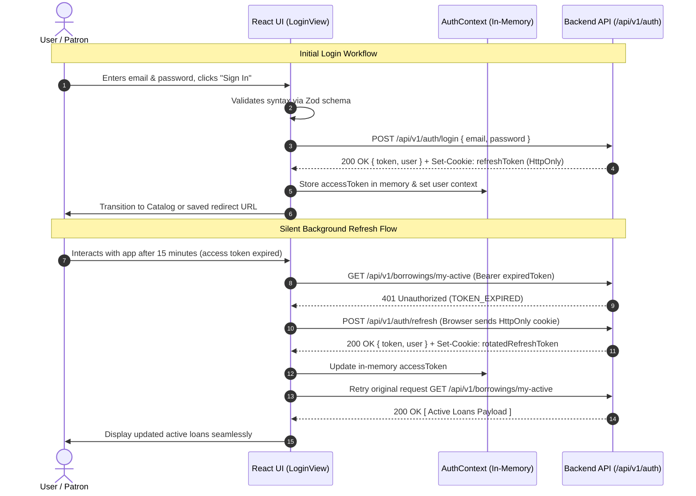

# FRONTEND ARCHITECTURE AND UI/UX DESIGN SPECIFICATION
## Cloud-Native Library Management System (LMS)

---

**Document Version**: 1.0.0  
**Phase**: Phase 5 – Frontend Architecture and UI/UX Design  
**Status**: PERMANENTLY BASELINE LOCKED AND APPROVED  
**Author**: Independent Principal Frontend Architect, Senior UI/UX Architect & Design System Specialist  
**Approved Upstream Baselines**:
- [Phase 0 Master Project Architecture Document (v1.1.0)](../02-architecture/MASTER_ARCHITECTURE.md)
- [Phase 1 Software Requirements Specification (v1.1.0)](../01-requirements/SOFTWARE_REQUIREMENTS_SPECIFICATION.md)
- [Phase 2 Detailed System Design (v1.1.0)](../02-architecture/DETAILED_SYSTEM_DESIGN.md)
- [Phase 3 Database Architecture Specification (v1.2.0)](../03-database/DATABASE_ARCHITECTURE.md)
- [Phase 4 Backend Architecture & API Design Specification (v1.1.0)](../04-backend/BACKEND_ARCHITECTURE_AND_API_DESIGN.md)  
**Classification**: Software Architecture, Design System & User Interface Specifications  
**Implementation Policy**: *STRICT GATE — Implementation (Phase 14) remains strictly barred. Zero executable application code, React components, CSS files, or package dependencies are created during this phase.*

---

## TABLE OF CONTENTS
1. [Document Control & Governance](#1-document-control--governance)
2. [Purpose & Architectural Scope](#2-purpose--architectural-scope)
3. [Upstream Baseline Dependencies & Boundary Preservation](#3-upstream-baseline-dependencies--boundary-preservation)
4. [Frontend Architectural Principles](#4-frontend-architectural-principles)
5. [Frontend System Architecture](#5-frontend-system-architecture)
   - 5.1 [Structural Layering & Module Boundaries](#51-structural-layering--module-boundaries)
   - 5.2 [Technology Stack Architecture (Design Intent)](#52-technology-stack-architecture-design-intent)
   - 5.3 [Client-Side Directory Architecture](#53-client-side-directory-architecture)
6. [Information Architecture](#6-information-architecture)
7. [User Roles & Experience Boundaries](#7-user-roles--experience-boundaries)
8. [Navigation Architecture](#8-navigation-architecture)
9. [Route Architecture & Route Guards](#9-route-architecture--route-guards)
10. [Complete Screen Inventory](#10-complete-screen-inventory)
11. [Design System Architecture (Design Tokens)](#11-design-system-architecture-design-tokens)
12. [Component Taxonomy](#12-component-taxonomy)
    - 12.1 [Foundation Components](#121-foundation-components)
    - 12.2 [Composite Components](#122-composite-components)
    - 12.3 [Domain Circulation Components](#123-domain-circulation-components)
    - 12.4 [Administrative Management Components](#124-administrative-management-components)
13. [Responsive Design Strategy](#13-responsive-design-strategy)
14. [Accessibility Architecture (WCAG 2.2 AA)](#14-accessibility-architecture-wcag-22-aa)
15. [State Management Architecture](#15-state-management-architecture)
    - 15.1 [Server State Architecture](#151-server-state-architecture)
    - 15.2 [Client UI State Architecture](#152-client-ui-state-architecture)
    - 15.3 [Authentication State Architecture](#153-authentication-state-architecture)
16. [API Integration Architecture & RFC 7807 Error Handling](#16-api-integration-architecture--rfc-7807-error-handling)
17. [Authentication UX Architecture](#17-authentication-ux-architecture)
18. [Authorization UX & Route Protection Architecture](#18-authorization-ux--route-protection-architecture)
19. [Patron Experience Architecture](#19-patron-experience-architecture)
20. [Administrative Experience Architecture](#20-administrative-experience-architecture)
21. [Borrowing & Return UX Architecture](#21-borrowing--return-ux-architecture)
22. [Catalog Search & Pagination UX Architecture](#22-catalog-search--pagination-ux-architecture)
23. [Error, Loading & Empty State Strategy](#23-error-loading--empty-state-strategy)
24. [Frontend Security Boundaries](#24-frontend-security-boundaries)
25. [Functional Requirement Traceability Matrix](#25-functional-requirement-traceability-matrix)
26. [Cross-Phase Consistency Review](#26-cross-phase-consistency-review)
27. [Architectural Decisions & Constraints (ADRs)](#27-architectural-decisions--constraints-adrs)
28. [Phase 5 Completion Checklist](#28-phase-5-completion-checklist)
29. [Revision History](#29-revision-history)

---

## 1. Document Control & Governance

### 1.1 Document Metadata
| Field | Value |
|---|---|
| **Document Title** | Frontend Architecture and UI/UX Design Specification |
| **Document Version** | 1.0.0 |
| **Document Status** | PERMANENTLY BASELINE LOCKED AND APPROVED |
| **Project Name** | Cloud-Native Library Management System (LMS) |
| **Author** | Independent Principal Frontend Architect, Senior UI/UX Architect & Design System Specialist |
| **Current Phase** | Phase 5 – Frontend Architecture and UI/UX Design |
| **Next Phase** | Phase 6 – Security Architecture |
| **Implementation Gate** | Strictly blocked until Phases 0 through 13 are fully completed and approved |

### 1.2 Strict Governance Rules
- **Pure Architectural Design**: Phase 5 specifies architectural boundaries, component hierarchies, user flows, design tokens, route graphs, state partitions, and accessibility contracts.
- **Zero Premature Code Generation**: No React components, JSX/TSX syntax, CSS style files, HTML templates, npm package manifests (`package.json`), or client scripts are created during this phase.
- **Upstream Baseline Immutability**: All 22 Phase 1 Functional Requirements, Phase 2 workflow models, Phase 3 database invariants (INV-01 to INV-06, DBD-07 to DBD-09), and Phase 4 backend contracts (21 REST endpoints, `/api/v1` prefix, RFC 7807 error envelopes) are strictly preserved without alteration or reinterpretation.

---

## 2. Purpose & Architectural Scope

The primary objective of **Phase 5 — Frontend Architecture and UI/UX Design** is to translate the approved system requirements, circulation workflows, and backend API contracts into a cohesive, production-grade, accessible, and responsive user experience. 

This specification establishes:
1. **Application Boundaries**: Modular component composition, clear separation between presentation, state orchestration, and API data transport.
2. **User Experience Topology**: Comprehensive screen inventories, state transition diagrams, and navigation paths for Public Visitors, Authenticated Patrons, and Library Administrators.
3. **Design System Foundations**: A formal design token system (colors, typography, elevation, spacing, motion) engineered to ensure brand cohesion, micro-interaction feedback, visual polish, and WCAG 2.2 AA compliance.
4. **Circulation UX Reliability**: Intuitive, error-resilient client interfaces for book discovery, transactional checkout, self-service return, quota tracking, and staff override operations.
5. **State & Network Governance**: Strict partitioning between server-cached entities (TanStack Query model), client-local UI state, and authentication session context, backed by automated silent token refresh and unified RFC 7807 problem details interpretation.

---

## 3. Upstream Baseline Dependencies & Boundary Preservation

Phase 5 directly inherits and strictly respects all locked upstream architecture baselines:

```
+---------------------------------------------------------------------------------------------------------+
|                                    UPSTREAM BASELINE INTEGRATION GRAPH                                  |
+---------------------------------------------------------------------------------------------------------+
|  Phase 1: SRS (v1.1.0)           --> 22 Functional Requirements (FR-AUTH, USER, BOOK, BORROW, ADMIN)    |
|  Phase 2: Detailed Design (v1.1.0)--> Circulation Workflows, State Transitions (ACTIVE->OVERDUE->RETURNED) |
|  Phase 3: Database Arch (v1.2.0) --> Collections (users, books, borrowings, sessions, audit_logs),     |
|                                       Invariants INV-01..06, DBD-07..09                                  |
|  Phase 4: Backend Spec (v1.1.0)  --> 21 REST Endpoints (/api/v1), RFC 7807 Errors, Dual-Token Security |
|                                       Session TTL, Service Unit of Work, Page/Limit Pagination           |
+---------------------------------------------------------------------------------------------------------+
                                                     │
                                                     ▼
+---------------------------------------------------------------------------------------------------------+
|                               PHASE 5: FRONTEND ARCHITECTURE & UI/UX DESIGN                             |
|  - 21 Endpoint Contracts Mapped 1-to-1 to UI Actions                                                    |
|  - In-Memory Access Token + HTTP-Only Cookie Refresh Token (Zero JS Token Storage)                      |
|  - Dynamic Overdue Presentation Reflecting Real-Time Temporal Truth (returnDate == null && now > dueDate)|
|  - Concurrency Error Handling (409 Conflict: DUPLICATE_ACTIVE_LOAN, ALREADY_RETURNED)                   |
|  - Suspended Patron Experience: Barred Checkout, Retained Active Loan Access, Permitted Return Workflows |
+---------------------------------------------------------------------------------------------------------+
```

### Upstream Constraints Enforced in Frontend Design
1. **Zero Endpoint Modification**: The frontend interfaces strictly with the 21 approved endpoints documented in Phase 4 Section 12. No artificial endpoints or client-orchestrated compound routes are assumed.
2. **Authoritative Backend Security**: The frontend recognizes that UI hiding and conditional button rendering are purely user experience conveniences. All authorization enforcement is delegated to backend middleware and service layers.
3. **Storage Security Boundaries**: In strict compliance with Phase 4 Section 7.1, refresh tokens are managed exclusively by the browser via secure, `HttpOnly`, `SameSite=Strict` cookies. The frontend **never** accesses or attempts to store refresh tokens in `localStorage`, `sessionStorage`, or JavaScript-accessible memory.
4. **Authoritative Temporal Truth (DBD-09)**: The UI derives overdue states in real-time ($returnDate == null \land now > dueDate$) rather than relying solely on stored database flags or client-side clocks.

---

## 4. Frontend Architectural Principles

The frontend architecture is founded on six core principles:

1. **Clarity & Cognitive Ergonomics**: Visual layouts prioritize scannability, clear hierarchical typography, unambiguous circulation status indicators, and deterministic call-to-action buttons.
2. **Resilient Feedback & State Transparency**: Every user mutation immediately communicates progress via localized loading skeletons, disabled button spinners, and definitive post-condition toasts. All failure outcomes map to human-intelligible explanations derived from backend RFC 7807 problem details.
3. **Accessibility as a First-Class Citizen**: Designed to satisfy **WCAG 2.2 Level AA** standards across all screens, incorporating semantic HTML landmarks, full keyboard navigation flows, visible high-contrast focus rings, ARIA live regions for dynamic mutations, and screen-reader announcements.
4. **Layered Separation of Concerns**: Strict boundary separation:
   - *Presentational Components*: Pure, stateless, accessible UI elements.
   - *Container/View Components*: Route-level view composition, layout scaffolding.
   - *Custom Domain Hooks*: Data fetching, mutation triggers, and cache synchronization.
   - *API Integration Client*: Transport abstraction, correlation header injection, silent refresh retry loops.
5. **Aesthetic Excellence & Modern Polish**: Deep, curated color palette (slate dark mode and crisp light mode), subtle glassmorphic elevation layers, micro-animations for state changes, and zero reliance on generic, unstyled components.
6. **Graceful Degradation & Network Tolerance**: Network timeouts, write conflicts (HTTP 503), rate limits (HTTP 429), and domain collisions (HTTP 409) feature specific, dedicated recovery pathways.

---

## 5. Frontend System Architecture

### 5.1 Structural Layering & Module Boundaries
The client application is organized into four concentric architectural tiers:

```
+---------------------------------------------------------------------------------------------------------+
|                                    FRONTEND ARCHITECTURAL TIERS                                         |
+---------------------------------------------------------------------------------------------------------+
| 1. PRESENTATION TIER (UI & Views)                                                                       |
|    - Route Views (Screens)                                                                              |
|    - Composite Domain Components (BookCard, LoanTable, KPICard)                                         |
|    - Foundation Design System Components (Button, Input, Badge, Dialog, Toast)                          |
+---------------------------------------------------------------------------------------------------------+
                                                     │
                                                     ▼
+---------------------------------------------------------------------------------------------------------+
| 2. ORCHESTRATION TIER (State & Hooks)                                                                   |
|    - Routing Engine & Route Guards (PublicRoute, ProtectedRoute, RoleGuard)                            |
|    - Domain Custom Hooks (useBorrow, useCatalogSearch, usePatronLoans, useAdminKPIs)                   |
|    - Client UI State Stores (Modal State, Filter Selections, Toast Queue)                              |
+---------------------------------------------------------------------------------------------------------+
                                                     │
                                                     ▼
+---------------------------------------------------------------------------------------------------------+
| 3. DATA ACCESS TIER (Server State & Cache)                                                              |
|    - TanStack Query Cache Manager (QueryClient)                                                         |
|    - Query Definitions & Cache Invalidation Triggers                                                    |
|    - Optimistic Update Rollback Handlers                                                                |
+---------------------------------------------------------------------------------------------------------+
                                                     │
                                                     ▼
+---------------------------------------------------------------------------------------------------------+
| 4. INFRASTRUCTURE & TRANSPORT TIER (HTTP Client)                                                        |
|    - Axios / Fetch HTTP Transport Adapter                                                               |
|    - Request Interceptors: Bearer JWT injection, X-Correlation-ID generation                            |
|    - Response Interceptors: Silent Token Refresh (POST /api/v1/auth/refresh), RFC 7807 Error Normalizer |
+---------------------------------------------------------------------------------------------------------+
```

### 5.2 Technology Stack Architecture (Design Intent)
To ensure long-term maintainability, high performance, and seamless alignment with production microservice environments:
- **Core Runtime & Framework**: React 18+ leveraging concurrent rendering features, automatic batching, and semantic JSX.
- **Build & Development Tooling**: Vite for fast Hot Module Replacement (HMR) and optimized Rollup-based tree-shaking production bundles.
- **Client-Side Routing**: React Router v6+ with declarative nested routing, route-level layout wrappers, and robust navigation blocking guards.
- **Server State Management**: TanStack Query (React Query v5) for declaratively managing asynchronous API requests, background cache synchronization, window focus re-fetching, and cache invalidation.
- **Local Client State Management**: Lightweight state container (Zustand or React Context API) strictly isolated to UI-only ephemeral state (sidebar toggle, modal dialog visibility, filter drawers).
- **Form Management & Client Validation**: React Hook Form coupled with Zod runtime schema validation matching Phase 4 backend transport schemas.
- **Visual Styling Architecture**: Vanilla CSS Modules or CSS Variables-driven Design Token architecture, avoiding heavy runtime CSS-in-JS overhead while preserving 100% control over micro-animations and responsive breakpoints.

### 5.3 Client-Side Directory Architecture
```text
apps/frontend/src/
├── assets/                  # Static media, icons, logo SVGs, illustrations
├── design-system/           # Foundational UI Design System
│   ├── tokens/              # Design tokens (colors, typography, spacing, breakpoints)
│   ├── primitives/          # Atomic components (Button, Input, Badge, Dialog, Spinner)
│   └── styles/              # Global reset, typography, token variables, theme definitions
├── components/              # Shared composite components
│   ├── layout/              # AppHeader, Sidebar, Navigation, Footer, Container
│   ├── feedback/            # ToastContainer, EmptyState, LoadingSkeleton, ErrorBoundary
│   └── common/              # SearchInput, PaginationBar, ConfirmationModal, DataTable
├── features/                # Domain-driven feature modules
│   ├── auth/                # LoginView, RegisterView, AuthProvider, useAuth
│   ├── catalog/             # CatalogListView, BookDetailView, BookCard, FilterPanel
│   ├── circulation/         # ActiveLoansView, LoanHistoryView, BorrowModal, ReturnModal
│   ├── profile/             # ProfileView, PasswordChangeModal
│   └── admin/               # DashboardView, BookManagementView, UserManagementView, AuditLogsView
├── routes/                  # Route configuration, ProtectedRoute, RoleGuard, route paths
├── services/                # API transport adapters, HTTP client, interceptors, RFC 7807 parser
├── hooks/                   # Shared utility hooks (useDebounce, useMediaQuery, useA11yAnnounce)
└── types/                   # TypeScript contract interfaces matching Phase 4 DTOs
```

---

## 6. Information Architecture

The information architecture organizes the Library Management System into clear, intuitive hierarchies tailored to user intent:

```mermaid
graph TD
    Root["Cloud-Native LMS"] --> PublicZone["Public & Guest Experience"]
    Root --> PatronZone["Authenticated Patron Experience"]
    Root --> AdminZone["Administrative Portal (ROLE_ADMIN)"]

    PublicZone --> Landing["Landing Page & Hero Discovery"]
    PublicZone --> PubCatalog["Public Catalog Search & Browsing"]
    PublicZone --> PubDetails["Book Details & Real-Time Availability"]
    PublicZone --> Login["User Login (/login)"]
    PublicZone --> Register["Patron Registration (/register)"]

    PatronZone --> PatCatalog["Personalized Catalog (Borrow Action)"]
    PatronZone --> PatLoans["Active Loans Dashboard (Due Dates, Self-Return)"]
    PatronZone --> PatHistory["Circulation History Archive (Past Borrows)"]
    PatronZone --> PatProfile["Profile Oversight & Password Management"]

    AdminZone --> AdminDash["Operational Dashboard (Live KPI Cards)"]
    AdminZone --> AdminBooks["Catalog Management (Add, Edit Stock, Soft-Delete)"]
    AdminZone --> AdminUsers["User Directory (Status Suspension / Reactivation)"]
    AdminZone --> AdminCirc["Global Circulation Oversight (Staff Return Override)"]
    AdminZone --> AdminAudit["Immutable System Audit Trail Inspector"]
```



---

## 7. User Roles & Experience Boundaries

The application enforces strict experience boundaries across three actor classifications:

| User Role | Identification & Context | Accessible Feature Surface | Boundaries & Constraints |
|---|---|---|---|
| **Anonymous Public Visitor** | Unauthenticated (`req.user === null`). No credentials present. | - Catalog discovery, text search, faceted filtering.<br/>- Book detail inspection and real-time copy availability.<br/>- User registration (`/register`) and login (`/login`). | - Cannot initiate borrowing operations.<br/>- Cannot view active loans, borrowing history, or profiles.<br/>- Clicking "Borrow" prompts an authentication modal redirect. |
| **Authenticated Patron (`ROLE_PATRON`)** | Authenticated via Bearer JWT (`req.user.role === 'ROLE_PATRON'`). Identity bound to `req.user.id`. | - All Public Visitor capabilities.<br/>- Self-service book checkout (`POST /api/v1/borrowings`).<br/>- Self-service book return (`POST /api/v1/borrowings/:borrowingId/return`).<br/>- Personal active loans dashboard & due date tracking.<br/>- Personal circulation history archive.<br/>- Profile inspection & authenticated password change. | - Strictly barred from accessing `/admin/*` routes.<br/>- Cannot inspect or mutate other patrons' loans (BOLA/IDOR prevention).<br/>- Quota ceiling enforced: Maximum 5 concurrent active loans.<br/>- If account status is `SUSPENDED`, borrowing and profile edits are barred; viewing active loans and returning items remain accessible. |
| **Library Administrator (`ROLE_ADMIN`)** | Authenticated via Bearer JWT (`req.user.role === 'ROLE_ADMIN'`). Staff privileges verified. | - Complete operational dashboard with real-time KPI aggregations.<br/>- Catalog CRUD: Book acquisition, stock count adjustments, soft-deactivation.<br/>- Patron account oversight: Suspend or reactivate user status.<br/>- Global circulation roster: Filter all loans across all users.<br/>- Staff administrative return override on behalf of patrons.<br/>- System audit log ledger inspection with advanced filtering. | - Administrative mutations generate mandatory Tier 1 audit trail records.<br/>- Cannot deactivate books with outstanding active loans.<br/>- Cannot reduce book total stock below current active loans. |

---

## 8. Navigation Architecture

Navigation is structured around a top application bar and context-sensitive side navigation menus:

```
+---------------------------------------------------------------------------------------------------------+
|                                    GLOBAL APPLICATION SHELL NAVIGATION                                  |
+---------------------------------------------------------------------------------------------------------+
| [ Logo: CloudLMS ]  [ Search Bar (Global Shortcut: /) ]         [ Role Badge ] [ Theme ] [ User Menu ] |
+---------------------------------------------------------------------------------------------------------+
| (If Public Visitor):                                                                                    |
| [ Explore Catalog ]    [ Library Policies ]                           [ Sign In ]  [ Join / Register ]  |
+---------------------------------------------------------------------------------------------------------+
| (If Authenticated Patron):                                                                              |
| [ Book Catalog ]  [ My Active Loans (Count) ]  [ Borrowing History ]  [ My Profile ]       [ Log Out ]  |
+---------------------------------------------------------------------------------------------------------+
| (If Authenticated Administrator):                                                                       |
| [ Dashboard ]  [ Catalog Management ]  [ User Directory ]  [ Circulation Oversight ]  [ Audit Logs ]     |
+---------------------------------------------------------------------------------------------------------+
```

### Navigation Rules & Micro-Interactions
1. **Active Route Indication**: Current navigation item highlighted with an accented indicator bar, elevated contrast, and `aria-current="page"`.
2. **Quota Badge Counter**: The "My Active Loans" navigation item features a real-time badge showing current active loans (e.g., `3/5`). If active loans reach `5/5`, the badge shifts to warning amber. If any loan is overdue, an alert counter pulses in rose-red.
3. **Responsive Hamburger Drawer**: On viewports $< 768\text{px}$, the top navigation links collapse into an off-canvas slide-out drawer accessible via an animated hamburger button with complete keyboard trap and focus restoration.

---

## 9. Route Architecture & Route Guards

The client-side router defines 14 primary route nodes divided into four distinct security classifications:

| Path | Screen Identifier | Authentication Required | Authorized Role | Primary API Endpoints Dependent | Route Guard Type |
|---|---|:---:|:---:|---|---|
| `/` | `SCR-PUB-001` (Landing) | No | Any | None (Static promotional + Featured query) | Public |
| `/login` | `SCR-AUTH-001` (Login) | No | Anonymous only | `POST /api/v1/auth/login` | GuestOnlyGuard |
| `/register` | `SCR-AUTH-002` (Register) | No | Anonymous only | `POST /api/v1/auth/register` | GuestOnlyGuard |
| `/books` | `SCR-CAT-001` (Catalog Browse) | No | Any | `GET /api/v1/books` | Public |
| `/books/:bookId` | `SCR-CAT-002` (Book Details) | No | Any | `GET /api/v1/books/:bookId`, `.../availability` | Public |
| `/my-loans` | `SCR-CIRC-001` (Active Loans) | **Yes** | `ROLE_PATRON` | `GET /api/v1/borrowings/my-active`, `POST .../return` | ProtectedPatronGuard |
| `/my-history` | `SCR-CIRC-002` (Loan History) | **Yes** | `ROLE_PATRON` | `GET /api/v1/borrowings/my-history` | ProtectedPatronGuard |
| `/profile` | `SCR-USER-001` (Profile View) | **Yes** | `ROLE_PATRON`, `ROLE_ADMIN` | `GET /api/v1/users/profile`, `PATCH .../password` | AuthenticatedGuard |
| `/admin/dashboard` | `SCR-ADM-001` (KPI Dashboard) | **Yes** | `ROLE_ADMIN` | `GET /api/v1/admin/dashboard/kpis` | AdminRoleGuard |
| `/admin/books` | `SCR-ADM-002` (Catalog Management) | **Yes** | `ROLE_ADMIN` | `GET /api/v1/books`, `POST`, `PUT`, `DELETE /admin/books` | AdminRoleGuard |
| `/admin/users` | `SCR-ADM-003` (User Directory) | **Yes** | `ROLE_ADMIN` | `PATCH /api/v1/admin/users/:userId/status` | AdminRoleGuard |
| `/admin/circulation` | `SCR-ADM-004` (Global Circulation) | **Yes** | `ROLE_ADMIN` | `GET /admin/borrowings`, `POST .../return-override` | AdminRoleGuard |
| `/admin/audit-logs` | `SCR-ADM-005` (Audit Trail) | **Yes** | `ROLE_ADMIN` | `GET /api/v1/admin/audit-logs` | AdminRoleGuard |
| `*` | `SCR-SYS-001` (404 Fallback) | No | Any | None | Fallback |

### Route Guard Mechanics
- **`GuestOnlyGuard`**: If an authenticated actor attempts to access `/login` or `/register`, they are immediately redirected to their default home view (`/admin/dashboard` for admins, `/books` for patrons).
- **`AuthenticatedGuard`**: Verifies access token presence and session validity. Unauthenticated requests are redirected to `/login?redirect=<targetPath>`.
- **`RoleGuard`**: Compares `req.user.role` with allowed roles. Unauthorized access triggers an immediate transition to `SCR-SYS-003` (Forbidden 403 View).

---

## 10. Complete Screen Inventory

Every approved functional requirement maps directly to one or more specialized screens:

### 10.1 Public & Authentication Screens
- **`SCR-PUB-001`: Discovery Landing View**
  - *Purpose*: Introduces library services, search entry point, featured books carousel.
  - *Primary User*: Public visitors, returning patrons.
  - *Mapped Requirements*: Foundation for `FR-BOOK-001`.
  - *Key Actions*: Quick search execution, navigation to catalog, login/register triggers.
  - *States*: Default, Loading hero skeletons.
- **`SCR-AUTH-001`: User Login Screen**
  - *Purpose*: Authenticates patrons and administrators.
  - *Primary User*: All registered users.
  - *Mapped Requirements*: `FR-AUTH-002`.
  - *Primary Endpoint*: `POST /api/v1/auth/login`.
  - *Key Actions*: Email/password entry, submit login, navigate to registration.
  - *Error States*: `401 Unauthorized` (`INVALID_CREDENTIALS`), `400 Bad Request` validation notices.
- **`SCR-AUTH-002`: Patron Self-Registration Screen**
  - *Purpose*: Allows new library patrons to enroll.
  - *Primary User*: Prospective patrons.
  - *Mapped Requirements*: `FR-AUTH-001`.
  - *Primary Endpoint*: `POST /api/v1/auth/register`.
  - *Key Actions*: Enter name, university email, phone number, password, confirm password.
  - *Error States*: `409 Conflict` (`EMAIL_ALREADY_REGISTERED`), password complexity warnings.

### 10.2 Catalog & Discovery Screens
- **`SCR-CAT-001`: Catalog Discovery & Browsing View**
  - *Purpose*: Search catalog with full-text queries, filter by genre and availability, navigate pages.
  - *Primary User*: Public visitors, patrons, staff.
  - *Mapped Requirements*: `FR-BOOK-001`, `FR-BOOK-002`.
  - *Primary Endpoint*: `GET /api/v1/books?q=&genre=&available=&page=&limit=`.
  - *Key Actions*: Search input typing (debounced 300ms), genre pill selection, in-stock toggle, pagination buttons.
  - *Empty State*: "No books found matching your query." with a "Reset Filters" action.
- **`SCR-CAT-002`: Book Detail & Availability Screen**
  - *Purpose*: Displays complete catalog metadata, real-time availability indicator, shelf coordinates, and checkout trigger.
  - *Primary User*: All users.
  - *Mapped Requirements*: `FR-BOOK-003`, `FR-BOOK-004`, `FR-BORROW-001`.
  - *Primary Endpoints*: `GET /api/v1/books/:bookId`, `GET /api/v1/books/:bookId/availability`, `POST /api/v1/borrowings`.
  - *Key Actions*: View metadata (ISBN, publisher, aisle/shelf), click "Borrow Book" (triggers confirmation modal).
  - *States*: In Stock (Green indicator + active Borrow button), Out of Stock (Red indicator + disabled Borrow button with tooltip).

### 10.3 Patron Circulation Screens
- **`SCR-CIRC-001`: Active Loans Dashboard**
  - *Purpose*: Lists all current unreturned books, due dates, countdown indicators, and return triggers.
  - *Primary User*: Authenticated Patron (`ROLE_PATRON`).
  - *Mapped Requirements*: `FR-BORROW-002`, `FR-BORROW-003`.
  - *Primary Endpoints*: `GET /api/v1/borrowings/my-active`, `POST /api/v1/borrowings/:borrowingId/return`.
  - *Key Actions*: Inspect remaining loan duration, initiate self-service book return.
  - *States*: Active (normal countdown), Overdue (highlighted in rose-red with warning badge), Returning spinner.
- **`SCR-CIRC-002`: Complete Borrowing History Archive**
  - *Purpose*: Historical chronological audit of all past completed borrowing transactions.
  - *Primary User*: Authenticated Patron (`ROLE_PATRON`).
  - *Mapped Requirements*: `FR-BORROW-004`.
  - *Primary Endpoint*: `GET /api/v1/borrowings/my-history?page=&limit=`.
  - *Key Actions*: Filter history by date range, page through historical records.
  - *Empty State*: "You have not borrowed any books yet. Explore our catalog!"
- **`SCR-USER-001`: Patron Profile & Security Settings View**
  - *Purpose*: Displays patron details, current quota utilization, and password modification form.
  - *Primary User*: Authenticated Patron & Admin.
  - *Mapped Requirements*: `FR-USER-001`, `FR-USER-002`.
  - *Primary Endpoints*: `GET /api/v1/users/profile`, `PATCH /api/v1/users/password`.
  - *Key Actions*: View account status and quota usage, update account password.

### 10.4 Administrative Oversight Screens
- **`SCR-ADM-001`: Administrator Operational Dashboard**
  - *Purpose*: Executive overview of system metrics, catalog counts, circulation volumes, and active overdue debt.
  - *Primary User*: Administrator (`ROLE_ADMIN`).
  - *Mapped Requirements*: `FR-ADMIN-001`.
  - *Primary Endpoint*: `GET /api/v1/admin/dashboard/kpis`.
  - *Key Visualizations*: Metric cards (Total Titles, Total Copies, Available Copies, Active Loans, Overdue Loans, Active Patrons, Suspended Patrons).
- **`SCR-ADM-002`: Catalog Stock Management View**
  - *Purpose*: Add new titles, edit metadata and inventory levels, soft-deactivate books.
  - *Primary User*: Administrator (`ROLE_ADMIN`).
  - *Mapped Requirements*: `FR-ADMIN-002`, `FR-ADMIN-003`, `FR-ADMIN-004`.
  - *Primary Endpoints*: `POST /api/v1/admin/books`, `PUT /api/v1/admin/books/:bookId`, `DELETE /api/v1/admin/books/:bookId`.
  - *Key Actions*: Click "Acquire New Title" (modal form), click "Edit Stock" (inline/modal), click "Deactivate" (with confirmation dialog).
- **`SCR-ADM-003`: User Account Directory & Status Management**
  - *Purpose*: Inspect registered users and execute operational account status toggling (Suspend / Reactivate).
  - *Primary User*: Administrator (`ROLE_ADMIN`).
  - *Mapped Requirements*: `FR-ADMIN-005`.
  - *Primary Endpoint*: `PATCH /api/v1/admin/users/:userId/status`.
  - *Key Actions*: Search patrons, toggle status switch, submit mandatory suspension reason dialog.
- **`SCR-ADM-004`: Global Circulation Oversight View**
  - *Purpose*: Full library-wide loan inspection across all users with staff return override capabilities.
  - *Primary User*: Administrator (`ROLE_ADMIN`).
  - *Mapped Requirements*: `FR-ADMIN-006`, `FR-ADMIN-007`.
  - *Primary Endpoints*: `GET /api/v1/admin/borrowings?status=&userId=&bookId=`, `POST .../:borrowingId/return-override`.
  - *Key Actions*: Filter by loan status, execute staff return on behalf of patron with mandatory remarks.
- **`SCR-ADM-005`: System Audit Log Ledger Inspector**
  - *Purpose*: Query immutable historical audit trail with detailed JSON payload inspection.
  - *Primary User*: Administrator (`ROLE_ADMIN`).
  - *Mapped Requirements*: `FR-ADMIN-008`.
  - *Primary Endpoint*: `GET /api/v1/admin/audit-logs?action=&actorId=&entityType=&page=`.
  - *Key Actions*: Filter by administrative action, expand detail drawer to view before/after state diffs.

---

## 11. Design System Architecture (Design Tokens)

The design system establishes a cohesive, high-contrast, modern visual foundation. All components are styled strictly using predefined tokens:

### 11.1 Color Tokens & Semantic Roles
```
+---------------------------------------------------------------------------------------------------------+
|                                        DESIGN SYSTEM COLOR TOKENS                                       |
+---------------------------------------------------------------------------------------------------------+
| Token Name             | Light Theme Value  | Dark Theme Value   | Semantic Role / Usage                |
+------------------------+--------------------+--------------------+--------------------------------------+
| --color-primary-600    | #0284c7 (Sky 600)  | #38bdf8 (Sky 400)  | Primary brand identity, active tabs  |
| --color-primary-700    | #0369a1 (Sky 700)  | #0284c7 (Sky 600)  | Primary hover & pressed state        |
| --color-secondary-600  | #4f46e5 (Indigo)   | #818cf8 (Indigo)   | Interactive accents, badges          |
| --color-success-600    | #16a34a (Emerald)  | #34d399 (Emerald)  | In Stock, Returned, Active status    |
| --color-warning-600    | #d97706 (Amber)    | #fbbf24 (Amber)    | Due soon warning, approaching quota  |
| --color-danger-600     | #dc2626 (Rose)     | #f87171 (Rose)     | Overdue, Suspended, Deletion actions |
| --color-bg-canvas      | #f8fafc (Slate 50) | #0f172a (Slate 900)| Main page background canvas          |
| --color-bg-surface     | #ffffff (Pure White)| #1e293b (Slate 800)| Cards, modals, sidebars, tables      |
| --color-border-subtle  | #e2e8f0 (Slate 200)| #334155 (Slate 700)| Hairline dividers, card outlines     |
| --color-text-primary   | #0f172a (Slate 900)| #f8fafc (Slate 50) | Headings, primary content labels     |
| --color-text-secondary | #475569 (Slate 600)| #94a3b8 (Slate 400)| Secondary metadata, subtitles        |
| --color-text-muted     | #94a3b8 (Slate 400)| #64748b (Slate 500)| Disabled text, placeholder hints     |
+---------------------------------------------------------------------------------------------------------+
```

### 11.2 Typography Hierarchy
- **Primary Typeface**: `Inter`, `-apple-system`, `BlinkMacSystemFont`, `Segoe UI`, `Roboto`, sans-serif.
- **Monospace Code Typeface**: `JetBrains Mono`, `Fira Code`, `SFMono-Regular`, monospace (used for ISBNs, ObjectIds, Audit Hashes).
- **Scale Hierarchy**:
  - `Display Large`: 36px / line-height 44px / font-weight 700 (Hero headers)
  - `Heading 1`: 28px / line-height 36px / font-weight 700 (Page titles)
  - `Heading 2`: 22px / line-height 28px / font-weight 600 (Section headers)
  - `Heading 3`: 18px / line-height 24px / font-weight 600 (Card titles, modal headers)
  - `Body Regular`: 15px / line-height 22px / font-weight 400 (Standard text content)
  - `Body Small`: 13px / line-height 18px / font-weight 400 (Metadata, timestamps, tooltips)
  - `Caption / Badge`: 11px / line-height 14px / font-weight 600 (Uppercase status badges)

### 11.3 Spacing, Elevation & Motion Tokens
- **Spacing Grid**: 4px base increment (`--space-1`: 4px, `--space-2`: 8px, `--space-3`: 12px, `--space-4`: 16px, `--space-6`: 24px, `--space-8`: 32px, `--space-12`: 48px).
- **Border Radius**: `--radius-sm`: 4px, `--radius-md`: 8px, `--radius-lg`: 12px, `--radius-full`: 9999px.
- **Elevation Layers (Box Shadows)**:
  - `--elevation-card`: `0 1px 3px 0 rgb(0 0 0 / 0.1), 0 1px 2px -1px rgb(0 0 0 / 0.1)`
  - `--elevation-card-hover`: `0 10px 15px -3px rgb(0 0 0 / 0.1), 0 4px 6px -4px rgb(0 0 0 / 0.1)`
  - `--elevation-modal`: `0 20px 25px -5px rgb(0 0 0 / 0.2), 0 8px 10px -6px rgb(0 0 0 / 0.2)`
- **Micro-Animation Transitions**:
  - `--transition-fast`: `150ms cubic-bezier(0.4, 0, 0.2, 1)` (Button press, badge toggle)
  - `--transition-medium`: `250ms cubic-bezier(0.4, 0, 0.2, 1)` (Drawer slide, modal fade-in)
  - `--transition-slow`: `400ms cubic-bezier(0.4, 0, 0.2, 1)` (Page transitions, card reorder)

---

## 12. Component Taxonomy

### 12.1 Foundation Components
1. **`Button`**: Supports variants (`primary`, `secondary`, `outline`, `danger`, `ghost`), sizes (`sm`, `md`, `lg`), loading state with integrated spinner, full-width toggle, and disabled state with tooltips.
2. **`Input` & `SearchInput`**: Text input supporting leading/trailing icon slots, clear button, accessible helper text, error announcement, and keyboard shortcuts (`/` focus trigger).
3. **`Select` & `Dropdown`**: Accessible select list conforming to WAI-ARIA combobox pattern with keyboard navigation (Up/Down arrows, Enter, Escape).
4. **`Badge`**: Semantic visual tags (`success`, `warning`, `danger`, `info`, `neutral`) with high-contrast text and dot indicators.
5. **`ModalDialog`**: Accessible modal overlay utilizing HTML5 `<dialog>` or React Portals with backdrop blur, focus trap, Escape key closure, and focus return.
6. **`ToastNotification`**: Floating status toast queue emitting RFC 7807 problem details or success notices with auto-dismiss timers and manual close controls.

### 12.2 Composite Components
1. **`BookCard`**: Grid presentation displaying book cover thumbnail, title, author, genre badge, stock availability pill, and direct "Borrow" button.
2. **`FilterPanel`**: Collapsible sidebar/drawer featuring genre checkbox group, availability toggle switch, and "Reset Filters" action.
3. **`PaginationBar`**: Unified navigation component displaying current page, total pages, record range (e.g., "Showing 1–20 of 142 titles"), previous/next arrows, and page size selector.
4. **`DataTable`**: High-density data grid supporting sortable column headers, loading skeleton rows, empty states, and action button columns.
5. **`ConfirmationDialog`**: Destructive action confirmation component (used for Book Soft-Deactivation, Account Suspension, and Staff Return Override).

### 12.3 Domain Circulation Components
1. **`AvailabilityIndicator`**: Dual-state component:
   - Green pill: "In Stock" with `availableCopies / totalCopies` counter and shelf location coordinates (`Aisle B3, Shelf 2A`).
   - Red pill: "Out of Stock" (`0 / totalCopies`).
2. **`DueCountdownBadge`**: Dynamic temporal badge calculating time remaining:
   - $> 3\text{ days}$: Green "Due in X days".
   - $\le 3\text{ days}$: Amber "Due in X days (Due soon)".
   - Expired ($now > dueDate$): Pulsing Rose-Red "Overdue by X days".
3. **`BorrowQuotaMeter`**: Visual progress bar showing active loans against the quota limit ($0/5$ to $5/5$).
4. **`AccountStatusBanner`**: Prominent sticky warning displayed when `req.user.status === 'SUSPENDED'`, explaining account restrictions and providing a direct link to return outstanding books.

### 12.4 Administrative Management Components
1. **`KPICard`**: Metric visualization card featuring trend icons, large typography counters, descriptive subtext, and loading pulse states.
2. **`UserStatusToggle`**: Dual-action switch initiating an immediate confirmation modal before changing patron status between `ACTIVE` and `SUSPENDED`.
3. **`AuditLogViewer`**: Expandable ledger displaying timestamp, actor email, action type badge, entity affected, and collapsible JSON diff payload.

---

## 13. Responsive Design Strategy

The user interface adapts dynamically across standard device breakpoints:

| Breakpoint Token | Viewport Range | Navigation Transformation | Catalog Layout | Table / Circulation View |
|---|---|---|---|---|
| **Mobile (`sm`)** | $< 640\text{px}$ | Collapsed slide-out drawer via hamburger button. Bottom sticky action bar. | Single-column book cards (1 column). Full-width tap targets ($\ge 44\text{px}$). | Tables transform into stacked responsive summary cards with accordion expansion. |
| **Tablet (`md`)** | $640\text{px} - 1024\text{px}$ | Top navigation bar with priority links; overflow menu for secondary items. | Two-column responsive card grid (2 columns). Collapsible filter modal. | Horizontal scrolling data tables with sticky primary identifier columns. |
| **Desktop (`lg`)** | $1024\text{px} - 1280\text{px}$ | Full expanded top navigation with dedicated search input and quick-access profile menu. | Three-column grid (3 columns) with persistent left-hand filter sidebar. | Full-width data tables with inline action buttons and expanded metadata columns. |
| **Wide Desktop (`xl`)**| $\ge 1280\text{px}$ | Full desktop layout centered within a 1280px max-width container with subtle outer margins. | Four-column grid (4 columns) maximizing visual browse density. | Multi-column administrative tables with inline diff inspectors and expanded audit logs. |

---

## 14. Accessibility Architecture (WCAG 2.2 AA)

Accessibility is architected into the foundation of all client interactions:

1. **Keyboard Operability**:
   - Every interactive element (buttons, links, inputs, dropdowns) is reachable via `Tab` / `Shift+Tab`.
   - Modals and drawers implement strict keyboard focus traps: on open, focus is shifted to the modal title or first focusable input; pressing `Escape` cancels and closes the modal; upon closing, focus returns to the initiating trigger element.
   - Global search shortcut: Pressing `/` outside of input fields immediately focuses the global catalog search bar.
2. **Visible Focus Indicators**: High-contrast, dual-ring focus outlines (`outline: 2px solid var(--color-primary-600); outline-offset: 2px;`) are enforced across all interactive controls. Default browser focus stripping is strictly prohibited.
3. **Semantic Hierarchy & Landmarks**:
   - Valid HTML5 landmark structure: `<header role="banner">`, `<nav aria-label="...">`, `<main id="main-content">`, `<aside aria-label="Filters">`, `<footer role="contentinfo">`.
   - Exactly one `<h1>` per view, with strictly nested `<h2>` and `<h3>` tags without heading level skipping.
   - Hidden skip link (`"Skip to main content"`) positioned at the very top of the DOM, visible on focus.
4. **Color Independence & Contrast Ratios**:
   - All text achieves a minimum contrast ratio of **4.5:1** against adjacent backgrounds (and **3:1** for large headings and UI icons).
   - Statuses are never conveyed by color alone: Overdue badges include an explicit warning icon and textual label `"OVERDUE"`; In-stock badges include checkmark icons and numerical copy counts.
5. **Screen Reader Announcements (ARIA Live Regions)**:
   - Dynamic asynchronous updates (search result counts, cart notifications, borrow confirmations) emit live announcements via `<div aria-live="polite" aria-atomic="true" class="sr-only">`.
   - Form submission errors and network failure alerts emit high-priority announcements via `role="alert"` (`aria-live="assertive"`).

---

## 15. State Management Architecture

The frontend strictly partitions state into three mutually exclusive domains to eliminate stale data and synchronization defects:

```
+---------------------------------------------------------------------------------------------------------+
|                                    STATE MANAGEMENT ARCHITECTURE                                        |
+---------------------------------------------------------------------------------------------------------+
| 1. SERVER CACHE STATE (TanStack Query v5)                                                               |
|    - Cache Keys: ['books', { q, genre, page }], ['my-loans'], ['my-history'], ['admin-kpis']           |
|    - Stale Time: 30 seconds for catalog search; 0 seconds (always fresh) for circulation loans          |
|    - Automated Invalidation: Borrow/Return mutations immediately invalidate ['my-loans', 'books']      |
+---------------------------------------------------------------------------------------------------------+
| 2. CLIENT UI EPHEMERAL STATE (Zustand / React Context)                                                  |
|    - Modal Open/Close states (isBorrowModalOpen, activeReturnLoanId)                                   |
|    - Temporary filter form selections prior to submission                                               |
|    - Active toast notifications queue                                                                   |
+---------------------------------------------------------------------------------------------------------+
| 3. AUTHENTICATION & SESSION CONTEXT (React Context + Memory)                                            |
|    - In-Memory Access Token (Cleared on tab close / reload)                                             |
|    - User Profile Context: req.user { id, email, role, status }                                         |
|    - Silent Token Refresh Interceptor (POST /api/v1/auth/refresh via HttpOnly Cookie)                   |
|    - Zero Token Storage in localStorage or sessionStorage                                               |
+---------------------------------------------------------------------------------------------------------+
```

### 15.1 Server State Architecture (TanStack Query)
- **Declarative Query Hooks**: Encapsulates all data fetching:
  - `useBooksQuery({ q, genre, available, page, limit })`
  - `useBookDetailQuery(bookId)`
  - `useActiveLoansQuery()`
  - `useBorrowHistoryQuery({ page, limit })`
  - `useAdminKPIsQuery()`
- **Mutation Invalidation Protocol**:
  - Executing `useBorrowBookMutation()` triggers post-commit cache invalidation:
    ```javascript
    queryClient.invalidateQueries({ queryKey: ['my-loans'] });
    queryClient.invalidateQueries({ queryKey: ['books'] });
    queryClient.invalidateQueries({ queryKey: ['user-profile'] });
    ```
  - Executing `useReturnBookMutation()` similarly invalidates `['my-loans']`, `['my-history']`, `['books']`, and `['admin-borrowings']`.

### 15.2 Client UI State Architecture
- UI stores hold zero entity data. They exclusively maintain interaction parameters such as:
  - `isFilterDrawerOpen: boolean`
  - `activeConfirmationDialog: { isOpen, title, message, onConfirm, isDestructive }`
  - `toastList: ToastItem[]`

### 15.3 Authentication State Architecture
- **In-Memory Access Token**: The JWT access token is retained strictly in-memory within the `AuthContext`.
- **Silent Refresh on Boot**: Upon page reload or cold start, the client application executes a silent handshake:
  `POST /api/v1/auth/refresh` (bearing the HTTP-only cookie).
  - If successful: Access token is restored in memory, `req.user` context is populated, and private routes render seamlessly.
  - If unsuccessful (e.g., cookie expired or revoked): Memory clears, user is set to unauthenticated, and public views render.

---

## 16. API Integration Architecture & RFC 7807 Error Handling

### 16.1 HTTP Transport Client Architecture
The frontend API client interfaces strictly with Phase 4's `/api/v1` routes using standard HTTP configurations:
- **Base URL**: `/api/v1`
- **Request Headers**:
  - `Authorization: Bearer <accessToken>` (injected on all protected requests)
  - `X-Correlation-ID: <uuidv4>` (generated per request for end-to-end tracing)
  - `Content-Type: application/json`
- **Credentials Policy**: `credentials: 'include'` (mandated to ensure the browser transmits the `refreshToken` cookie on `/auth/refresh` and `/auth/logout`).

### 16.2 Standardized RFC 7807 Problem Details Normalizer
When any backend request fails, the API client normalizes the error payload into a strongly typed error object:
```json
{
  "type": "https://api.library.cloud/errors/duplicate-active-loan",
  "title": "Conflict",
  "status": 409,
  "code": "DUPLICATE_ACTIVE_LOAN",
  "detail": "Patron already holds an active or overdue loan for this book.",
  "instance": "/api/v1/borrowings",
  "correlationId": "c9a2f1b0-6421-4a1e-8e43-85b4d7c0f12a",
  "timestamp": "2026-09-07T16:30:00.000Z",
  "errors": []
}
```

### 16.3 Client Error Handling Taxonomy
| HTTP Status | Domain Code | UI Interpretation & User Guidance | Actionable Recovery Flow |
|---|---|---|---|
| **`400 Bad Request`** | `VALIDATION_ERROR` | Inline form error banner listing specific field constraints (e.g., "Password must be at least 8 characters"). | Highlights offending input fields; sets focus to first invalid input. |
| **`401 Unauthorized`** | `UNAUTHENTICATED`, `TOKEN_EXPIRED` | Triggers silent token refresh interceptor. If refresh fails, session is cleared and user is redirected to `/login`. | Preserves current URL as `?redirect=` query parameter. |
| **`403 Forbidden`** | `ACCOUNT_SUSPENDED` | Displays prominent Account Suspended modal informing patron that borrowing is blocked but returns are permitted. | Directs user to `/my-loans` with a button: "View & Return Outstanding Books". |
| **`403 Forbidden`** | `INSUFFICIENT_PERMISSIONS` | Renders `SCR-SYS-003` Access Denied page. | Provides "Return to Catalog" button. |
| **`404 Not Found`** | `RESOURCE_NOT_FOUND`, `BOOK_DEACTIVATED` | Displays "The requested title or record is no longer available in the catalog." | Provides search suggestion links. |
| **`409 Conflict`** | `DUPLICATE_ACTIVE_LOAN` | Warning toast: "You currently hold an active copy of this book. Only one active loan per title is permitted." | Disables borrow button; offers link to "View Active Loan". |
| **`409 Conflict`** | `BORROWING_QUOTA_EXCEEDED` | Warning toast: "Maximum loan limit reached (5/5). Please return a book before checking out another." | Offers direct link to "My Active Loans". |
| **`409 Conflict`** | `BOOK_UNAVAILABLE` | Toast notice: "This title is currently out of stock. All copies are checked out." | Updates book card availability to "Out of Stock". |
| **`409 Conflict`** | `ALREADY_RETURNED` | Informational toast: "This book has already been marked as returned." | Invalidates active loans cache; removes card from active list. |
| **`409 Conflict`** | `TOTAL_COPIES_BELOW_LOANS` | Modal warning: "Cannot reduce total copies below active loans. Currently borrowed copies must be returned first." | Reverts stock adjustment input field to minimum allowable value. |
| **`409 Conflict`** | `ACTIVE_LOANS_EXIST` | Deletion dialog warning: "Book cannot be deactivated while copies are actively borrowed." | Retains book in catalog; highlights active loan count. |
| **`429 Too Many Requests`** | `RATE_LIMIT_EXCEEDED` | Amber toast: "Too many requests. Please wait a moment before trying again." | Implements temporary countdown disable on action button based on `Retry-After`. |
| **`503 Service Unavailable`** | `TRANSACTION_CONFLICT` | Toast: "System is experiencing high checkout volume. Please retry in a moment." | Displays a localized "Retry Checkout" button. |
| **`500 Server Error`** | `INTERNAL_SERVER_ERROR` | Red alert toast: "An unexpected server error occurred. Reference ID: [correlationId]". | Provides copyable correlation ID for library technical support. |

---

## 17. Authentication UX Architecture



### Logout UX & Session Revocation
- When the patron clicks "Sign Out":
  1. UI executes `POST /api/v1/auth/logout`.
  2. Backend clears the session token in the `sessions` collection and sends a cleared cookie header (`Max-Age=0`).
  3. UI clears the in-memory access token, resets `AuthContext`, and clears TanStack Query client cache (`queryClient.clear()`) to prevent data leakage between users sharing a device.
  4. User is redirected to `/login` with a success toast: *"You have been securely signed out."*

---

## 18. Authorization UX & Route Protection Architecture

1. **Role-Aware UI Rendering**:
   - Navigation menus dynamically render links based on verified `req.user.role`:
     - Patrons see: `Catalog`, `My Active Loans`, `Borrowing History`, `Profile`.
     - Administrators see: `Dashboard`, `Manage Catalog`, `User Directory`, `Circulation Oversight`, `Audit Logs`.
2. **Strict Client-Side Gate**:
   - Direct browser URL navigation to `/admin/*` by a patron evaluates `req.user.role === 'ROLE_ADMIN'`.
   - Failing the check renders `SCR-SYS-003` (Access Denied) with a clear explanation: *"You do not have administrative privileges to access this console."*
3. **No Hidden Security**:
   - The UI recognizes that client route protection is an ergonomic UX shield. If a malicious user bypasses client guards via DevTools, the backend API rejects all unauthorized endpoints with `403 Forbidden` (`INSUFFICIENT_PERMISSIONS`), which the frontend cleanly renders as an authorization error.

---

## 19. Patron Experience Architecture

The patron experience is optimized for effortless book discovery and transparent loan tracking:

1. **Catalog Browsing Experience**:
   - Fast, visual card grid presenting cover art, titles, authors, and real-time availability badges.
   - Quick search input equipped with keyboard focus shortcut (`/`) and automatic debounced execution.
   - Dynamic facet pills for instantaneous genre filtering (`Computer Science`, `Fiction`, `History`, `Philosophy`).
2. **Active Loans Dashboard Experience**:
   - High-visibility overview of all outstanding library books.
   - Visual progress meter indicating active quota usage ($X/5$ books checked out).
   - Prominent due date warnings: loans approaching within 3 days highlight in amber; loans past due pulse in rose-red with an alert banner: *"Overdue book must be returned to restore borrowing eligibility."*
   - Immediate "Return Book" action button on every active loan card with single-click confirmation.
3. **Circulation History Archive Experience**:
   - Clean, searchable timeline of all past borrowed books.
   - Displays checkout date, return date, and total days held.
   - Quick action: "Borrow Again" button linking back to catalog details.

---

## 20. Administrative Experience Architecture

The administrative experience provides library staff with high-efficiency oversight tools:

1. **Executive Operational Dashboard (`SCR-ADM-001`)**:
   - High-contrast KPI metric cards reflecting live MongoDB Atlas aggregations:
     - Catalog Capacity: Total Titles, Total Copies, Available Copies.
     - Circulation Volume: Active Borrowings, Current Overdue Obligations.
     - Patron Community: Total Registered, Active Patrons, Suspended Accounts.
2. **Catalog Acquisition & Stock Modification (`SCR-ADM-002`)**:
   - Searchable, dense data table listing all catalog titles with pagination.
   - "Acquire New Title" modal enforcing required ISBN, title, author, total copies, and shelf placement.
   - Inline stock editor: Modifies `totalCopies` while enforcing the mathematical guard:
     $$\text{newTotalCopies} \ge (\text{oldTotalCopies} - \text{oldAvailableCopies})$$
     If staff attempts to enter a total copy number lower than currently borrowed copies, an inline validation warning prevents submission: *"Cannot set total copies below active loans."*
   - Destructive soft-deletion dialog: Explains that deactivation hides the title from public search while preserving past borrowing history. If active loans exist, the delete button is disabled with an explanatory tooltip.
3. **Patron Account Directory & Suspension (`SCR-ADM-003`)**:
   - Search patrons by name or email.
   - Status toggle switch: Clicking "Suspend" prompts a required modal:
     - Prominently notes that suspension bars new checkouts and revokes active refresh sessions, but permits returns.
     - Requires a mandatory explanation string (5–500 characters) for audit trail non-repudiation.
4. **Circulation Oversight & Staff Override (`SCR-ADM-004`)**:
   - Global roster showing all active and overdue loans library-wide.
   - Staff Return Override button: Allows staff to process returns on behalf of patrons (e.g., book returned to physical drop-box). Requires mandatory `adminRemarks` input.
5. **Audit Log Inspection (`SCR-ADM-005`)**:
   - Real-time stream of all Tier 1 and Tier 2 administrative audit events.
   - Filterable by actor, action type, entity type, and date range.
   - Expandable JSON payload viewer displaying exact mutation metadata and client IP / correlation ID.

---

## 21. Borrowing & Return UX Architecture

### 21.1 Self-Service Borrowing Flow (`FR-BORROW-001`)
```
+---------------------------------------------------------------------------------------------------------+
|                                    BORROWING WORKFLOW USER EXPERIENCE                                   |
+---------------------------------------------------------------------------------------------------------+
| 1. User clicks "Borrow Book" on Book Detail View (SCR-CAT-002)                                          |
|    │                                                                                                    |
|    ├── Check: Is user logged in?                                                                        |
|    │     NO  ──► Show Authentication Prompt Modal (redirects to /login)                                 |
|    │     YES ──► Continue                                                                               |
|    │                                                                                                    |
|    ├── Check: Is patron account suspended?                                                              |
|    │     YES ──► Show Account Suspended Dialog (Borrowing prohibited; view active loans)                |
|    │     NO  ──► Continue                                                                               |
|    │                                                                                                    |
|    ├── Check: Has patron reached 5-book quota limit?                                                    |
|    │     YES ──► Show Quota Exceeded Modal (Must return an existing book first)                         |
|    │     NO  ──► Continue                                                                               |
|    │                                                                                                    |
|    ▼                                                                                                    |
| 2. Render Checkout Confirmation Modal:                                                                   |
|    - Title, Author, Cover Art                                                                           |
|    - Due Date Notice: "Due in 14 days (September 21, 2026)"                                             |
|    - Remaining Quota Notice: "This will be book X of 5 allowed."                                        |
|    - Buttons: [ Cancel ]  [ Confirm Borrow ]                                                            |
|    │                                                                                                    |
|    ▼ (User clicks "Confirm Borrow")                                                                     |
| 3. Button transitions to loading spinner; API request dispatched: POST /api/v1/borrowings { bookId }    |
|    │                                                                                                    |
|    ├── API returns 201 Created:                                                                         |
|    │     - Close modal; play subtle success chime; show success banner                                  |
|    │     - Invalidate ['my-loans'], ['books'], and ['user-profile'] cache queries                       |
|    │     - Button updates to "Borrowed! View in Loans"                                                  |
|    │                                                                                                    |
|    ├── API returns 409 Conflict (DUPLICATE_ACTIVE_LOAN):                                                |
|    │     - Show warning toast: "You already have an active loan for this book."                         |
|    │                                                                                                    |
|    ├── API returns 409 Conflict (BOOK_UNAVAILABLE):                                                     |
|    │     - Show toast: "Another user just borrowed the last copy. This book is now out of stock."       |
|    │     - Update UI stock status to "Out of Stock"                                                     |
|    │                                                                                                    |
|    └── API returns 503 Service Unavailable (TRANSACTION_CONFLICT):                                      |
|          - Show amber toast: "High system activity. Please click below to retry."                       |
|          - Modal offers [ Retry Checkout ] button                                                       |
+---------------------------------------------------------------------------------------------------------+
```

### 21.2 Self-Service Return Flow (`FR-BORROW-002`)
1. Patron navigates to **My Active Loans** (`SCR-CIRC-001`).
2. Patron clicks **"Return Book"** on the target loan card.
3. Confirmation dialog appears: *"Are you sure you want to return 'Clean Architecture'?"*
4. Patron clicks **"Confirm Return"**:
   - Button enters loading state with spinner.
   - Dispatches `POST /api/v1/borrowings/:borrowingId/return`.
5. **Success Handling (`200 OK`)**:
   - Card transitions with an animated fade-out and slide-up removal.
   - Green toast appears: *"Book returned successfully! Thank you for returning on time."*
   - Quota meter decrements immediately ($X/5 \to X-1/5$).
   - Cache invalidated for `['my-loans']` and `['books']`.
6. **Conflict Handling (`409 Conflict - ALREADY_RETURNED`)**:
   - Toast appears: *"This borrowing record has already been marked as returned."*
   - Loan card is gracefully removed from active view.

---

## 22. Catalog Search & Pagination UX Architecture

### 22.1 Search & Relevance Ordering Contract
- **Debounced Text Queries**: Typing into the catalog search input executes after a **300ms debounce window** to eliminate redundant API calls while preserving fluid responsiveness.
- **Text Score Dominance**: When query parameter `?q=` is active, the catalog displays a subtle banner: *"Sorted by relevance for '[query]'."* Sort dropdown is disabled with tooltip: *"Manual sorting is disabled during keyword search to preserve relevance ranking."*
- **Faceted Combinations**: Selecting a genre pill (e.g., `Computer Science`) appends `&genre=Computer%20Science` to the query. Toggling the "In Stock" switch appends `&available=true`.

### 22.2 Offset Pagination Contract Alignment
- **Canonical Pagination Parameters**:
  - `page`: 1-indexed (Default: `1`).
  - `limit`: Default `20`, Maximum `100`.
- **Deterministic Sort Tie-Breaker**: Backend queries enforce secondary sort by `_id: 1`. The frontend leverages this to guarantee zero duplicate or skipped cards when paginating.
- **Pagination Controls**:
  - Displays: `[ < Prev ]  Page X of Y  [ Next > ]` alongside record range summary (`Showing 1–20 of 142 titles`).
  - Selecting a new page automatically scrolls the viewport smoothly back to the top of the catalog container.

---

## 23. Error, Loading & Empty State Strategy

Every view in the application implements a unified state triage model:

```
+---------------------------------------------------------------------------------------------------------+
|                                    VIEW STATE TRIAGE ARCHITECTURE                                       |
+---------------------------------------------------------------------------------------------------------+
|                                           [ Incoming Route ]                                            |
|                                                   │                                                     |
|                         ┌─────────────────────────┴─────────────────────────┐                           |
|                         ▼                                                   ▼                           |
|               [ Initial Data Loading ]                             [ Cache Stale / Refetch ]            |
|                         │                                                   │                           |
|                         ▼                                                   ▼                           |
|             Render Skeleton Screen                               Render Background Progress Bar         |
|             (Pulsing wireframe cards)                            (Subtle top-bar pulse indicator)       |
|                         │                                                   │                           |
|                         └─────────────────────────┬─────────────────────────┘                           |
|                                                   ▼                                                     |
|                                         [ Query Evaluation ]                                            |
|                                                   │                                                     |
|          ┌────────────────────────────────────────┼────────────────────────────────────────┐            |
|          ▼                                        ▼                                        ▼            |
|   [ Success: Data Present ]               [ Success: Zero Records ]                [ Query Failed ]     |
|          │                                        │                                        │            |
|          ▼                                        ▼                                        ▼            |
|   Render Content Grid                     Render Empty State View                 Render Error State    |
|   (Interactive Cards/Tables)              - Distinct SVG Illustration             - RFC 7807 Detail     |
|                                           - Explanatory Heading                   - Retry Button        |
|                                           - "Clear Filters" CTA                   - Help Desk Link      |
+---------------------------------------------------------------------------------------------------------+
```

### State Specifications
1. **Loading Skeletons**: Avoid blank white screens and generic spinning wheels. Catalog views render pulsing grey card skeletons with mock cover art, title bars, and badge placeholders.
2. **Empty States**: Rendered when queries return empty arrays (`data.length === 0`). Includes custom SVG illustrations, conversational copy, and actionable recovery buttons (e.g., "Clear Search Filters", "Browse Available Books").
3. **Error Boundaries**: Component-level error boundaries isolate crashes: if a single BookCard fails rendering, the remainder of the catalog remains fully interactive. Critical route crashes display an emergency recovery view with a "Reload Application" button.

---

## 24. Frontend Security Boundaries

The frontend strictly enforces browser security boundaries to prevent client-side vulnerabilities:

1. **Cross-Site Scripting (XSS) Defenses**:
   - All dynamic content (book titles, author names, synopses, admin remarks) is rendered using standard React JSX text bindings, automatically HTML-entity escaping inputs.
   - Raw HTML rendering (`dangerouslySetInnerHTML`) is strictly prohibited across all codebase modules.
   - Cover image URLs (`coverImageUrl`) are strictly validated against an approved protocol whitelist (`https://`) before rendering in `` tags, preventing `javascript:` protocol injections.
2. **Cross-Site Request Forgery (CSRF) Mitigation**:
   - In accordance with Phase 4 Section 6.2, refresh token cookies enforce `SameSite=Strict; Secure; HttpOnly`. The browser automatically refuses to send the cookie during cross-site requests, neutralizing CSRF vectors.
   - Custom header requirement: Mutating API requests include custom headers (`X-Correlation-ID`, `Authorization`), triggering browser CORS preflight checks (`OPTIONS`) on cross-origin calls.
3. **Zero Token Storage in Web Storage**:
   - Refresh tokens are never exposed to JavaScript. Access tokens reside solely in memory. If an attacker injects malicious scripts via an XSS vector, they cannot harvest long-lived credentials from `localStorage` or `sessionStorage`.
4. **Sensitive Data Minimization**:
   - Password fields use `autocomplete="new-password"` or `autocomplete="current-password"`.
   - Error messages presented to the user never expose database connection strings, BSON internal stack traces, or server IP addresses.

---

## 25. Functional Requirement Traceability Matrix

Every single approved Functional Requirement from Phase 1 is rigorously verified against its corresponding Phase 5 screen and UI interaction:

```
+----------------------------------------------------------------------------------------------------------------------------------------------------+
|                                              PHASE 5 COMPLETE REQUIREMENTS TRACEABILITY MATRIX                                                     |
+----------------------------------------------------------------------------------------------------------------------------------------------------+
| Phase 1 FR Identifier & Title      | Phase 5 Screen(s)            | UI Component(s) Involved      | User Action Trigger         | Phase 4 Endpoint |
+------------------------------------+------------------------------+-------------------------------+-----------------------------+------------------+
| FR-AUTH-001: Self-Registration     | SCR-AUTH-002 (RegisterView)  | RegisterForm, PasswordInput   | Click "Create Account"      | POST /api/v1/auth/register |
| FR-AUTH-002: Authentication & Login| SCR-AUTH-001 (LoginView)     | LoginForm, PasswordInput      | Click "Sign In"             | POST /api/v1/auth/login |
| FR-AUTH-003: Session Termination   | SCR-COMMON (AppHeader)       | UserMenu, SignOutButton       | Click "Log Out"             | POST /api/v1/auth/logout |
| FR-AUTH-004: Silent Session Renewal| SCR-COMMON (AppShell)        | AuthInterceptor, TokenRefresher| Automatic on 401 error     | POST /api/v1/auth/refresh |
| FR-USER-001: View Profile Info     | SCR-USER-001 (ProfileView)   | ProfileCard, QuotaMeter       | Navigate to /profile        | GET /api/v1/users/profile |
| FR-USER-002: Change Password       | SCR-USER-001 (ProfileView)   | PasswordChangeForm            | Click "Update Password"     | PATCH /api/v1/users/password |
| FR-BOOK-001: Catalog Text Search   | SCR-CAT-001 (CatalogView)    | SearchInput, BookGrid         | Type in search bar          | GET /api/v1/books (?q=) |
| FR-BOOK-002: Faceted Filtering     | SCR-CAT-001 (CatalogView)    | FilterPanel, GenrePills       | Toggle filters              | GET /api/v1/books (?genre=) |
| FR-BOOK-003: Book Detail View      | SCR-CAT-002 (BookDetailView) | MetadataTable, LocationBadge  | Click book card             | GET /api/v1/books/:bookId |
| FR-BOOK-004: Availability Indicator| SCR-CAT-002 (BookDetailView) | AvailabilityBadge, StockPill  | View detail / catalog       | GET /api/v1/books/:bookId/availability |
| FR-BORROW-001: Self-Service Borrow | SCR-CAT-002 (BookDetailView) | BorrowModal, ConfirmButton    | Click "Borrow Book"         | POST /api/v1/borrowings |
| FR-BORROW-002: Self-Service Return | SCR-CIRC-001 (ActiveLoansView)| LoanCard, ReturnButton        | Click "Return Book"         | POST /api/v1/borrowings/:borrowingId/return |
| FR-BORROW-003: Active Loans Dash   | SCR-CIRC-001 (ActiveLoansView)| LoanTable, DueCountdownBadge  | Navigate to /my-loans       | GET /api/v1/borrowings/my-active |
| FR-BORROW-004: History Archive     | SCR-CIRC-002 (HistoryView)   | HistoryTable, PaginationBar   | Navigate to /my-history     | GET /api/v1/borrowings/my-history |
| FR-ADMIN-001: Operational KPIs     | SCR-ADM-001 (DashboardView)  | KPIGrid, MetricCard           | Navigate to /admin/dashboard| GET /api/v1/admin/dashboard/kpis |
| FR-ADMIN-002: Add Catalog Item     | SCR-ADM-002 (BookManageView) | AddBookModal, BookForm        | Click "Add Book"            | POST /api/v1/admin/books |
| FR-ADMIN-003: Edit Book & Stock    | SCR-ADM-002 (BookManageView) | EditBookModal, StockInput     | Click "Edit Stock"          | PUT /api/v1/admin/books/:bookId |
| FR-ADMIN-004: Soft-Delete Book     | SCR-ADM-002 (BookManageView) | DeactivateConfirmDialog       | Click "Deactivate"          | DELETE /api/v1/admin/books/:bookId |
| FR-ADMIN-005: Manage User Status   | SCR-ADM-003 (UserManageView) | UserTable, StatusModal        | Toggle status switch        | PATCH /api/v1/admin/users/:userId/status |
| FR-ADMIN-006: Global Circulation   | SCR-ADM-004 (GlobalCircView) | GlobalLoanTable, StatusFilter | Filter loans by user/book   | GET /api/v1/admin/borrowings |
| FR-ADMIN-007: Admin Return Override| SCR-ADM-004 (GlobalCircView) | OverrideModal, RemarksInput    | Click "Return Override"     | POST /api/v1/admin/borrowings/:borrowingId/return-override |
| FR-ADMIN-008: Audit Log Inspection | SCR-ADM-005 (AuditLogsView)  | AuditTable, JSONDiffViewer     | Query audit trail stream     | GET /api/v1/admin/audit-logs |
+------------------------------------+------------------------------+-------------------------------+-----------------------------+------------------+
```

---

## 26. Cross-Phase Consistency Review

```
========================================================================================================================
CROSS-PHASE ALIGNMENT AUDIT (PHASE 5 vs. PHASES 1, 2, 3, 4)
========================================================================================================================
```

| Upstream Baseline | Verification Dimension | Alignment Finding | Status |
|---|---|---|:---:|
| **Phase 1: SRS (v1.1.0)** | Requirement Coverage | All 22 approved functional requirements mapped directly to client screens and user interactions. Zero unapproved scope. | **PASS** |
| **Phase 2: DSD (v1.1.0)** | Circulation State Transitions | Models loan transitions (`ACTIVE` $\to$ `OVERDUE` $\to$ `RETURNED`). Preserves self-service return and staff override workflows. | **PASS** |
| **Phase 3: Database (v1.2.0)** | Persistence Invariants | Enforces INV-01 ($availableCopies \ge 0$), INV-04 ($activeBorrowCount \le 5$), and reflects compound unique partial index race arbitration. | **PASS** |
| **Phase 3: Database (v1.2.0)** | Authoritative Overdue (DBD-09) | Displays real-time temporal truth formula: $\text{isOverdue} \iff (returnDate == null \land now > dueDate)$. Stale flags do not mislead UI. | **PASS** |
| **Phase 4: Backend (v1.1.0)** | API Inventory & Endpoints | Operates strictly across the 21 approved `/api/v1` routes. Zero invented or modified endpoints. | **PASS** |
| **Phase 4: Backend (v1.1.0)** | Error Architecture | Full adoption of RFC 7807 Problem Details. Humanized client handling for 400, 401, 403, 404, 409, 429, 500, 503. | **PASS** |
| **Phase 4: Backend (v1.1.0)** | Authentication & Cookies | In-memory access token + HTTP-only refresh cookie. Zero token leakage into `localStorage`. | **PASS** |
| **Phase 4: Backend (v1.1.0)** | Pagination Contract | Consistently defaults to `page=1, limit=20, max=100` with stable secondary `_id: 1` tie-breaker. | **PASS** |

---

## 27. Architectural Decisions & Constraints (ADRs)

### ADR-FE-01: Adoption of TanStack Query for Asynchronous Server State
- **Context**: Managing asynchronous catalog searches, borrowing records, and administrative dashboards requires caching, background re-validation, loading state coordination, and optimistic updates.
- **Decision**: Adopt TanStack Query (React Query v5) as the exclusive server-state synchronization engine. Prohibit storing server entities in generic global client stores (such as Redux).
- **Rationale**: Eliminates hundreds of lines of boilerplate reducer code, automates window focus re-fetching, guarantees consistent stale-while-revalidate caching, and simplifies cache invalidation post-mutation.

### ADR-FE-02: Zero Token Storage in Browser Web Storage
- **Context**: Traditional single-page applications frequently store JWTs in `localStorage`, creating significant vulnerability to Cross-Site Scripting (XSS) credential theft.
- **Decision**: Store the short-lived access token strictly in application JavaScript memory (via `AuthContext`). Store the long-lived refresh token exclusively in a browser-managed `HttpOnly; Secure; SameSite=Strict` cookie managed by the Phase 4 backend.
- **Rationale**: Completely eliminates client-side access to long-lived refresh credentials. Even in the event of an XSS vulnerability, the attacker cannot harvest persistent tokens from storage.

### ADR-FE-03: Strict Component Tiers & Presentational Purity
- **Context**: Mixing API data fetching, form state handling, and visual styling inside monolithic components degrades testability, accessibility, and reuse.
- **Decision**: Enforce a strict 3-tier component hierarchy:
  1. *Primitives / Foundation*: Presentational, zero domain knowledge, accessible primitives.
  2. *Composite / Domain Components*: Business-aware UI layouts (e.g., `BookCard`, `LoanTable`).
  3. *Views / Route Containers*: Coordinates hooks, queries, mutations, and error boundaries.

---

## 28. Phase 5 Completion Checklist

- [x] **Check 01**: All 22 Phase 1 Functional Requirements have concrete frontend representation.
- [x] **Check 02**: No new Functional Requirements or unapproved scopes were introduced.
- [x] **Check 03**: No new backend endpoints were invented; interfaces strictly with the 21 Phase 4 endpoints.
- [x] **Check 04**: All API references match Phase 4 contracts with 100% precision.
- [x] **Check 05**: Canonical `/api/v1` prefix is utilized across all integration specifications.
- [x] **Check 06**: `ROLE_PATRON` and `ROLE_ADMIN` user experiences and navigation boundaries are clearly decoupled.
- [x] **Check 07**: UI hiding is explicitly qualified as an ergonomic aid, never as authoritative authorization.
- [x] **Check 08**: Refresh tokens are prohibited from `localStorage` / `sessionStorage`.
- [x] **Check 09**: Suspended patron UX faithfully mirrors Phase 4 rules (barred borrowing, retained loan inspection, permitted returns).
- [x] **Check 10**: Borrowing UX incorporates backend concurrency conflict recovery (`409 DUPLICATE_ACTIVE_LOAN`).
- [x] **Check 11**: Return UX handles `409 ALREADY_RETURNED` conflicts without duplicate inventory mutations.
- [x] **Check 12**: Pagination contracts consistently enforce `page` (default 1), `limit` (default 20, max 100).
- [x] **Check 13**: Loading skeleton states are defined for all primary views.
- [x] **Check 14**: Error state handling is specified for all API interaction categories.
- [x] **Check 15**: Empty state views with actionable recovery CTAs are defined for all collection views.
- [x] **Check 16**: Accessibility architecture targets WCAG 2.2 AA (contrast, keyboard flow, focus trap, ARIA live).
- [x] **Check 17**: Responsive behavior across mobile, tablet, desktop, and wide desktop is documented.
- [x] **Check 18**: Administrative operations are isolated behind route-level RBAC guards.
- [x] **Check 19**: Zero implementation code has been generated.
- [x] **Check 20**: No React components, JSX/TSX syntax, CSS files, HTML templates, or npm manifests were created.
- [x] **Check 21**: Upstream locked baselines (Phases 1–4) remain pristine and untouched.
- [x] **Check 22**: Persistence invariants (INV-01 to INV-06) and temporal overdue truth (DBD-09) are upheld.
- [x] **Check 23**: RFC 7807 Problem Details have a standardized client interpretation strategy.
- [x] **Check 24**: Credential-bearing refresh request mechanics adhere to Phase 4 dual-token architecture.
- [x] **Check 25**: The final traceability matrix demonstrates 100% bi-directional coverage.

---

## 29. Revision History

| Version | Date | Author | Summary of Changes |
|---|---|---|---|
| **1.0.0** | 2026-09-07 | Independent Principal Frontend Architect & Senior UI/UX Architect | Authoritative Phase 5 Frontend Architecture and UI/UX Design Specification. Completed comprehensive independent verification, reconciled canonical `/api/v1` route paths and parameter identifiers, synchronized cross-phase governance indicators, and permanently baseline locked and approved. |
