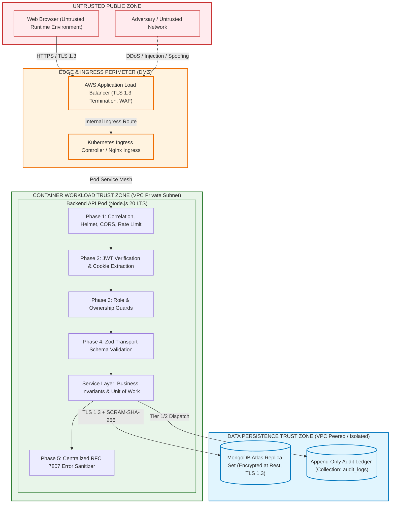
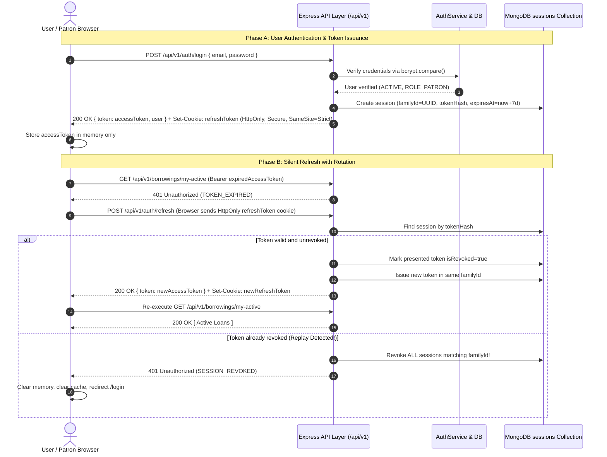

# SECURITY ARCHITECTURE AND THREAT MODEL SPECIFICATION
## Cloud-Native Library Management System (LMS)

---

**Document Version**: 1.0.0  
**Phase**: Phase 6 – Security Architecture  
**Status**: PERMANENTLY BASELINE LOCKED AND APPROVED  
**Author**: Principal Security Architect, Cloud Security Architect, Application Security Architect & DevSecOps Governance Specialist  
**Approved Upstream Baselines**:
- [Phase 0 Master Project Architecture Document (v1.1.0)](../02-architecture/MASTER_ARCHITECTURE.md)
- [Phase 1 Software Requirements Specification (v1.1.0)](../01-requirements/SOFTWARE_REQUIREMENTS_SPECIFICATION.md)
- [Phase 2 Detailed System Design (v1.1.0)](../02-architecture/DETAILED_SYSTEM_DESIGN.md)
- [Phase 3 Database Architecture Specification (v1.2.0)](../03-database/DATABASE_ARCHITECTURE.md)
- [Phase 4 Backend Architecture & API Design Specification (v1.1.0)](../04-backend/BACKEND_ARCHITECTURE_AND_API_DESIGN.md)
- [Phase 5 Frontend Architecture & UI/UX Design Specification (v1.0.0)](../05-frontend/FRONTEND_ARCHITECTURE_AND_UI_UX_DESIGN.md)  
**Classification**: Enterprise Security Architecture, Threat Model & Defense-in-Depth Specification  
**Implementation Policy**: *STRICT GATE — Implementation (Phase 14) remains strictly barred. Zero executable code, security modules, cryptographic scripts, or infrastructure templates are generated during this phase.*

---

## TABLE OF CONTENTS
1. [Document Control & Governance](#1-document-control--governance)
2. [Security Architecture Scope & Operational Boundaries](#2-security-architecture-scope--operational-boundaries)
3. [Upstream Baseline Security Dependencies & Invariant Preservation](#3-upstream-baseline-security-dependencies--invariant-preservation)
4. [Core Security Principles & Zero Trust Charter](#4-core-security-principles--zero-trust-charter)
5. [System Security Context & Explicit Trust Boundaries](#5-system-security-context--explicit-trust-boundaries)
6. [Comprehensive STRIDE Threat Model](#6-comprehensive-stride-threat-model)
   - 6.1 [Methodology & Risk Rating Framework](#61-methodology--risk-rating-framework)
   - 6.2 [Spoofing Threats & Defenses](#62-spoofing-threats--defenses)
   - 6.3 [Tampering Threats & Defenses](#63-tampering-threats--defenses)
   - 6.4 [Repudiation Threats & Defenses](#64-repudiation-threats--defenses)
   - 6.5 [Information Disclosure Threats & Defenses](#65-information-disclosure-threats--defenses)
   - 6.6 [Denial of Service Threats & Defenses](#66-denial-of-service-threats--defenses)
   - 6.7 [Elevation of Privilege Threats & Defenses](#67-elevation-of-privilege-threats--defenses)
   - 6.8 [Consolidated Threat Risk Register](#68-consolidated-threat-risk-register)
7. [Asset Classification & Data Protection Model](#7-asset-classification--data-protection-model)
8. [Identity & Authentication Architecture](#8-identity--authentication-architecture)
   - 8.1 [Dual-Token Authentication Model](#81-dual-token-authentication-model)
   - 8.2 [Access Token Specifications & Cryptographic Verification](#82-access-token-specifications--cryptographic-verification)
   - 8.3 [Refresh Token Specifications & HttpOnly Cookie Transport](#83-refresh-token-specifications--httponly-cookie-transport)
   - 8.4 [Authentication & Lifecycle Workflows](#84-authentication--lifecycle-workflows)
9. [Session Security, Rotation Families & Replay Detection](#9-session-security-rotation-families--replay-detection)
   - 9.1 [Session State Machine & Database Invariants](#91-session-state-machine--database-invariants)
   - 9.2 [Token Family Rotation & Stolen Credential Defense](#92-token-family-rotation--stolen-credential-defense)
   - 9.3 [Invalidation, Logout & Concurrent Session Behavior](#93-invalidation-logout--concurrent-session-behavior)
   - 9.4 [Client-Side Error Response Semantics](#94-client-side-error-response-semantics)
10. [Authorization & Access Control Architecture (RBAC & BOLA Prevention)](#10-authorization--access-control-architecture-rbac--bola-prevention)
    - 10.1 [Role-Based Access Control Model](#101-role-based-access-control-model)
    - 10.2 [Resource Ownership & BOLA / IDOR Defenses](#102-resource-ownership--bola--idor-defenses)
    - 10.3 [Function-Level Authorization & Administrative Boundaries](#103-function-level-authorization--administrative-boundaries)
    - 10.4 [Non-Authoritative Client UI Principle](#104-non-authoritative-client-ui-principle)
11. [Account Suspension Security Model (BR-003 Enforcement)](#11-account-suspension-security-model-br-003-enforcement)
    - 11.1 [Threat Context & Operational Objectives](#111-threat-context--operational-objectives)
    - 11.2 [Prohibited vs. Permitted Operation Matrix](#112-prohibited-vs-permitted-operation-matrix)
    - 11.3 [Multi-Layer Enforcement Pipeline](#113-multi-layer-enforcement-pipeline)
12. [Comprehensive API Security Architecture (All 21 Endpoints)](#12-comprehensive-api-security-architecture-all-21-endpoints)
    - 12.1 [Endpoint Threat & Security Control Matrix](#121-endpoint-threat--security-control-matrix)
    - 12.2 [Injection, Mass Assignment & Parameter Tampering Mitigations](#122-injection-mass-assignment--parameter-tampering-mitigations)
13. [Input Validation, Sanitization & Output Security](#13-input-validation-sanitization--output-security)
    - 13.1 [Strict Schema-Based Input Validation (Zod)](#131-strict-schema-based-input-validation-zod)
    - 13.2 [Output Data Minimization & Sensitive Field Redaction](#132-output-data-minimization--sensitive-field-redaction)
14. [OWASP Web Application Security Top 10 Mapping](#14-owasp-web-application-security-top-10-mapping)
    - 14.1 [A01:2021 — Broken Access Control](#141-a012021--broken-access-control)
    - 14.2 [A02:2021 — Cryptographic Failures](#142-a022021--cryptographic-failures)
    - 14.3 [A03:2021 — Injection](#143-a032021--injection)
    - 14.4 [A04:2021 — Insecure Design](#144-a042021--insecure-design)
    - 14.5 [A05:2021 — Security Misconfiguration](#145-a052021--security-misconfiguration)
    - 14.6 [A06:2021 — Vulnerable and Outdated Components](#146-a062021--vulnerable-and-outdated-components)
    - 14.7 [A07:2021 — Identification and Authentication Failures](#147-a072021--identification-and-authentication-failures)
    - 14.8 [A08:2021 — Software and Data Integrity Failures](#148-a082021--software-and-data-integrity-failures)
    - 14.9 [A09:2021 — Security Logging and Monitoring Failures](#149-a092021--security-logging-and-monitoring-failures)
    - 14.10 [A10:2021 — Server-Side Request Forgery (SSRF)](#1410-a102021--server-side-request-forgery-ssrf)
15. [Frontend Security Architecture & Browser Defense Model](#15-frontend-security-architecture--browser-defense-model)
    - 15.1 [Untrusted Client Environment Baseline](#151-untrusted-client-environment-baseline)
    - 15.2 [Cross-Site Scripting (XSS) Prevention](#152-cross-site-scripting-xss-prevention)
    - 15.3 [Cross-Site Request Forgery (CSRF) Mitigation & SameSite Cookies](#153-cross-site-request-forgery-csrf-mitigation--samesite-cookies)
    - 15.4 [Open Redirect & Clickjacking Defenses](#154-open-redirect--clickjacking-defenses)
16. [Database Security Architecture & Persistence Boundary](#16-database-security-architecture--persistence-boundary)
    - 16.1 [Least Privilege Database Access & User Provisioning](#161-least-privilege-database-access--user-provisioning)
    - 16.2 [In-Transit & At-Rest Cryptography](#162-in-transit--at-rest-cryptography)
    - 16.3 [Database Invariant Preservation (INV-01 to INV-06, DBD-09)](#163-database-invariant-preservation-inv-01-to-inv-06-dbd-09)
17. [Secrets Management & Key Lifecycle Architecture](#17-secrets-management--key-lifecycle-architecture)
    - 17.1 [Secrets Inventory & Environment Segmentation](#171-secrets-inventory--environment-segmentation)
    - 17.2 [Secret Storage, Injection & Rotation Policies](#172-secret-storage-injection--rotation-policies)
18. [Cryptographic Standards & Key Management](#18-cryptographic-standards--key-management)
    - 18.1 [Cryptographic Algorithms & Parameter Baselines](#181-cryptographic-algorithms--parameter-baselines)
    - 18.2 [Password Hashing (bcrypt Work Factor)](#182-password-hashing-bcrypt-work-factor)
    - 18.3 [JWT Signing & Key Lifecycle](#183-jwt-signing--key-lifecycle)
19. [Security Logging, Auditing & SIEM Integration](#19-security-logging-auditing--siem-integration)
    - 19.1 [Security Audit Event Taxonomy](#191-security-audit-event-taxonomy)
    - 19.2 [Sanitization & Redaction Rules](#192-sanitization--redaction-rules)
    - 19.3 [Audit Trail Immutability & Tier 1 vs. Tier 2 Governance](#193-audit-trail-immutability--tier-1-vs-tier-2-governance)
20. [Error Security & Information Disclosure Prevention](#20-error-security--information-disclosure-prevention)
    - 20.1 [RFC 7807 Safe Error Payloads](#201-rfc-7807-safe-error-payloads)
    - 20.2 [Anti-User-Enumeration Protections](#202-anti-user-enumeration-protections)
21. [Rate Limiting, Throttling & Abuse Prevention](#21-rate-limiting-throttling--abuse-prevention)
    - 21.1 [Tiered Rate-Limiting Policy](#211-tiered-rate-limiting-policy)
    - 21.2 [Brute-Force & Denial-of-Service Mitigations](#212-brute-force--denial-of-service-mitigations)
22. [Cloud & Infrastructure Security Boundaries](#22-cloud--infrastructure-security-boundaries)
    - 22.1 [Network Segmentation & VPC Isolation](#221-network-segmentation--vpc-isolation)
    - 22.2 [EKS Cluster & Container Security Posture](#222-eks-cluster--container-security-posture)
    - 22.3 [Zero Unapproved Infrastructure Rule](#223-zero-unapproved-infrastructure-rule)
23. [Security Monitoring, Anomaly Detection & Incident Response](#23-security-monitoring-anomaly-detection--incident-response)
    - 23.1 [Automated Security Anomaly Detection](#231-automated-security-anomaly-detection)
    - 23.2 [Incident Response Lifecycle](#232-incident-response-lifecycle)
24. [Security Requirements Traceability Matrix](#24-security-requirements-traceability-matrix)
25. [Security Control Responsibility Matrix](#25-security-control-responsibility-matrix)
26. [Security Architectural Decision Records (ADRs)](#26-security-architectural-decision-records-adrs)
27. [Phase 6 Non-Goals & Implementation Boundaries](#27-phase-6-non-goals--implementation-boundaries)
28. [Cross-Phase Consistency Audit](#28-cross-phase-consistency-audit)
29. [Quality Gate Checklist & Revision History](#29-quality-gate-checklist--revision-history)

---

## 1. Document Control & Governance

### 1.1 Document Metadata
| Attribute | Specification Value |
|---|---|
| **Document Title** | Security Architecture and Threat Model Specification |
| **Document Version** | 1.0.0 |
| **Document Status** | PERMANENTLY BASELINE LOCKED AND APPROVED |
| **Project Name** | Cloud-Native Library Management System (LMS) |
| **Lifecycle Phase** | Phase 6 – Security Architecture |
| **Previous Phase** | Phase 5 – Frontend Architecture and UI/UX Design (Locked & Approved) |
| **Next Phase** | Phase 7 – Engineering Standards and Code Quality |
| **Classification** | Enterprise Security Architecture & Governance Standard |
| **Implementation Gate** | Strictly barred until Phases 0 through 13 are fully completed and baseline locked. |

### 1.2 Upstream Authority Hierarchy
This specification is governed by the following authoritative upstream documents:
1. **Phase 0 Master Project Architecture (v1.1.0)**: Governs overall system boundaries, cloud deployment profiles (Profile A Production vs Profile B Student), and non-functional scalability tenets.
2. **Phase 1 Software Requirements Specification (v1.1.0)**: Establishes all 22 Functional Requirements (`FR-AUTH-001..004`, `FR-USER-001..002`, `FR-BOOK-001..004`, `FR-BORROW-001..004`, `FR-ADMIN-001..008`) and mandatory security NFRs (`NFR-SEC-01` through `NFR-SEC-08`).
3. **Phase 2 Detailed System Design (v1.1.0)**: Dictates the end-to-end request lifecycle, component responsibilities, circulation state machine, and trust boundaries.
4. **Phase 3 Database Architecture (v1.2.0)**: Enforces document structures, multi-document ACID transactions, persistence invariants (`INV-01` to `INV-06`), session TTL purging, and real-time temporal overdue truth (`DBD-09`).
5. **Phase 4 Backend Architecture & API Design (v1.1.0)**: Governs the 21 approved REST endpoints under `/api/v1`, 5-phase middleware pipeline, controller-service-repository boundaries, two-tier race defense, and RFC 7807 error envelopes.
6. **Phase 5 Frontend Architecture & UI/UX Design (v1.0.0)**: Governs the browser trust model, in-memory access token storage, HttpOnly refresh cookie integration, and client UX state isolation.

---

## 2. Security Architecture Scope & Operational Boundaries

### 2.1 In-Scope Security Capabilities
Phase 6 formalizes the comprehensive security posture across all tiers of the LMS platform:
- **Threat Modeling**: Exhaustive STRIDE evaluation across all system interfaces and data stores.
- **Identity & Access Management (IAM)**: Dual-token JWT lifecycle, cryptographic validation, session rotation families, replay attack countermeasures, and absolute session termination.
- **Role-Based Access Control (RBAC)**: Multi-layer enforcement of `ROLE_PATRON` and `ROLE_ADMIN` roles across functional boundaries.
- **Broken Object-Level Authorization (BOLA/IDOR) Prevention**: Context-bound resource ownership validation preventing horizontal patron privilege escalation.
- **Account Suspension Enforcement (BR-003)**: Multi-layered containment barring checkout and password modification while preserving loan oversight and book returns.
- **API Boundary Defenses**: Complete security control matrix for all 21 approved `/api/v1` routes, rate limiting, and RFC 7807 error sanitization.
- **Data Protection & Cryptography**: Mandatory TLS 1.3 in transit, AES-256 at rest, bcrypt password hashing, and data minimization gates.
- **Audit & SIEM Architecture**: Tamper-resistant, append-only administrative and security logging with strict credential redaction.
- **Cloud & Container Security**: Micro-segmentation, non-root execution, IAM Roles for Service Accounts (IRSA), and defense-in-depth isolation.

### 2.2 Out-of-Scope Items (Deferred to Designated Lifecycle Phases)
- **Phase 7**: Linting rules, static code analysis (SAST) config files, and pre-commit hooks.
- **Phase 8**: Production multi-stage Dockerfiles and non-root container base images.
- **Phase 9 / 10**: Terraform IaC modules, Kubernetes NetworkPolicies, and PodSecurityStandards YAML manifests.
- **Phase 11**: GitHub Actions workflow YAML files, automated CI/CD vulnerability scanning steps.
- **Phase 13**: Dynamic Application Security Testing (DAST) scripts, pen-testing test suites.
- **Phase 14**: Executable application source code, middleware implementation, and database driver scripts.

---

## 3. Upstream Baseline Security Dependencies & Invariant Preservation

| Upstream Requirement / Invariant | Governing Source Document | Phase 6 Security Control Architecture |
|---|---|---|
| **NFR-SEC-01**: Password Hashing | Phase 1 SRS Section 16.1 | One-way hashing using `bcrypt` (work factor $\ge 12$). Zero plain-text storage or reversible encryption. |
| **NFR-SEC-02**: Token Storage | Phase 1 SRS Section 16.2 | Short-lived JWT access tokens stored exclusively in client memory. Long-lived refresh tokens stored exclusively in `HttpOnly; Secure; SameSite=Strict` cookies. |
| **NFR-SEC-03**: Replay Defense | Phase 1 SRS Section 16.3 | Refresh token rotation with cryptographic family tracking (`familyId`). Consumption of an already-rotated token triggers total family invalidation. |
| **INV-01**: $availableCopies \ge 0$ | Phase 3 Database Spec Section 10 | Stock decrement mutations guarded inside multi-document ACID transactions with concurrency conflict arbitration. |
| **INV-04**: $activeBorrowCount \le 5$ | Phase 3 Database Spec Section 10 | Maximum active loan ceiling enforced atomically at application service and persistence layers; reject concurrent bursts with `409 Conflict`. |
| **INV-06**: Single Active Loan Per Book | Phase 3 Database Spec Section 10 | Compound unique partial index `idx_borrowings_active_user_book` on `{ userId: 1, bookId: 1 }` where `status: { $in: ['ACTIVE', 'OVERDUE'] }`. |
| **DBD-09**: Authoritative Overdue Truth | Phase 3 Database Spec Section 10 | Dynamic temporal evaluation: $\text{isOverdue} \iff (returnDate == null \land now > dueDate)$. Prevents stale client flags from subverting business rules. |
| **BR-003**: Suspended Patron Semantics | Phase 1 SRS Section 21 | Barred from borrowing and credential updates; strictly allowed to inspect active loans/history and execute book returns. |
| **RFC 7807 Error Standard** | Phase 4 Backend Spec Section 6 | Uniform error envelopes suppressing stack traces, database details, and internal network coordinates. |

---

## 4. Core Security Principles & Zero Trust Charter

The security architecture is grounded in fourteen non-negotiable architectural tenets:

```
+-------------------------------------------------------------------------------------------------------+
|                                    CORE SECURITY PRINCIPLES                                           |
+-------------------------------------------------------------------------------------------------------+
| 1. ZERO TRUST ARCHITECTURE          | Never trust; always verify. Authenticate and authorize every    |
|                                     | request regardless of origin (external internet or intra-VPC).  |
| 2. DEFENSE IN DEPTH                 | Implement overlapping controls across Edge, ALB, Ingress, Pod,  |
|                                     | Middleware, Service, Persistence, and Cloud IAM layers.         |
| 3. LEAST PRIVILEGE                  | Every identity, pod, and service account operates with the      |
|                                     | minimal permission set required to perform its function.         |
| 4. BACKEND AUTHORITATIVE ACCESS     | Security enforcement resides exclusively in backend services.   |
|                                     | Client UI controls and route guards are ergonomic aids only.    |
| 5. FAIL SECURELY                    | Failures, exceptions, and transient outages default to closed   |
|                                     | access. System rejections emit standardized, safe error codes.  |
| 6. SECURE BY DEFAULT                | All routes require authentication unless explicitly marked       |
|                                     | public; all cookies require Secure/HttpOnly/SameSite flags.     |
| 7. DENY BY DEFAULT                  | Implicit authorization is prohibited. Roles must explicitly     |
|                                     | possess permission grants to execute protected operations.       |
| 8. DATA MINIMIZATION & REDACTION    | Transmit only necessary attributes; strip credentials, tokens,   |
|                                     | and internal IDs from responses and logging streams.            |
| 9. EXPLICIT TRUST BOUNDARIES        | Strict validation and sanitization whenever data traverses from  |
|                                     | an untrusted boundary to a trusted internal zone.                |
| 10. SEPARATION OF DUTIES            | Patron circulation workflows are strictly separated from staff  |
|                                     | catalog CRUD, patron suspension, and audit inspection.          |
| 11. IMMUTABLE SECURITY AUDITABILITY | Security-critical and administrative actions emit non-repudiable|
|                                     | append-only audit records tied to actor context.                 |
| 12. CRYPTOGRAPHIC INTEGRITY         | Rely exclusively on modern, vetted algorithms (TLS 1.3,         |
|                                     | AES-256-GCM, SHA-256, bcrypt). Zero proprietary crypto.         |
| 13. SESSION REPLAY DEFENSE          | Refresh token presentation consumes the token immediately;      |
|                                     | reuse of invalidated tokens triggers automatic family purge.     |
| 14. CROSS-LAYER RESPONSIBILITY      | Security is not isolated to an edge gateway; every tier          |
|                                     | validates and protects its own execution boundary.               |
+-------------------------------------------------------------------------------------------------------+
```

---

## 5. System Security Context & Explicit Trust Boundaries



### Trust Boundary Analysis
1. **Boundary TB-01 (Browser to ALB / Ingress)**:
   - *Untrusted to Perimeter*: Client browsers execute untrusted code. All traffic is untrusted, subject to strict TLS 1.3, AWS WAF rules, CORS origin verification, and global IP rate limiting.
2. **Boundary TB-02 (Ingress to API Gateway / Middleware)**:
   - *Perimeter to Workload*: Ingress forwards requests with injected client IP (`X-Forwarded-For`) and generated `X-Correlation-ID`. Middleware rejects payloads exceeding 100KB.
3. **Boundary TB-03 (API Middleware to Application Service Layer)**:
   - *Transport to Domain*: Data must be fully validated by Zod schemas and stripped of extraneous properties before reaching domain services. Context is enriched with authenticated `req.user`.
4. **Boundary TB-04 (Application Service to Persistence Engine)**:
   - *Workload to Data*: MongoDB connections enforce TLS 1.3, SCRAM-SHA-256 authentication, and dedicated service credentials. Invariants INV-01 to INV-06 are enforced via multi-document ACID transactions.
5. **Boundary TB-05 (Backend to Client UI Response)**:
   - *Domain to Untrusted*: Output shaping redacts password hashes, refresh token secrets, BSON internal identifiers, and system stack traces before response dispatch.

---

## 6. Comprehensive STRIDE Threat Model

### 6.1 Methodology & Risk Rating Framework
Threats are evaluated using the **STRIDE** methodology and prioritized using the **CVSS v3.1 / DREAD** qualitative scoring model:
- **Critical (CRIT)**: Immediate threat to system integrity, sensitive credentials, or data availability. Requires proactive architectural barriers.
- **High (HIGH)**: Significant risk of unauthorized data access, privilege escalation, or resource exhaustion.
- **Medium (MED)**: Limited impact or requires significant prerequisites/preconditions.
- **Low (LOW)**: Minor informational disclosure or localized UX disruption.

### 6.2 Spoofing Threats & Defenses (Identity & Credentials)
| Threat ID | Threat Description & Attack Surface | Asset at Risk | Initial Risk | Preventive & Detective Controls | Residual Risk |
|---|---|---|:---:|---|:---:|
| **THR-SP-01** | **Access Token Forgery / Tampering**: Attacker crafts an arbitrary JWT containing elevated roles (`ROLE_ADMIN`) and forged `sub` claims. | Identity Context, RBAC Enforcement | **CRIT** | Cryptographic verification using HMAC-SHA256 with an ephemeral 256-bit secret rotated via Secrets Manager. Alg header locked to `HS256` (reject `none` or asymmetric confusion). | **LOW** |
| **THR-SP-02** | **Refresh Token Interception (XSS / Network)**: Attacker steals a persistent refresh token to establish an unauthorized ongoing session. | User Session, Patron Account | **HIGH** | Refresh tokens transported exclusively via `HttpOnly; Secure; SameSite=Strict` cookies. Inaccessible to client JavaScript; protected from transit interception via TLS 1.3. | **LOW** |
| **THR-SP-03** | **Stolen Refresh Token Replay**: Attacker captures and reuses a valid refresh token after the legitimate client has rotated it. | User Session Family | **HIGH** | Cryptographic token family rotation (`familyId`). Presenting an already-consumed token triggers immediate invalidation of the entire session family across all devices. | **LOW** |
| **THR-SP-04** | **Credential Stuffing / Brute Force**: Automated botnet attempts widespread credential validation against `/api/v1/auth/login`. | Patron / Admin Credentials | **HIGH** | Dedicated IP and account sliding-window rate limiters; generic error messaging ("Invalid email or password"); bcrypt hashing ($cost \ge 12$) imposing computational cost. | **MED** |

### 6.3 Tampering Threats & Defenses (Data & Message Integrity)
| Threat ID | Threat Description & Attack Surface | Asset at Risk | Initial Risk | Preventive & Detective Controls | Residual Risk |
|---|---|---|:---:|---|:---:|
| **THR-TA-01** | **BOLA / IDOR Loan Tampering**: Malicious patron submits `POST /api/v1/borrowings/:borrowingId/return` targeting another patron's active borrowing. | Patron Circulation Integrity | **CRIT** | Context-bound ownership validation in `CirculationService`: verifies `borrowing.userId.toString() === req.user.id`. Unauthorized attempts reject with `403 RESOURCE_ACCESS_DENIED`. | **LOW** |
| **THR-TA-02** | **Inventory Stock Manipulation**: Staff or compromised admin attempts to adjust catalog stock below current outstanding loans. | Inventory Invariant INV-02 | **HIGH** | Domain mathematical guard: $\text{newTotalCopies} \ge (\text{oldTotalCopies} - \text{oldAvailableCopies})$. Enforced in `AdminBookService` inside a transactional session. | **LOW** |
| **THR-TA-03** | **NoSQL Query Parameter Injection**: Malicious JSON payload injecting BSON operators (e.g., `{"$gt": ""}`) into catalog or auth queries. | Database Integrity, Auth Gate | **CRIT** | Zod input schema validation enforcing strict primitive types (`z.string().email()`, `z.string().min(1)`); Mongoose query casting; disallowing object injection on query fields. | **LOW** |
| **THR-TA-04** | **Parameter Tampering on User Status**: Attacker manipulates HTTP payload during profile update to elevate role or un-suspend account. | User Identity & RBAC | **HIGH** | Strict endpoint segregation: `PATCH /api/v1/users/password` accepts only password fields; `PATCH /api/v1/admin/users/:userId/status` requires `ROLE_ADMIN`. Mass assignment rejected by Zod `.strict()`. | **LOW** |

### 6.4 Repudiation Threats & Defenses (Non-Repudiation & Audit)
| Threat ID | Threat Description & Attack Surface | Asset at Risk | Initial Risk | Preventive & Detective Controls | Residual Risk |
|---|---|---|:---:|---|:---:|
| **THR-RE-01** | **Administrative Action Repudiation**: Administrator denies performing a book soft-deletion or patron suspension. | Audit Trail Integrity | **HIGH** | Mandatory Tier 1 atomic audit logging (`audit_logs` collection). Captures `actorId`, `action`, `entityId`, `timestamp`, client IP, and `correlationId` inside the business transaction. | **LOW** |
| **THR-RE-02** | **Staff Return Override Repudiation**: Staff member executes unauthorized return override on behalf of patron and denies action. | Circulation Truth | **HIGH** | `POST /api/v1/admin/borrowings/:borrowingId/return-override` mandates an `adminRemarks` payload (5–500 chars) committed directly into the immutable audit record. | **LOW** |
| **THR-RE-03** | **Audit Log Tampering / Deletion**: Compromised application process attempts to delete or alter historical audit log entries. | Audit Trail History | **CRIT** | MongoDB Atlas least-privilege user configuration: application database user granted only `read` and `insert` on `audit_logs`. `update` and `delete` privileges are strictly revoked. | **LOW** |

### 6.5 Information Disclosure Threats & Defenses (Confidentiality)
| Threat ID | Threat Description & Attack Surface | Asset at Risk | Initial Risk | Preventive & Detective Controls | Residual Risk |
|---|---|---|:---:|---|:---:|
| **THR-ID-01** | **User Enumeration via Registration / Login**: Attacker uses distinct error messages on `/auth/register` or `/auth/login` to harvest active email addresses. | Patron Privacy | **MED** | Generic error messages on authentication failures ("Invalid email or password"). Consistent response timings via dummy bcrypt evaluations when user does not exist. | **LOW** |
| **THR-ID-02** | **BSON / Stack Trace Exposure**: Unhandled database exceptions bubble up to API response, leaking schema internals and MongoDB version. | System Topology & Secrets | **HIGH** | Centralized RFC 7807 error middleware catches all exceptions, suppresses internal stack traces, and emits clean, standardized problem details with an opaque `correlationId`. | **LOW** |
| **THR-ID-03** | **Credential Leakage in Application Logs**: Developer or library logs full request bodies on `/auth/login` or `/auth/register`, exposing plaintext passwords. | User Passwords | **CRIT** | Request logging middleware enforces strict redaction on sensitive keys (`password`, `currentPassword`, `newPassword`, `refreshToken`, `token`). | **LOW** |
| **THR-ID-04** | **Persistent XSS Credential Theft**: Attacker exploits stored book metadata to execute malicious scripts in patron browsers and steal tokens. | JWT Credentials | **CRIT** | React JSX auto-escaping; raw HTML injection (`dangerouslySetInnerHTML`) strictly prohibited; access token held solely in memory; refresh token held in `HttpOnly` cookie. | **LOW** |

### 6.6 Denial of Service Threats & Defenses (Availability)
| Threat ID | Threat Description & Attack Surface | Asset at Risk | Initial Risk | Preventive & Detective Controls | Residual Risk |
|---|---|---|:---:|---|:---:|
| **THR-DS-01** | **ReDoS (Regular Expression Denial of Service)**: Attacker submits catastrophic backtracking regex inputs in catalog search query `?q=`. | Backend CPU Availability | **HIGH** | Prohibit raw regex queries from user input. Leverage native MongoDB text indexing (`$text: { $search: ... }`) with strict string sanitization and character limits. | **LOW** |
| **THR-DS-02** | **Authentication Endpoint Flooding**: Excessive login or registration requests intended to exhaust CPU through repetitive bcrypt calculations. | API Compute & Capacity | **HIGH** | Dedicated IP-based sliding-window rate limiters on `/api/v1/auth/*` (max 5 failed attempts per 15-minute window before temporary lockout). | **LOW** |
| **THR-DS-03** | **Pagination Depth Exhaustion**: Attacker requests astronomical page offsets (e.g., `?page=1000000&limit=100`) causing heavy database heap allocation. | Database Memory | **MED** | Offset validation capping `limit` to maximum 100 records and `page` to valid positive integers; backend enforced bounds. | **LOW** |
| **THR-DS-04** | **Checkout Concurrency Race Flooding**: Parallel threads attempt checkout on the last copy of a title to force negative stock. | Inventory Invariant INV-01 | **CRIT** | Two-tier race defense: ACID transactional updates with atomic condition `{ availableCopies: { $gt: 0 } }` and compound unique partial index `idx_borrowings_active_user_book`. | **LOW** |

### 6.7 Elevation of Privilege Threats & Defenses (Access Control)
| Threat ID | Threat Description & Attack Surface | Asset at Risk | Initial Risk | Preventive & Detective Controls | Residual Risk |
|---|---|---|:---:|---|:---:|
| **THR-EP-01** | **Vertical Privilege Escalation**: Patron bypasses client UI hiding and directly invokes administrative endpoints under `/api/v1/admin/*`. | Administrative Console | **CRIT** | Route-level RBAC middleware verifies `req.user.role === 'ROLE_ADMIN'`. Fails closed with `403 Forbidden (INSUFFICIENT_PERMISSIONS)`. Zero trust in client state. | **LOW** |
| **THR-EP-02** | **Suspended Patron Circumvention**: Suspended patron invokes `POST /api/v1/borrowings` or `PATCH /api/v1/users/password` directly via curl/Postman. | Circulation Governance | **HIGH** | Middleware evaluates `req.user.status === 'ACTIVE'` on checkout and password change routes. Rejects suspended accounts with `403 ACCOUNT_SUSPENDED`. | **LOW** |
| **THR-EP-03** | **JWT Signature Stripping / Algorithm None**: Attacker submits a JWT with `"alg": "none"` to bypass signature verification entirely. | System Authentication Gate | **CRIT** | JWT verification middleware explicitly restricts accepted algorithms: `algorithms: ['HS256']`. Rejects any token specifying `none`, `RS256`, or unsupported schemes. | **LOW** |

### 6.8 Consolidated Threat Risk Register
```
+--------------------------------------------------------------------------------------------------------------------+
|                                      CONSOLIDATED STRIDE RISK MATRIX                                               |
+------------+-------------+------------------------------------+---------------+--------------------+---------------+
| Threat ID  | STRIDE Cat  | Threat Vector                      | Pre-Mitigation| Primary Control    | Residual Risk |
+------------+-------------+------------------------------------+---------------+--------------------+---------------+
| THR-SP-01  | Spoofing    | JWT Signature Forgery              | CRITICAL      | HS256 Secret Mgmt  | LOW           |
| THR-SP-02  | Spoofing    | Refresh Token Interception         | HIGH          | HttpOnly Cookies   | LOW           |
| THR-SP-03  | Spoofing    | Stolen Token Replay                | HIGH          | Token Family Purge | LOW           |
| THR-SP-04  | Spoofing    | Credential Stuffing                | HIGH          | Rate Limit, bcrypt | MEDIUM        |
| THR-TA-01  | Tampering   | BOLA / IDOR Loan Return            | CRITICAL      | Ownership Guards   | LOW           |
| THR-TA-02  | Tampering   | Stock Count Manipulation           | HIGH          | Invariant Math     | LOW           |
| THR-TA-03  | Tampering   | NoSQL Operator Injection           | CRITICAL      | Zod Schema Typing  | LOW           |
| THR-TA-04  | Tampering   | Mass Assignment Privilege Grab     | HIGH          | Strict Schemas     | LOW           |
| THR-RE-01  | Repudiation | Admin Mutation Denial              | HIGH          | Tier 1 Audit Log   | LOW           |
| THR-RE-02  | Repudiation | Staff Override Denial              | HIGH          | Mandatory Remarks  | LOW           |
| THR-RE-03  | Repudiation | Audit Ledger Deletion              | CRITICAL      | DB Least Privilege | LOW           |
| THR-ID-01  | Info Disc   | User Email Enumeration             | MEDIUM        | Normalized Errors  | LOW           |
| THR-ID-02  | Info Disc   | Stack Trace / BSON Leaks           | HIGH          | RFC 7807 Gateway   | LOW           |
| THR-ID-03  | Info Disc   | Plaintext Password in Logs         | CRITICAL      | Redaction Filter   | LOW           |
| THR-ID-04  | Info Disc   | Stored XSS Credential Theft        | CRITICAL      | In-Memory Tokens   | LOW           |
| THR-DS-01  | DoS         | ReDoS Regex Exhaustion             | HIGH          | Text Index Bounds  | LOW           |
| THR-DS-02  | DoS         | Auth Endpoint Brute-Force          | HIGH          | Sliding Throttles  | LOW           |
| THR-DS-03  | DoS         | Deep Offset Pagination Heap Bomb   | MEDIUM        | Bounds Enforcement | LOW           |
| THR-DS-04  | DoS         | Concurrent Stock Depletion Race    | CRITICAL      | ACID Trans + Index | LOW           |
| THR-EP-01  | Priv Esc    | Vertical Admin Escalation          | CRITICAL      | RBAC Middleware    | LOW           |
| THR-EP-02  | Priv Esc    | Suspended Patron Checkout Bypass   | HIGH          | Status Middleware  | LOW           |
| THR-EP-03  | Priv Esc    | JWT "None" Algorithm Bypass        | CRITICAL      | Alg Whitelisting   | LOW           |
+------------+-------------+------------------------------------+---------------+--------------------+---------------+
```

---

## 7. Asset Classification & Data Protection Model

The system protects assets according to three formal sensitivity classifications:

```
+-------------------------------------------------------------------------------------------------------------------+
|                                            DATA ASSET CLASSIFICATION                                              |
+----------------------+--------------------+---------------------+---------------------------+---------------------+
| Classification Tier  | Asset Type         | Storage Location    | Transmission Channel      | Protection Baseline |
+----------------------+--------------------+---------------------+---------------------------+---------------------+
| **TIER 1: CRITICAL** | - User Passwords   | MongoDB (`users`)   | HTTPS (TLS 1.3 only)      | bcrypt work factor  |
|                      | - Access Tokens    | In-Memory Only      | Bearer Authorization Hdr  | 15-min lifespan     |
|                      | - Refresh Tokens   | MongoDB (`sessions`)| HttpOnly, Secure Cookie   | Cryptographic Hash  |
|                      | - JWT Secrets      | AWS Secrets Manager | TLS Intra-Cluster VPC     | AES-256 Envelope    |
|                      | - Audit Logs       | MongoDB (`audit`)   | TLS 1.3 (SCRAM-SHA-256)   | Append-Only Access  |
+----------------------+--------------------+---------------------+---------------------------+---------------------+
| **TIER 2: HIGH**     | - Circulation Recs | MongoDB (`borrow`)  | JSON REST APIs            | ACID Consistency    |
|                      | - Account Status   | MongoDB (`users`)   | JSON REST APIs            | Strict RBAC Guard   |
|                      | - Inventory Stock  | MongoDB (`books`)   | JSON REST APIs            | Atomic Invariants   |
+----------------------+--------------------+---------------------+---------------------------+---------------------+
| **TIER 3: SENSITIVE**| - Patron Full Name | MongoDB (`users`)   | Authenticated API View    | Role Redaction      |
|                      | - Email Address    | MongoDB (`users`)   | Authenticated API View    | Unique Constraint   |
|                      | - Phone Number     | MongoDB (`users`)   | Authenticated API View    | Optional, Encrypted |
+----------------------+--------------------+---------------------+---------------------------+---------------------+
```

---

## 8. Identity & Authentication Architecture

### 8.1 Dual-Token Authentication Model
The system enforces a dual-token authentication model strictly aligning with Phase 4 (Section 7) and Phase 5 (Section 15):
- **Access Token (Short-Lived Bearer)**: Authorizes protected API requests. Stored **strictly in application memory** within the client execution environment (`AuthContext`). Lifespan is fixed at **15 minutes**.
- **Refresh Token (Long-Lived Credential)**: Renews expired access tokens. Stored **exclusively in a browser-managed cookie** with attributes:
  ```http
  Set-Cookie: refreshToken=<opaque_token>; HttpOnly; Secure; SameSite=Strict; Path=/api/v1/auth; Max-Age=604800
  ```
  Lifespan is fixed at **7 days (604,800 seconds)** with native MongoDB TTL collection purging (`expireAfterSeconds: 0`).

### 8.2 Access Token Specifications & Cryptographic Verification
- **Token Structure**: JSON Web Token (JWT) adhering to RFC 7519.
- **Header**:
  ```json
  {
    "alg": "HS256",
    "typ": "JWT"
  }
  ```
- **Payload Claims**:
  ```json
  {
    "sub": "64a7f9b8c2d5e1f0a1b2c3d4",
    "email": "jane.doe@university.edu",
    "role": "ROLE_PATRON",
    "status": "ACTIVE",
    "iat": 1788771600,
    "exp": 1788772500,
    "jti": "d3b07384-d113-4660-8452-e4e73000574a"
  }
  ```
- **Verification Gates**:
  1. Header validation: `alg === 'HS256'`.
  2. Cryptographic signature check using HMAC-SHA256 and secret key.
  3. Expiration evaluation: `now < exp`.
  4. Identity extraction: Populates `req.user: { id: sub, email, role, status }`.

### 8.3 Refresh Token Specifications & HttpOnly Cookie Transport
- **Token Generation**: Cryptographically secure pseudorandom token (32 bytes generated via `crypto.randomBytes(32).toString('hex')`).
- **Database Document Structure (`sessions` collection)**:
  ```json
  {
    "_id": "64b1c2d3e4f5a6b7c8d9e0f1",
    "tokenHash": "<sha256_hash_of_refresh_token>",
    "userId": "64a7f9b8c2d5e1f0a1b2c3d4",
    "familyId": "8f3b2a1c-9d4e-4f7a-b2c1-3e5f7a9b0c2d",
    "isRevoked": false,
    "expiresAt": "2026-09-14T16:00:00.000Z",
    "createdAt": "2026-09-07T16:00:00.000Z"
  }
  ```
- **Storage Security**: Only the SHA-256 hash of the refresh token is stored in the database, ensuring that a database compromise does not leak actionable refresh tokens.

### 8.4 Authentication & Lifecycle Workflows



---

## 9. Session Security, Rotation Families & Replay Detection

### 9.1 Session State Machine & Database Invariants
The session lifecycle transitions across three states:
1. **ACTIVE**: Session is valid, unexpired, and unrevoked. Can be presented once for access renewal.
2. **ROTATED (Consumed)**: Token was presented and replaced by a successor in the same family. Retained for replay detection until natural TTL expiration.
3. **REVOKED**: Session explicitly terminated (via logout, password change, user suspension, or intrusion detection).

### 9.2 Token Family Rotation & Stolen Credential Defense
- **Single-Use Policy**: Every refresh token can only be consumed once.
- **Intrusion Detection Mechanics**:
  - If a client presents a refresh token that is already marked `isRevoked: true`, this is conclusive evidence of token leakage (either the legitimate user or an attacker is replaying an already-consumed token).
  - **Automated Containment Action**: The system immediately executes an atomic update revoking all sessions sharing that `familyId`:
    ```javascript
    await Session.updateMany({ familyId: currentSession.familyId }, { $set: { isRevoked: true } });
    ```
  - Emits a Tier 1 security audit event: `SECURITY_ALERT_SESSION_REPLAY`.
  - Rejects request with `401 Unauthorized (SESSION_REVOKED)`.

### 9.3 Invalidation, Logout & Concurrent Session Behavior
- **Logout (`POST /api/v1/auth/logout`)**:
  - Locates session document matching the cookie token hash.
  - Sets `isRevoked: true`.
  - Instructs client browser to purge cookie via `Set-Cookie: refreshToken=; Max-Age=0; Path=/api/v1/auth`.
- **Password Change (`PATCH /api/v1/users/password`)**:
  - Changes the user password hash.
  - Revokes all active session documents for that `userId`, invalidating all tokens on other devices.
- **Account Suspension (`PATCH /api/v1/admin/users/:userId/status`)**:
  - When status changes to `SUSPENDED`, all active sessions for that user are immediately revoked in the database.

### 9.4 Client-Side Error Response Semantics
| Backend Error Code | HTTP Status | Security Meaning | Mandatory Client Action |
|---|:---:|---|---|
| `TOKEN_EXPIRED` | **401** | Ephemeral access token reached 15-minute TTL. | Triggers silent token refresh interceptor. |
| `UNAUTHENTICATED` | **401** | Missing, malformed, or signature-invalid token. | Purges memory, redirects to `/login`. |
| `SESSION_REVOKED` | **401** | Replay detected or session explicitly terminated. | Clears memory & TanStack cache, redirects to `/login`. |
| `ACCOUNT_SUSPENDED`| **403** | Patron account status set to `SUSPENDED`. | Displays modal; bars borrowing; preserves returns. |

---

## 10. Authorization & Access Control Architecture (RBAC & BOLA Prevention)

### 10.1 Role-Based Access Control Model
The system enforces strict Role-Based Access Control across three security principal classifications:
1. **Anonymous Public Visitor**:
   - Access restricted to catalog discovery, full-text search, genre filtering, and book detail/availability inspection.
   - Prohibited from invoking any mutation route or circulation endpoint.
2. **Authenticated Patron (`ROLE_PATRON`)**:
   - Authorized to manage personal active borrowings, view personal borrowing history, check out books, return books, and view personal profiles.
   - Strictly barred from administrative routes under `/api/v1/admin/*`.
3. **Library Administrator (`ROLE_ADMIN`)**:
   - Full operational privileges: catalog CRUD, stock count adjustments, book deactivation, patron account suspension, global circulation oversight, staff return overrides, and audit log inspection.

### 10.2 Resource Ownership & BOLA / IDOR Defenses
Broken Object-Level Authorization (OWASP API1:2023) is mitigated through mandatory context-bound ownership validation in domain services:
- **Circulation Records**:
  ```typescript
  // Service-layer ownership verification
  if (borrowing.userId.toString() !== authenticatedUser.id && authenticatedUser.role !== 'ROLE_ADMIN') {
    throw new ForbiddenError('RESOURCE_ACCESS_DENIED', 'Cannot access or mutate loans belonging to another patron.');
  }
  ```
- **Patron Profiles**:
  - `GET /api/v1/users/profile` extracts identity strictly from `req.user.id`. The client is never permitted to pass arbitrary `userId` path parameters to inspect profiles.

### 10.3 Function-Level Authorization & Administrative Boundaries
- All routes prefixed with `/api/v1/admin/*` pass through dedicated RBAC middleware:
  ```typescript
  export const requireRole = (role: string) => (req: Request, res: Response, next: NextFunction) => {
    if (!req.user || req.user.role !== role) {
      return res.status(403).json(createProblemDetails({
        status: 403,
        code: 'INSUFFICIENT_PERMISSIONS',
        detail: 'Administrative role required to access this resource.'
      }));
    }
    next();
  };
  ```

### 10.4 Non-Authoritative Client UI Principle
In accordance with Phase 5 Section 18:
> **UI VISIBILITY IS NOT AUTHORIZATION.**
> Client-side route guards, hidden buttons, and disabled form inputs are ergonomic usability controls only. The backend API is the sole authoritative gatekeeper of system security.

---

## 11. Account Suspension Security Model (BR-003 Enforcement)

### 11.1 Threat Context & Operational Objectives
Business Rule `BR-003` governs the state of patrons whose library privileges have been suspended (e.g., due to severe loan delinquency, administrative discipline, or policy violations).
- **Threat Vector**: A suspended patron attempts to exploit the system by checking out additional books, draining library inventory, or altering account credentials.
- **Operational Objective**: Contain patron actions while maintaining the library's ability to recover physical property.

### 11.2 Prohibited vs. Permitted Operation Matrix
```
+-----------------------------------------------------------------------------------------------------+
|                                 SUSPENDED PATRON PERMISSION MATRIX                                  |
+-----------------------------------+--------------------+--------------------+-----------------------+
| Operation / Endpoint              | Execution Right    | Backend Status Gate| Security Justification|
+-----------------------------------+--------------------+--------------------+-----------------------+
| `POST /api/v1/borrowings`         | **BARRED**         | Rejects (403)      | Prevents inventory    |
| (Book Checkout)                   |                    | ACCOUNT_SUSPENDED  | loss during suspension|
+-----------------------------------+--------------------+--------------------+-----------------------+
| `PATCH /api/v1/users/password`    | **BARRED**         | Rejects (403)      | Blocks credential     |
| (Password Change)                 |                    | ACCOUNT_SUSPENDED  | manipulation          |
+-----------------------------------+--------------------+--------------------+-----------------------+
| `GET /api/v1/borrowings/my-active`| **PERMITTED**      | Allowed (200 OK)   | Patron must see what  |
| (View Active Loans)               |                    | Returns records    | property is owed      |
+-----------------------------------+--------------------+--------------------+-----------------------+
| `GET /api/v1/borrowings/my-history`| **PERMITTED**     | Allowed (200 OK)   | Patron retains right  |
| (View History Archive)            |                    | Returns records    | to personal records   |
+-----------------------------------+--------------------+--------------------+-----------------------+
| `POST /api/v1/borrowings/.../return`| **PERMITTED**    | Allowed (200 OK)   | System must allow and |
| (Self-Service Return)             |                    | Restores stock     | encourage book returns|
+-----------------------------------+--------------------+--------------------+-----------------------+
| `GET /api/v1/users/profile`       | **PERMITTED**      | Allowed (200 OK)   | Patron views status   |
| (View Profile Info)               |                    | Shows 'SUSPENDED'  | and active loan count |
+-----------------------------------+--------------------+--------------------+-----------------------+
```

### 11.3 Multi-Layer Enforcement Pipeline
1. **Middleware Level (`requireActiveStatus`)**:
   - Attached to `POST /api/v1/borrowings` and `PATCH /api/v1/users/password`.
   - Inspects `req.user.status`. If `status === 'SUSPENDED'`, halts execution and emits `403 Forbidden` (`ACCOUNT_SUSPENDED`).
2. **Service Level (`CirculationService.borrowBook`)**:
   - Redundant defense: Re-verifies user status in database within the transaction session before allocating inventory.

---

## 12. Comprehensive API Security Architecture (All 21 Endpoints)

### 12.1 Endpoint Threat & Security Control Matrix
Every single approved Phase 4 backend route is mapped to its mandatory security controls:

| # | Route & HTTP Method | Required Role | Ownership Check | Rate Limit Tier | Audit Level | Key Attack Mitigations |
|---|---|:---:|:---:|:---:|:---:|---|
| **1** | `POST /api/v1/auth/register` | Public | N/A | Strict (Auth) | Security Log | Brute-force registration, mass assignment, weak passwords. |
| **2** | `POST /api/v1/auth/login` | Public | N/A | Strict (Auth) | Security Log | Credential stuffing, user enumeration, timing attacks. |
| **3** | `POST /api/v1/auth/logout` | Authenticated | Bound to Cookie | Standard | Security Log | Session fixation, cookie persistence, replay attacks. |
| **4** | `POST /api/v1/auth/refresh` | Authenticated | Bound to Cookie | Strict (Auth) | Security Log | Token family replay theft, session hijacking. |
| **5** | `GET /api/v1/users/profile` | Patron / Admin | `req.user.id` | Standard | None | BOLA, horizontal privilege escalation, data leakage. |
| **6** | `PATCH /api/v1/users/password` | Patron / Admin | `req.user.id` | Strict (Auth) | Security Log | Unauthorized credential override, suspended patron bypass. |
| **7** | `GET /api/v1/books` | Public | N/A | Standard | None | ReDoS regex bombs, deep offset heap exhaustion, SQL/NoSQLi. |
| **8** | `GET /api/v1/books/:bookId` | Public | N/A | Standard | None | Malformed BSON injection, deactivated book discovery. |
| **9** | `GET /api/v1/books/:bookId/availability`| Public | N/A | High Volume | None | Availability race scraping, resource starvation. |
| **10**| `POST /api/v1/borrowings` | `ROLE_PATRON` | `req.user.id` | Standard | Tier 2 Audit | Concurrency race, negative stock, quota bypass, suspended bypass. |
| **11**| `POST /api/v1/borrowings/:borrowingId/return` | `ROLE_PATRON` | Verify Borrower | Standard | Tier 2 Audit | BOLA unauthorized check-in, duplicate return race (409). |
| **12**| `GET /api/v1/borrowings/my-active` | `ROLE_PATRON` | `req.user.id` | Standard | None | Horizontal loan inspection, cross-patron leakage. |
| **13**| `GET /api/v1/borrowings/my-history` | `ROLE_PATRON` | `req.user.id` | Standard | None | Historical BOLA, pagination memory exhaustion. |
| **14**| `GET /api/v1/admin/dashboard/kpis` | `ROLE_ADMIN` | Staff RBAC | Standard | None | Unauthorized business intelligence discovery, unauthenticated scraping. |
| **15**| `POST /api/v1/admin/books` | `ROLE_ADMIN` | Staff RBAC | Sensitive | Tier 1 Audit | Malformed ISBN injection, unauthenticated catalog tampering. |
| **16**| `PUT /api/v1/admin/books/:bookId` | `ROLE_ADMIN` | Staff RBAC | Sensitive | Tier 1 Audit | Reducing stock below active loans, inventory race conditions. |
| **17**| `DELETE /api/v1/admin/books/:bookId`| `ROLE_ADMIN`| Staff RBAC | Sensitive | Tier 1 Audit | Deleting books with active loans, hard-deletion data loss. |
| **18**| `PATCH /api/v1/admin/users/:userId/status`| `ROLE_ADMIN`| Staff RBAC | Sensitive | Tier 1 Audit | Self-suspension lockout, missing audit remarks, privilege escalation. |
| **19**| `GET /api/v1/admin/borrowings` | `ROLE_ADMIN` | Staff RBAC | Standard | None | Global loan roster harvesting by patrons, deep pagination DoS. |
| **20**| `POST /api/v1/admin/borrowings/:borrowingId/return-override`| `ROLE_ADMIN`| Staff RBAC | Sensitive | Tier 1 Audit | Repudiation, staff return abuse, missing remarks. |
| **21**| `GET /api/v1/admin/audit-logs` | `ROLE_ADMIN` | Staff RBAC | Sensitive | None | Audit ledger inspection by non-staff, sensitive data leakage. |

### 12.2 Injection, Mass Assignment & Parameter Tampering Mitigations
- **Mass Assignment**: All controller input schemas enforce `.strict()` via Zod. Unexpected payload fields (e.g., `role: 'ROLE_ADMIN'` injected into registration) immediately trigger `400 Bad Request` rejection.
- **Path Parameter Type Enforcing**: All route parameters (`:bookId`, `:borrowingId`, `:userId`) are validated against standard 24-character hexadecimal MongoDB ObjectId patterns (`/^[0-9a-fA-F]{24}$/`). Invalid strings reject immediately before invoking the database.

---

## 13. Input Validation, Sanitization & Output Security

### 13.1 Strict Schema-Based Input Validation (Zod)
Every request payload, query string, and route parameter is validated at Phase 4 of the middleware pipeline:
```
+-----------------------------------------------------------------------------------------------------+
|                                 INPUT VALIDATION BOUNDARIES (ZOD)                                   |
+----------------------+--------------------+---------------------------------------------------------+
| Payload Field        | Data Type          | Validation Rule & Security Boundary                     |
+----------------------+--------------------+---------------------------------------------------------+
| `email`              | String             | RFC 5322 format, lowercase trimmed, max 255 chars.       |
| `password`           | String             | Min 8, max 128 chars; 1 upper, 1 lower, 1 digit, 1 spec.|
| `isbn`               | String             | Valid ISBN-10 or ISBN-13 format, alphanumeric trimmed.  |
| `title`, `author`    | String             | 1–255 chars, stripped of leading/trailing whitespace.   |
| `page`, `limit`      | Integer            | `page` >= 1; `limit` between 1 and 100. Default: 20.    |
| `adminRemarks`       | String             | Required on admin mutations, 5–500 chars trimmed.       |
+----------------------+--------------------+---------------------------------------------------------+
```

### 13.2 Output Data Minimization & Sensitive Field Redaction
- **Password Hashes**: The `users` repository projection explicitly strips `passwordHash` on all find operations unless explicitly requested for authentication (`select: false`).
- **Refresh Token Hashes**: Internal token hashes in `sessions` are never serialized in API responses.
- **Sanitized User Serializer**:
  ```json
  {
    "id": "64a7f9b8c2d5e1f0a1b2c3d4",
    "firstName": "Jane",
    "lastName": "Doe",
    "email": "jane.doe@university.edu",
    "role": "ROLE_PATRON",
    "status": "ACTIVE",
    "activeBorrowCount": 2,
    "createdAt": "2026-09-07T16:00:00.000Z"
  }
  ```

---

## 14. OWASP Web Application Security Top 10 Mapping

```
+-------------------------------------------------------------------------------------------------------+
|                                    OWASP TOP 10 (2021) MITIGATION MAPPING                             |
+------------------------------------+------------------------------------------------------------------+
| OWASP Risk Category                | Architectural Mitigation Control                                 |
+------------------------------------+------------------------------------------------------------------+
| **A01: Broken Access Control**     | - Dual RBAC middleware (`ROLE_PATRON`, `ROLE_ADMIN`).            |
|                                    | - Mandatory BOLA resource ownership checks in domain services.   |
|                                    | - Suspended patron multi-layer containment pipeline (BR-003).    |
|                                    | - Backend authoritative authorization (client UI is non-security)|
+------------------------------------+------------------------------------------------------------------+
| **A02: Cryptographic Failures**    | - Enforced TLS 1.3 across external and intra-VPC connections.    |
|                                    | - One-way bcrypt password hashing ($cost \ge 12$).               |
|                                    | - HMAC-SHA256 JWT signing with 256-bit rotating secret.          |
|                                    | - Zero tokens in browser `localStorage` or `sessionStorage`.     |
+------------------------------------+------------------------------------------------------------------+
| **A03: Injection**                 | - Strict Zod schema typing blocking NoSQL operator injection.    |
|                                    | - Mongoose schema parameterization; zero raw string concat.      |
|                                    | - MongoDB `$text` search index; zero raw client regex queries.   |
|                                    | - React JSX automatic HTML entity encoding neutralizing XSS.     |
+------------------------------------+------------------------------------------------------------------+
| **A04: Insecure Design**           | - Concurrency-safe two-tier race defense for inventory.          |
|                                    | - Invariants INV-01 to INV-06 enforced inside ACID transactions. |
|                                    | - Dynamic temporal overdue evaluation (DBD-09).                  |
|                                    | - Formal STRIDE threat model across all architectural gates.     |
+------------------------------------+------------------------------------------------------------------+
| **A05: Security Misconfiguration** | - Helmet middleware setting CSP, HSTS, X-Content-Type-Options.   |
|                                    | - Non-root container runtime execution (UID 10001).              |
|                                    | - Centralized RFC 7807 problem details suppressing stack traces. |
|                                    | - Strict CORS policy whitelisting approved frontend domain only. |
+------------------------------------+------------------------------------------------------------------+
| **A06: Vulnerable / Outdated**     | - Dependency lockfiles and automated vulnerability audit gates.  |
|                                    | - Minimal Alpine Linux base images minimizing CVE surface.       |
+------------------------------------+------------------------------------------------------------------+
| **A07: Identification / Auth**     | - Token family rotation with automated replay intrusion purge.   |
|                                    | - Ephemeral 15-minute access token lifespan.                     |
|                                    | - Dedicated sliding-window rate limiters on auth endpoints.      |
|                                    | - Anti-user-enumeration constant-time response normalization.    |
+------------------------------------+------------------------------------------------------------------+
| **A08: Software / Data Integrity** | - Mass assignment blocking via Zod `.strict()`.                  |
|                                    | - Immutable append-only audit log ledger (`audit_logs`).         |
|                                    | - Database least-privilege user revoking update/delete on audit. |
+------------------------------------+------------------------------------------------------------------+
| **A09: Logging & Monitoring**      | - Tier 1 atomic audit logging for sensitive admin actions.       |
|                                    | - Tier 2 reliable event logging for patron circulation.          |
|                                    | - Request tracing via end-to-end `X-Correlation-ID`.             |
|                                    | - Mandatory redaction of credentials and secrets from logs.      |
+------------------------------------+------------------------------------------------------------------+
| **A10: SSRF**                      | - External image cover URLs strictly validated to HTTPS scheme.  |
|                                    | - Backend does not fetch or proxy client-provided URLs.          |
+------------------------------------+------------------------------------------------------------------+
```

---

## 15. Frontend Security Architecture & Browser Defense Model

### 15.1 Untrusted Client Environment Baseline
The client browser is explicitly classified as an **untrusted execution environment**. All client-supplied headers, query parameters, route segments, and payload bodies are treated as potentially hostile by backend services.

### 15.2 Cross-Site Scripting (XSS) Prevention
- **Safe React Rendering**: User-generated strings (book titles, authors, synopses, admin remarks) are rendered strictly using standard React JSX expression bindings `{value}`, automatically escaping HTML entities.
- **Prohibition of Dangerous APIs**: Raw HTML rendering (`dangerouslySetInnerHTML`, `eval()`, `document.write()`) is strictly prohibited.
- **Protocol Whitelisting**: External cover image URLs are strictly checked against `https://` protocols before rendering in `` tags, neutralizing `javascript:` URI attacks.

### 15.3 Cross-Site Request Forgery (CSRF) Mitigation & SameSite Cookies
- **SameSite=Strict Policy**: The refresh token cookie enforces `SameSite=Strict`. The browser automatically refuses to send the cookie during cross-site requests, mitigating cross-site invocation vectors.
- **Custom Header Gate**: Mutating API calls mandate custom HTTP headers (`X-Correlation-ID`, `Authorization: Bearer ...`), automatically triggering browser CORS preflight checks (`OPTIONS`) on cross-origin requests.

### 15.4 Open Redirect & Clickjacking Defenses
- **Open Redirect Guard**: The `?redirect=` parameter used during authentication expiration is strictly restricted to relative internal paths beginning with `/` (e.g., `/my-loans`). Absolute URLs (e.g., `https://attacker.com`) are rejected, defaulting to `/catalog`.
- **Clickjacking Protection**: Helmet middleware injects `X-Frame-Options: DENY` and `Content-Security-Policy: frame-ancestors 'none'`.

---

## 16. Database Security Architecture & Persistence Boundary

### 16.1 Least Privilege Database Access & User Provisioning
The application accesses MongoDB Atlas using a dedicated service user provisioned with the principle of least privilege:
- **`users` collection**: `read`, `insert`, `update` (delete prohibited).
- **`books` collection**: `read`, `insert`, `update` (delete prohibited; soft-deletion enforced via `isDeleted: true`).
- **`borrowings` collection**: `read`, `insert`, `update` (delete prohibited).
- **`sessions` collection**: `read`, `insert`, `update`, `delete` (native TTL purge enabled).
- **`audit_logs` collection**: `read`, `insert` (**`update` and `delete` strictly revoked**).

### 16.2 In-Transit & At-Rest Cryptography
- **Encryption at Rest**: MongoDB Atlas volumes encrypted using AES-256 via AWS KMS managed keys.
- **Encryption in Transit**: TLS 1.3 mandated across all replica set connections. Certificate verification enforced via connection string parameters:
  ```text
  mongodb+srv://<cluster>?ssl=true&authSource=admin&retryWrites=true&w=majority
  ```

### 16.3 Database Invariant Preservation (INV-01 to INV-06, DBD-09)
The persistence security architecture guarantees that under no circumstances can application faults or concurrent race conditions subvert database truth:
- **INV-01 ($availableCopies \ge 0$)**: Guaranteed by atomic transactional conditional updates.
- **INV-04 ($activeBorrowCount \le 5$)**: Atomically verified prior to increment.
- **INV-06 (Single Active Loan Per Book)**: Enforced via MongoDB unique partial index `idx_borrowings_active_user_book`.
- **DBD-09 (Dynamic Temporal Overdue Truth)**: Overdue status is evaluated dynamically via real-time temporal formula:
  $$\text{isOverdue} \iff (returnDate == null \land now > dueDate)$$

---

## 17. Secrets Management & Key Lifecycle Architecture

### 17.1 Secrets Inventory & Environment Segmentation
```
+----------------------------------------------------------------------------------------------------+
|                                      SECRETS INVENTORY & STORAGE                                   |
+-------------------+---------------------+--------------------------+-------------------------------+
| Secret Identifier | Purpose             | Storage Mechanism        | Injection / Access Pattern    |
+-------------------+---------------------+--------------------------+-------------------------------+
| `JWT_SECRET`      | Token HMAC Signing  | AWS Secrets Manager      | Read on Boot via IRSA Identity|
| `MONGODB_URI`     | Database Conn String| AWS Secrets Manager      | Injected as Env via Secrets   |
| `SESSION_SECRET`  | Cookie Signing      | AWS Secrets Manager      | Injected as Env via Secrets   |
+-------------------+---------------------+--------------------------+-------------------------------+
```

### 17.2 Secret Storage, Injection & Rotation Policies
- **Zero Plaintext Secrets**: No secret keys, credentials, or connection strings may be committed to source code or container images.
- **Runtime Injection**: Secrets are fetched dynamically during pod startup via AWS IAM Roles for Service Accounts (IRSA), eliminating long-lived static credentials on compute nodes.
- **Key Rotation**: JWT signing keys support scheduled 90-day rotation using key identification headers (`kid`).

---

## 18. Cryptographic Standards & Key Management

### 18.1 Cryptographic Algorithms & Parameter Baselines
| Domain | Approved Standard | Minimum Key / Work Factor | Deprecated / Prohibited Schemes |
|---|---|---|---|
| **Network Transport** | TLS 1.3 (RFC 8446) | ECDHE key exchange, AES-GCM / ChaCha20 | SSLv3, TLS 1.0, TLS 1.1, TLS 1.2 plain CBC |
| **Data at Rest** | AES-256-GCM | 256-bit symmetric key | DES, 3DES, RC4, AES-ECB |
| **Password Hashing**| bcrypt | Work factor $\ge 12$ ($2^{12}$ iterations) | MD5, SHA-1, plain SHA-256, NTLM |
| **Token Signing** | HMAC-SHA256 (`HS256`)| 256-bit cryptographically random secret | `none`, MD5, asymmetric key confusion |
| **Pseudorandom Gen**| `crypto.randomBytes` | 256-bit CSPRNG entropy | `Math.random()`, predictable seeds |

### 18.2 Password Hashing (bcrypt Work Factor)
- Passwords are salted with a 16-byte cryptographically secure random salt generated per user.
- Hashing workload is set to cost factor **12**, establishing a processing latency of approximately ~250ms per evaluation on production CPUs, effectively frustrating offline dictionary attacks.

---

## 19. Security Logging, Auditing & SIEM Integration

### 19.1 Security Audit Event Taxonomy
Security-critical operations emit structured audit payloads conforming to RFC 5424 / JSON logging standards:
```json
{
  "timestamp": "2026-09-08T00:20:00.000Z",
  "correlationId": "f47ac10b-58cc-4372-a567-0e02b2c3d479",
  "eventType": "ADMIN_BOOK_DEACTIVATED",
  "severity": "SECURITY_WARNING",
  "actor": {
    "userId": "64a7f9b8c2d5e1f0a1b2c3d4",
    "role": "ROLE_ADMIN",
    "clientIp": "198.51.100.42",
    "userAgent": "Mozilla/5.0..."
  },
  "target": {
    "entityType": "BOOK",
    "entityId": "64b2a1c3e4d5f6a7b8c9d0e1",
    "details": { "isbn": "978-0132350884", "reason": "Damaged inventory withdrawal" }
  },
  "status": "SUCCESS"
}
```

### 19.2 Sanitization & Redaction Rules
The logging middleware intercepts all structured log entries and enforces a mandatory redaction pipeline:
- Any key matching `password`, `currentPassword`, `newPassword`, `token`, `refreshToken`, `authorization`, or `secret` is unconditionally replaced with `[REDACTED]`.

### 19.3 Audit Trail Immutability & Tier 1 vs. Tier 2 Governance
In accordance with Phase 4 Section 10:
- **Tier 1 (Atomic Business-Audit)**: Sensitive administrative operations (patron suspension, staff return override, catalog deactivation) commit business state and audit log records inside a single multi-document ACID transaction. If the audit log fails, the business mutation rolls back.
- **Tier 2 (Decoupled Routine Audit)**: Patron checkout and return actions commit business state immediately; audit records are dispatched asynchronously via an in-process reliable event queue.

---

## 20. Error Security & Information Disclosure Prevention

### 20.1 RFC 7807 Safe Error Payloads
All error outcomes adhere strictly to the **RFC 7807 Problem Details** standard:
```json
{
  "type": "https://api.library.cloud/errors/resource-access-denied",
  "title": "Forbidden",
  "status": 403,
  "code": "RESOURCE_ACCESS_DENIED",
  "detail": "Cannot access or mutate loans belonging to another patron.",
  "instance": "/api/v1/borrowings/64b2c3d4e5f6a7b8c9d0e1f2/return",
  "correlationId": "f47ac10b-58cc-4372-a567-0e02b2c3d479",
  "timestamp": "2026-09-08T00:20:00.000Z",
  "errors": []
}
```

### 20.2 Anti-User-Enumeration Protections
- **Authentication Failure**: Both unregistered emails and invalid passwords return identical generic responses:
  ```json
  {
    "status": 401,
    "code": "UNAUTHENTICATED",
    "detail": "Invalid email or password."
  }
  ```
- **Constant-Time Execution**: If the submitted email is not found in the database, the authentication service executes a dummy bcrypt comparison against a pre-computed hash to equalize execution timing and eliminate timing-attack enumeration.

---

## 21. Rate Limiting, Throttling & Abuse Prevention

### 21.1 Tiered Rate-Limiting Policy
Rate limiting is enforced at Phase 1 of the middleware pipeline using sliding-window in-memory or ingress counters:
```
+----------------------------------------------------------------------------------------------------+
|                                    TIERED RATE LIMITING POLICIES                                   |
+---------------------+-------------------------------+-------------------+--------------------------+
| Rate Limit Tier     | Target Routes                 | Window & Limit    | Action on Violation      |
+---------------------+-------------------------------+-------------------+--------------------------+
| **Tier 1: Auth**    | `/api/v1/auth/login`          | 5 requests / 15m  | `429 Too Many Requests`  |
|                     | `/api/v1/auth/register`       | per IP / account  | Retry-After header sent  |
|                     | `/api/v1/auth/refresh`        |                   |                          |
+---------------------+-------------------------------+-------------------+--------------------------+
| **Tier 2: Mutations**| `POST /api/v1/borrowings`    | 30 requests / 1m  | `429 Too Many Requests`  |
|                     | `PUT /api/v1/admin/books/*`   | per patron IP     | Temporary throttle       |
+---------------------+-------------------------------+-------------------+--------------------------+
| **Tier 3: Queries** | `GET /api/v1/books`           | 120 requests / 1m | `429 Too Many Requests`  |
|                     | `GET /api/v1/books/*`         | per client IP     | Temporary throttle       |
+---------------------+-------------------------------+-------------------+--------------------------+
```

---

## 22. Cloud & Infrastructure Security Boundaries

### 22.1 Network Segmentation & VPC Isolation
In accordance with Phase 0 Master Architecture Section 11:
- **Public Subnets**: Houses the AWS Application Load Balancer (ALB) terminating external TLS 1.3.
- **Private Subnets**: Houses Amazon EKS worker nodes running container pods. No public IPv4 addresses assigned. Outbound internet egress restricted via AWS NAT Gateways.
- **Isolated Data Layer**: MongoDB Atlas replica set accessible strictly via Private VPC Peering or strict IP whitelisting.

### 22.2 EKS Cluster & Container Security Posture
- **Non-Root Execution**: Container images run as dedicated non-root service account (`USER 10001`).
- **Read-Only Root Filesystems**: Container filesystems mounted read-only (`readOnlyRootFilesystem: true`); temporary scratch writes isolated to in-memory `emptyDir` volumes.
- **IAM Roles for Service Accounts (IRSA)**: Pods assume fine-grained AWS IAM roles via OpenID Connect (OIDC) federation, eliminating static AWS access keys.

### 22.3 Zero Unapproved Infrastructure Rule
Phase 6 strictly adheres to the approved Phase 0 infrastructure baseline:
- **Zero Redis / Memcached**: Distributed caching layers are strictly prohibited.
- **Zero Kafka / RabbitMQ**: Message brokers are strictly prohibited.
- **Zero Elasticsearch / OpenSearch**: Search is provided exclusively via native MongoDB text indexing.

---

## 23. Security Monitoring, Anomaly Detection & Incident Response

### 23.1 Automated Security Anomaly Detection
The platform monitors security events for signature attack indicators:
1. **Brute-Force Bursts**: $\ge 5$ failed logins within 15 minutes for a specific email or IP.
2. **Token Replay Violation**: Any presentation of a previously rotated refresh token triggers instant session family invalidation and an alert dispatch.
3. **Privilege Escalation Probing**: $\ge 3$ consecutive `403 Forbidden` errors from a single patron IP within 5 minutes.
4. **Administrative Return Spike**: More than 10 staff return overrides within 1 hour.

### 23.2 Incident Response Lifecycle
```
+----------------------------------------------------------------------------------------------------+
|                                    INCIDENT RESPONSE LIFECYCLE                                     |
+----------------------------------------------------------------------------------------------------+
| 1. DETECTION        | Anomaly alert triggered via CloudWatch Logs / security event stream.         |
| 2. CLASSIFICATION   | Triage severity (P1 Critical Data Breach, P2 Account Compromise, P3 Abuse).   |
| 3. CONTAINMENT      | Revoke compromised session family; suspend offending patron account;        |
|                     | block abusive IP at AWS WAF perimeter.                                       |
| 4. INVESTIGATION    | Trace actor trail using correlationId and immutable audit_logs ledger.       |
| 5. ERADICATION      | Neutralize vulnerability; force credential rotation across affected patrons. |
| 6. RECOVERY         | Restore affected data state via transactional logs; verify service health.   |
| 7. POST-MORTEM      | Complete root-cause analysis; update STRIDE threat register and test suites. |
+----------------------------------------------------------------------------------------------------+
```

---

## 24. Security Requirements Traceability Matrix

| Requirement / Invariant ID | Upstream Source | Primary Security Concern | Phase 6 Security Control Architecture | Enforcement Layer | Verification Protocol |
|---|---|---|---|---|---|
| **FR-AUTH-001** | Phase 1 SRS | Plaintext credentials, duplicate accounts | One-way bcrypt hashing ($cost \ge 12$), unique index | API / Service / DB | Unit & Auth Integration Test |
| **FR-AUTH-002** | Phase 1 SRS | Credential theft, session hijacking | Dual-token model, in-memory access token, HttpOnly cookie | API / Client Memory | Token Transport Inspection |
| **FR-AUTH-003** | Phase 1 SRS | Zombie session reuse post-logout | Explicit DB revocation, cookie clearance (`Max-Age=0`) | Service / DB | Session Revocation Test |
| **FR-AUTH-004** | Phase 1 SRS | Stolen refresh token replay | Token family rotation, automatic family invalidation | Service / DB | Replay Attack Emulation |
| **FR-USER-001** | Phase 1 SRS | Sensitive attribute disclosure | Output data minimization, password hash exclusion | API / Repository | Payload Field Inspection |
| **FR-USER-002** | Phase 1 SRS | Unauthorized credential modification | Authenticated password verification, session purge | Service / DB | Multi-Device Logout Test |
| **FR-BOOK-001** | Phase 1 SRS | ReDoS, NoSQL injection | Native text index, Zod query string sanitization | Middleware / DB | Search Fuzzing & Stress Test |
| **FR-BOOK-002** | Phase 1 SRS | Parameter tampering, injection | Zod enum & boolean validation (`genre`, `available`) | Middleware / Service | Fuzzing & Filter Tamper Test |
| **FR-BOOK-003** | Phase 1 SRS | BSON injection, deactivated title leak | ObjectId hex validation, query filter `{ isDeleted: false }` | Middleware / Repository | Path Traversal & BSON Test |
| **FR-BOOK-004** | Phase 1 SRS | Inventory race scraping, timing leak | Read-only aggregation, rate limiting tier 3 | API / Service | High-Volume Scraping Test |
| **FR-BORROW-001** | Phase 1 SRS | Stock race, negative stock, quota theft | Two-tier race defense, ACID multi-document trans | Service / DB | Concurrent Checkout Flood Test |
| **FR-BORROW-002** | Phase 1 SRS | BOLA unauthorized returns | Context-bound ownership check (`userId === sub`) | Service Layer | BOLA Penetration Test |
| **FR-BORROW-003** | Phase 1 SRS | Horizontal BOLA loan inspection | Identity bound to `req.user.id`, zero path param exposure | Controller / Service | Horizontal Authorization Test |
| **FR-BORROW-004** | Phase 1 SRS | Cross-patron history harvesting, DoS | Identity bound to `req.user.id`, pagination bounds (`limit <= 100`) | Controller / Service | IDOR & Memory Bounds Test |
| **FR-ADMIN-001** | Phase 1 SRS | Unauthorized KPI discovery | Route RBAC guard (`ROLE_ADMIN` required) | Middleware | Privilege Escalation Test |
| **FR-ADMIN-002** | Phase 1 SRS | Mass assignment, malformed ISBN | Strict Zod schema, ISBN format verification, Tier 1 audit | Middleware / Service / DB | Schema Strictness & Audit Test |
| **FR-ADMIN-003** | Phase 1 SRS | Stock reduction below active loans | Invariant guard $\text{newTotal} \ge (\text{total} - \text{available})$, Tier 1 audit | Service / DB | Inventory Race & Invariant Test |
| **FR-ADMIN-004** | Phase 1 SRS | Data loss, orphaned loans | Soft-deletion (`isDeleted: true`), active loan guard | Service / DB | Deletion Guard Assertion |
| **FR-ADMIN-005** | Phase 1 SRS | Suspended patron privilege leak | Multi-layer containment pipeline (BR-003) | Middleware / Service | Suspended Patron Abuse Test |
| **FR-ADMIN-006** | Phase 1 SRS | Global circulation harvesting by non-staff| Route RBAC guard (`ROLE_ADMIN`), paginated query bounds | Middleware / Controller | Non-Staff Access Block Test |
| **FR-ADMIN-007** | Phase 1 SRS | Repudiation of staff override | Mandatory remarks, Tier 1 atomic audit logging | Service / DB | Audit Ledger Assertion |
| **FR-ADMIN-008** | Phase 1 SRS | Audit tampering, record deletion | Append-only permissions on `audit_logs` collection | Database User ACL | DB Update / Delete Rejection |
| **INV-01 to 06** | Phase 3 Database| Persistence invariant corruption | ACID transactions, unique partial index | Database Engine | Concurrency Invariant Test |
| **DBD-09** | Phase 3 Database| Stale overdue flags misleading access | Dynamic real-time formula evaluation | Service Layer | Temporal Time-Shift Test |

---

## 25. Security Control Responsibility Matrix

| Security Control Domain | Client Browser (Untrusted) | API Gateway / Middleware | Application Service Layer | Database Engine (MongoDB Atlas) | Cloud Perimeter (AWS / EKS) |
|---|:---:|:---:|:---:|:---:|:---:|
| **Authentication Verification** | Holds token in memory | Verifies JWT signature | Resolves user context | Queries session document | TLS 1.3 Termination |
| **Role Authorization (RBAC)** | Renders UI views | Guards `/api/v1/admin/*` | Evaluates fine permissions | N/A | Ingress routing rules |
| **Object Ownership (BOLA)** | N/A | N/A | **Primary Authority** | Query filters | N/A |
| **Input Schema Validation** | Client Zod validation | **Primary Authority** | N/A | Schema validation rules | Request size bounds (100KB) |
| **Password Hashing** | N/A | N/A | Executes bcrypt | Stores salted hash | N/A |
| **Token Family Rotation** | Receives rotated cookie | Extracts cookie | **Primary Authority** | Atomically updates session | N/A |
| **Inventory Invariants** | Visual disable | N/A | Transaction Demarcation | **Guarantees ACID Truth** | N/A |
| **Rate Limiting** | Respects 429 response | **Primary Authority** | N/A | N/A | AWS WAF rate limits |
| **Audit Logging** | N/A | Context propagation | Dispatches audit event | Stores immutable ledger | CloudWatch ingestion |
| **Secrets Management** | Zero secret storage | N/A | Reads in-memory config | Secret-authenticated | Injected via IRSA |

---

## 26. Security Architectural Decision Records (ADRs)

### ADR-SEC-01: Dual-Token Architecture with In-Memory Access Token and HttpOnly Refresh Cookie
- **Context**: SPAs often store JWTs in `localStorage`, exposing long-lived credentials to XSS harvesting.
- **Decision**: Store short-lived access tokens (15m) strictly in application memory. Store long-lived refresh tokens (7d) exclusively in browser-managed `HttpOnly; Secure; SameSite=Strict` cookies.
- **Rationale**: Completely prevents client-side script access to persistent credentials. Even under a severe stored XSS event, the attacker cannot extract long-lived refresh tokens.

### ADR-SEC-02: Cryptographic Single-Use Refresh Token Rotation with Token Family Invalidation
- **Context**: If a refresh token cookie is stolen via malware or network sniffing, the attacker could maintain ongoing access undetected.
- **Decision**: Issue a new refresh token on every renewal and mark the previous token consumed. If an already-consumed token is presented, revoke all sessions sharing that `familyId`.
- **Rationale**: Immediate automatic containment of credential replay attacks, neutralizing stolen credentials upon first reuse.

### ADR-SEC-03: Two-Tier Defense for Borrowing Race Conditions & Invariant Protection
- **Context**: High-concurrency checkout requests on the last available copy of a book can create negative inventory (violating INV-01) or duplicate loans (violating INV-06).
- **Decision**: Combine multi-document ACID transactions with conditional atomic decrement `{ availableCopies: { $gt: 0 } }` and a compound unique partial index `idx_borrowings_active_user_book`.
- **Rationale**: Guarantees database-level enforcement that cannot be bypassed by application-level race conditions.

### ADR-SEC-04: Strict Backend Authorization Authority with Non-Authoritative Client UX Guards
- **Context**: Frontend frameworks can easily lead developers to assume client-side route guards provide security.
- **Decision**: Explicitly declare the frontend an untrusted environment. All authorization enforcement must reside in backend middleware and domain services.
- **Rationale**: Eliminates privilege escalation vulnerabilities caused by DevTools tampering.

### ADR-SEC-05: Standardized RFC 7807 Error Envelope with Anti-Enumeration & Redaction Gates
- **Context**: Unhandled exceptions leak internal server architectures, database structures, and software versions.
- **Decision**: Normalize all API errors into standardized RFC 7807 Problem Details while scrubbing stack traces, database internals, and credential indicators.
- **Rationale**: Prevents reconnaissance and information disclosure while delivering clear, actionable feedback to legitimate clients.

---

## 27. Phase 6 Non-Goals & Implementation Boundaries

In accordance with engineering lifecycle governance:
- **Zero Source Code**: No TypeScript controllers, middleware functions, or repository code are implemented in Phase 6.
- **Zero Container Manifests**: No Dockerfiles or container configuration files are generated.
- **Zero Kubernetes / IaC Manifests**: No Helm charts, Kubernetes YAML manifests, or Terraform scripts are generated.
- **Zero Premature Tooling**: No security scanners, SAST pipelines, or pre-commit hooks are configured.
- Phase 6 is exclusively an **architectural specification, threat model, and defense-in-depth design gate**. Implementation remains strictly gated until Phase 14.

---

## 28. Cross-Phase Consistency Audit

```
========================================================================================================================
CROSS-PHASE SECURITY CONSISTENCY AUDIT (PHASE 6 vs. PHASES 0, 1, 2, 3, 4, 5)
========================================================================================================================
```

| Upstream Baseline | Verification Dimension | Alignment Finding | Status |
|---|---|---|:---:|
| **Phase 0: Master Arch (v1.1.0)** | Infrastructure & Profiles | Conforms to VPC private subnets, EKS IRSA, and Profile A/B constraints. Zero unapproved infrastructure (Redis/Kafka) introduced. | **PASS** |
| **Phase 1: SRS (v1.1.0)** | Functional & NFR Scope | All 22 FRs and NFR-SEC-01 to 08 preserved. Zero unauthorized features introduced. | **PASS** |
| **Phase 2: DSD (v1.1.0)** | System Design & Lifecycles | Request lifecycle, circulation state machine, and trust boundaries match Phase 2 models. | **PASS** |
| **Phase 3: Database (v1.2.0)** | Persistence Invariants | Invariants INV-01 to INV-06, compound partial index, session TTL, and DBD-09 overdue truth strictly honored. | **PASS** |
| **Phase 4: Backend (v1.1.0)** | API Inventory & Contracts | Operates strictly across the 21 approved `/api/v1` routes. 5-phase middleware and RFC 7807 problem details preserved. | **PASS** |
| **Phase 5: Frontend (v1.0.0)** | UI/UX & Browser Security | In-memory access token, HttpOnly cookie transport, non-authoritative client guards, and suspended patron UX preserved. | **PASS** |

---

## 29. Quality Gate Checklist & Revision History

### 29.1 Phase 6 Quality Gate Verification
- [x] **Check 01**: Authoritative upstream documents (Phases 0–5) inspected and verified intact.
- [x] **Check 02**: No upstream baseline modified, reinterpreted, or contradicted.
- [x] **Check 03**: System security context and trust boundaries formally modeled.
- [x] **Check 04**: Comprehensive STRIDE threat model completed across all six categories.
- [x] **Check 05**: Data assets classified into Critical, High, and Sensitive tiers.
- [x] **Check 06**: Dual-token authentication model documented with sequence diagrams.
- [x] **Check 07**: Session rotation families and automated replay attack invalidation specified.
- [x] **Check 08**: RBAC and resource-ownership (BOLA/IDOR) defenses formally defined.
- [x] **Check 09**: Suspended patron security model (BR-003) fully preserved across all routes.
- [x] **Check 10**: All 21 approved `/api/v1` backend endpoints security-mapped.
- [x] **Check 11**: OWASP Web Application Security Top 10 mitigations mapped.
- [x] **Check 12**: Frontend browser security and XSS/CSRF defenses formalized.
- [x] **Check 13**: Database least privilege access and persistence invariants preserved.
- [x] **Check 14**: Secrets management and cryptographic algorithm standards defined.
- [x] **Check 15**: Security audit logging, redaction, and Tier 1/2 consistency specified.
- [x] **Check 16**: RFC 7807 error sanitization and anti-enumeration gates documented.
- [x] **Check 17**: Tiered rate limiting and abuse protection policies specified.
- [x] **Check 18**: Cloud VPC segmentation and container security boundaries documented.
- [x] **Check 19**: Security anomaly detection and incident response lifecycle defined.
- [x] **Check 20**: Security Requirements Traceability Matrix completed.
- [x] **Check 21**: Security Control Responsibility Matrix completed.
- [x] **Check 22**: Five formal Security Architectural Decision Records (ADRs) documented.
- [x] **Check 23**: Zero premature implementation code, components, or manifests generated.
- [x] **Check 24**: Zero unapproved infrastructure technologies introduced.

### 29.2 Revision History
| Version | Date | Author | Summary of Changes |
|---|---|---|---|
| **1.0.0** | 2026-09-08 | Principal Security Architect & DevSecOps Governance Specialist | Authoritative Phase 6 Security Architecture and Threat Model Specification. Completed comprehensive independent verification, resolved FND-SEC-01 (100% 22-FR traceability enumeration), verified zero code generation, and permanently baseline locked and approved. |
