# ENGINEERING STANDARDS AND CODE QUALITY SPECIFICATION
## Cloud-Native Library Management System (LMS)

---

**Document Version**: 1.0.0  
**Lifecycle Phase**: Phase 7 – Engineering Standards and Code Quality  
**Document Status**: PERMANENTLY BASELINE LOCKED AND APPROVED  
**Author**: Principal Software Architect, Senior Engineering Standards Architect, Code Quality Authority & Lifecycle Governance Controller  
**Upstream Baseline Dependencies**:
- [Phase 0 Master Project Architecture (v1.1.0)](../02-architecture/MASTER_ARCHITECTURE.md)
- [Phase 1 Software Requirements Specification (v1.1.0)](../01-requirements/SOFTWARE_REQUIREMENTS_SPECIFICATION.md)
- [Phase 2 Detailed System Design (v1.1.0)](../02-architecture/DETAILED_SYSTEM_DESIGN.md)
- [Phase 3 Database Architecture Specification (v1.2.0)](../03-database/DATABASE_ARCHITECTURE.md)
- [Phase 4 Backend Architecture & API Design Specification (v1.1.0)](../04-backend/BACKEND_ARCHITECTURE_AND_API_DESIGN.md)
- [Phase 5 Frontend Architecture & UI/UX Design Specification (v1.0.0)](../05-frontend/FRONTEND_ARCHITECTURE_AND_UI_UX_DESIGN.md)
- [Phase 6 Security Architecture Specification (v1.0.0)](../06-security/SECURITY_ARCHITECTURE.md)  
**Implementation Policy**: *STRICT GATE — Physical implementation (Phase 14) remains strictly barred. Zero executable code (.ts, .tsx, .js, .jsx, .html, .css), package manifests (package.json), container files (Dockerfile), or infrastructure templates are generated during this phase.*

---

## TABLE OF CONTENTS
1. [Document Control and Lifecycle Status](#1-document-control-and-lifecycle-status)
2. [Engineering Principles](#2-engineering-principles)
3. [Repository and Workspace Standards](#3-repository-and-workspace-standards)
4. [TypeScript Engineering Standards](#4-typescript-engineering-standards)
5. [Naming Conventions](#5-naming-conventions)
6. [Backend Engineering Standards](#6-backend-engineering-standards)
7. [Frontend Engineering Standards](#7-frontend-engineering-standards)
8. [Dependency and Module Boundaries](#8-dependency-and-module-boundaries)
9. [API Engineering Standards](#9-api-engineering-standards)
10. [Error Handling Standards](#10-error-handling-standards)
11. [Validation and Data Integrity Standards](#11-validation-and-data-integrity-standards)
12. [Database Access and Transaction Standards](#12-database-access-and-transaction-standards)
13. [Security-Oriented Coding Standards](#13-security-oriented-coding-standards)
14. [Code Complexity and Maintainability](#14-code-complexity-and-maintainability)
15. [Logging and Observability Standards](#15-logging-and-observability-standards)
16. [Documentation Standards](#16-documentation-standards)
17. [Code Review Standards](#17-code-review-standards)
18. [Pull Request Quality Gates](#18-pull-request-quality-gates)
19. [Static Analysis and Formatting Standards](#19-static-analysis-and-formatting-standards)
20. [Dependency Management Standards](#20-dependency-management-standards)
21. [Testing-Oriented Engineering Practices](#21-testing-oriented-engineering-practices)
22. [Technical Debt Governance](#22-technical-debt-governance)
23. [Definition of Done](#23-definition-of-done)
24. [Engineering Compliance Matrix](#24-engineering-compliance-matrix)
25. [Engineering Standards Governance](#25-engineering-standards-governance)
26. [Formal Engineering Architecture Decision Records (ADRs)](#26-formal-engineering-architecture-decision-records-adrs)

---

## 1. Document Control and Lifecycle Status

### 1.1 Document Metadata
| Field | Value |
|---|---|
| **Document Title** | Engineering Standards and Code Quality Specification |
| **Document Version** | 1.0.0 |
| **Document Status** | PERMANENTLY BASELINE LOCKED AND APPROVED |
| **Project Name** | Cloud-Native Library Management System (LMS) |
| **Governing Authority** | Software Engineering Governance & Standards Council |
| **Current Phase** | Phase 7 – Engineering Standards and Code Quality |
| **Next Phase** | Phase 8 – Docker Containerization Design / Phase 8 Testing Strategy & Quality Assurance |
| **Physical Implementation Gate** | Strictly barred until Phases 0 through 13 have completed formal sign-off. |

### 1.2 Upstream Baseline Hierarchy & Immutability Rules
This document consumes, operationalizes, and strictly enforces the decisions locked across upstream phases:
- **Phase 0 (Master Project Architecture v1.1.0)**: Governs 15-phase lifecycle structure, dual deployment profiles (Profile A Production vs Profile B Student), monorepo boundaries, and technology selections.
- **Phase 1 (Software Requirements Specification v1.1.0)**: Establishes all 22 Functional Requirements (`FR-AUTH-001..004`, `FR-USER-001..002`, `FR-BOOK-001..004`, `FR-BORROW-001..004`, `FR-ADMIN-001..008`), non-functional requirements, and business rules (`BR-001` through `BR-005`).
- **Phase 2 (Detailed System Design v1.1.0)**: Dictates the end-to-end request lifecycle, clean layered component responsibilities, circulation state machines, and domain boundaries.
- **Phase 3 (Database Architecture v1.2.0)**: Enforces document models, multi-document ACID transactions, persistence invariants (`INV-01` to `INV-06`), session TTL index policies, and real-time temporal overdue calculation (`DBD-09`).
- **Phase 4 (Backend Architecture & API Design v1.1.0)**: Locks the canonical `/api/v1` namespace, exactly 21 REST endpoints, controller-service-repository pattern, two-tier race defense, and RFC 7807 error envelopes.
- **Phase 5 (Frontend Architecture & UI/UX Design v1.0.0)**: Enforces React 18+ SPA structure, TanStack Query v5 server-state caching, in-memory access token storage, browser-managed HttpOnly refresh cookie integration, WCAG 2.1 AA accessibility, and suspended patron UX containment.
- **Phase 6 (Security Architecture v1.0.0)**: Dictates STRIDE defenses, RBAC authorization, BOLA/IDOR ownership validation, Refresh Token Family Rotation, credential redaction, and two-tier audit logging.

No standard defined herein shall reinterpret, weaken, alter, replace, contradict, or bypass any approved upstream baseline.

---

## 2. Engineering Principles

The following 12 engineering principles form the foundational quality contract for all software development within the LMS project:

1. **Correctness Before Convenience**: System integrity and data consistency take absolute precedence over implementation expediency. Invariants (`INV-01` to `INV-06`) must never be bypassed for developer convenience or perceived performance gains.
2. **Security by Design**: Every component operates under a Zero Trust posture. All input entering any layer is untrusted until validated. Client UI states are ergonomics only; backend services are the sole authoritative security gatekeeper.
3. **Maintainability & Readability**: Code must be written to be read, debugged, and maintained by engineers other than the author. Self-documenting code with clear semantics is preferred over cryptic micro-optimizations.
4. **Explicitness**: System behavior must be deterministic and transparent. Implicit conversions, hidden side effects, magical reflection, dynamic monkey-patching, and ambiguous types are prohibited.
5. **Separation of Concerns**: Each software layer possesses a single, well-defined responsibility with strict boundaries. Presentation, routing, domain logic, persistence, and infrastructure do not cross-contaminate.
6. **Single Source of Truth**: Every domain entity, data type, validation rule, and state element has exactly one authoritative owner. Schemas drive type definitions; real-time database conditions drive business status (e.g., dynamic overdue truth `DBD-09`).
7. **Minimal Complexity**: Engineers must favor simple, linear designs over complex generic abstractions. Cyclomatic and cognitive complexity must be tracked and bounded. Premature abstraction is treated as technical debt.
8. **Fail-Safe Behavior (Fail Closed)**: If an operation encounters an ambiguous state, missing authorization, validation failure, or database error, it must fail safely, abort active transactions, and revert to a secure, consistent state.
9. **Testability by Construction**: Software must be structured with decoupled interfaces and dependency injection so that unit, integration, and contract tests can be executed without complex monkey-patching or reliance on mutable external state.
10. **Observability & Traceability**: Every request is traceable across the system lifecycle via structured logging, standard correlation identifiers (`X-Correlation-ID`), and standard RFC 7807 error envelopes.
11. **Accessibility Preservation**: User interfaces must natively maintain WCAG 2.1 AA accessibility standards, including keyboard focus management, semantic HTML hierarchies, and screen reader announcements.
12. **Performance-Conscious Engineering**: Write performance-aware code from the outset by selecting optimal data structures, leveraging indexed queries, avoiding N+1 roundtrips, and minimizing bundle sizes, while avoiding unmeasured premature optimization.

---

## 3. Repository and Workspace Standards

### 3.1 Monorepo Workspace Topology
The project utilizes a monorepo workspace structured into distinct, isolated directory hierarchies:

```text
library-management-system/
├── apps/
│   ├── frontend/             # React 18+ SPA client (Vite, TypeScript)
│   └── backend/              # Node.js 20 LTS Express REST API (TypeScript)
│
├── infrastructure/
│   ├── docker/               # Dockerfiles and Docker Compose local stacks
│   ├── kubernetes/           # Kubernetes manifests and Helm charts
│   ├── aws/                  # Terraform IaC modules (VPC, EKS, ECR, IAM, ALB)
│   └── scripts/              # Cluster automation and deployment utilities
│
├── docs/
│   ├── 01-requirements/      # Software Requirements Specification (Phase 1)
│   ├── 02-architecture/      # Master Architecture & Detailed System Design (Phases 0 & 2)
│   ├── 03-database/          # Database Architecture & Invariants (Phase 3)
│   ├── 04-backend/           # Backend Architecture & API Specs (Phase 4)
│   ├── 05-frontend/          # Frontend Architecture & UI/UX Design (Phase 5)
│   ├── 06-security/          # Security Architecture & Threat Model (Phase 6)
│   ├── 07-engineering/       # Engineering Standards & Code Quality (Phase 7)
│   ├── 07-devops/            # DevOps, Infrastructure & CI/CD Blueprints
│   └── 08-testing/           # Testing Strategy & QA Architecture (Phase 13)
│
├── .github/
│   └── workflows/            # GitHub Actions CI/CD automation pipelines
│
├── scripts/                  # Development utility scripts (seed data, verification)
├── README.md                 # Project landing guide and master roadmap
└── .gitignore                # Workspace git ignore specification
```

### 3.2 Application Boundaries & Isolation Rules
- **Backend Isolation (`apps/backend`)**:
  - Encapsulates all server-side domain logic, database operations, and external system integrations.
  - Exposes functionality strictly via the canonical `/api/v1` RESTful interface.
  - Zero coupling to frontend client bundles, DOM objects, or browser APIs.
- **Frontend Isolation (`apps/frontend`)**:
  - Encapsulates presentation, component rendering, user interactions, and client-side routing.
  - Interacts with backend services strictly through standard HTTP network calls to `/api/v1`.
  - Zero direct access to database drivers (Mongoose, MongoDB driver), server file systems, or private backend environment secrets.
- **Shared Contracts**:
  - Data Transfer Objects (DTOs), API route constants, and Zod schemas may be shared across applications via explicit relative paths or monorepo package references.
  - Domain entities containing persistence logic or Mongoose-specific bindings MUST NOT be shared with the frontend.

### 3.3 Import Boundaries and Path Aliases
To eliminate brittle relative import traversal (`../../../`), projects must configure explicit path aliases in their respective `tsconfig.json` files:
- **Backend Path Aliases**:
  - `@controllers/*` $\rightarrow$ `src/controllers/*`
  - `@services/*` $\rightarrow$ `src/services/*`
  - `@repositories/*` $\rightarrow$ `src/repositories/*`
  - `@models/*` $\rightarrow$ `src/models/*`
  - `@middleware/*` $\rightarrow$ `src/middleware/*`
  - `@schemas/*` $\rightarrow$ `src/schemas/*`
  - `@types/*` $\rightarrow$ `src/types/*`
  - `@utils/*` $\rightarrow$ `src/utils/*`
- **Frontend Path Aliases**:
  - `@components/*` $\rightarrow$ `src/components/*`
  - `@pages/*` $\rightarrow$ `src/pages/*`
  - `@hooks/*` $\rightarrow$ `src/hooks/*`
  - `@context/*` $\rightarrow$ `src/context/*`
  - `@services/*` $\rightarrow$ `src/services/*`
  - `@types/*` $\rightarrow$ `src/types/*`
  - `@utils/*` $\rightarrow$ `src/utils/*`

Relative upward escapes across application boundaries (e.g., importing from `../../backend/` inside `apps/frontend/`) are strictly prohibited and enforced via linting rules.

---

## 4. TypeScript Engineering Standards

### 4.1 Strict Compiler Configuration Baseline
All TypeScript compilation across both `apps/backend` and `apps/frontend` must operate under maximum strictness. The base `tsconfig.json` must enforce:

```json
{
  "compilerOptions": {
    "target": "ES2022",
    "module": "NodeNext",
    "moduleResolution": "NodeNext",
    "strict": true,
    "noImplicitAny": true,
    "strictNullChecks": true,
    "strictFunctionTypes": true,
    "strictBindCallApply": true,
    "strictPropertyInitialization": true,
    "noImplicitThis": true,
    "alwaysStrict": true,
    "noUncheckedIndexedAccess": true,
    "exactOptionalPropertyTypes": true,
    "noImplicitReturns": true,
    "noFallthroughCasesInSwitch": true,
    "noUnusedLocals": true,
    "noUnusedParameters": true,
    "forceConsistentCasingInFileNames": true,
    "skipLibCheck": true
  }
}
```

### 4.2 Prohibited Unsafe Patterns
1. **The `any` Type**: The `any` keyword is strictly prohibited in production and test code. Engineers must use `unknown` for data of unverified shape and narrow types using type guards or Zod validation schemas.
2. **Compiler Suppression Directives**: `@ts-ignore`, `@ts-nocheck`, and `$TSFixMe` are strictly banned. In rare scenarios where third-party type definitions are demonstrably broken, `@ts-expect-error` may be used only if accompanied by an explanatory comment and an issue tracker link.
3. **Non-Null Assertions**: The non-null assertion operator (`!`) is prohibited unless preceded by an explicit runtime assertion guard within the immediate local lexical scope.
4. **Unconstrained Type Assertions (`as TargetType`)**: Type casting via `as` is prohibited for unverified external data (HTTP bodies, query strings, headers). External data must be parsed through Zod runtime validation.
5. **Function Constructor & `eval()`**: Dynamic code evaluation via `eval()`, `new Function()`, or `setTimeout("string")` is strictly prohibited.

### 4.3 Type System Boundaries & Runtime Validation
- **Boundary Separation**: Compile-time types disappear at runtime. Therefore, compile-time types alone must NEVER be trusted to validate HTTP request bodies, route parameters, query strings, or environment variables.
- **Zod-Driven DTO Inference**: All DTO types must be derived directly from authoritative Zod validation schemas using `z.infer<typeof Schema>`. This guarantees that compile-time types and runtime validation rules remain perfectly synchronized:

```typescript
// Canonical Pattern: Single Source of Truth
export const BorrowBookSchema = z.object({
  bookId: z.string().regex(/^[0-9a-fA-F]{24}$/, 'Invalid bookId format'),
});

export type BorrowBookDto = z.infer<typeof BorrowBookSchema>;
```

### 4.4 Interface vs. Type Usage Conventions
- **Use `interface` for**:
  - Object-oriented architectural contracts (e.g., repository interfaces `IBookRepository`, service contracts `ICirculationService`).
  - Class definitions, implementations, and extensible component prop hierarchies.
- **Use `type` for**:
  - Union types (e.g., `type UserRole = 'ROLE_PATRON' | 'ROLE_LIBRARIAN' | 'ROLE_ADMIN';`).
  - Intersection types, tuples, primitive type aliases, and mapped types.
  - Inferred Zod schema representations (`type RegisterUserDto = z.infer<typeof RegisterUserSchema>;`).

### 4.5 Nullability Handling
- Avoid ambiguous `null | undefined`. Adopt the standard convention:
  - `undefined`: Represents missing properties, optional parameters, or uninitialized values.
  - `null`: Represents intentional absence of a value from persistence or external APIs (e.g., `returnDate: null` for active loans).

---

## 5. Naming Conventions

Consistency in naming reduces cognitive load and eliminates ambiguity across the codebase.

### 5.1 Comprehensive Naming Matrix
| Entity Category | Convention | Example | Prohibited / Counter-Example |
|---|---|---|---|
| **Backend Source Files** | `kebab-case.role.ts` | `circulation.service.ts`, `book.repository.ts` | `CirculationService.ts`, `bookRepo.ts` |
| **Frontend Component Files**| `PascalCase.tsx` | `BookCard.tsx`, `ActiveLoansTable.tsx` | `bookCard.tsx`, `active-loans.tsx` |
| **Frontend Hook Files** | `kebab-case.ts` | `use-auth.ts`, `use-book-search.ts` | `UseAuth.ts`, `authHook.ts` |
| **Directory Names** | `kebab-case` | `controllers/`, `circulation/`, `ui/` | `Controllers/`, `circulationService/` |
| **React Components** | `PascalCase` | `PatronDashboard`, `ConfirmationModal` | `patronDashboard`, `Patron_Dashboard` |
| **Functions & Methods** | `camelCase` (Verb-Noun) | `checkoutBook()`, `validatePatronQuota()` | `book()`, `Checkout()`, `data()` |
| **Variables & Fields** | `camelCase` | `availableCopies`, `activeLoanCount` | `AvailableCopies`, `avail_copies` |
| **Global Constants** | `UPPER_SNAKE_CASE` | `MAX_ACTIVE_LOANS_PER_PATRON`, `JWT_EXPIRY` | `MaxLoans`, `max_active_loans` |
| **Classes & Singletons** | `PascalCase` | `CirculationService`, `UserRepository` | `circulationService`, `user_repo` |
| **Interfaces (Backend)** | `PascalCase` (`I` Prefix) | `ICirculationService`, `IBookRepository` | `CirculationService`, `circulation_iface` |
| **Interfaces (Frontend)** | `PascalCase` (No `I` Prefix) | `BookCardProps`, `UserProfile` | `IBookCardProps`, `IUserProfile` |
| **Type Aliases & Enums** | `PascalCase` | `UserRole`, `CirculationStatus` | `user_role`, `USER_ROLE` |
| **Zod Schemas** | `PascalCase` (`Schema` suffix) | `RegisterUserSchema`, `BorrowBookSchema` | `registerValidation`, `borrow_schema` |
| **Inferred DTOs** | `PascalCase` (`Dto` suffix) | `RegisterUserDto`, `BorrowBookDto` | `RegisterPayload`, `BorrowData` |
| **Custom Error Classes** | `PascalCase` (`Error` suffix) | `InvariantViolationError`, `NotFoundError` | `InvariantException`, `Fail` |
| **Unit / Spec Test Files** | `kebab-case.role.spec.ts` | `circulation.service.spec.ts` | `circulationTest.ts`, `test-circ.ts` |
| **API Path Parameters** | `camelCase` (Canonical) | `:bookId`, `:borrowingId`, `:userId` | `:id`, `:book_id`, `:ID` |

---

## 6. Backend Engineering Standards

### 6.1 Strict Layered Execution Model
All backend request processing in `apps/backend` must strictly traverse the 6-tier layered architecture established in Phase 2 and Phase 4:

```text
[ Incoming HTTP Request ]
          │
          ▼
   1. Router Layer (`routes/`)
          │  (Route matching, canonical /api/v1 parameter extraction)
          ▼
   2. Middleware Pipeline (`middleware/`)
          │  (Correlation ID, Rate Limiting, Helmet, Authentication, RBAC, Zod Validation)
          ▼
   3. Controller Layer (`controllers/`)
          │  (HTTP unmarshaling, DTO delegation, HTTP status response formatting)
          ▼
   4. Service Layer (`services/`)
          │  (Domain business logic, Invariants INV-01..06, Transaction coordination)
          ▼
   5. Repository Layer (`repositories/`)
          │  (Data access, Mongoose queries, index projections, session binding)
          ▼
   6. Database Tier (MongoDB Atlas)
```

### 6.2 Layer Responsibilities and Prohibited Dependencies
- **Router Layer (`src/routes/`)**:
  - Sole responsibility: Bind HTTP methods and canonical `/api/v1` URL paths to middleware and controller functions.
  - Prohibitions: MUST NOT contain business logic, database queries, or inline error translation.
- **Middleware Pipeline (`src/middleware/`)**:
  - Sole responsibility: Cross-cutting concerns (request correlation tracking, rate limiting, token extraction, role verification, schema validation).
  - Prohibitions: MUST NOT mutate entity records in the database or execute multi-document transactions.
- **Controller Layer (`src/controllers/`)**:
  - Sole responsibility: Extract validated DTOs from `req.body`, `req.params`, and `req.query`, invoke the appropriate Service method, and send the returned domain result using standard HTTP status codes.
  - Prohibitions:
    - Controllers MUST NEVER import or call Mongoose models or Repositories directly.
    - Controllers MUST NEVER initiate or commit database transactions.
    - Controllers MUST NEVER execute business logic or invariant checks.
- **Service Layer (`src/services/`)**:
  - Sole responsibility: Pure domain business logic, invariant enforcement (`INV-01` to `INV-06`), transaction coordination (`session.startTransaction()`), and audit event generation.
  - Prohibitions:
    - Services MUST NEVER import Express objects (`Request`, `Response`, `NextFunction`).
    - Services MUST NOT construct HTTP error status codes or RFC 7807 JSON payloads directly; they throw typed domain errors (`DomainError`).
- **Repository Layer (`src/repositories/`)**:
  - Sole responsibility: Direct interaction with Mongoose models, construction of database queries, projection optimization, and passing active transaction sessions (`{ session }`).
  - Prohibitions:
    - Repositories MUST NOT contain domain authorization rules or checkout workflow logic.
    - Repositories MUST NOT return raw, unmapped, mutable Mongoose documents across the service boundary; lean objects or typed domain entities must be returned.

---

## 7. Frontend Engineering Standards

### 7.1 Component Architecture & Hierarchy
Frontend engineering in `apps/frontend` strictly follows functional React 18+ with TypeScript:
- **Component Classification**:
  - **Page Views (`src/pages/`)**: Top-level route components mapped to React Router. Responsible for coordinating queries, mutations, and composing feature components.
  - **Feature Components (`src/components/features/`)**: Domain-specific UI blocks (e.g., `BookCatalogGrid`, `ActiveLoansTable`, `PatronSuspensionBanner`).
  - **Base UI Components (`src/components/ui/`)**: Pure, reusable presentation components (buttons, input fields, modals, cards, badges) styling via CSS design tokens.
- **Rules of Components**:
  - Class components are strictly prohibited.
  - Components must remain focused and concise ($\le 150$ lines). Larger components must be decomposed into sub-components.
  - Business logic, network requests, and complex calculations must be extracted into custom React hooks (`src/hooks/`).

### 7.2 Strict Separation of State (Phase 5 Baseline)
The frontend architecture enforces strict separation across three isolated state domains:
1. **Server State (TanStack Query v5)**:
   - All asynchronous data retrieved from the backend (catalog, patron active loans, user profile, dashboard KPIs) is managed strictly via `useQuery` and `useMutation`.
   - Explicit query keys must be used: `['books', { page, search }]`, `['borrowings', 'active']`, `['users', 'me']`.
   - Never mirror server data into local `useState` or Redux/Zustand stores.
2. **Client Authentication State (React Context)**:
   - User identity, role, and ephemeral in-memory access token are managed strictly inside `AuthContext`.
   - Access tokens are held exclusively in JavaScript application memory.
   - Storage of access tokens or user credentials in `localStorage` or `sessionStorage` is strictly prohibited.
3. **Presentation / Local UI State (React `useState` / `useReducer`)**:
   - Ephemeral UI states (modal open/closed, form input drafts, accordion toggles, dropdown active states) are kept locally inside the consuming component.

### 7.3 Centralized API Client & Token Interceptors
All frontend HTTP communication routes through a centralized Axios client instance:
- **Request Interceptor**: Automatically attaches the current in-memory access token as an `Authorization: Bearer <token>` header if present.
- **Response Interceptor**:
  - Monitors for `401 Unauthorized` responses.
  - Automatically initiates a silent token refresh via `POST /api/v1/auth/refresh` (utilizing the browser's HttpOnly refresh cookie).
  - Queues concurrent failing requests during active refresh.
  - Upon successful refresh, retries queued requests with the new access token.
  - If refresh fails or a token family reuse is detected, clears client auth state, notifies user, and redirects to `/login`.

### 7.4 Accessibility Standards (WCAG 2.1 AA Compliance)
- All interactive controls must be keyboard operable with visible focus rings (`:focus-visible`).
- Semantic HTML tags (`<main>`, `<nav>`, `<header>`, `<footer>`, `<section>`, `<article>`, `<button>`) must be used over generic `<div>` wrappers.
- Icon-only buttons must declare an explicit `aria-label`.
- Dynamic UI updates (e.g., loan return success, error alerts) must be announced to assistive technologies via `aria-live="polite"` or `role="alert"`.
- Color contrast ratios must satisfy minimum WCAG 2.1 AA requirements (4.5:1 for normal text, 3:1 for large text).

### 7.5 Suspended Patron UX Rules (BR-003)
- If `user.status === 'SUSPENDED'`, the UI must immediately render the prominent `PatronSuspensionBanner`.
- "Borrow Book" and checkout buttons must be disabled with a descriptive tooltip explaining the suspension.
- Active loans view, return actions (`Return Book`), and loan history must remain fully enabled and accessible to facilitate property recovery.

---

## 8. Dependency and Module Boundaries

### 8.1 Permitted Dependency Direction
To avoid architectural erosion, code dependencies must flow in one direction only:

```text
[ Presentation / Pages ] ──► [ Feature Components ] ──► [ Custom Hooks ] ──► [ API Services ] ──► [ Types / Schemas ]
[ HTTP Routers ]         ──► [ Middleware ]         ──► [ Controllers ]  ──► [ Services ]     ──► [ Repositories ] ──► [ Models ]
```

- **Prohibited Inversions**:
  - Repositories must never depend on Services.
  - Services must never depend on Controllers or Express Request/Response objects.
  - UI Presentation components must never import Axios or invoke API routes directly; they must interact via custom hooks (`useQuery` / `useMutation`).
  - Frontend components must never attempt to import backend database schemas or Mongoose models.

### 8.2 Circular Dependency Prevention
- Circular module dependencies (Module A imports Module B, which directly or indirectly imports Module A) create fragile initialization order bugs and are strictly prohibited.
- Prevention: Enforced via `eslint-plugin-import` rule `import/no-cycle` with `maxDepth: 3` and automated static analysis tools (`madge --circular`).

### 8.3 Business Logic Boundary Enforcement
- React components must contain ZERO business validation rules (e.g., maximum loan duration math, inventory decrement calculations). All business logic belongs to backend Domain Services.
- Client-side validation (Zod in React Hook Form) is solely for immediate user feedback; backend validation is mandatory and authoritative.

---

## 9. API Engineering Standards

### 9.1 Namespace and Approved Endpoint Inventory
All API implementations must reside under the canonical `/api/v1` prefix and preserve the exact 21 approved Phase 4 endpoints:

| Endpoint # | HTTP Method | Canonical Path | Description | Required RBAC Role |
|---|---|---|---|---|
| **1** | `POST` | `/api/v1/auth/register` | User Registration (`FR-AUTH-001`) | Public |
| **2** | `POST` | `/api/v1/auth/login` | User Login (`FR-AUTH-002`) | Public |
| **3** | `POST` | `/api/v1/auth/logout` | User Logout (`FR-AUTH-003`) | Authenticated |
| **4** | `POST` | `/api/v1/auth/refresh` | Token Refresh (`FR-AUTH-004`) | Public (Cookie) |
| **5** | `GET` | `/api/v1/users/profile` | View User Profile (`FR-USER-001`) | Authenticated |
| **6** | `PATCH` | `/api/v1/users/password` | Change Password (`FR-USER-002`) | Authenticated |
| **7** | `GET` | `/api/v1/books` | Search Catalog (`FR-BOOK-001`, `002`) | Public |
| **8** | `GET` | `/api/v1/books/:bookId` | View Book Details (`FR-BOOK-003`) | Public |
| **9** | `GET` | `/api/v1/books/:bookId/availability` | Real-time Availability (`FR-BOOK-004`) | Public |
| **10** | `POST` | `/api/v1/borrowings` | Borrow Book (`FR-BORROW-001`) | `ROLE_PATRON` |
| **11** | `POST` | `/api/v1/borrowings/:borrowingId/return` | Return Book (`FR-BORROW-002`) | `ROLE_PATRON` |
| **12** | `GET` | `/api/v1/borrowings/my-active` | View Active Loans (`FR-BORROW-003`) | `ROLE_PATRON` |
| **13** | `GET` | `/api/v1/borrowings/my-history` | View Loan History (`FR-BORROW-004`) | `ROLE_PATRON` |
| **14** | `GET` | `/api/v1/admin/dashboard/kpis` | View Dashboard KPIs (`FR-ADMIN-001`) | `ROLE_ADMIN` / `LIBRARIAN` |
| **15** | `POST` | `/api/v1/admin/books` | Add New Book (`FR-ADMIN-002`) | `ROLE_ADMIN` / `LIBRARIAN` |
| **16** | `PUT` | `/api/v1/admin/books/:bookId` | Update Book Details (`FR-ADMIN-003`) | `ROLE_ADMIN` / `LIBRARIAN` |
| **17** | `DELETE` | `/api/v1/admin/books/:bookId` | Deactivate Book (`FR-ADMIN-004`) | `ROLE_ADMIN` / `LIBRARIAN` |
| **18** | `PATCH` | `/api/v1/admin/users/:userId/status` | Suspend/Reactivate User (`FR-ADMIN-005`)| `ROLE_ADMIN` |
| **19** | `GET` | `/api/v1/admin/borrowings` | List All System Loans (`FR-ADMIN-006`)| `ROLE_ADMIN` / `LIBRARIAN` |
| **20** | `POST` | `/api/v1/admin/borrowings/:borrowingId/return-override` | Staff Return Override (`FR-ADMIN-007`)| `ROLE_ADMIN` / `LIBRARIAN` |
| **21** | `GET` | `/api/v1/admin/audit-logs` | View Audit Trail (`FR-ADMIN-008`)| `ROLE_ADMIN` |

### 9.2 Route Parameter Integrity Rules
- Generic route parameter tokens such as `:id` are **STRICTLY PROHIBITED**.
- Every path parameter MUST use its canonical name: `:bookId`, `:borrowingId`, `:userId`.
- Inventing new endpoints, altering HTTP verbs, or modifying path structures without formal RFC approval is strictly forbidden.

### 9.3 Standard Pagination Envelope
All paginated collection endpoints (`GET /api/v1/books`, `GET /api/v1/borrowings/my-history`, `GET /api/v1/admin/borrowings`, `GET /api/v1/admin/audit-logs`) must adhere to the standard envelope:

```json
{
  "data": [ ... ],
  "pagination": {
    "page": 1,
    "limit": 20,
    "totalItems": 142,
    "totalPages": 8,
    "hasNextPage": true,
    "hasPrevPage": false
  }
}
```

Query parameter bounds: `page >= 1` (default: 1), `limit` bounded between 1 and 100 (default: 20).

---

## 10. Error Handling Standards

### 10.1 RFC 7807 Problem Details Specification
All error responses emitted by the backend must conform strictly to RFC 7807 (Problem Details for HTTP APIs). No ad-hoc `{ error: "message" }` strings are permitted.

```json
{
  "type": "https://api.lms.cloud/errors/ERR-CIRC-INVENTORY-EXHAUSTED",
  "title": "Conflict",
  "status": 409,
  "detail": "Book has zero available copies for borrowing.",
  "instance": "/api/v1/borrowings",
  "code": "ERR-CIRC-INVENTORY-EXHAUSTED",
  "timestamp": "2026-09-08T01:00:00.000Z",
  "invalidParams": []
}
```

### 10.2 Domain Error Hierarchy
Backend services raise typed domain errors extending an abstract `AppError`:

```text
AppError (abstract: status, code, detail, invalidParams)
├── ValidationError (HTTP 400, ERR-VAL-INVALID-INPUT)
├── AuthenticationError (HTTP 401, ERR-AUTH-INVALID-CREDENTIALS)
├── ForbiddenError (HTTP 403, ERR-AUTH-FORBIDDEN)
├── AccountSuspendedError (HTTP 403, ERR-USER-SUSPENDED)
├── NotFoundError (HTTP 404, ERR-RES-NOT-FOUND)
├── ConflictError (HTTP 409, ERR-RES-CONFLICT)
│   ├── InventoryExhaustedError (HTTP 409, ERR-CIRC-INVENTORY-EXHAUSTED)
│   └── DuplicateActiveLoanError (HTTP 409, ERR-CIRC-DUPLICATE-LOAN)
├── UnprocessableEntityError (HTTP 422, ERR-BIZ-RULE-VIOLATION)
└── RateLimitExceededError (HTTP 429, ERR-SEC-RATE-LIMIT)
```

### 10.3 Database Error Translation
The Repository and Service layers must intercept database driver errors and translate them into domain errors:
- MongoDB Duplicate Key (`E11000`) on `idx_borrowings_active_user_book` $\rightarrow$ `DuplicateActiveLoanError` (409 Conflict).
- MongoDB Duplicate Key (`E11000`) on `users.email` $\rightarrow$ `ConflictError` (409 Conflict: "Email already registered").
- Mongoose CastError (invalid ObjectId format) $\rightarrow$ `ValidationError` (400 Bad Request).
- Transaction Abort / Transient Write Conflict $\rightarrow$ Retry up to 3 times before raising `ConflictError`.

### 10.4 Safe Production Error Emission
In production environments, the global error middleware MUST strip internal stack traces, database query dumps, and sensitive environmental variables before returning the RFC 7807 payload to the client.

---

## 11. Validation and Data Integrity Standards

### 11.1 Runtime Validation Boundaries
Every incoming request must be validated at the middleware boundary before controller invocation:
- `validateBody(Schema)`: Validates `req.body`.
- `validateParams(Schema)`: Validates `req.params`.
- `validateQuery(Schema)`: Validates `req.query`.

If validation fails, the middleware terminates execution immediately, responding with `400 Bad Request` and populating `invalidParams`:

```json
{
  "type": "https://api.lms.cloud/errors/ERR-VAL-INVALID-INPUT",
  "title": "Validation Error",
  "status": 400,
  "detail": "Request validation failed on 1 field.",
  "instance": "/api/v1/admin/books",
  "code": "ERR-VAL-INVALID-INPUT",
  "timestamp": "2026-09-08T01:00:00.000Z",
  "invalidParams": [
    {
      "field": "isbn",
      "issue": "Invalid ISBN-13 format",
      "value": "invalid-isbn"
    }
  ]
}
```

### 11.2 Mass-Assignment Prevention
- Express `req.body` must NEVER be passed directly to `Model.create()`, `Model.findByIdAndUpdate()`, or Repository functions.
- Schemas must use `.strict()` or `.strip()` to discard unexpected or prohibited fields (e.g., `role`, `status`, `isOverdue`).
- Protected administrative fields (`role`, `status`) must be modifiable only through dedicated administrative endpoints (`PATCH /api/v1/admin/users/:userId/status`).

### 11.3 Identifier & Normalization Standards
- All MongoDB ObjectIds passed in route parameters must be validated via Zod regex: `/^[0-9a-fA-F]{24}$/`.
- Email addresses must be normalized (`.trim().toLowerCase()`) during registration and authentication.
- ISBN strings must be sanitized by stripping hyphens and whitespace prior to validation and storage.

---

## 12. Database Access and Transaction Standards

### 12.1 Persistence Invariant Preservation
All database operations must strictly preserve the six core invariants established in Phase 3:
- **INV-01 (Non-Negative Inventory)**: `0 <= availableCopies <= totalCopies`. Enforced via atomic conditional queries (`availableCopies: { $gt: 0 }`) and Mongoose schema validators.
- **INV-02 (Borrowing Count Consistency)**: `availableCopies = totalCopies - activeLoans`. Enforced atomically during checkout and return transactions.
- **INV-03 (Single Active Loan Per Patron Per Book)**: Enforced via unique partial compound index `idx_borrowings_active_user_book` (`{ userId: 1, bookId: 1 }` where `status: "ACTIVE"`).
- **INV-04 (Patron Active Loan Quota)**: Patrons are limited to a maximum of 5 concurrent active loans (`MAX_ACTIVE_LOANS_PER_PATRON = 5`). Validated atomically inside the checkout transaction.
- **INV-05 (Suspended Patron Borrowing Prohibition)**: Suspended patrons (`status === 'SUSPENDED'`) are strictly blocked from initiating new checkouts (`BR-003`).
- **INV-06 (Referential Integrity)**: Active borrowings must reference existing, active user and book documents. Books with active loans cannot be hard-deleted.

### 12.2 Real-Time Dynamic Overdue Truth (DBD-09)
In strict compliance with Phase 3 baseline rule `DBD-09`:
- The overdue status of a loan is a dynamic temporal condition:
  $$\text{isOverdue} \iff (\text{returnDate} == \text{null} \land \text{now} > \text{dueDate})$$
- Storing an `isOverdue` boolean column or static field in the database is **STRICTLY PROHIBITED**.
- Dynamic calculation must occur at the Service layer upon document retrieval, or via database aggregation projection expressions (`$cond`).

### 12.3 Multi-Document ACID Transaction Lifecycle
Checkout (`CirculationService.borrow()`) and Return (`CirculationService.return()`) operations must execute within a formal MongoDB ClientSession transaction:

```typescript
// Canonical Transaction Standard
const session = await mongoose.startSession();
session.startTransaction({
  readConcern: { level: 'majority' },
  writeConcern: { w: 'majority' },
});

try {
  // 1. Invariant Checks (Quota, Suspension) within session
  // 2. Atomic Inventory Decrement with condition: { availableCopies: { $gt: 0 } }
  // 3. Create Borrowing Record within session
  // 4. Create Audit Log Record within session (Tier 1)
  await session.commitTransaction();
} catch (error) {
  await session.abortTransaction();
  throw translateDatabaseError(error);
} finally {
  await session.endSession();
}
```

### 12.4 Query Safety and Lean Projections
- Repositories must use projection to select only necessary fields, explicitly excluding sensitive fields (`passwordHash`, `__v`) by default.
- Read queries must use `.lean()` when document modification is not required, minimizing memory overhead.
- Unindexed queries are prohibited; all query filters must align with documented compound indexes.

---

## 13. Security-Oriented Coding Standards

### 13.1 Authentication & Token Handling
- **Access Tokens**: Short-lived (15-minute) signed JWTs. Held exclusively in frontend memory (`AuthContext`). Transmitted via `Authorization: Bearer <token>` header.
- **Refresh Tokens**: Cryptographically random 256-bit entropy tokens, hashed with SHA-256 before storage in the database. Transmitted exclusively via `HttpOnly; Secure; SameSite=Strict; Path=/api/v1/auth` cookies.
- **Refresh Token Family Rotation (Phase 6)**: Every refresh request invalidates the consumed refresh token and issues a successor within the same `familyId`. If an already-consumed token is replayed, the system immediately revokes all tokens belonging to that session family.

### 13.2 Authorization & BOLA / IDOR Prevention
- Role-Based Access Control (RBAC) middleware must verify role requirements (`ROLE_PATRON`, `ROLE_LIBRARIAN`, `ROLE_ADMIN`) on all protected routes.
- **Broken Object-Level Authorization (BOLA) Prevention**:
  - Accessing patron-specific resources (active loans, profile, borrowing return) must verify resource ownership:
    $$\text{assert}(\text{resource}.\text{userId} == \text{req}.\text{user}.\text{id} \lor \text{req}.\text{user}.\text{role} \in \{\text{LIBRARIAN}, \text{ADMIN}\})$$
  - Route queries for patron data must automatically bind to `req.user.id` rather than relying on unverified query string parameters.

### 13.3 Injection & Parameter Tampering Defenses
- **NoSQL Injection**: Prohibit passing raw client objects into Mongoose query filters. All query parameters must be explicitly cast to expected primitive types or validated via Zod schemas.
- **Cross-Site Scripting (XSS)**: React handles auto-escaping by default. Use of `dangerouslySetInnerHTML` is strictly prohibited. Backend inputs are sanitized against HTML injection.
- **Cross-Site Request Forgery (CSRF)**: Mitigated via `SameSite=Strict` cookie transport and custom header verification on mutation requests.

### 13.4 Cryptographic Rigor
- Passwords must be hashed using `bcrypt` with a minimum work factor of 12 ($\ge 12$).
- No plaintext passwords, API keys, or JWT secrets may appear in source code or version control. All secrets are injected via validated environment variables.

---

## 14. Code Complexity and Maintainability

### 14.1 Measurable Quality Thresholds
To ensure codebase maintainability and readability, the following quantitative limits are enforced:

| Metric | Upper Bound | Enforcement Mechanism |
|---|---|---|
| **Max Function Length** | 30 executable lines | ESLint `max-lines-per-function` |
| **Max File / Module Length** | 300 lines | ESLint `max-lines` |
| **Cyclomatic Complexity** | $\le 10$ per function | ESLint `complexity` |
| **Cognitive Complexity** | $\le 15$ per function | SonarJS / ESLint `sonarjs/cognitive-complexity` |
| **Max Nesting Depth** | 3 indentation levels | ESLint `max-depth` |
| **Max Function Parameters** | 3 parameters | ESLint `max-params` (use DTO/options object for $\ge 4$) |

### 14.2 Complexity Mitigation Strategies
- **Early Return Pattern (Guard Clauses)**: Replace deeply nested `if/else` structures with guard clauses that validate preconditions and return or throw immediately.
- **Extract Function Refactoring**: Break monolithic functions into small, single-purpose helper functions.
- **Polymorphism over Type Switches**: Favor clean strategy patterns or polymorphic dispatch over unwieldy, 20-case `switch` statements.

---

## 15. Logging and Observability Standards

### 15.1 Structured JSON Logging Specification
All application logging across backend services must emit single-line, structured JSON payloads to `stdout`/`stderr` using Winston. Plaintext string logging (`console.log`) is strictly prohibited.

```json
{
  "timestamp": "2026-09-08T01:00:00.123Z",
  "level": "info",
  "message": "Patron successfully borrowed book",
  "service": "lms-backend",
  "environment": "production",
  "correlationId": "c4b3a1d2-7f8e-4a9b-bc01-123456789abc",
  "userId": "64f1a2b3c4d5e6f7a8b9c0d1",
  "action": "CIRC_BORROW_SUCCESS",
  "metadata": {
    "bookId": "64f1a2b3c4d5e6f7a8b9c0d2",
    "borrowingId": "64f1a2b3c4d5e6f7a8b9c0d3",
    "dueDate": "2026-09-22T01:00:00.000Z"
  }
}
```

### 15.2 Standard Log Fields
Every log record must include:
- `timestamp`: UTC ISO 8601 string.
- `level`: Log severity (`error`, `warn`, `info`, `http`, `debug`).
- `message`: Human-readable description of the event.
- `service`: Originating service identifier (`lms-backend`).
- `environment`: Operational environment (`production`, `staging`, `development`).
- `correlationId`: Distributed tracing identifier propagated from incoming `X-Correlation-ID` header.

### 15.3 Sensitive Data Redaction Policy
Log formatters must incorporate deep, recursive redaction filters. The following field patterns must be scrubbed and replaced with `"[REDACTED]"` before output:
- `password`, `newPassword`, `currentPassword`
- `token`, `accessToken`, `refreshToken`, `authorization`
- `cookie`, `set-cookie`
- `creditCard`, `cvv`, `ssn`

### 15.4 Audit Logging Boundaries (Phase 6 Alignment)
- **Tier 1 (Synchronous Transactional Audit)**: High-consequence administrative events (patron suspension `FR-ADMIN-005`, return override `FR-ADMIN-007`, catalog deletion `FR-ADMIN-004`) are written to the `audit_logs` collection within the active database transaction.
- **Tier 2 (Asynchronous Telemetry Logging)**: Routine reads and operational metrics are emitted via structured Winston logger to CloudWatch Container Insights.

---

## 16. Documentation Standards

### 16.1 TSDoc / JSDoc Standards
All exported functions, classes, interfaces, types, and methods must include standard TSDoc comments explaining purpose, parameters, return values, and thrown exceptions:

```typescript
/**
 * Executes an atomic book checkout for an authenticated patron.
 *
 * @remarks
 * Enforces Invariants INV-01, INV-03, INV-04, and INV-05 within a MongoDB
 * multi-document transaction.
 *
 * @param patronId - The canonical 24-character hex ObjectId of the borrowing patron.
 * @param bookId - The canonical 24-character hex ObjectId of the requested book.
 * @returns A promise resolving to the newly created BorrowingRecord.
 *
 * @throws {NotFoundError} If the patron or book does not exist.
 * @throws {AccountSuspendedError} If the patron account is suspended (BR-003, INV-05).
 * @throws {ConflictError} If the book has zero available copies (INV-01) or patron has active loan (INV-03).
 */
async borrowBook(patronId: string, bookId: string): Promise<BorrowingRecord>;
```

### 16.2 Self-Documenting Code Philosophy
- Code must be clear enough to explain *what* is happening through descriptive naming and clean flow.
- Comments must explain *why* non-obvious architectural decisions or business invariants exist, linking directly to phase documentation (e.g., `// Adheres to Phase 3 DBD-09 dynamic overdue truth`).
- Redundant comments that merely restate the code (e.g., `// increment count by 1: count++`) are forbidden.

---

## 17. Code Review Standards

### 17.1 Peer Review Protocol
- Every pull request requires review and formal approval by at least one Senior Software Architect before merge.
- Self-approvals are prohibited.
- Authors must not merge pull requests with unresolved comments or failing CI checks.

### 17.2 Comprehensive Reviewer Checklist
Reviewers must evaluate pull requests against seven mandatory dimensions:
1. **Architectural Conformance**:
   - [ ] Does the change respect the 6-tier backend or 3-tier frontend layering model?
   - [ ] Are all API routes using canonical `/api/v1` paths and canonical parameters (`:bookId`, etc.)?
   - [ ] Are cross-application import boundaries respected?
2. **Invariant & Domain Correctness**:
   - [ ] Are Invariants `INV-01` through `INV-06` strictly preserved?
   - [ ] Is dynamic overdue truth `DBD-09` preserved without static database flags?
   - [ ] Are transactions rolled back cleanly on error?
3. **Security Posture**:
   - [ ] Is input parsed through Zod runtime validation schemas?
   - [ ] Are BOLA/IDOR ownership checks present on all resource operations?
   - [ ] Is password hashing work factor $\ge 12$?
   - [ ] Are sensitive tokens and credentials redacted from logs?
4. **Code Quality & Complexity**:
   - [ ] Does the code pass strict TypeScript checks without `any` or `@ts-ignore`?
   - [ ] Are function lengths $\le 30$ lines and nesting depth $\le 3$?
   - [ ] Are naming conventions consistently applied?
5. **Error Handling**:
   - [ ] Are domain errors translated to RFC 7807 problem details?
   - [ ] Are internal database errors masked in production?
6. **Frontend & Accessibility (if applicable)**:
   - [ ] Is state cleanly separated (TanStack Query vs AuthContext vs local useState)?
   - [ ] Are interactive elements fully keyboard accessible (WCAG 2.1 AA)?
   - [ ] Is the suspended patron UX banner properly rendered?
7. **Testability & Documentation**:
   - [ ] Are domain services decoupled and unit testable?
   - [ ] Are TSDoc annotations present on all public exports?

---

## 18. Pull Request Quality Gates

### 18.1 Automated Pre-Merge Gate Pipeline
No pull request may be merged into the `main` or `develop` branches unless all automated quality gates pass with zero failures:

```mermaid
flowchart LR
    A[Pull Request Created] --> B[Branch & Commit Check]
    B --> C[TypeScript Strict Compilation]
    C --> D[ESLint & Prettier Linting]
    D --> E[Security SAST & Dependency Audit]
    E --> F[Unit & Integration Tests]
    F --> G[Complexity & Boundary Checks]
    G --> H[Peer Review Approval]
    H --> I[Squash & Merge to Main]
```



### 18.2 Gate Checklist Criteria
- **Branch Naming Standard**: `feat/<issue-id>-description`, `fix/<issue-id>-description`, `refactor/<issue-id>-description`, `docs/<issue-id>-description`.
- **Conventional Commits**: Every commit message must follow the Conventional Commits specification (`feat:`, `fix:`, `refactor:`, `docs:`, `test:`, `chore:`).
- **Zero TypeScript Errors**: `tsc --noEmit` must exit with return code `0`.
- **Zero Lint Warnings**: `eslint . --max-warnings=0` must pass.
- **Formatting Compliance**: `prettier --check .` must confirm 100% adherence.
- **Zero Critical/High Vulnerabilities**: `npm audit --audit-level=high` and Trivy vulnerability scanners must pass clean.
- **Zero Circular Dependencies**: `madge --circular` must report 0 cycles.

---

## 19. Static Analysis and Formatting Standards

### 19.1 ESLint Governance
The static analysis baseline incorporates the following strict plugin suite:
- `@typescript-eslint/eslint-plugin`: Strict type-aware linting.
- `eslint-plugin-react` & `eslint-plugin-react-hooks`: Enforce hooks rules and component practices.
- `eslint-plugin-security`: Detect AST patterns prone to injection and prototype pollution.
- `eslint-plugin-import`: Prevent circular imports and boundary violations.
- `eslint-plugin-sonarjs`: Enforce cognitive complexity and bug-prevention heuristics.

### 19.2 Prettier Configuration Baseline
Formatting must be automated via Prettier to eliminate subjective formatting debates:
- `semi`: `true`
- `singleQuote`: `true`
- `tabWidth`: `2`
- `trailingComma`: `"all"`
- `printWidth`: `100`
- `arrowParens`: `"always"`
- `endOfLine`: `"lf"`

### 19.3 Dead-Code and Unused Dependency Elimination
- Automated dead-code detection via `knip` or `ts-prune` runs in the CI pipeline to flag unused exports, orphaned files, and unreferenced packages.

---

## 20. Dependency Management Standards

### 20.1 Dependency Evaluation Criteria
Before introducing any new third-party dependency into `apps/backend` or `apps/frontend`, engineers must evaluate:
1. **Necessity**: Can the functionality be achieved using standard ES2022+ APIs or existing utilities in $\le 50$ lines of clean code?
2. **Maintenance Health**: Does the repository have active releases within the last 6 months, responsive maintainers, and no unresolved CVEs?
3. **Bundle Weight**: Does the package introduce excessive transitive dependencies or bloat client bundle sizes?
4. **License Compatibility**: Must belong to the approved license whitelist.

### 20.2 Approved License Whitelist
- **Permitted**: MIT, Apache-2.0, BSD-2-Clause, BSD-3-Clause, ISC, CC0-1.0.
- **Strictly Prohibited**: GPL-2.0, GPL-3.0, AGPL, SSPL, Commons Clause, or proprietary licenses without written legal sign-off.

### 20.3 Lockfile Governance & Supply Chain Security
- Package manifests (`package.json`) and lockfiles (`package-lock.json`) must be committed in lockstep.
- In CI and Docker builds, installation must run strictly via `npm ci --ignore-scripts` to prevent arbitrary build script execution and ensure bit-for-bit reproducible installs.
- Dependabot or Renovate bot must be configured to generate automated security patch PRs with vulnerability severity ratings.

---

## 21. Testing-Oriented Engineering Practices

*(Note: Phase 8 / Phase 13 govern the comprehensive testing strategy and QA execution. Phase 7 defines the code-level testability design standards.)*

### 21.1 Testability by Design & Inversion of Control
- Domain services must accept dependencies (repositories, loggers, mailers) via constructor parameter injection or factory interfaces, enabling mock injection during unit tests.
- Static global singletons containing mutable state are strictly prohibited.

### 21.2 Pure Domain Logic Isolation
- Complex business calculations (loan duration arithmetic, dynamic overdue evaluations, quota calculations) must be structured as pure functions without side effects.
- Pure functions must be unit tested with 100% branch coverage across all edge cases (leap years, midnight boundaries, boundary quotas).

### 21.3 Test Suite Structure & Naming Conventions
Test suites must follow the BDD (Behavior-Driven Development) pattern with Arrange-Act-Assert (AAA) separation:

```typescript
describe('CirculationService', () => {
  describe('borrowBook', () => {
    it('should successfully checkout book and decrement inventory when patron is in good standing', async () => {
      // Arrange
      const patronId = '64f1a2b3c4d5e6f7a8b9c0d1';
      const bookId = '64f1a2b3c4d5e6f7a8b9c0d2';
      // Act
      const result = await circulationService.borrowBook(patronId, bookId);
      // Assert
      expect(result.status).toBe('ACTIVE');
      expect(mockBookRepo.decrementAvailableCopies).toHaveBeenCalledWith(bookId, expect.any(Object));
    });

    it('should throw AccountSuspendedError when patron status is SUSPENDED (BR-003)', async () => {
      // Arrange / Act / Assert
      await expect(circulationService.borrowBook(suspendedPatronId, bookId))
        .rejects.toThrow(AccountSuspendedError);
    });
  });
});
```

### 21.4 Deterministic Time Handling
- Code that evaluates dates (e.g., dynamic overdue truth `DBD-09`) must accept an optional `clock` abstraction or leverage Vitest/Jest fake timers (`vi.setSystemTime()`).
- Calling raw `Date.now()` or `new Date()` without clock control in temporal business logic is prohibited.

---

## 22. Technical Debt Governance

### 22.1 Technical Debt Taxonomy & Classification
Technical debt is defined as any intentional shortcut, deviation from architecture, or deferred refactoring. Debt is classified into three severity levels:
- **Level 1 (Critical Architectural Debt)**: Invariant workarounds, bypassed security controls, or layer violations. Strictly barred from merge.
- **Level 2 (Moderate Debt)**: Sub-optimal performance queries, temporary polyfills, or missing secondary unit test branches. Requires a documented remediation issue.
- **Level 3 (Low / Ergonomic Debt)**: Deprecated helper usage, minor duplicate CSS tokens, or missing comments. Logged for scheduled cleanup.

### 22.2 Standardization of Debt Markers
Every technical debt item admitted into the codebase must carry a standardized code comment:
```typescript
// TODO(TECH-DEBT-ISSUE-142): Refactor query to use aggregate pipeline once Mongoose 8.4 is stabilized.
```

### 22.3 Technical Debt Remediation Budget
Engineering sprint planning must allocate a mandatory **15% capacity budget** exclusively for technical debt remediation, dependency upgrades, and refactoring.

---

## 23. Definition of Done (DoD)

Before any feature, endpoint, or user story is marked as "Done" during Phase 14 implementation, it must satisfy all 10 criteria of the formal **Engineering Definition of Done**:

1. **Requirements Completeness**: Implements 100% of the assigned Phase 1 Functional Requirement acceptance criteria.
2. **Architectural Compliance**: Strictly conforms to the 6-tier backend or 3-tier frontend architecture with zero layer violations.
3. **Persistence Invariant Preservation**: Enforces Invariants `INV-01` to `INV-06` and dynamic overdue truth `DBD-09`.
4. **API Fidelity**: Matches Phase 4 canonical `/api/v1` route paths, canonical parameter names, HTTP verbs, and RFC 7807 error envelopes.
5. **Security Verification**: Passed Zod schema validation, RBAC enforcement, BOLA ownership checks, and log redaction.
6. **Accessibility Compliance (Frontend)**: WCAG 2.1 AA verified, keyboard operable, focus rings active, screen-reader announced.
7. **Static Analysis & Type Checking**: Passes `tsc --noEmit` and `eslint` with zero errors and zero warnings.
8. **Automated Testing Verification**: Unit test branch coverage $\ge 85\%$, integration tests passing, zero regression failures.
9. **Documentation Quality**: Comprehensive TSDoc annotations on all public interfaces and updated README/API docs.
10. **Peer Review & Merge**: Approved by at least one Senior Software Architect and successfully merged via green CI pipeline.

---

## 24. Engineering Compliance Matrix

This matrix provides cross-phase traceability demonstrating how Phase 7 engineering standards operationalize and protect upstream baselines:

| Upstream Baseline | Baseline Requirement / Invariant | Phase 7 Operational Standard | Governing Section |
|---|---|---|---|
| **Phase 1: FR-AUTH-001..004** | User Registration, Login, Logout, Refresh | Zod validation, bcrypt work factor $\ge 12$, Refresh Token Family Rotation | Section 4, 9, 13 |
| **Phase 1: FR-USER-001..002** | Profile View, Password Update | BOLA ownership verification (`req.user.id`), Zod schema input validation | Section 6, 9, 13 |
| **Phase 1: FR-BOOK-001..004** | Catalog Search, Book Details, Real-time Availability | Lean projections, indexed queries, dynamic availability calculation | Section 6, 9, 12 |
| **Phase 1: FR-BORROW-001..004** | Borrow Book, Return Book, Active Loans, Loan History | Multi-document ACID transactions, two-tier race defense, BOLA checks | Section 6, 9, 12, 13 |
| **Phase 1: FR-ADMIN-001..008** | Admin KPI Dashboard, Catalog & User Management, Override, Audit | RBAC role check (`ROLE_ADMIN`), Tier 1 transactional audit logging | Section 6, 9, 13, 15 |
| **Phase 1: BR-003** | Suspended Patron Operational Restrictions | Service guard blocks borrow/update; allows return/view; Frontend alert banner | Section 7.5, 12.1, 13.2 |
| **Phase 3: INV-01** | Non-negative inventory ($0 \le \text{available} \le \text{total}$) | Atomic conditional query `{ availableCopies: { $gt: 0 } }` with `$inc` | Section 12.1, 12.3 |
| **Phase 3: INV-02** | Borrowing active count consistency | Atomic decrement/increment within ACID session | Section 12.1, 12.3 |
| **Phase 3: INV-03** | Single active loan per patron per book | Unique compound partial index `idx_borrowings_active_user_book` | Section 10.3, 12.1 |
| **Phase 3: INV-04** | Patron active loan quota ($\le 5$ loans) | Atomic quota validation query within ACID checkout session | Section 12.1, 12.3 |
| **Phase 3: INV-05** | Suspended patron borrowing prohibition | Service layer status assertion `assert(user.status !== 'SUSPENDED')` | Section 12.1, 13.2 |
| **Phase 3: INV-06** | Referential integrity across collections | Session-bound foreign key checks; no orphaned borrowings | Section 12.1, 12.3 |
| **Phase 3: DBD-09** | Real-time temporal overdue truth | Dynamic evaluation ($\text{returnDate} == \text{null} \land \text{now} > \text{dueDate}$); no static DB column | Section 12.2, 21.4 |
| **Phase 4: API-21** | Exactly 21 approved REST endpoints | Canonical `/api/v1` routing table, prohibition of generic `:id` | Section 9.1, 9.2 |
| **Phase 4: RFC 7807** | Problem Details for HTTP APIs | Standard error envelope with `code`, `instance`, and `invalidParams` | Section 10.1, 10.2 |
| **Phase 5: State Tiering** | Separation of Server, Auth, and UI state | TanStack Query v5 for server state, React Context for in-memory auth | Section 7.2 |
| **Phase 5: Storage Model** | In-memory token, HttpOnly refresh cookie | Access token in JS memory; refresh token in browser HttpOnly cookie | Section 7.2, 7.3, 13.1 |
| **Phase 5: Accessibility** | WCAG 2.1 AA Compliance | Semantic HTML, keyboard focus management, ARIA announcements | Section 7.4 |
| **Phase 6: Threat Model** | STRIDE Mitigations & Zero Trust | Defense in depth, strict schema validation, fail-safe error handling | Section 2, 11, 13 |
| **Phase 6: BOLA Defense** | Broken Object-Level Authorization Prevention | Explicit ownership verification matching `resource.userId === req.user.id` | Section 6.2, 13.2 |
| **Phase 6: IAM Rotation** | Refresh Token Family Rotation | Invalidation of entire session family upon token replay detection | Section 13.1 |
| **Phase 6: Redaction** | Sensitive credential and PII scrubbing | Deep recursive redaction of passwords, tokens, and authorization headers | Section 15.3 |

---

## 25. Engineering Standards Governance

### 25.1 Authority and Standards Modification Process
- The **Software Engineering Standards Council**, chaired by the Principal Software Architect, is the sole authority empowered to approve modifications to this specification.
- Proposed modifications require a formal **Standards Change Proposal (SCP)** detailing:
  1. Technical motivation and empirical evidence.
  2. Cross-phase architectural impact assessment.
  3. Upstream baseline compatibility verification.
  4. Migration strategy for existing code.
- No change proposal that weakens, overrides, or contradicts any locked upstream baseline (Phases 0–6) shall be approved.

### 25.2 Architecture Exception Lifecycle
In rare cases where an engineering requirement cannot strictly comply with this standard:
- An **Architecture Exception Request (AER)** must be submitted prior to PR creation.
- Exceptions must be time-boxed (maximum duration: 30 days) and carry a formal technical debt tracking ID.
- Permanent exemptions are strictly prohibited.

---

## 26. Formal Engineering Architecture Decision Records (ADRs)

### ADR-ENG-01: Strict Layered Clean Architecture with Prohibition of Cross-Layer Leaks
- **ADR Identifier**: `ADR-ENG-01`
- **Title**: Strict Layered Clean Architecture with Prohibition of Cross-Layer Leaks
- **Status**: APPROVED
- **Context**: The LMS requires robust, maintainable backend code capable of scaling across 21 REST endpoints and strict ACID transactions. Cross-layer coupling (e.g., controllers calling Mongoose models directly or services manipulating HTTP responses) leads to untestable, fragile code.
- **Decision**: Enforce a strict 6-tier architecture: `Routes -> Middleware -> Controllers -> Services -> Repositories -> Database`. Controllers only handle HTTP translation; Services only handle domain logic and transactions; Repositories only handle data persistence. Cross-layer leaks are prohibited and enforced via ESLint boundaries.
- **Consequences**:
  - *Positive*: Clear separation of concerns, high testability with easy mocking, deterministic transaction boundaries.
  - *Negative*: Additional boilerplate classes and interfaces for simple CRUD operations.
- **Alternatives Considered**: Direct controller-to-model access (rejected: untestable, violates Single Responsibility Principle).
- **Baseline Dependencies**: Phase 2 Section 5; Phase 4 Section 3.

### ADR-ENG-02: Universal Runtime Schema Validation with Zod at All System Boundaries
- **ADR Identifier**: `ADR-ENG-02`
- **Title**: Universal Runtime Schema Validation with Zod at All System Boundaries
- **Status**: APPROVED
- **Context**: TypeScript compile-time types provide zero runtime safety against malicious or malformed network payloads, database inputs, or environment configurations.
- **Decision**: Mandate Zod schema validation across all external system boundaries (HTTP request bodies, URL path parameters, query strings, environment variables). All TypeScript DTO types must be inferred directly from Zod schemas (`z.infer<typeof Schema>`).
- **Consequences**:
  - *Positive*: Eliminates type desynchronization, prevents mass-assignment vulnerabilities, generates detailed RFC 7807 validation error payloads.
  - *Negative*: Small runtime overhead on request parsing (benchmarked at $< 1\text{ms}$).
- **Alternatives Considered**: Joi / Yup (rejected: inferior TypeScript inference integration); manual type guards (rejected: high maintenance overhead).
- **Baseline Dependencies**: Phase 4 Section 8; Phase 6 Section 13.

### ADR-ENG-03: RFC 7807 Problem Details as the Universal Application Error Representation
- **ADR Identifier**: `ADR-ENG-03`
- **Title**: RFC 7807 Problem Details as the Universal Application Error Representation
- **Status**: APPROVED
- **Context**: Inconsistent error response formats across endpoints complicate client-side error handling, degrade developer experience, and risk accidental disclosure of internal system internals.
- **Decision**: Adopt RFC 7807 (Problem Details for HTTP APIs) as the sole, mandatory error payload format across all 21 backend endpoints. Standardize custom domain error classes to map directly to RFC 7807 attributes (`type`, `title`, `status`, `detail`, `instance`, `code`, `invalidParams`).
- **Consequences**:
  - *Positive*: Standardized error parsing in frontend Axios interceptors, complete elimination of internal stack trace leakage in production.
  - *Negative*: Requires comprehensive error mapping logic across all domain exceptions.
- **Alternatives Considered**: Custom proprietary error envelopes (rejected: fails web standards and third-party tooling compatibility).
- **Baseline Dependencies**: Phase 4 Section 11; Phase 6 Section 20.

### ADR-ENG-04: Dual-Token IAM with In-Memory Access Token & Browser-Managed HttpOnly Cookie
- **ADR Identifier**: `ADR-ENG-04`
- **Title**: Dual-Token IAM with In-Memory Access Token & Browser-Managed HttpOnly Cookie
- **Status**: APPROVED
- **Context**: Persisting access tokens in browser `localStorage` or `sessionStorage` leaves credentials vulnerable to exfiltration via Cross-Site Scripting (XSS). Transmitting tokens in standard cookies risks Cross-Site Request Forgery (CSRF).
- **Decision**: Store the short-lived (15-minute) JWT access token strictly in JavaScript application memory (`AuthContext`). Transmit the 7-day refresh token exclusively via an `HttpOnly; Secure; SameSite=Strict; Path=/api/v1/auth` cookie. Enforce single-use Refresh Token Family Rotation.
- **Consequences**:
  - *Positive*: Complete immunity to localStorage token theft via XSS; automated CSRF protection via `SameSite=Strict`; compromised refresh tokens trigger instant session family invalidation.
  - *Negative*: Page reloads require an asynchronous silent refresh roundtrip to restore access token memory.
- **Alternatives Considered**: Storing access tokens in localStorage (rejected: critical XSS risk); single long-lived session cookie (rejected: violates stateless REST architecture).
- **Baseline Dependencies**: Phase 4 Section 6; Phase 5 Section 6; Phase 6 Section 8.

### ADR-ENG-05: Real-Time Dynamic Overdue Truth (DBD-09) over Static Persistence
- **ADR Identifier**: `ADR-ENG-05`
- **Title**: Real-Time Dynamic Overdue Truth (DBD-09) over Static Persistence
- **Status**: APPROVED
- **Context**: Storing an `isOverdue` boolean flag in the database creates stale data anomalies, requiring continuous batch update cron jobs that fail to guarantee real-time accuracy.
- **Decision**: Operationalize Phase 3 baseline rule `DBD-09`: overdue status is strictly evaluated dynamically at runtime ($\text{isOverdue} \iff [\text{returnDate} == \text{null} \land \text{now} > \text{dueDate}]$). Prohibit storing `isOverdue` in database documents.
- **Consequences**:
  - *Positive*: 100% real-time truth, zero batch-job drift, zero race conditions on overdue updates.
  - *Negative*: Requires database aggregation expressions or service-layer calculation upon document read.
- **Alternatives Considered**: Scheduled nightly batch cron job setting `isOverdue: true` (rejected: stale data between runs, violates DBD-09).
- **Baseline Dependencies**: Phase 3 Section 6 (DBD-09); Phase 4 Section 12.

### ADR-ENG-06: Two-Tier Concurrency Defense for Book Circulation
- **ADR Identifier**: `ADR-ENG-06`
- **Title**: Two-Tier Concurrency Defense for Book Circulation
- **Status**: APPROVED
- **Context**: Concurrent borrowing requests for books with low inventory risk race conditions leading to phantom inventory (negative `availableCopies`, violating `INV-01`) or duplicate active loans for the same user (violating `INV-03`).
- **Decision**: Implement a two-tier concurrency defense:
  1. *Tier 1 (Inventory Protection)*: Atomic conditional decrement query (`{ availableCopies: { $gt: 0 } }` with `$inc: { availableCopies: -1 }`) executed within a MongoDB multi-document ACID transaction.
  2. *Tier 2 (Duplicate Loan Prevention)*: Unique compound partial index `idx_borrowings_active_user_book` (`{ userId: 1, bookId: 1 }` where `status: "ACTIVE"`).
- **Consequences**:
  - *Positive*: Mathematically impossible to over-borrow books or create duplicate active loans, even under extreme concurrent load.
  - *Negative*: Transaction retries required if concurrent writes encounter write conflicts.
- **Alternatives Considered**: In-memory mutex locks (rejected: ineffective across multi-replica distributed pods); database table locking (rejected: severe throughput bottleneck).
- **Baseline Dependencies**: Phase 2 Section 7; Phase 3 Section 7; Phase 4 Section 10; Phase 6 Section 16.

---

## 27. Phase 7 Findings Register

During the Phase 7 baseline analysis and engineering standards authoring, the following findings were logged and formally resolved:

| Finding ID | Severity | Category | Description | Evidence | Required Action | Status |
|---|---|---|---|---|---|---|
| **F-07-001** | Low | Category C | Initial repository scaffold included `docs/07-devops` without dedicated `docs/07-engineering` directory for Phase 7. | Directory inspection of `docs/` showed `07-devops` and `08-testing`. | Create canonical `docs/07-engineering/` directory for Phase 7 specifications and synchronize root `README.md`. | **RESOLVED** |
| **F-07-002** | Medium | Category B | Risk of path parameter naming drift across future backend implementations (e.g. using generic `:id` instead of `:bookId`, `:borrowingId`, `:userId`). | Phase 4 API contracts explicitly establish canonical parameter identifiers. | Codify strict prohibition of generic `:id` in Section 5 and Section 9.2, backed by automated linting policy. | **RESOLVED** |
| **F-07-003** | High | Category A | Potential violation of dynamic overdue truth `DBD-09` if future developers introduce static `isOverdue` fields in Mongoose models. | Phase 3 `DBD-09` strictly mandates dynamic runtime calculation. | Formally codify prohibition in Section 12.2 and ADR-ENG-05, requiring service-layer computation or aggregation projection. | **RESOLVED** |
| **F-07-004** | High | Category A | Risk of storing JWT access tokens in browser `localStorage`, creating critical XSS vulnerability. | Phase 5 and Phase 6 mandate in-memory access token storage. | Enforce in-memory token storage standard in Section 7.2 and ADR-ENG-04, prohibiting localStorage usage. | **RESOLVED** |

---

## 28. Lifecycle Governance Conclusion and Next Phase Authorization

With the completion of this specification, Phase 7 establishes an unambiguous, enforceable, and authoritative engineering quality contract across the entire lifecycle of the Cloud-Native Library Management System.

```text
========================================================================================
                          LIFECYCLE GOVERNANCE STATUS SUMMARY
========================================================================================
Phase 0 – Master Project Architecture:        PERMANENTLY BASELINE LOCKED & APPROVED
Phase 1 – Software Requirements Specification: PERMANENTLY BASELINE LOCKED & APPROVED
Phase 2 – Detailed System Design:             PERMANENTLY BASELINE LOCKED & APPROVED
Phase 3 – Database Architecture:              PERMANENTLY BASELINE LOCKED & APPROVED
Phase 4 – Backend Architecture & API Design:  PERMANENTLY BASELINE LOCKED & APPROVED
Phase 5 – Frontend Architecture & UI Design:  PERMANENTLY BASELINE LOCKED & APPROVED
Phase 6 – Security Architecture:              PERMANENTLY BASELINE LOCKED & APPROVED

Phase 7 – Engineering Standards & Code Quality:
STATUS: PERMANENTLY BASELINE LOCKED AND APPROVED

Phase 8 – Testing Strategy & Quality Assurance: NOT YET AUTHORIZED
Phase 14 – Implementation:                    STRICTLY PROHIBITED (GATED)
========================================================================================
```
