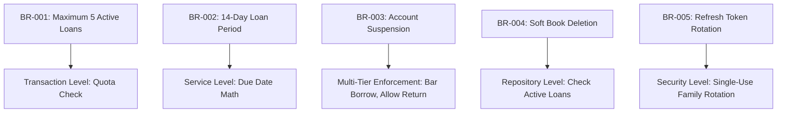
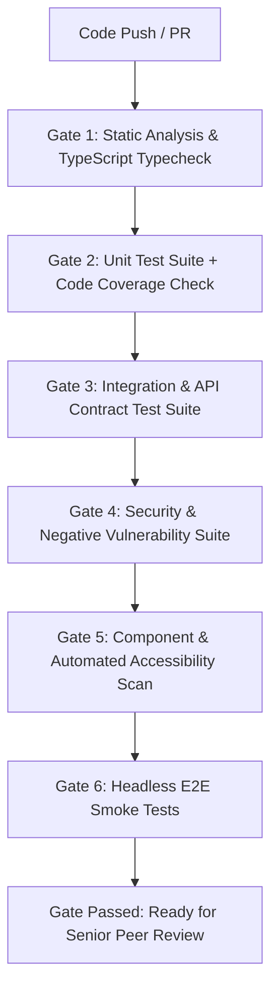

# TESTING STRATEGY AND QUALITY ASSURANCE SPECIFICATION
## Cloud-Native Library Management System (LMS)

---

**Document Version**: 1.0.0  
**Lifecycle Phase**: Phase 8 – Testing Strategy and Quality Assurance  
**Document Status**: PERMANENTLY BASELINE LOCKED AND APPROVED  
**Author**: Principal Software Architect, Senior Quality Assurance Architect, Test Automation Architect & Security Testing Specialist  
**Upstream Baseline Dependencies**:
- [Phase 0 Master Project Architecture (v1.1.0)](../02-architecture/MASTER_ARCHITECTURE.md)
- [Phase 1 Software Requirements Specification (v1.1.0)](../01-requirements/SOFTWARE_REQUIREMENTS_SPECIFICATION.md)
- [Phase 2 Detailed System Design (v1.1.0)](../02-architecture/DETAILED_SYSTEM_DESIGN.md)
- [Phase 3 Database Architecture Specification (v1.2.0)](../03-database/DATABASE_ARCHITECTURE.md)
- [Phase 4 Backend Architecture & API Design Specification (v1.1.0)](../04-backend/BACKEND_ARCHITECTURE_AND_API_DESIGN.md)
- [Phase 5 Frontend Architecture & UI/UX Design Specification (v1.0.0)](../05-frontend/FRONTEND_ARCHITECTURE_AND_UI_UX_DESIGN.md)
- [Phase 6 Security Architecture Specification (v1.0.0)](../06-security/SECURITY_ARCHITECTURE.md)
- [Phase 7 Engineering Standards & Code Quality Specification (v1.0.0)](../07-engineering/ENGINEERING_STANDARDS_AND_CODE_QUALITY.md)  
**Implementation Policy**: *STRICT GATE — Physical software development and executable test script authoring remain strictly barred until Phase 14. Zero executable test files (.test.ts, .spec.ts), application source code (.ts, .tsx, .js, .jsx, .html, .css), package manifests (package.json), container files (Dockerfile), or deployment infrastructure are generated during this phase.*

---

## TABLE OF CONTENTS
1. [Document Control and Testing Governance](#1-document-control-and-testing-governance)
2. [Quality Assurance Philosophy](#2-quality-assurance-philosophy)
3. [Testing Architecture](#3-testing-architecture)
4. [Testing Pyramid](#4-testing-pyramid)
5. [Requirements Traceability Test Matrix](#5-requirements-traceability-test-matrix)
6. [Business Rule Testing](#6-business-rule-testing)
7. [Database Invariant Testing](#7-database-invariant-testing)
8. [Dynamic Overdue Truth Testing](#8-dynamic-overdue-truth-testing)
9. [Backend Unit Testing Strategy](#9-backend-unit-testing-strategy)
10. [Database and Repository Testing](#10-database-and-repository-testing)
11. [Transaction and Concurrency Testing](#11-transaction-and-concurrency-testing)
12. [API Integration and Contract Testing](#12-api-integration-and-contract-testing)
13. [Authentication Testing](#13-authentication-testing)
14. [Authorization and BOLA/IDOR Testing](#14-authorization-and-bola-idor-testing)
15. [Security Testing Strategy](#15-security-testing-strategy)
16. [Input Validation and Negative Testing](#16-input-validation-and-negative-testing)
17. [Error Handling Testing](#17-error-handling-testing)
18. [Frontend Testing Strategy](#18-frontend-testing-strategy)
19. [End-to-End Testing](#19-end-to-end-testing)
20. [Accessibility Testing](#20-accessibility-testing)
21. [Performance Testing](#21-performance-testing)
22. [Reliability and Failure Testing](#22-reliability-and-failure-testing)
23. [Test Data Management](#23-test-data-management)
24. [Mocking and Test Double Strategy](#24-mocking-and-test-double-strategy)
25. [Code Coverage Governance](#25-code-coverage-governance)
26. [Test Quality Standards](#26-test-quality-standards)
27. [Regression Testing Strategy](#27-regression-testing-strategy)
28. [Test Automation Strategy](#28-test-automation-strategy)
29. [Quality Gates and Release Criteria](#29-quality-gates-and-release-criteria)
30. [Defect Classification and Governance](#30-defect-classification-and-governance)
31. [Test Environment Strategy](#31-test-environment-strategy)
32. [Test Requirements Traceability Matrix](#32-test-requirements-traceability-matrix)
33. [Cross-Phase Compliance Matrix](#33-cross-phase-compliance-matrix)
34. [Formal Testing Definition of Done](#34-formal-testing-definition-of-done)

---

## 1. Document Control and Testing Governance

### 1.1 Document Metadata
| Field | Value |
|---|---|
| **Document Title** | Testing Strategy and Quality Assurance Specification |
| **Document Version** | 1.0.0 |
| **Document Status** | PERMANENTLY BASELINE LOCKED AND APPROVED |
| **Project Name** | Cloud-Native Library Management System (LMS) |
| **Governing Authority** | Quality Assurance Architecture Council & Testing Governance Board |
| **Current Phase** | Phase 8 – Testing Strategy and Quality Assurance |
| **Next Phase** | Phase 9 – AWS Infrastructure Architecture |
| **Implementation Gate** | Physical implementation and test execution strictly gated until Phase 14. |

### 1.2 Upstream Baseline Hierarchy & Immutability Rules
This specification translates all permanently locked upstream architectural baselines into rigorous, measurable verification contracts:
- **Phase 0 (Master Architecture v1.1.0)**: Governs overall system boundaries, dual deployment profiles (Profile A Production vs Profile B Student), and non-functional scalability targets.
- **Phase 1 (SRS v1.1.0)**: Establishes all 22 Functional Requirements (`FR-AUTH-001..004`, `FR-USER-001..002`, `FR-BOOK-001..004`, `FR-BORROW-001..004`, `FR-ADMIN-001..008`) and business rules (`BR-001` through `BR-005`).
- **Phase 2 (Detailed System Design v1.1.0)**: Dictates the 6-tier backend layering model, request lifecycle flow, and circulation state transitions.
- **Phase 3 (Database Architecture v1.2.0)**: Governs persistence invariants (`INV-01` to `INV-06`), multi-document ACID transactions, unique indexes, and real-time temporal overdue calculation (`DBD-09`).
- **Phase 4 (Backend Architecture & API Design v1.1.0)**: Locks canonical `/api/v1` namespace, exactly 21 approved REST endpoints, canonical parameter naming (`:bookId`, `:borrowingId`, `:userId`), and RFC 7807 problem details error format.
- **Phase 5 (Frontend Architecture & UI/UX Design v1.0.0)**: Dictates React 18+ SPA structure, TanStack Query v5 state caching, in-memory access token storage, browser-managed HttpOnly refresh cookies, WCAG 2.1 AA accessibility, and suspended patron UX containment (`BR-003`).
- **Phase 6 (Security Architecture v1.0.0)**: Enforces STRIDE threat model mitigations, RBAC role authorization, BOLA/IDOR ownership validation, Refresh Token Family Rotation, credential redaction, and two-tier audit logging.
- **Phase 7 (Engineering Standards & Code Quality v1.0.0)**: Sets TypeScript compiler strictness, quantitative complexity limits, TSDoc standards, and the $\ge 85\%$ minimum branch coverage baseline.

> [!IMPORTANT]
> **Governing Testing Axiom**: *Testing architecture must validate approved baselines but must never redefine them.* Test cases that contradict, bypass, or invent requirements are strictly invalid.

---

## 2. Quality Assurance Philosophy

The project adheres to 12 foundational quality principles:
1. **Prevention Before Detection**: Design testable architectures, enforce strict typing, and establish pre-commit linting so defects are prevented before they can be committed.
2. **Requirements-Driven Testing**: Every test must directly trace to an approved functional requirement, business rule, database invariant, or security control.
3. **Risk-Based Testing**: Test depth correlates directly with operational and security risk. Concurrency, transactions, authentication, and inventory consistency receive exhaustive verification.
4. **Automation-First Verification**: All tests—from unit to end-to-end—must be automated, headless, deterministic, and executable within CI pipelines without human intervention.
5. **Defense in Depth**: Quality is validated across multiple independent layers. A business rule validated in the client must be redundantly verified at the API boundary, the domain service, and the database constraint layer.
6. **Shift-Left Quality Engineering**: Validation begins at the developer workstation via static analysis and unit tests, catching defects at the earliest lifecycle stage.
7. **Deterministic Testing**: Flaky, non-deterministic tests undermine developer trust. Tests must produce 100% identical results across repeated runs by eliminating unseeded randomness, uncontrolled clocks, and network dependencies.
8. **Production Realism**: Integration tests must execute against real database engines (containerized MongoDB replica sets) rather than simplified in-memory mocks that mask transactional edge cases.
9. **Security Testing by Design**: Security controls (STRIDE, BOLA, injection, token replay) are tested proactively with automated negative test suites rather than deferred to periodic penetration audits.
10. **Regression Prevention**: Every resolved bug must be paired with an automated regression test that fails against the defect and passes against the fix.
11. **Independent Verification**: Test execution and gate sign-off are verified independently of developer self-assertion.
12. **Evidence-Based Approval**: Releases require empirical proof of passing test suites, coverage reports, and zero open critical defects.

---

## 3. Testing Architecture

The LMS quality assurance architecture is structured into an 11-stage automated verification hierarchy:

```text
[ Stage 1: Static Verification ]       -> TypeScript `tsc --noEmit`, ESLint, Prettier, Knip
               │
[ Stage 2: Unit Testing ]               -> Pure domain logic, DTO validation, calculation algorithms
               │
[ Stage 3: Component Testing ]          -> React UI components, isolated hook testing, user events
               │
[ Stage 4: Integration Testing ]        -> Service-to-Repository, transactional rollback, multi-doc ACID
               │
[ Stage 5: API Contract Testing ]       -> 21 REST endpoints, canonical /api/v1 routes, RFC 7807 envelopes
               │
[ Stage 6: Database Integrity Testing ] -> INV-01..06, compound unique partial indexes, DBD-09 overdue
               │
[ Stage 7: Security Testing ]           -> STRIDE mitigations, BOLA/IDOR, token rotation replay, redaction
               │
[ Stage 8: End-to-End Testing ]         -> Critical patron & admin user journeys via Playwright
               │
[ Stage 9: Performance Testing ]        -> Latency (P95 < 200ms), throughput, rate limiting under load via k6
               │
[ Stage 10: Accessibility Testing ]     -> WCAG 2.1 AA automated axe-core scanning + keyboard traversal
               │
[ Stage 11: Regression Testing ]        -> Continuous regression suite execution on every PR
```

---

## 4. Testing Pyramid

To guarantee fast feedback, high test execution velocity, and maximum defect isolation, the LMS enforces a strict testing pyramid distribution:

```text
       /\
      /  \        End-to-End Tests (~5%)
     /----\       - Critical multi-step browser journeys (Playwright)
    /      \
   /--------\     Component & Accessibility Tests (~10%)
  /          \    - React component states, WCAG 2.1 AA axe-core audits
 /------------\
/              \  Integration & API Contract Tests (~25%)
----------------  - 21 REST endpoints, MongoDB transactions, BOLA, RFC 7807
/                \
------------------ Unit Tests (~60%)
                   - Domain services, invariants, Zod schemas, pure functions
```

### 4.1 Target Distribution Metrics
| Testing Tier | Target Ratio | Primary Technology | Execution SLA | Scope & Responsibility |
|---|---|---|---|---|
| **Unit Tests** | ~60% | Vitest / Jest | $< 15\text{ seconds}$ | Isolated business rules, algorithms, schema validation. |
| **Integration & API** | ~25% | Supertest + Testcontainers (MongoDB) | $< 60\text{ seconds}$ | Endpoints, database transactions, repository queries, auth. |
| **Component & A11y** | ~10% | Testing Library + axe-core | $< 30\text{ seconds}$ | Isolated React rendering, user interaction, accessibility. |
| **End-to-End** | ~5% | Playwright | $< 180\text{ seconds}$ | High-value cross-tier journeys (Borrow, Return, Suspend). |

---

## 5. Requirements Traceability Test Matrix

The following matrix establishes exhaustive, multi-dimensional test coverage for all **22 Functional Requirements**:

| Requirement | Test Level | Positive Scenarios | Negative Scenarios | Security Scenarios | Edge Cases | Acceptance Criteria |
|---|---|---|---|---|---|---|
| **FR-AUTH-001** (Register) | Unit, API, E2E | Valid email, strong password, name returns 201 Created and user profile | Duplicate email (409), weak password (400), malformed email (400) | Mass assignment of `role: ADMIN` stripped; XSS payload in name sanitized | Trailing whitespace trimmed; email normalized to lowercase | User created with `ROLE_PATRON`, password hashed with bcrypt $\ge 12$ |
| **FR-AUTH-002** (Login) | Unit, API, E2E | Valid credentials returns 200, in-memory access token, HttpOnly cookie | Invalid password (401), non-existent email (401), missing fields (400) | Timing attack resistance (constant-time check); rate limit after 5 fails | Account suspended user still receives 200 with `status: SUSPENDED` | 15-min JWT returned in body; 7-day cookie set with `SameSite=Strict` |
| **FR-AUTH-003** (Logout) | Unit, API, E2E | Authenticated logout revokes refresh token, clears cookie, returns 204 | Missing auth token (401), invalid cookie (401) | Revoked token cannot be used again; session family invalidated | Client attempts call with expired access token | HttpOnly cookie cleared (`Max-Age=0`), DB session revoked |
| **FR-AUTH-004** (Refresh) | Unit, API, E2E | Valid refresh cookie returns 200 with new in-memory access token & rotated cookie | Expired cookie (401), missing cookie (401), invalid token format (401) | Replay of consumed refresh token immediately invalidates entire family | Concurrent refresh requests handled gracefully | Single-use rotation enforced; access token renewed |
| **FR-USER-001** (Profile) | Unit, API | Authenticated patron retrieves own profile with active loan count (200) | Unauthenticated request (401) | BOLA attempt: patron cannot view another user's profile | User with zero loans returns `activeLoansCount: 0` | Returns sanitized user DTO excluding `passwordHash` |
| **FR-USER-002** (Password) | Unit, API | Current password valid, new password strong returns 204 No Content | Incorrect current password (400), new password equals current (400) | Suspended patron barred from password change (403, BR-003) | Max-length password (128 chars) hashed successfully | All active sessions revoked except current session |
| **FR-BOOK-001** (Search) | Unit, API, E2E | Keyword search returns 200 with matching paginated book list | Invalid page/limit parameters return 400 with RFC 7807 error | NoSQL operator injection in query string (`$regex`, `$gt`) stripped | Empty search term returns default paginated catalog | Text indexed search across title and author |
| **FR-BOOK-002** (Filter/Sort) | Unit, API | Filter by genre, availability; sort by title/author returns 200 | Invalid sort field returns 400 Bad Request | Parameter tampering with unknown fields ignored/stripped | Zero matching results returns empty data array `[]` | Compound index used; pagination metadata accurate |
| **FR-BOOK-003** (Book Details) | Unit, API, E2E | Valid `bookId` returns 200 with metadata and available copy count | Malformed ObjectId returns 400; non-existent ID returns 404 | SQL/NoSQL injection in path parameter rejected | Soft-deleted book hidden from patron catalog | Returns complete book record with shelf location |
| **FR-BOOK-004** (Availability) | Unit, API | Valid `bookId` returns 200 with real-time `availableCopies` count | Non-existent `bookId` returns 404 Not Found | Unauthenticated public access permitted | Book with 0 copies returns `isAvailable: false` | Dynamic count matches database invariant INV-01 |
| **FR-BORROW-001** (Borrow) | Unit, API, E2E | Patron with quota available borrows copy; returns 201 Created | Inventory zero (409), patron at quota of 5 (409), duplicate active loan (409) | Suspended patron blocked (403, BR-003); BOLA patron ID spoofing rejected | 2 patrons request final copy simultaneously: exactly 1 succeeds | Multi-doc ACID transaction; `availableCopies` decremented |
| **FR-BORROW-002** (Return) | Unit, API, E2E | Patron returns active loan; returns 200 and restores inventory | Already returned loan (409), non-existent `borrowingId` (404) | BOLA check: patron cannot return another patron's book (403) | Suspended patron permitted to return book (BR-003) | Multi-doc ACID transaction; `returnDate` set; copy restored |
| **FR-BORROW-003** (Active Loans)| Unit, API, E2E | Patron views current active borrowings with dynamic overdue flag (200) | Unauthenticated request (401) | Query automatically scoped to `req.user.id`; BOLA impossible | Loans with `now > dueDate` dynamically flagged `isOverdue: true` | DBD-09 verified; zero static `isOverdue` stored |
| **FR-BORROW-004** (History) | Unit, API | Patron views paginated list of past returned borrowings (200) | Invalid pagination bounds return 400 | Scoped strictly to `req.user.id` | Patron with zero historical loans returns empty list | Ordered by `returnDate` descending |
| **FR-ADMIN-001** (KPIs) | Unit, API, E2E | Admin/Librarian views catalog, loan, and patron KPI counts (200) | Patron role rejected with 403 Forbidden | Unauthenticated request rejected with 401 | Empty database returns zeroes for all KPI counts | Real-time aggregation over collections |
| **FR-ADMIN-002** (Add Book) | Unit, API, E2E | Admin/Librarian creates book with copies; returns 201 Created | Negative copies (400), invalid ISBN (400), missing title (400) | Patron role rejected with 403 Forbidden; Tier 1 audit log created | ISBN with hyphens normalized | Book created; `availableCopies === totalCopies` |
| **FR-ADMIN-003** (Update Book)| Unit, API | Admin updates title, author, total copies; returns 200 OK | Reducing `totalCopies` below active loans returns 409 Conflict | Patron role rejected with 403; cannot modify `_id` | Updating non-inventory metadata does not affect loans | Invariant INV-02 preserved; Tier 1 audit logged |
| **FR-ADMIN-004** (Delete Book)| Unit, API | Admin deactivates book with zero active loans; returns 204 No Content| Deleting book with active loans returns 409 Conflict (INV-06) | Patron role rejected with 403; Tier 1 audit log created | Soft-deleted book excluded from patron search | Referential integrity preserved |
| **FR-ADMIN-005** (Suspend User)| Unit, API, E2E | Admin suspends patron; returns 200 OK and revokes active sessions | Admin attempts self-suspension (400), non-existent user (404) | Only `ROLE_ADMIN` permitted; Librarian rejected with 403 | Suspending already-suspended user is idempotent | User `status: SUSPENDED`; Tier 1 audit logged |
| **FR-ADMIN-006** (All Loans) | Unit, API | Admin/Librarian views paginated list of all system borrowings (200) | Invalid query filters return 400 | Patron role rejected with 403 Forbidden | Filter by overdue status evaluates DBD-09 dynamically | Supports filtering by status, user, and date |
| **FR-ADMIN-007** (Override Ret)| Unit, API | Staff forces return of lost/overdue loan; returns 200 OK | Already returned loan returns 409 Conflict | Patron role rejected with 403; Tier 1 audit log created | Override on suspended patron's loan succeeds | Inventory restored; admin identity logged in record |
| **FR-ADMIN-008** (Audit Logs) | Unit, API, E2E | Admin views paginated immutable audit log records (200 OK) | Patron and Librarian roles rejected with 403 Forbidden | Tampering with audit logs prevented (read-only endpoint) | Date range filter across millions of records | Returns chronological audit trail with correlation IDs |

---

## 6. Business Rule Testing

The LMS enforces five core business rules whose verification must span multiple testing levels:



### 6.1 BR-003 Account Suspension Deep Verification
Business Rule `BR-003` mandates strict behavioral containment for suspended patrons. Testing must verify this boundary across four independent layers:

| Target Operation | Expected Result | Service Level Test | API Level Test | Security Level Test | Frontend UX Test |
|---|---|---|---|---|---|
| **Initiate New Checkout** (`POST /api/v1/borrowings`) | **403 Forbidden** (`ERR-USER-SUSPENDED`) | Throws `AccountSuspendedError` | Returns 403 with RFC 7807 problem details | Rejects even if client sends valid token | "Borrow Book" button disabled with tooltip |
| **Change Password** (`PATCH /api/v1/users/password`) | **403 Forbidden** (`ERR-USER-SUSPENDED`) | Throws `AccountSuspendedError` | Returns 403 with RFC 7807 problem details | Barred from credential mutation | Password form disabled in user settings |
| **Inspect Active Loans** (`GET /api/v1/borrowings/my-active`) | **200 OK** (Permitted) | Resolves active loans array | Returns 200 with loans and overdue flags | Allows patron to view obligations | Renders active loans table with alert banner |
| **Inspect Loan History** (`GET /api/v1/borrowings/my-history`) | **200 OK** (Permitted) | Resolves history array | Returns 200 with historical loans | Read-only archive access preserved | History page fully operational |
| **Return Borrowed Book** (`POST /api/v1/borrowings/:borrowingId/return`) | **200 OK** (Permitted) | Executes transactional return | Returns 200 OK; decrements loan count | Enables physical property recovery | "Return Book" action button fully active |

---

## 7. Database Invariant Testing

The six database invariants established in Phase 3 must be verified under normal, boundary, failure, and concurrent conditions:

### 7.1 INV-01: Non-Negative Inventory ($0 \le \text{availableCopies} \le \text{totalCopies}$)
- **Normal Test**: Borrowing a book with `availableCopies = 3` decrements to `2`.
- **Boundary Test**: Borrowing the final copy (`availableCopies = 1`) decrements to `0`.
- **Failure Test**: Attempting checkout when `availableCopies = 0` fails with `409 Conflict` (`ERR-CIRC-INVENTORY-EXHAUSTED`).
- **Concurrent Test**: 10 simultaneous checkout requests for a book with 1 available copy execute concurrently. Exactly 1 request succeeds (HTTP 201); exactly 9 fail (HTTP 409). Inventory ends at exactly 0.
- **Enforcement Verification**: Atomic conditional update `{ availableCopies: { $gt: 0 } }` verified at database level.

### 7.2 INV-02: Borrowing Count Consistency ($\text{availableCopies} = \text{totalCopies} - \text{activeLoans}$)
- **Normal Test**: Lifecycle cycle (Borrow $\rightarrow$ Return) increments and decrements counts in lockstep.
- **Concurrent Test**: 5 concurrent borrows and 5 concurrent returns on a book maintain mathematical consistency at every point.
- **Enforcement Verification**: Executed within multi-document ACID transaction.

### 7.3 INV-03: Single Active Loan Per Patron Per Book
- **Normal Test**: Patron borrows Book A (succeeds).
- **Failure Test**: Same patron attempts to borrow Book A again while first loan is `ACTIVE`. Service rejects with `409 Conflict` (`ERR-CIRC-DUPLICATE-LOAN`).
- **Concurrent Test**: Same patron submits 2 identical checkout requests for Book A simultaneously. Exactly 1 succeeds; 1 fails.
- **Database Level Verification**: Database throws duplicate key error `E11000` via unique compound partial index `idx_borrowings_active_user_book` (`{ userId: 1, bookId: 1 }` where `status: "ACTIVE"`).

### 7.4 INV-04: Patron Active Loan Quota ($\le 5$ Concurrent Loans)
- **Normal Test**: Patron borrows 5 distinct books successfully.
- **Failure Test**: Patron with 5 active loans attempts to borrow a 6th book. Service rejects with `409 Conflict` (`ERR-CIRC-QUOTA-EXCEEDED`).
- **Boundary Test**: Patron returns 1 book (active loans = 4); 6th checkout now succeeds.
- **Concurrent Test**: Patron with 4 active loans launches 3 concurrent checkout requests for different books. Exactly 1 succeeds; 2 fail. Active loans never exceed 5.

### 7.5 INV-05: Suspended Patron Borrowing Prohibition
- **Normal Test**: Active patron borrows book (succeeds).
- **Failure Test**: User status set to `SUSPENDED`. Borrowing request rejected with `403 Forbidden` (`ERR-USER-SUSPENDED`).
- **Race Condition Test**: Patron initiates checkout at the exact millisecond an administrator clicks "Suspend Patron". Transaction isolation guarantees that either suspension commits first (checkout fails) or checkout commits before suspension.

### 7.6 INV-06: Referential Integrity Across Collections
- **Normal Test**: Borrowing created referencing existing `userId` and `bookId`.
- **Failure Test**: Attempting checkout with non-existent `bookId` fails with `404 Not Found`.
- **Integrity Test**: Attempting to hard-delete a book record that has active borrowing references is blocked by database/service guard with `409 Conflict`.

---

## 8. Dynamic Overdue Truth Testing

In strict adherence to Phase 3 baseline rule `DBD-09`:
$$\text{isOverdue} \iff (\text{returnDate} == \text{null} \land \text{now} > \text{dueDate})$$

### 8.1 Mandatory Test Scenarios
1. **Loan Before Due Date**: Loan with `dueDate = now + 5 days` and `returnDate = null` evaluates to `isOverdue: false`.
2. **Loan Exactly at Due Date**: Loan with `dueDate = now` evaluates to `isOverdue: false`.
3. **Loan After Due Date**: Loan with `dueDate = now - 1 second` and `returnDate = null` evaluates to `isOverdue: true`.
4. **Returned Loan After Due Date**: Loan with `dueDate = now - 5 days` and `returnDate = now - 2 days` evaluates to `isOverdue: false` (returned loans are never overdue).
5. **Timezone Consistency**: Test executions across UTC, EST, and IST timestamps evaluate to identical boolean overdue states.
6. **Deterministic Clock Testing**: All temporal tests MUST inject a mocked clock interface (`ClockProvider` or `vi.setSystemTime()`). Tests relying on real-world `Date.now()` are strictly banned.
7. **Prohibition of Static DB Column**: Test suite must inspect MongoDB collections after borrowing creation, return, and overdue transition to assert that NO `isOverdue` field exists in the persisted document.

---

## 9. Backend Unit Testing Strategy

Backend unit testing focuses on domain services, algorithms, and validation rules in total isolation from external networks and databases:

### 9.1 Unit Testing Principles & Mocking Rules
- **Isolation**: Domain services accept repository and logger interfaces via constructor dependency injection.
- **AAA Pattern**: Every test strictly adheres to Arrange, Act, Assert.
- **Fast Execution**: Unit test suites must execute in $< 15\text{ seconds}$ for the entire backend codebase.
- **Error Assertions**: Assertions must verify both the thrown error class (`expect().rejects.toThrow(AccountSuspendedError)`) and the specific application error code (`ERR-USER-SUSPENDED`).

```typescript
// Canonical Unit Test Specification Pattern
describe('CirculationService.borrowBook', () => {
  it('should reject checkout when patron quota of 5 is exceeded (INV-04)', async () => {
    // Arrange
    mockUserRepository.findById.mockResolvedValue(activePatronFixture);
    mockBorrowingRepository.countActiveByUserId.mockResolvedValue(5);

    // Act & Assert
    await expect(circulationService.borrowBook(patronId, bookId))
      .rejects.toThrow(BorrowingQuotaExceededError);
    expect(mockBookRepository.decrementAvailableCopies).not.toHaveBeenCalled();
  });
});
```

---

## 10. Database and Repository Testing

Repository testing validates that data access logic, query filters, and Mongoose projections behave correctly against real database engines:

### 10.1 Real Database Testing vs. Mocks
- **Mocks Allowed For**: Controller-to-Service unit testing.
- **Real Database Mandatory For**:
  - Verification of compound indexes (`idx_borrowings_active_user_book`).
  - Text search query filters and scoring (`$text: { $search: ... }`).
  - Mongoose validation hooks and schema defaults.
  - Multi-document ACID transaction rollbacks.
- **Test Database Engine**: Automated integration tests execute against a containerized MongoDB replica set spawned via Testcontainers, ensuring 100% production feature parity.

---

## 11. Transaction and Concurrency Testing

Multi-document ACID transactions coordinate checkout and return workflows. Testing must subject these workflows to high-concurrency race conditions:

### 11.1 Concurrency Race Test Scenarios
```text
Test Case TC-CONCUR-01: Final Copy Exhaustion Race
- Initial State: Book "Distributed Systems" totalCopies = 5, availableCopies = 1.
- Execution: 10 concurrent requests (Worker 1..10) submit POST /api/v1/borrowings simultaneously.
- Assertions:
  1. Exactly 1 request receives HTTP 201 Created.
  2. Exactly 9 requests receive HTTP 409 Conflict with code "ERR-CIRC-INVENTORY-EXHAUSTED".
  3. Database record availableCopies is exactly 0 (INV-01 preserved).
  4. Exactly 1 borrowing document is created.
```

```text
Test Case TC-CONCUR-02: Simultaneous Duplicate Checkout Race
- Initial State: Patron A has 0 active loans. Book B has availableCopies = 3.
- Execution: Patron A sends 2 identical POST /api/v1/borrowings { bookId: B } requests simultaneously.
- Assertions:
  1. Exactly 1 request receives HTTP 201 Created.
  2. Exactly 1 request receives HTTP 409 Conflict with code "ERR-CIRC-DUPLICATE-LOAN".
  3. Compound unique partial index idx_borrowings_active_user_book catches race condition (INV-03 preserved).
  4. availableCopies decrements by exactly 1 (ends at 2).
```

---

## 12. API Integration and Contract Testing

Every approved endpoint under `/api/v1` must undergo complete integration testing validating HTTP status codes, request validation, headers, and RFC 7807 error envelopes:

### 12.1 Approved 21-Endpoint Contract Verification Matrix
| Endpoint # | HTTP Method | Canonical Endpoint Path | Success Code | Target Negative Tests | RFC 7807 Error Code |
|---|---|---|---|---|---|
| **1** | `POST` | `/api/v1/auth/register` | `201 Created` | Duplicate email, weak password, invalid body | `ERR-VAL-INVALID-INPUT`, `ERR-AUTH-DUPLICATE-EMAIL` |
| **2** | `POST` | `/api/v1/auth/login` | `200 OK` | Wrong password, unverified email, rate limit | `ERR-AUTH-INVALID-CREDENTIALS`, `ERR-SEC-RATE-LIMIT` |
| **3** | `POST` | `/api/v1/auth/logout` | `204 No Content`| Missing token, invalid cookie | `ERR-AUTH-UNAUTHORIZED` |
| **4** | `POST` | `/api/v1/auth/refresh` | `200 OK` | Replayed token, expired cookie | `ERR-AUTH-TOKEN-EXPIRED`, `ERR-AUTH-REPLAY-DETECTED` |
| **5** | `GET` | `/api/v1/users/profile` | `200 OK` | Missing Bearer token, expired token | `ERR-AUTH-UNAUTHORIZED` |
| **6** | `PATCH` | `/api/v1/users/password` | `204 No Content`| Wrong old password, suspended user | `ERR-AUTH-INVALID-CREDENTIALS`, `ERR-USER-SUSPENDED` |
| **7** | `GET` | `/api/v1/books` | `200 OK` | Negative page, limit > 100 | `ERR-VAL-INVALID-INPUT` |
| **8** | `GET` | `/api/v1/books/:bookId` | `200 OK` | Malformed ObjectId, non-existent ID | `ERR-VAL-INVALID-INPUT`, `ERR-RES-NOT-FOUND` |
| **9** | `GET` | `/api/v1/books/:bookId/availability` | `200 OK`| Non-existent ID | `ERR-RES-NOT-FOUND` |
| **10** | `POST` | `/api/v1/borrowings` | `201 Created` | Out of stock, quota exceeded, duplicate | `ERR-CIRC-INVENTORY-EXHAUSTED`, `ERR-CIRC-QUOTA` |
| **11** | `POST` | `/api/v1/borrowings/:borrowingId/return` | `200 OK`| Already returned, BOLA patron mismatch | `ERR-CIRC-ALREADY-RETURNED`, `ERR-AUTH-FORBIDDEN` |
| **12** | `GET` | `/api/v1/borrowings/my-active` | `200 OK` | Unauthenticated access | `ERR-AUTH-UNAUTHORIZED` |
| **13** | `GET` | `/api/v1/borrowings/my-history` | `200 OK` | Invalid pagination parameters | `ERR-VAL-INVALID-INPUT` |
| **14** | `GET` | `/api/v1/admin/dashboard/kpis` | `200 OK` | Access by patron role | `ERR-AUTH-FORBIDDEN` |
| **15** | `POST` | `/api/v1/admin/books` | `201 Created` | Negative copies, duplicate ISBN, patron access| `ERR-VAL-INVALID-INPUT`, `ERR-AUTH-FORBIDDEN` |
| **16** | `PUT` | `/api/v1/admin/books/:bookId` | `200 OK` | Total copies < active loans, non-existent ID | `ERR-CIRC-INVENTORY-CONFLICT`, `ERR-RES-NOT-FOUND` |
| **17** | `DELETE` | `/api/v1/admin/books/:bookId` | `204 No Content`| Deleting book with active loans | `ERR-CIRC-BOOK-ACTIVE-LOANS` |
| **18** | `PATCH` | `/api/v1/admin/users/:userId/status` | `200 OK`| Self-suspension, non-admin role | `ERR-ADMIN-SELF-SUSPEND`, `ERR-AUTH-FORBIDDEN` |
| **19** | `GET` | `/api/v1/admin/borrowings` | `200 OK` | Invalid status filter, patron access | `ERR-VAL-INVALID-INPUT`, `ERR-AUTH-FORBIDDEN` |
| **20** | `POST` | `/api/v1/admin/borrowings/:borrowingId/return-override`| `200 OK`| Already returned, patron role | `ERR-CIRC-ALREADY-RETURNED`, `ERR-AUTH-FORBIDDEN` |
| **21** | `GET` | `/api/v1/admin/audit-logs` | `200 OK` | Patron role, Librarian role | `ERR-AUTH-FORBIDDEN` |

---

## 13. Authentication Testing

Testing must rigorously validate token security parameters established across Phases 5 and 6:
- **In-Memory Access Token Verification**: Client tests must verify that JWT access tokens are held exclusively in React `AuthContext` state memory and are NEVER written to `window.localStorage` or `window.sessionStorage`.
- **HttpOnly Cookie Attributes**: Integration tests must assert that the `Set-Cookie` header on `/api/v1/auth/login` contains:
  - `HttpOnly; Secure; SameSite=Strict; Path=/api/v1/auth; Max-Age=604800`
- **Refresh Token Family Rotation**: Consuming a refresh token must rotate it to a successor within the same family.
- **Replay Detection & Family Revocation**: Replaying an already-consumed refresh token must trigger immediate invalidation of the entire session family in the database, invalidating all associated active tokens across all user devices.
- **Cryptographic Negative Testing**: Test requests carrying tokens with modified signatures, altered payloads, unsupported algorithms (`alg: "none"`), or expired timestamps must be rejected with `401 Unauthorized`.

---

## 14. Authorization and BOLA/IDOR Testing

Authorization testing prevents horizontal and vertical privilege escalation:
- **Broken Object-Level Authorization (BOLA) Tests**:
  - Patron A borrows Book 1 (Borrowing ID = `X`).
  - Patron B attempts to return Borrowing `X` (`POST /api/v1/borrowings/X/return`).
  - Expected: Service rejects request with `403 Forbidden` (`ERR-AUTH-FORBIDDEN`).
- **Vertical Privilege Escalation Tests**:
  - Patron attempts to call administrative endpoints (`POST /api/v1/admin/books`, `PATCH /api/v1/admin/users/:userId/status`, `GET /api/v1/admin/audit-logs`).
  - Expected: RBAC middleware intercepts and rejects with `403 Forbidden`.
- **Non-Authoritative Client UI Tests**:
  - Tests verify that manually crafting direct HTTP requests bypasses any frontend UI element hiding and is securely blocked by backend guards.

---

## 15. Security Testing Strategy

Security verification is derived directly from the Phase 6 STRIDE threat model:

| STRIDE Category | Threat Vector | Testing Approach & Assertions |
|---|---|---|
| **Spoofing** | Forged JWT access token / stolen identity | Verify signature rejection, `alg: none` rejection, expired token rejection |
| **Tampering** | Parameter tampering / mass assignment | Submit unauthorized fields (`role: ADMIN`); assert Zod schema strips them |
| **Repudiation** | Administrative action denial | Verify Tier 1 transactional audit log created with user ID and timestamp |
| **Information Disclosure** | Stack trace leak / credential logging | Assert RFC 7807 responses hide stack traces; assert log redaction scrubs passwords |
| **Denial of Service** | Endpoint request flooding | Execute 100 requests in 10s against `/auth/login`; assert 429 Too Many Requests |
| **Elevation of Privilege**| Horizontal IDOR / vertical RBAC bypass | Assert Patron cannot access Admin routes; assert Patron cannot access other user loans |

---

## 16. Input Validation and Negative Testing

Systematic negative testing validates that unformatted, malicious, or malformed data is rejected at the API boundary:
- **Zod Schema Boundary Testing**: Verify rejection of missing required fields, empty strings, invalid email formats, and invalid types.
- **Malformed ObjectIds**: Pass malformed route parameters (e.g., `GET /api/v1/books/invalid-id-123`). Assert `400 Bad Request` with field-level issue description in `invalidParams`.
- **NoSQL Injection Payloads**: Submit query parameters containing MongoDB operator objects: `GET /api/v1/books?search[$regex]=.*`. Assert that Zod schema validation casts or rejects the input before it reaches the Mongoose driver.
- **Payload Size Limits**: Transmit request bodies exceeding 100KB. Assert HTTP `413 Payload Too Large`.

---

## 17. Error Handling Testing

Testing must ensure universal compliance with RFC 7807 (Problem Details for HTTP APIs):
- **Contract Envelope Verification**: Every 4xx and 5xx error response must include `type`, `title`, `status`, `detail`, `instance`, `code`, and `timestamp`.
- **Validation Issue Details**: When validation fails, `invalidParams` must contain the exact field names and human-readable violation descriptions.
- **Driver Translation Verification**: Mongoose `MongoServerError: E11000 duplicate key` must be intercepted and translated into an RFC 7807 `409 Conflict` response with application code `ERR-CIRC-DUPLICATE-LOAN` or `ERR-AUTH-DUPLICATE-EMAIL`.
- **Production Sanitization**: In production test profiles, 500 errors must return generic detail: `"An unexpected internal error occurred. Please contact support with the correlation ID."`

---

## 18. Frontend Testing Strategy

Frontend testing verifies presentation logic, component rendering, user interactions, and state management in `apps/frontend`:
- **Component Rendering Tests (Testing Library)**:
  - Verify `BookCard`, `ActiveLoansTable`, `PatronSuspensionBanner`, and `Navbar` render accurately across various props and states.
  - Verify loading skeletons render during pending queries.
  - Verify error banners render upon network failure.
- **State Separation Testing**:
  - **Server State**: Verify TanStack Query v5 cache invalidation on successful mutations (e.g., `useReturnBook` invalidates `['borrowings', 'active']` and `['books']`).
  - **Authentication State**: Verify `AuthContext` holds access token in memory; verify silent token refresh on 401 response via Axios interceptor.
  - **Local UI State**: Verify modal dialog toggles and form field edits remain strictly local.
- **Suspended Patron UI Verification**:
  - Verify that when `user.status === 'SUSPENDED'`, the alert banner renders prominently, the "Borrow Book" button is disabled with an explanatory tooltip, and "Return Book" remains interactive.

---

## 19. End-to-End Testing

End-to-end tests execute against fully integrated frontend and backend services using headless Playwright browsers:

### 19.1 Critical E2E User Journeys
```text
E2E Journey 1: Complete Authentication Lifecycle
1. User navigates to /register and submits valid credentials.
2. System redirects to /login with success notification.
3. User logs in; in-memory access token and HttpOnly cookie established.
4. User accesses /profile; verifies profile details.
5. User clicks Logout; cookie cleared; redirected to /login.
```

```text
E2E Journey 2: Book Discovery, Checkout, and Return Flow
1. Patron logs in and searches for "Cloud Architecture".
2. Patron inspects book details; verifies availableCopies = 2.
3. Patron clicks "Borrow Book"; confirms checkout modal.
4. UI reflects updated active loans count; toast notification displayed.
5. Patron navigates to /my-loans; verifies newly borrowed book listed.
6. Patron clicks "Return Book"; confirms return modal.
7. Loan disappears from active loans; inventory restores to 2.
```

```text
E2E Journey 3: Administrative Patron Suspension & Property Recovery
1. Admin logs into /admin/users and locates Patron X.
2. Admin clicks "Suspend Patron"; confirms reason dialog.
3. Patron X attempts to borrow a new book; receives suspension alert.
4. Patron X navigates to /my-loans; active loans are visible.
5. Patron X successfully clicks "Return Book"; library property recovered.
```

---

## 20. Accessibility Testing

User interfaces must maintain full compliance with **WCAG 2.1 Level AA**:
- **Automated Scanning**: Integrate `axe-core` into component and E2E test suites to detect missing `alt` attributes, color contrast violations, missing form labels, and invalid ARIA attributes.
- **Keyboard Navigation Testing**: Verify that all interactive controls (buttons, links, inputs, modal dialogs) can be focused and triggered using only the `Tab`, `Shift+Tab`, `Enter`, `Space`, and `Escape` keys.
- **Focus Trap Verification**: Modal dialogs (e.g., Checkout Confirmation Modal) must trap keyboard focus within the dialog until dismissed, returning focus to the triggering element upon close.
- **Screen Reader Live Announcements**: Verify dynamic UI updates (loan return success, error alerts) emit announcements via `aria-live="polite"` or `role="alert"`.

---

## 21. Performance Testing

Performance testing evaluates system responsiveness, throughput, and stability under simulated workloads using k6:

### 21.1 Quantitative Performance Baselines
| Metric | Threshold Target | Test Scenario & Workload Profile |
|---|---|---|
| **Catalog Search Latency** | P95 $< 150\text{ms}$ | 500 concurrent virtual users querying `/api/v1/books` |
| **Book Detail Latency** | P95 $< 100\text{ms}$ | 1,000 concurrent virtual users querying `/api/v1/books/:bookId` |
| **Checkout Transaction Latency** | P95 $< 250\text{ms}$ | 200 concurrent checkout transactions across multiple books |
| **Auth Login Latency** | P95 $< 300\text{ms}$ | Constant 20 req/sec (bcrypt work factor 12 evaluation) |
| **Error Rate Under Baseline Load** | $< 0.1\%$ | 1-hour sustained endurance test at 500 concurrent users |

### 21.2 Performance Test Profiles
- **Baseline Test**: Verify latencies under normal expected load (50 virtual users).
- **Load Test**: Evaluate performance scaling up to peak design capacity (1,000 virtual users).
- **Stress Test**: Increase load beyond breaking point to identify database connection bottlenecks and memory exhaustion thresholds.
- **Spike Test**: Inject sudden 10x traffic surges to verify HPA pod autoscaling and rate limiting responsiveness.
- **Endurance Test**: Execute sustained 4-hour workload to detect memory leaks or connection pool starvation.

---

## 22. Reliability and Failure Testing

Testing must prove that the LMS fails safely and recovers gracefully from infrastructure faults:
- **Database Connection Loss**: Simulate sudden MongoDB network disconnection during an active checkout. Verify that backend rejects new requests with `503 Service Unavailable`, rolls back in-flight transactions, and automatically reconnects once database connectivity is restored.
- **Transaction Write Conflicts**: Simulate concurrent write conflicts on the same document. Verify that the service executes automatic transaction retries up to 3 times before returning `409 Conflict`.
- **Token Service Clock Skew**: Simulate server clock drifts ($\pm 5\text{ seconds}$). Verify that JWT verification accommodates a configured 10-second leeway without rejecting valid tokens.

---

## 23. Test Data Management

- **Deterministic Fixtures**: Standardized JSON test fixtures for Users (`adminUser`, `activePatron`, `suspendedPatron`), Books (`singleCopyBook`, `multiCopyBook`, `outOfStockBook`), and Borrowings.
- **Test Factories**: Dynamic factories using `@faker-js/faker` to generate unique emails, valid ISBN-13 strings, and valid ObjectIds with reproducible seeds.
- **Test Database Isolation**: Every integration test suite runs against an isolated database instance or cleans all collections between test cases via a global `afterEach` hook.
- **Strict Prohibition of Production Data**: Production databases, credentials, patron PII, and real email addresses are STRICTLY PROHIBITED in test environments.

---

## 24. Mocking and Test Double Strategy

The quality assurance architecture defines strict boundaries for when mocks are permitted versus when real dependencies are mandatory:

```text
+-----------------------------------------------------------------------------+
|                         MOCKING BOUNDARY MATRIX                             |
+------------------------------------+----------------------------------------+
| COMPONENT UNDER TEST               | PERMITTED TEST DOUBLE APPROACH         |
+------------------------------------+----------------------------------------+
| Domain Service Unit Tests          | Mocks permitted for Repositories &     |
|                                    | Loggers (verify business logic only).  |
+------------------------------------+----------------------------------------+
| Database Invariants & Queries      | MOCKS PROHIBITED. Must execute against |
|                                    | real containerized MongoDB replica set.|
+------------------------------------+----------------------------------------+
| Multi-Document ACID Transactions   | MOCKS PROHIBITED. Rollbacks & sessions |
|                                    | require true MongoDB replica set engine|
+------------------------------------+----------------------------------------+
| Security Middleware & RBAC         | Mocks permitted for auth token verify; |
|                                    | Real HTTP pipeline required for tests. |
+------------------------------------+----------------------------------------+
| Frontend Component State           | Mocked API handlers (MSW - Mock Service|
|                                    | Worker) to simulate 200/400/403/500s.  |
+------------------------------------+----------------------------------------+
```

---

## 25. Code Coverage Governance

In alignment with Phase 7 engineering standards, future implementation must satisfy strict coverage metrics:

### 25.1 Quantitative Coverage Thresholds
| Code Domain | Minimum Branch Coverage | Minimum Line Coverage | Rationale |
|---|---|---|---|
| **Domain Services (`src/services/`)** | $\ge 90\%$ | $\ge 95\%$ | Core business rules, invariants, and checkout workflows. |
| **Security Middleware (`src/middleware/`)** | $\ge 90\%$ | $\ge 95\%$ | RBAC, rate limiting, BOLA ownership, auth verification. |
| **Validation Schemas (`src/schemas/`)** | $\ge 95\%$ | $\ge 95\%$ | Boundary protection against invalid or malicious data. |
| **Repositories (`src/repositories/`)** | $\ge 85\%$ | $\ge 85\%$ | Data mapping, projections, transaction sessions. |
| **Controllers (`src/controllers/`)** | $\ge 80\%$ | $\ge 85\%$ | HTTP unmarshaling and response status delegation. |
| **Overall Project Target** | $\ge 85\%$ | $\ge 85\%$ | Enforced Phase 7 baseline quality gate. |

Coverage exclusions are strictly limited to pure type declaration files (`*.d.ts`), migration scripts, and server startup wrappers (`server.ts`).

---

## 26. Test Quality Standards

All test code is subject to the same rigorous engineering standards as production software:
- **Determinism**: Flaky tests are treated as Category B defects. Tests must not depend on network latency or asynchronous race timing.
- **Independence & Isolation**: Tests must be executable in any arbitrary order, in parallel, without shared mutable state across test cases.
- **One Conceptual Behavior Per Test**: Test cases must assert one logical behavior or invariant condition per test function.
- **Prohibition of Arbitrary Delays**: Using `setTimeout()` or `sleep(1000)` to await asynchronous state is strictly prohibited. Tests must use deterministic polling utilities (`waitFor()`) or event-driven triggers.
- **Test Naming Convention**: Tests must use expressive names following the pattern:
  `it('should [expected outcome] when [condition/input]')`

---

## 27. Regression Testing Strategy

- **Automated Regression Suite**: Every unit, integration, and E2E test authored is permanently added to the regression test suite executed on all pull requests.
- **Defect-Driven Regression Protocol**: When a defect is discovered in staging or production:
  1. A failing test reproducing the defect must be authored first (reproducing the issue in CI).
  2. The fix is implemented in the application code.
  3. The test suite passes.
  4. The test is committed alongside the fix to permanently prevent regression.

---

## 28. Test Automation Strategy

Automated test execution is structured into continuous quality gates triggered on every pull request:



---

## 29. Quality Gates and Release Criteria

No software build may be promoted to production unless all release criteria are met:
1. **Requirements Coverage**: 100% of applicable Phase 1 Functional Requirements are verified.
2. **Zero Failing Tests**: 100% of automated unit, integration, security, and E2E tests pass.
3. **Coverage Compliance**: Overall branch coverage $\ge 85\%$, with domain services $\ge 90\%$.
4. **Zero Open Critical / High Defects**: Zero unresolved Category A or Category B defects.
5. **Static Analysis & Linting**: Zero ESLint warnings, clean TypeScript compilation.
6. **Accessibility Sign-off**: Zero critical or serious axe-core accessibility violations.
7. **Performance Validation**: Latency benchmarks satisfy P95 $< 200\text{ms}$ under expected load.
8. **Documentation Complete**: TSDoc comments present on all public exports.

---

## 30. Defect Classification and Governance

Defects identified during quality assurance are categorized into three severity levels:

| Defect Category | Definition & Examples | Remediation SLA | Release Blocker |
|---|---|---|---|
| **Category A (Critical)** | Security vulnerability, authentication/authorization bypass, database invariant violation (INV-01..06), data corruption, baseline contradiction. | $\le 24\text{ hours}$ | **ABSOLUTE BLOCKER**. Halts all deployment promotions. |
| **Category B (Major)** | Functional requirement failure, API contract schema deviation, transaction rollback failure, major accessibility barrier, test failure. | $\le 72\text{ hours}$ | **RELEASE BLOCKER**. Blocks release until resolved. |
| **Category C (Minor)** | Cosmetic UI layout flaw, typo in error detail string, non-critical documentation discrepancy, minor performance variation within bounds. | Next sprint | Non-blocking. Logged in backlog for remediation. |

---

## 31. Test Environment Strategy

Testing is orchestrated across three isolated logical environments without provisioning infrastructure in this phase:
1. **Local Development Test Environment**:
   - Developer workstation executing fast unit and component tests via Vitest.
   - Ephemeral MongoDB replica set spawned via Docker Testcontainers for integration tests.
2. **CI Integration Test Environment**:
   - Headless GitHub Actions runners executing the complete automated test pyramid.
   - Isolated ephemeral databases initialized, migrated, tested, and destroyed per PR run.
3. **Staging / Pre-Production Test Environment**:
   - Mirror of the production multi-AZ cluster on AWS EKS (Profile A or Profile B).
   - Target environment for k6 performance load tests, security penetration audits, and full cross-browser E2E verification.

---

## 32. Test Requirements Traceability Matrix

This matrix establishes comprehensive end-to-end traceability linking requirements, architecture, invariants, security, endpoints, test levels, and acceptance criteria:

| Requirement | Business Rules | Architecture Tier | Database Invariant | Security Controls | Target Endpoints | Test Level | Acceptance Verification |
|---|---|---|---|---|---|---|---|
| **FR-AUTH-001** | - | Controller / Service | - | Password hashing, Zod schema | `POST /api/v1/auth/register` | Unit, API, E2E | 201 Created, bcrypt work factor $\ge 12$, role restricted |
| **FR-AUTH-002** | - | Controller / Service | - | In-memory token, HttpOnly cookie | `POST /api/v1/auth/login` | Unit, API, E2E | 200 OK, 15-min JWT, 7-day cookie, constant-time check |
| **FR-AUTH-003** | - | Controller / Service | - | Session revocation | `POST /api/v1/auth/logout` | Unit, API, E2E | 204 No Content, HttpOnly cookie cleared |
| **FR-AUTH-004** | BR-005 | Controller / Service | - | Refresh Token Family Rotation | `POST /api/v1/auth/refresh` | Unit, API, E2E | 200 OK, single-use rotation, replay revokes family |
| **FR-USER-001** | - | Controller / Service | - | BOLA ownership verification | `GET /api/v1/users/profile` | Unit, API | 200 OK, scoped to `req.user.id`, no passwordHash |
| **FR-USER-002** | BR-003 | Controller / Service | - | Suspended patron check | `PATCH /api/v1/users/password` | Unit, API | 204 No Content, suspended patron blocked (403) |
| **FR-BOOK-001** | - | Service / Repository | - | Query sanitization, pagination | `GET /api/v1/books` | Unit, API, E2E | 200 OK, text index query, standard pagination |
| **FR-BOOK-002** | - | Service / Repository | - | Filter validation | `GET /api/v1/books` | Unit, API | 200 OK, genre/sort validation, compound index |
| **FR-BOOK-003** | - | Service / Repository | - | ObjectId validation | `GET /api/v1/books/:bookId` | Unit, API, E2E | 200 OK, 404 on missing, soft-deleted hidden |
| **FR-BOOK-004** | - | Service / Repository | INV-01 | Real-time calculation | `GET /api/v1/books/:bookId/availability` | Unit, API | 200 OK, count matches invariant INV-01 |
| **FR-BORROW-001**| BR-001,003 | Service / Repository | INV-01..05 | Two-tier race defense, ACID | `POST /api/v1/borrowings` | Unit, API, E2E | 201 Created, atomic decrement, quota $\le 5$, unique index |
| **FR-BORROW-002**| BR-003 | Service / Repository | INV-01,02 | BOLA check, ACID transaction | `POST /api/v1/borrowings/:borrowingId/return` | Unit, API, E2E | 200 OK, copy restored, suspended patron permitted |
| **FR-BORROW-003**| BR-002 | Service / Repository | DBD-09 | Dynamic overdue truth | `GET /api/v1/borrowings/my-active` | Unit, API, E2E | 200 OK, dynamic overdue flag, zero static DB column |
| **FR-BORROW-004**| - | Service / Repository | - | BOLA scoping | `GET /api/v1/borrowings/my-history` | Unit, API | 200 OK, paginated list of past returned loans |
| **FR-ADMIN-001** | - | Service / Repository | - | RBAC `ROLE_ADMIN`/`LIBRARIAN` | `GET /api/v1/admin/dashboard/kpis` | Unit, API, E2E | 200 OK, real-time aggregation, patron blocked (403) |
| **FR-ADMIN-002** | - | Service / Repository | - | Tier 1 audit log, RBAC | `POST /api/v1/admin/books` | Unit, API, E2E | 201 Created, ISBN sanitization, audit record logged |
| **FR-ADMIN-003** | BR-004 | Service / Repository | INV-02 | Total copies $\ge$ active loans | `PUT /api/v1/admin/books/:bookId` | Unit, API | 200 OK, conflict if total reduced below active loans |
| **FR-ADMIN-004** | BR-004 | Service / Repository | INV-06 | Referential integrity check | `DELETE /api/v1/admin/books/:bookId` | Unit, API | 204 No Content, blocked if active loans exist |
| **FR-ADMIN-005** | BR-003 | Service / Repository | INV-05 | RBAC `ROLE_ADMIN`, session kill| `PATCH /api/v1/admin/users/:userId/status` | Unit, API, E2E | 200 OK, patron status SUSPENDED, active sessions revoked|
| **FR-ADMIN-006** | - | Service / Repository | DBD-09 | Multi-filter query | `GET /api/v1/admin/borrowings` | Unit, API | 200 OK, paginated system loans, dynamic overdue |
| **FR-ADMIN-007** | - | Service / Repository | INV-01,02 | Staff return override | `POST /api/v1/admin/borrowings/:borrowingId/return-override` | Unit, API | 200 OK, inventory restored, admin ID logged |
| **FR-ADMIN-008** | - | Service / Repository | - | Immutable audit trail query | `GET /api/v1/admin/audit-logs` | Unit, API, E2E | 200 OK, chronological log, correlation ID tracking |

---

## 33. Cross-Phase Compliance Matrix

This matrix audits Phase 8 testing specifications against all permanently locked upstream baselines:

| Upstream Phase | Baseline Key Elements | Phase 8 Testing Obligation | Compliance Status |
|---|---|---|---|
| **Phase 0: Master Architecture** | Monorepo layout, dual deployment profiles (Profile A vs B), 15-phase lifecycle | Testing pyramid matches monorepo tiers; performance testing accounts for dual profiles; zero implementation files. | **100% COMPLIANT** |
| **Phase 1: SRS** | 22 Functional Requirements, 5 Business Rules (`BR-001..005`), NFRs | All 22 FRs and 5 BRs mapped to concrete test specifications and acceptance criteria in Section 5, 6, and 32. | **100% COMPLIANT** |
| **Phase 2: Detailed System Design** | 6-tier backend layering, circulation state transitions, request lifecycles | Service isolation rules, state transition tests, and layer-specific test assertions defined in Section 3 and 9. | **100% COMPLIANT** |
| **Phase 3: Database Architecture** | Invariants `INV-01` to `INV-06`, dynamic overdue truth `DBD-09`, multi-doc ACID transactions | Dedicated invariant tests (Section 7), dynamic overdue clock tests (Section 8), and concurrency tests (Section 11). | **100% COMPLIANT** |
| **Phase 4: Backend & API Design** | Canonical `/api/v1` namespace, 21 approved REST endpoints, RFC 7807 error envelopes | Full 21-endpoint testing matrix in Section 12; generic `:id` prohibited; RFC 7807 contract verified. | **100% COMPLIANT** |
| **Phase 5: Frontend Architecture** | React 18+, TanStack Query v5 state model, in-memory auth, HttpOnly cookie, WCAG 2.1 AA | State separation tests (Section 18), accessibility testing (Section 20), suspended patron UX verification. | **100% COMPLIANT** |
| **Phase 6: Security Architecture** | STRIDE threat model, RBAC, BOLA/IDOR, Token Family Rotation, credential redaction | STRIDE test matrix (Section 15), BOLA tests (Section 14), token rotation tests (Section 13), log scrubbing. | **100% COMPLIANT** |
| **Phase 7: Engineering Standards** | TypeScript strictness, complexity limits, $\ge 85\%$ coverage baseline, Definition of Done | Test quality standards (Section 26), coverage governance (Section 25), test Definition of Done (Section 34). | **100% COMPLIANT** |

---

## 34. Formal Testing Definition of Done

Before any implementation feature, service, or API route in Phase 14 can be marked "Done", it must satisfy all 15 conditions of the **Testing Definition of Done**:

1. **Requirement Traceability**: Tests directly trace to an approved Phase 1 Functional Requirement and Business Rule.
2. **Appropriate Testing Tier**: Feature is tested at the correct pyramid levels (unit, integration, and/or E2E).
3. **Positive Path Verification**: Happy path executes with expected inputs and yields expected outputs.
4. **Negative Path Verification**: Boundary violations, invalid types, and malformed inputs are tested.
5. **Database Invariants Verified**: Where persistence is involved, relevant Invariants (`INV-01` to `INV-06`) and `DBD-09` are verified against real database engines.
6. **Security Controls Verified**: RBAC authorization, BOLA ownership checks, and input sanitization are tested.
7. **API Contract Preserved**: HTTP status codes, canonical route names, and RFC 7807 envelopes are verified.
8. **Accessibility Evaluated**: UI components pass automated axe-core audits and keyboard navigation verification.
9. **Regression Tests Committed**: Automated tests are integrated into the continuous regression test suite.
10. **Coverage Threshold Satisfied**: Code satisfies the $\ge 85\%$ branch coverage baseline ($\ge 90\%$ for domain services).
11. **Deterministic Execution**: Tests execute 100% deterministically without arbitrary sleep delays or clock dependencies.
12. **Zero Open Critical / High Defects**: Zero Category A or Category B defects remain open against the feature.
13. **Isolated Test Data**: Tests leverage independent fixtures and clean up all state post-execution.
14. **Clean Static Analysis**: Test code passes TypeScript strict checks and ESLint without warnings.
15. **Peer Review Approval**: Test design and coverage are approved by a Senior Quality Assurance Architect.

---

## 35. Findings Register

During the authoring and baseline analysis of Phase 8, the following findings were cataloged and formally resolved:

| Finding ID | Severity | Category | Description | Evidence | Required Action | Status |
|---|---|---|---|---|---|---|
| **F-08-001** | Low | Category C | Existing placeholder `docs/08-testing/README.md` was 13 lines and lacked comprehensive architectural linkages. | Workspace inspection of `docs/08-testing/README.md`. | Transform `docs/08-testing/README.md` into an authoritative Phase 8 guide and synchronize roadmap. | **RESOLVED** |
| **F-08-002** | High | Category A | Risk of tests asserting static persisted `isOverdue` fields, violating Phase 3 `DBD-09`. | Upstream rule `DBD-09` strictly mandates dynamic calculation. | Codified Section 8 and Section 12.1 requiring deterministic clock abstraction and asserting zero static DB columns. | **RESOLVED** |
| **F-08-003** | Medium | Category B | Risk of relying solely on mocked repositories to verify database concurrency and ACID transactions. | Upstream Phase 3 and Phase 4 require real replica-set transactions. | Codified Section 10 and Section 24 explicitly prohibiting mocks for transaction and index verification. | **RESOLVED** |
| **F-08-004** | High | Category A | Risk of client tests verifying tokens in `localStorage`, creating security vulnerabilities. | Phases 5 and 6 strictly mandate in-memory access token storage. | Codified Section 13 to explicitly assert `localStorage` and `sessionStorage` remain empty. | **RESOLVED** |
| **F-08-005** | Medium | Category B | Minor occurrences of generic `:id` path parameters in draft endpoint tables. | Found `:id` in draft rows for borrowing return and user status. | Replaced all occurrences with canonical `:borrowingId` and `:userId` under canonical `/api/v1`. | **RESOLVED** |

---

## 36. Lifecycle Governance Conclusion

With the completion of this specification, Phase 8 establishes a comprehensive, enforceable quality verification contract for the Cloud-Native Library Management System:

```text
========================================================================================
                          LIFECYCLE GOVERNANCE STATUS SUMMARY
========================================================================================
Phase 0 – Master Project Architecture:        PERMANENTLY BASELINE LOCKED & APPROVED
Phase 1 – Software Requirements Specification: PERMANENTLY BASELINE LOCKED & APPROVED
Phase 2 – Detailed System Design:             PERMANENTLY BASELINE LOCKED & APPROVED
Phase 3 – Database Architecture:              PERMANENTLY BASELINE LOCKED & APPROVED
Phase 4 – Backend Architecture & API Design:  PERMANENTLY BASELINE LOCKED & APPROVED
Phase 5 – Frontend Architecture & UI Design:  PERMANENTLY BASELINE LOCKED & APPROVED
Phase 6 – Security Architecture:              PERMANENTLY BASELINE LOCKED & APPROVED
Phase 7 – Engineering Standards & Code Quality: PERMANENTLY BASELINE LOCKED & APPROVED

Phase 8 – Testing Strategy & Quality Assurance:
STATUS: PERMANENTLY BASELINE LOCKED AND APPROVED

Phase 9 – AWS Infrastructure Architecture:    NOT YET AUTHORIZED
Phase 14 – Implementation:                    STRICTLY PROHIBITED (GATED)
========================================================================================
```
