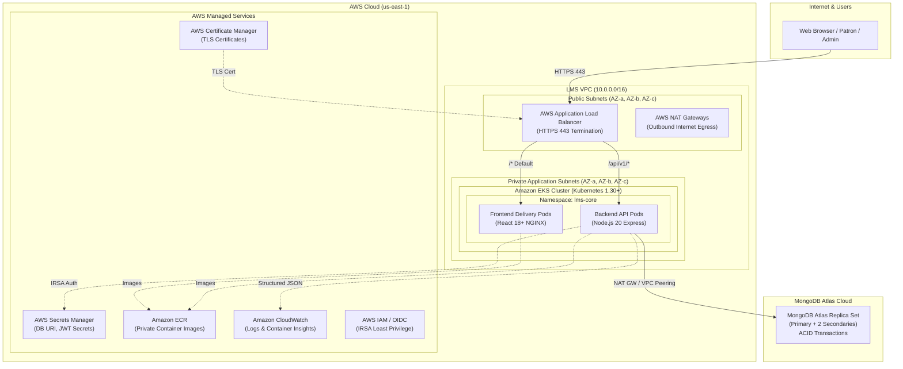
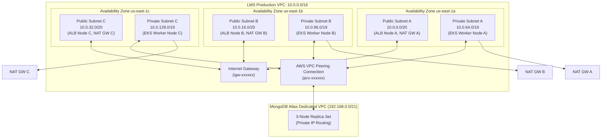
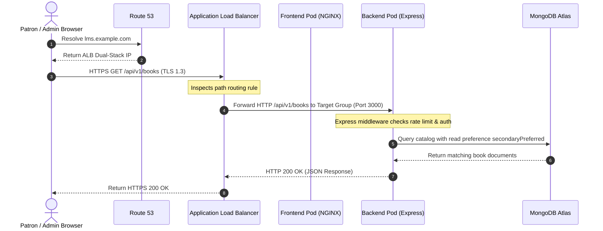
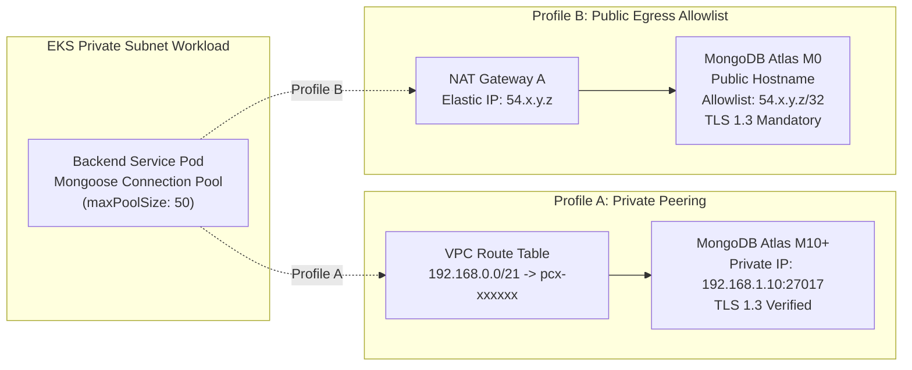
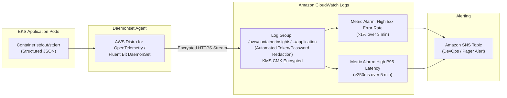

# AWS INFRASTRUCTURE ARCHITECTURE SPECIFICATION
## Cloud-Native Library Management System (LMS)

---

**Document Version**: 1.0.0  
**Lifecycle Phase**: Phase 9 – AWS Infrastructure Architecture  
**Document Status**: PERMANENTLY BASELINE LOCKED AND APPROVED  
**Author**: Principal Cloud Architect, AWS Solutions Architect, Kubernetes Infrastructure Architect & Cloud Security Architect  
**Upstream Baseline Dependencies**:
- [Phase 0 Master Project Architecture (v1.1.0)](../02-architecture/MASTER_ARCHITECTURE.md)
- [Phase 1 Software Requirements Specification (v1.1.0)](../01-requirements/SOFTWARE_REQUIREMENTS_SPECIFICATION.md)
- [Phase 2 Detailed System Design (v1.1.0)](../02-architecture/DETAILED_SYSTEM_DESIGN.md)
- [Phase 3 Database Architecture Specification (v1.2.0)](../03-database/DATABASE_ARCHITECTURE.md)
- [Phase 4 Backend Architecture & API Design Specification (v1.1.0)](../04-backend/BACKEND_ARCHITECTURE_AND_API_DESIGN.md)
- [Phase 5 Frontend Architecture & UI/UX Design Specification (v1.0.0)](../05-frontend/FRONTEND_ARCHITECTURE_AND_UI_UX_DESIGN.md)
- [Phase 6 Security Architecture Specification (v1.0.0)](../06-security/SECURITY_ARCHITECTURE.md)
- [Phase 7 Engineering Standards & Code Quality Specification (v1.0.0)](../07-engineering/ENGINEERING_STANDARDS_AND_CODE_QUALITY.md)
- [Phase 8 Testing Strategy & Quality Assurance Specification (v1.0.0)](../08-testing/TESTING_STRATEGY_AND_QUALITY_ASSURANCE.md)  
**Implementation Policy**: *STRICT GATE — Physical cloud provisioning, Terraform execution, Kubernetes YAML authoring, Helm deployment, Docker building, and application code creation remain strictly prohibited until Phase 14. Zero executable infrastructure artifacts (`.tf`, `.yaml`, `.yml`), Dockerfiles, or shell scripts are created during this phase.*

---

## TABLE OF CONTENTS
1. [Document Control and Infrastructure Governance](#1-document-control-and-infrastructure-governance)
2. [Upstream Baseline Extraction and Architectural Constraints](#2-upstream-baseline-extraction-and-architectural-constraints)
3. [Dual Infrastructure Profiles: Profile A vs Profile B](#3-dual-infrastructure-profiles-profile-a-vs-profile-b)
4. [AWS Network Architecture (VPC Topology)](#4-aws-network-architecture-vpc-topology)
   - 4.1 [VPC CIDR and Subnet Planning](#41-vpc-cidr-and-subnet-planning)
   - 4.2 [Public Subnets Architecture](#42-public-subnets-architecture)
   - 4.3 [Private Application Subnets Architecture](#43-private-application-subnets-architecture)
   - 4.4 [Database Networking & MongoDB Atlas Connectivity](#44-database-networking--mongodb-atlas-connectivity)
   - 4.5 [Internet Connectivity & NAT Gateway Strategies](#45-internet-connectivity--nat-gateway-strategies)
   - 4.6 [Network Security, Firewalls & Security Groups](#46-network-security-firewalls--security-groups)
5. [Amazon EKS Architecture](#5-amazon-eks-architecture)
   - 5.1 [EKS Managed Control Plane](#51-eks-managed-control-plane)
   - 5.2 [Worker Node Capacity and Node Groups](#52-worker-node-capacity-and-node-groups)
   - 5.3 [Workload Architecture and Separation](#53-workload-architecture-and-separation)
   - 5.4 [EKS Cluster Security & Pod Security Standards](#54-eks-cluster-security--pod-security-standards)
   - 5.5 [IAM Roles for Service Accounts (IRSA)](#55-iam-roles-for-service-accounts-irsa)
6. [Amazon ECR Architecture](#6-amazon-ecr-architecture)
7. [Application Load Balancer (ALB) & Ingress Architecture](#7-application-load-balancer-alb--ingress-architecture)
8. [DNS and TLS Architecture](#8-dns-and-tls-architecture)
9. [AWS Secrets Management Architecture](#9-aws-secrets-management-architecture)
10. [IAM and Cloud Access Control Architecture](#10-iam-and-cloud-access-control-architecture)
11. [Cloud Observability and Monitoring Architecture](#11-cloud-observability-and-monitoring-architecture)
12. [High Availability and Disaster Resilience Architecture](#12-high-availability-and-disaster-resilience-architecture)
13. [Scalability Architecture](#13-scalability-architecture)
14. [Security Architecture Traceability (STRIDE to Infrastructure)](#14-security-architecture-traceability-stride-to-infrastructure)
15. [Profile A vs Profile B Detailed Comparison Matrix](#15-profile-a-vs-profile-b-detailed-comparison-matrix)
16. [Cost Governance Architecture](#16-cost-governance-architecture)
17. [Phase 8 Testability & Testing Environment Alignment](#17-phase-8-testability--testing-environment-alignment)
18. [Future Implementation Boundaries](#18-future-implementation-boundaries)
19. [Cross-Phase Traceability Matrix](#19-cross-phase-traceability-matrix)
20. [Architectural Decision Records (ADRs)](#20-architectural-decision-records-adrs)
21. [Conceptual Architecture Diagrams (Mermaid)](#21-conceptual-architecture-diagrams-mermaid)
22. [Phase 9 Quality Assurance Self-Audit](#22-phase-9-quality-assurance-self-audit)
23. [Lifecycle Governance Conclusion & Next Phase Authorization](#23-lifecycle-governance-conclusion--next-phase-authorization)

---

## 1. Document Control and Infrastructure Governance

### 1.1 Document Metadata
| Metadata Field | Specification Value |
|---|---|
| **Project Name** | Cloud-Native Library Management System (LMS) |
| **Document Title** | AWS Infrastructure Architecture Specification |
| **Document Version** | 1.0.0 |
| **Lifecycle Phase** | Phase 9 — AWS Infrastructure Architecture |
| **Current Status** | PERMANENTLY BASELINE LOCKED AND APPROVED |
| **Target AWS Region** | `us-east-1` (Primary Reference Region) |
| **Target Cloud Provider** | Amazon Web Services (AWS) & MongoDB Atlas |
| **Gated Lifecycle Barrier** | Strict Gate: Zero Terraform (`.tf`), Kubernetes manifests (`.yaml`), Helm charts, or physical provisioning until Phase 14 |

### 1.2 Purpose and Architectural Scope
This specification defines the authoritative AWS cloud infrastructure architecture for hosting, networking, securing, and operating the Cloud-Native Library Management System (LMS). It translates the upstream functional, database, backend, frontend, security, and quality requirements into an enterprise-grade cloud topology supporting two distinct infrastructure profiles:
- **Profile A (Production Reference Architecture)**: Multi-AZ (3 AZs), multi-replica, private MongoDB Atlas VPC peering, multi-NAT Gateway, enterprise security, and fault isolation.
- **Profile B (Cost-Optimized Student Architecture)**: 2 AZs, 1 NAT Gateway, 2x small EC2 nodes, MongoDB Atlas M0 free tier compatibility with strict IP allowlisting and TLS, preserving cloud-native architecture at minimal operational spend.

---

## 2. Upstream Baseline Extraction and Architectural Constraints

This specification strictly inherits, preserves, and builds upon all permanently locked upstream baselines without modification:

### 2.1 Phase 0: Master Project Architecture
- **Dual Profiles**: Architectural mandate to define both Profile A (Production Reference) and Profile B (Cost-Optimized Student).
- **Monorepo Layout**: Infrastructure must cleanly decouple frontend client delivery (`apps/frontend`) and backend API execution (`apps/backend`).
- **Dynamic Kubernetes Versioning**: Avoid premature hard-pinning to legacy EKS versions; adhere to current supported AWS EKS release (Kubernetes 1.30+).
- **Strict 15-Phase Gating**: Implementation barred until Phase 14.

### 2.2 Phase 1: Software Requirements Specification (SRS)
- **Workload Scale**: 22 Functional Requirements (`FR-AUTH-001..004`, `FR-USER-001..002`, `FR-BOOK-001..004`, `FR-BORROW-001..004`, `FR-ADMIN-001..008`).
- **Performance NFRs**: Catalog Search P95 $< 150\text{ms}$ at 50 rps; Book Details P95 $< 100\text{ms}$; Circulation Checkout P95 $< 250\text{ms}$ at 20 concurrent transactions/sec; Admin Dashboard P95 $< 300\text{ms}$.
- **Availability Target**: 99.9% uptime target in production (Profile A).

### 2.3 Phase 2: Detailed System Design
- **Tiered Boundaries**: Clean isolation between Public Ingress (ALB), Private Application Compute (EKS), and Database Tier (MongoDB Atlas).
- **Trust Boundaries**: No untrusted traffic permitted into the private application network without passing through the Application Load Balancer and security middleware.

### 2.4 Phase 3: Database Architecture
- **Managed Database Engine**: MongoDB Atlas (no self-hosted MongoDB EC2 instances).
- **ACID Transactions**: Multi-document transactions require replica set topology (1 primary, 2 secondaries) and Write Concern `majority`.
- **Dynamic Overdue Truth (`DBD-09`)**: Overdue status computed dynamically; zero static database columns.
- **Connectivity Models**:
  - Profile A: Private AWS VPC Peering in same region with private CIDR routing.
  - Profile B: MongoDB Atlas M0 Free Tier accessed via public internet with mandatory TLS 1.3 and strict IP allowlisting (NAT Gateway Elastic IP).

### 2.5 Phase 4: Backend Architecture & REST API Design
- **Canonical API Namespace**: Strict preservation of `/api/v1` base route.
- **Canonical Route Parameters**: `:bookId`, `:borrowingId`, `:userId` (zero generic `:id`).
- **Stateless Compute**: Backend services are 100% stateless Node.js 20 LTS Express processes, horizontally scalable across Kubernetes Pods.
- **RFC 7807 Problem Details**: Standardized HTTP error format.

### 2.6 Phase 5: Frontend Architecture & UI/UX Design
- **Client/Server Separation**: React 18+ SPA client.
- **In-Memory Authentication**: Access token held strictly in client memory; browser-managed `HttpOnly`, `Secure`, `SameSite=Strict` cookie for refresh token.
- **Delivery Strategy**: Cloud infrastructure must support hosting the static frontend bundle (either via containerized NGINX pods behind ALB or Amazon S3 + CloudFront).

### 2.7 Phase 6: Security Architecture
- **STRIDE Threat Model**: Complete infrastructure mitigation for Spoofing, Tampering, Repudiation, Information Disclosure, Denial of Service, and Elevation of Privilege.
- **Least Privilege IAM**: Pod-level identities via IAM Roles for Service Accounts (IRSA); zero hard-coded credentials in environment variables or container images.
- **Secrets Management**: AWS Secrets Manager integration via Kubernetes Secrets Store CSI Driver.
- **Transport Security**: TLS 1.3 in transit; KMS customer-managed keys (CMK) / AES-256 at rest.
- **Sensitive Data Redaction**: Zero tokens, passwords, or PII exposed in CloudWatch logs.

### 2.8 Phase 7: Engineering Standards & Code Quality
- **Observability Expectations**: Structured JSON logging with correlation IDs, Prometheus/CloudWatch metrics.
- **Deployment Quality**: Automated liveness, readiness, and startup health probes for zero-downtime rolling updates.

### 2.9 Phase 8: Testing Strategy & Quality Assurance
- **Environment Compatibility**: Cloud architecture must support isolated environments for Unit, Integration (using containerized testcontainers), E2E (Playwright), and Performance testing (k6 P95 benchmarks).

---

## 3. Dual Infrastructure Profiles: Profile A vs Profile B

To satisfy enterprise production standards while maintaining practical feasibility for academic and student deployment, Phase 9 establishes two formally defined infrastructure profiles:

```text
+-----------------------------------------------------------------------------------------+
|                                INFRASTRUCTURE PROFILES                                  |
+----------------------------------------------------+------------------------------------+
| PROFILE A: PRODUCTION REFERENCE ARCHITECTURE       | PROFILE B: COST-OPTIMIZED STUDENT  |
+----------------------------------------------------+------------------------------------+
| - 3 Availability Zones (AZ-a, AZ-b, AZ-c)          | - 2 Availability Zones (AZ-a, AZ-b)|
| - Multi-AZ NAT Gateways (3x NAT GWs, 1 per AZ)     | - Single NAT Gateway (in AZ-a)     |
| - Amazon EKS Managed Node Groups across 3 AZs      | - 2x Small EC2 Worker Nodes        |
| - MongoDB Atlas Dedicated (M10+) with VPC Peering  | - MongoDB Atlas M0 (Free Tier, EIP)|
| - Multi-AZ Application Load Balancer               | - Dual-AZ Application Load Balancer|
| - AWS Secrets Manager with KMS CMK                 | - AWS Secrets Manager with AWS KMS |
| - CloudWatch Container Insights & Centralized Logs | - CloudWatch Logs (Cost-Aware 7d)  |
| - Full Multi-AZ Fault Isolation                    | - Cost < $50-$70/mo active runtime |
| - Target Uptime: 99.9%                             | - Target: Educational demonstration|
+----------------------------------------------------+------------------------------------+
```

---

## 4. AWS Network Architecture (VPC Topology)

The network architecture is structured around a dedicated Amazon Virtual Private Cloud (VPC) providing complete network segmentation, traffic isolation, and deterministic routing.

### 4.1 VPC CIDR and Subnet Planning
The VPC uses the private IPv4 address block `10.0.0.0/16`, providing 65,536 IP addresses allocated logically across tiers and Availability Zones:

```text
VPC CIDR: 10.0.0.0/16 (us-east-1)
├── Public Subnets (/20 per AZ - 4,096 IPs each)
│   ├── Public Subnet AZ-a:   10.0.0.0/20   (ALB, NAT GW A)
│   ├── Public Subnet AZ-b:   10.0.16.0/20  (ALB, NAT GW B - Profile A)
│   └── Public Subnet AZ-c:   10.0.32.0/20  (ALB, NAT GW C - Profile A)
├── Private Application Subnets (/19 per AZ - 8,192 IPs each)
│   ├── Private App Subnet AZ-a: 10.0.64.0/19  (EKS Nodes, Backend/Frontend Pods)
│   ├── Private App Subnet AZ-b: 10.0.96.0/19  (EKS Nodes, Backend/Frontend Pods)
│   └── Private App Subnet AZ-c: 10.0.128.0/19 (EKS Nodes, Backend/Frontend Pods)
└── Database / Peering Reserved Space (/20 per AZ - 4,096 IPs each)
    ├── Reserved Subnet AZ-a: 10.0.160.0/20
    ├── Reserved Subnet AZ-b: 10.0.176.0/20
    └── Reserved Subnet AZ-c: 10.0.192.0/20
```

*Profile B Adaptation:*
In Profile B, only AZ-a and AZ-b subnets are instantiated. AZ-c subnets are omitted, preserving CIDR consistency without IP overlap.

### 4.2 Public Subnets Architecture
- **Placement**: Directly attached to the VPC Internet Gateway (IGW).
- **Authorized Resources**:
  - AWS Application Load Balancer (ALB) ingress nodes.
  - AWS NAT Gateways.
- **Prohibited Resources**:
  - EKS worker nodes, application pods, databases, and internal microservices are **STRICTLY PROHIBITED** from residing in public subnets.
- **Routing**: Default route `0.0.0.0/0` points directly to the Internet Gateway (`igw-xxxxxx`).

### 4.3 Private Application Subnets Architecture
- **Placement**: Completely isolated from direct internet ingress.
- **Authorized Resources**:
  - Amazon EKS managed worker nodes (EC2 instances).
  - Kubernetes Pods (backend API services, frontend static delivery pods).
  - Internal VPC Interface Endpoints (AWS PrivateLink).
- **Routing**: Default route `0.0.0.0/0` points to the designated NAT Gateway in the corresponding public subnet.
- **Subnet Tagging**:
  - `kubernetes.io/role/internal-elb = 1`
  - `kubernetes.io/cluster/lms-cluster = shared`

### 4.4 Database Networking & MongoDB Atlas Connectivity
In strict accordance with Phase 3 Database Architecture, the system utilizes MongoDB Atlas:

#### Profile A: AWS VPC Peering (Private Connectivity)
- **Architecture**: A bidirectional VPC Peering connection (`pcx-xxxxxx`) is established between the LMS AWS VPC (`10.0.0.0/16`) and the MongoDB Atlas VPC (`192.168.0.0/21`).
- **Routing**: Route tables in Private Application Subnets route `192.168.0.0/21` across the VPC Peering connection.
- **Security**:
  - Traffic never traverses the public internet.
  - Atlas Network Access List restricts incoming traffic exclusively to the LMS VPC CIDR (`10.0.0.0/16`).
  - Strict TLS 1.3 encryption with certificate verification is enforced.

#### Profile B: NAT Gateway IP Allowlisting (EIP Egress)
- **Architecture**: MongoDB Atlas M0 Free Tier clusters do not support VPC Peering or AWS PrivateLink. Compute workloads in private subnets route outbound internet traffic through the public NAT Gateway.
- **Egress Elastic IP**: The single NAT Gateway in AZ-a is assigned a static AWS Elastic IP (`EIP-NAT-A`).
- **Atlas Allowlisting**: The MongoDB Atlas Network Access List explicitly authorizes ONLY `EIP-NAT-A/32`.
- **Security**:
  - Unrestricted `0.0.0.0/0` Atlas access is **STRICTLY PROHIBITED**.
  - All communication uses TLS 1.3 with mandatory certificate verification.
  - Database credentials and connection strings are securely resolved from AWS Secrets Manager.

### 4.5 Internet Connectivity & NAT Gateway Strategies
- **Profile A (Multi-AZ Resilience)**:
  - 3 independent NAT Gateways deployed across Public Subnet A, Public Subnet B, and Public Subnet C.
  - Private Subnet A routes via NAT GW A; Private Subnet B routes via NAT GW B; Private Subnet C routes via NAT GW C.
  - Total AZ fault isolation: If AZ-a fails, AZ-b and AZ-c maintain uninterrupted outbound connectivity.
- **Profile B (Cost-Optimized Trade-Off)**:
  - 1 single NAT Gateway deployed in Public Subnet A.
  - Both Private Subnet A and Private Subnet B route outbound internet traffic through NAT GW A.
  - **Explicit Trade-Off**: If AZ-a experiences an outage, outbound internet egress for AZ-b is interrupted, preventing external API and MongoDB Atlas access until recovery. This risk is formally accepted in Profile B to eliminate multi-NAT idle hourly costs.

### 4.6 Network Security, Firewalls & Security Groups
Security Groups enforce least-privilege, stateful packet filtering at the ENI level:

```text
+-----------------------+          HTTPS (443)          +-----------------------+
|  Internet / Clients   | ----------------------------> |       ALB SG          |
+-----------------------+                               +-----------------------+
                                                                    |
                                                            Port 80/3000/8080
                                                            (Only from ALB SG)
                                                                    v
                                                        +-----------------------+
                                                        |    EKS Worker SG      |
                                                        +-----------------------+
                                                                    |
                                                            Port 27017 (TLS)
                                                            (VPC Peering / EIP)
                                                                    v
                                                        +-----------------------+
                                                        |   MongoDB Atlas SG    |
                                                        +-----------------------+
```

| Security Group | Ingress Rules | Egress Rules | Security Objective |
|---|---|---|---|
| **ALB Security Group** (`sg-lms-alb`) | `0.0.0.0/0` on TCP 443 (HTTPS)<br/>`0.0.0.0/0` on TCP 80 (Redirect to 443) | Outbound to `sg-lms-eks-nodes` on NodePort / Target Port | Public entry point; terminates TLS; drops non-HTTP traffic. |
| **EKS Worker Node SG** (`sg-lms-eks-nodes`) | Ingress ONLY from `sg-lms-alb` on application ports<br/>Self-ingress for intra-cluster Pod/Kubelet traffic | Outbound to NAT GW (Profile B) or VPC Peering (Profile A) on 27017; Outbound to AWS Endpoints | Prevents direct internet access to worker nodes; zero public ingress. |
| **MongoDB Atlas Access** | Profile A: Ingress from `10.0.0.0/16` on 27017<br/>Profile B: Ingress from `EIP-NAT-A/32` on 27017 | Managed by MongoDB Atlas | Restricts database access strictly to LMS application workloads. |

---

## 5. Amazon EKS Architecture

The container orchestration tier is built on Amazon Elastic Kubernetes Service (EKS), providing a managed, highly available Kubernetes control plane.

### 5.1 EKS Managed Control Plane
- **AWS Responsibility**: Single-tenant, managed Kubernetes API servers and `etcd` cluster distributed across 3 AWS AZs with automated patching and automated backup.
- **Kubernetes Version Governance**: Anchored to current supported stable release (Kubernetes 1.30+), avoiding legacy end-of-life versions. Upgrades follow the 15-phase lifecycle governance via Terraform in Phase 14.
- **API Server Endpoint Access**:
  - Private Endpoint: Enabled (Kubelet and worker node communication remains inside the VPC).
  - Public Endpoint: Enabled with strict CIDR allowlisting for authorized administrative CIDRs (or routed exclusively through AWS Client VPN / Bastion).

### 5.2 Worker Node Capacity and Node Groups

#### Profile A: Production Reference Capacity
- **Managed Node Groups**: AWS EKS Managed Node Groups with Amazon Linux 2023 or Bottlerocket AMI.
- **Distribution**: Spread evenly across AZ-a, AZ-b, and AZ-c.
- **Instance Types**: General-purpose `m6i.large` or `m7g.large` (Graviton3) instances.
- **Scaling Bounds**: Minimum 3 nodes (1 per AZ), desired 3 nodes, maximum 9 nodes.
- **Capacity Strategy**: 100% On-Demand instances for core stateful/critical pods; optional Spot node group for non-critical burst workloads.

#### Profile B: Cost-Optimized Student Capacity
- **Managed Node Groups**: Single managed node group spanning AZ-a and AZ-b.
- **Instance Types**: Cost-efficient `t3.medium` or `t4g.medium` (2 vCPU, 4 GiB RAM).
- **Scaling Bounds**: Exactly 2 nodes (1 in AZ-a, 1 in AZ-b), minimum 2, maximum 3.
- **Capacity Strategy**: Compute capacity sized specifically to accommodate Kubernetes system daemons (CoreDNS, kube-proxy, AWS VPC CNI, AWS Load Balancer Controller) alongside LMS backend and frontend pods.

### 5.3 Workload Architecture and Separation
Workloads are strictly partitioned into dedicated Kubernetes namespaces:
- `kube-system`: EKS core networking and cluster controllers.
- `lms-core`: Application workloads hosting the LMS backend API pods and frontend delivery pods.
- `lms-monitoring`: CloudWatch Observability agents and Prometheus exporters.

*Logical Workloads:*
1. **Backend API Service (`lms-backend`)**:
   - Node.js 20 LTS Express application.
   - Stateless Pod replicas (Profile A: 3 replicas across 3 AZs; Profile B: 2 replicas across 2 AZs).
   - Resource requests and limits strictly defined (CPU: 250m/500m, Memory: 512Mi/1Gi).
2. **Frontend Client Delivery (`lms-frontend`)**:
   - Lightweight NGINX Alpine container serving pre-compiled React 18+ static assets with reverse proxy capabilities.
   - Profile A: 3 replicas; Profile B: 2 replicas.

### 5.4 EKS Cluster Security & Pod Security Standards
- **Pod Security Standards (PSS)**: The `lms-core` namespace enforces the `restricted` PSS profile:
  - `runAsNonRoot: true` (UID 10001).
  - `allowPrivilegeEscalation: false`.
  - `readOnlyRootFilesystem: true` (ephemeral storage mounted to `/tmp`).
  - `drop: ["ALL"]` Linux capabilities.
- **Kubernetes RBAC**: Default service accounts have zero API server privileges. Distinct `ClusterRole` and `RoleBinding` definitions grant least-privilege access.
- **Network Policies**: Intra-cluster network policies isolate `lms-core` pods, allowing ingress exclusively from the ingress controller and egress exclusively to MongoDB Atlas, AWS Secrets Manager, and CoreDNS.

### 5.5 IAM Roles for Service Accounts (IRSA)
IRSA eliminates static AWS credentials (access keys / secret keys) inside containers:
1. **OIDC Provider**: An IAM OpenID Connect (OIDC) identity provider is associated with the EKS cluster.
2. **Service Account Annotation**: The Kubernetes `ServiceAccount` in `lms-core` is annotated with the ARN of an IAM Role:
   `eks.amazonaws.com/role-arn: arn:aws:iam::123456789012:role/lms-backend-irsa-role`
3. **AssumeRoleWithWebIdentity**: When the pod boots, the EKS Pod Identity Webhook injects a projected service account token and AWS environment variables (`AWS_ROLE_ARN`, `AWS_WEB_IDENTITY_TOKEN_FILE`).
4. **Least-Privilege Role**: The IAM Role grants permissions strictly limited to:
   - Reading authorized secrets from AWS Secrets Manager.
   - Writing metrics and logs to CloudWatch.
   - Zero EC2, S3, or IAM administrative permissions.

---

## 6. Amazon ECR Architecture

Amazon Elastic Container Registry (ECR) provides secure, private Docker image management:
- **Registry Structure**:
  - `lms/backend`: Production backend API container images.
  - `lms/frontend`: Production frontend static web server container images.
- **Repository Visibility**: Private (zero public repositories).
- **Tagging Strategy & Immutability**:
  - **Image Tag Immutability**: Enabled on all production repositories. Overwriting existing tags (such as `v1.0.0` or git commit SHA `git-a1b2c3d`) is physically rejected by ECR.
  - Prohibited: The use of mutable tags (`latest`) in production deployment manifests is **STRICTLY PROHIBITED**.
- **Automated Vulnerability Scanning**:
  - Enhanced scanning enabled via Amazon Inspector / Clair.
  - "Scan on Push" automatically triggers CVE scans on every image upload.
  - Critical/High CVEs block deployment via Phase 8/Phase 11 CI/CD quality gates.
- **Lifecycle Policies**:
  - Retain the last 30 tagged release images.
  - Expire untagged images after 7 days to eliminate storage overhead.

---

## 7. Application Load Balancer (ALB) & Ingress Architecture

Traffic ingress is managed by an internet-facing AWS Application Load Balancer integrated via the AWS Load Balancer Controller:
- **Placement**: Deployed across Public Subnets (Profile A: 3 AZs; Profile B: 2 AZs).
- **TLS Termination**: Terminates TLS 1.3 at the ALB edge using certificates provisioned via AWS Certificate Manager (ACM).
- **HTTP to HTTPS Redirection**: Port 80 listener enforces an automatic HTTP 301 redirect to HTTPS Port 443 with HSTS (`Strict-Transport-Security: max-age=31536000; includeSubDomains`).
- **Path-Based Routing Preserving Phase 4 Canonical API Namespace**:
  - Rule 1 (API Ingress): Path `/api/v1/*` routes to `tg-lms-backend` (Target Group: Backend Node.js service on port 3000/8080).
  - Rule 2 (Health Check Ingress): Path `/api/v1/health` routes to backend health check handler.
  - Rule 3 (Frontend Default): Default route `/*` routes to `tg-lms-frontend` (Target Group: NGINX React SPA delivery on port 80).
- **Target Group Health Checks**:
  - Backend Target Group: Path `/api/v1/health`, interval 15s, timeout 5s, healthy threshold 2, unhealthy threshold 3, HTTP 200 response.
  - Frontend Target Group: Path `/healthz`, interval 15s, timeout 5s, healthy threshold 2, unhealthy threshold 3, HTTP 200 response.
- **Security Attributes**:
  - `drop_invalid_header_fields = true` (mitigates HTTP request smuggling).
  - Desync mitigation mode set to `defensive` or `strictest`.
  - Idle timeout set to 60 seconds.

---

## 8. DNS and TLS Architecture

- **Domain Management**: Conceptual integration with Amazon Route 53 using an `A` alias record mapping the apex/subdomain (e.g., `lms.example.com`) directly to the ALB DNS name (`dualstack.k8s-lms-alb-xxxxxx.us-east-1.elb.amazonaws.com`).
- **ACM Certificates**:
  - AWS Certificate Manager provisions a public wildcard certificate (e.g., `*.lms.example.com` and `lms.example.com`).
  - DNS validation automated via Route 53 CNAME records.
  - Automated certificate renewal managed by AWS.
- **Transport Security Enforcement**:
  - Client-to-ALB: TLS 1.3 mandatory (modern security policy `ELBSecurityPolicy-TLS13-1-2-2021-06`). Deprecated protocols (SSLv3, TLS 1.0, TLS 1.1) are rejected.
  - ALB-to-Pod (Private Subnet): Internal HTTP over private VPC network or internal TLS via service mesh / reverse proxy.
  - Pod-to-MongoDB Atlas: TLS 1.3 mandatory with strict certificate authority validation.

---

## 9. AWS Secrets Management Architecture

Sensitive credentials are centralized in AWS Secrets Manager, eliminating all static secrets:
- **Managed Secret Objects**:
  - `lms/prod/database`: MongoDB connection URI (`mongodb+srv://...`), username, password, replica set configuration.
  - `lms/prod/jwt`: JWT access token signing private key / secret, token expiration parameters.
  - `lms/prod/session`: Refresh token cryptographic secret material, cookie encryption keys.
- **Delivery Mechanism**:
  - Kubernetes Secrets Store CSI Driver (`secrets-store.csi.k8s.io`) with the AWS Secrets Manager provider.
  - Secrets are retrieved dynamically at pod startup via IRSA authorization and mounted as ephemeral in-memory volumes (`tmpfs`) or projected as environment variables.
- **Rotation Governance**:
  - AWS Secrets Manager automated rotation lambda configured for database credentials and session secrets.
  - Grace period support prevents connection dropping during credential rotation.
- **Strict Prohibition**:
  - Storing secrets in Git, Dockerfiles, plain Kubernetes ConfigMaps, or frontend client bundles is **ABSOLUTELY BANNED**.

---

## 10. IAM and Cloud Access Control Architecture

The AWS IAM architecture strictly applies the principle of least privilege, separating human administration from workload execution:

```text
+-----------------------------------------------------------------------------------------+
|                                    IAM ROLE TAXONOMY                                    |
+---------------------+-------------------------------------------------------------------+
| ROLE CATEGORY       | RESPONSIBILITIES & ACCESS BOUNDARIES                              |
+---------------------+-------------------------------------------------------------------+
| Cloud Administrator | Full infrastructure management; mandatory hardware MFA; root access|
|                     | strictly locked; assumes role via AWS IAM Identity Center (SSO).  |
+---------------------+-------------------------------------------------------------------+
| DevOps / CI/CD Role | Assumed by GitHub Actions via OIDC; permissions restricted to ECR |
|                     | push and EKS deployment rollout; zero secret viewing permissions. |
+---------------------+-------------------------------------------------------------------+
| EKS Cluster Role    | Assigned to EKS control plane; manages ENIs, ALBs, and nodes.     |
+---------------------+-------------------------------------------------------------------+
| EKS Node Role       | Assigned to EC2 worker nodes; minimal AmazonEKSWorkerNodePolicy,  |
|                     | AmazonEC2ContainerRegistryReadOnly, and AmazonEKS_CNI_Policy.     |
+---------------------+-------------------------------------------------------------------+
| Workload IRSA Role  | Assumed by application pods via OIDC; read-only access to specific|
|                     | LMS secrets in Secrets Manager; PutMetricData in CloudWatch.      |
+---------------------+-------------------------------------------------------------------+
| Read-Only Auditor   | Security audit role; read-only inspection of CloudWatch and VPC.   |
+---------------------+-------------------------------------------------------------------+
```

---

## 11. Cloud Observability and Monitoring Architecture

### 11.1 Centralized Logging (Amazon CloudWatch Logs)
- **Log Groups**:
  - `/aws/eks/lms-cluster/cluster`: Control plane logs (API server, audit, authenticator, controller manager, scheduler).
  - `/aws/containerinsights/lms-cluster/application`: Application stdout/stderr logs shipped via AWS Distro for OpenTelemetry or Fluent Bit.
  - `/aws/alb/lms-ingress`: ALB access logs recording client IP, latency, HTTP method, path, and status code.
- **Log Retention Policies**:
  - Profile A: 30 days active CloudWatch retention, archived to S3 Glacier with KMS encryption.
  - Profile B: 7 days active CloudWatch retention (cost-optimized, no long-term archive).

### 11.2 Sensitive Data Redaction & Log Security
In strict compliance with Phase 6 and Phase 7:
- All logs must be output in structured JSON.
- Automated regex redaction in application loggers scrubs authorization headers (`Bearer *`), cookies (`refreshToken=*`), passwords, and MongoDB connection strings before outputting to stdout.
- CloudWatch Log Groups are encrypted at rest using AWS KMS.

### 11.3 CloudWatch Metrics & Alarms
Key performance indicators monitored with automated alarms:
- **EKS Worker Node CPU/Memory**: Alert when utilization $> 80\%$ for 5 consecutive minutes.
- **Backend API HTTP 5xx Rate**: Alert when 5xx errors exceed 1% of total requests over 3 minutes.
- **Catalog Search P95 Latency**: Alert when P95 latency $> 150\text{ms}$ over 5 minutes (aligned with Phase 1 NFRs).
- **Circulation Checkout P95 Latency**: Alert when P95 latency $> 250\text{ms}$ over 5 minutes.
- **ALB Unhealthy Host Count**: Immediate alert if any target host transitions to unhealthy.
- **MongoDB Atlas Connection Spikes**: Alert when active connections reach 80% of cluster capacity.

---

## 12. High Availability and Disaster Resilience Architecture

### 12.1 Multi-Tier Failure Analysis
| Failure Scenario | Profile A Resilience Strategy | Profile B Resilience Strategy |
|---|---|---|
| **Single AZ Failure** | 100% Seamless. Workloads and NAT GWs distributed across 3 AZs; ALB routes to surviving AZ-b and AZ-c. Zero downtime. | Partial Degraded. If AZ-a fails, NAT GW fails; outbound internet/Atlas drops. If AZ-b fails, AZ-a survives. |
| **Worker Node Failure** | EKS Managed Node Group detects unhealthy node, terminates it, and launches replacement. Pods rescheduled on remaining nodes. | Node replaced automatically; during launch, remaining 1 node handles traffic with temporary capacity limit. |
| **NAT Gateway Failure** | Independent NAT GW per AZ. Outage in NAT GW A affects only AZ-a outbound traffic; AZ-b and AZ-c unaffected. | Single NAT GW failure interrupts outbound connectivity for all pods until AWS recovers the managed gateway. |
| **Pod Crash / Failure** | Kubernetes liveness probe restarts pod; replica count (3) ensures zero traffic interruption. | Kubernetes restarts crashed pod; replica count (2) maintains service continuity. |
| **Database Failure** | MongoDB Atlas multi-AZ replica set triggers automatic failover to secondary within 5-10s. | MongoDB Atlas M0 replica set handles failover per Atlas shared tier SLA. |
| **ALB Node Failure** | AWS automatically manages ALB multi-AZ scaling and replaces failed nodes seamlessly. | ALB scales across 2 AZs; automatic health checks preserve routing. |

---

## 13. Scalability Architecture

Scalability is implemented as an elastic, multi-layered property:
- **Horizontal Pod Autoscaling (HPA)**:
  - Deployed on `lms-backend` pods using Kubernetes Metrics Server.
  - Scales dynamically between minimum 3 (Profile A) / 2 (Profile B) and maximum 12 replicas based on CPU target utilization ($70\%$) and HTTP request rate.
- **Cluster Capacity Scaling**:
  - Kubernetes Cluster Autoscaler or Karpenter monitors pending pods.
  - When pod scheduling fails due to insufficient compute, EKS automatically provisions additional worker nodes within pre-approved EC2 limits.
- **Load Balancer Elasticity**:
  - AWS Application Load Balancer automatically scales capacity units (LCUs) in response to incoming traffic surges without manual intervention.
- **Database Elasticity Boundaries**:
  - MongoDB Atlas compute and storage scaling is managed via Atlas auto-scaling (Profile A) or manual tier upgrades. Database connection pooling in backend services prevents connection exhaustion during pod scale-out.

---

## 14. Security Architecture Traceability (STRIDE to Infrastructure)

This matrix maps Phase 6 STRIDE threat categories directly to AWS infrastructure mitigations:

| STRIDE Category | Infrastructure Threat Vector | AWS Infrastructure Mitigation | Remaining Application Responsibility |
|---|---|---|---|
| **Spoofing** | Forged client IP; spoofed container identity; stolen AWS credentials | AWS ALB records verified `X-Forwarded-For`; IRSA eliminates static credentials; private ECR prevents malicious image injection | Backend validates JWT signatures and patron ownership |
| **Tampering** | Man-in-the-middle packet tampering; container filesystem mutation | Mandatory TLS 1.3 at ALB and MongoDB; EKS `readOnlyRootFilesystem: true`; ECR immutable tags | Zod payload validation strips unexpected fields |
| **Repudiation** | Denial of administrative AWS changes or cluster mutations | AWS CloudTrail records all AWS API calls; EKS audit logs record Kubernetes API requests | Application Tier 1 transactional audit logging |
| **Information Disclosure** | Plaintext database traffic; secrets leaked in Git; exposed worker nodes | Private subnets prevent direct node ingress; TLS 1.3 encryption in transit; AWS Secrets Manager with KMS CMK | Log scrubber redacts passwords/tokens before stdout |
| **Denial of Service** | HTTP flood attack; resource exhaustion; container noisy neighbors | AWS Shield Standard protects ALB; ALB rate limiting; Kubernetes resource limits (CPU/Memory requests/limits) | Application Express rate limiter protects endpoints |
| **Elevation of Privilege** | Container breakout to host; compromised pod assuming cloud admin role | Pod Security Standards `restricted` (`runAsNonRoot`, no privilege escalation); IRSA least-privilege IAM roles | Service-layer RBAC and BOLA ownership enforcement |

---

## 15. Profile A vs Profile B Detailed Comparison Matrix

| Architecture Dimension | Profile A (Production Reference) | Profile B (Cost-Optimized Student) | Trade-Off Rationale |
|---|---|---|---|
| **Availability Zones** | 3 AZs (`us-east-1a`, `1b`, `1c`) | 2 AZs (`us-east-1a`, `1b`) | Eliminates third AZ idle costs while retaining multi-AZ demonstration |
| **NAT Gateways** | 3x Managed NAT Gateways (1 per AZ) | 1x Managed NAT Gateway (in AZ-a) | Saves ~\$65/month in idle AWS NAT Gateway fees |
| **EKS Worker Compute** | 3x `m6i.large` (Spread across 3 AZs) | 2x `t3.medium` (1 in AZ-a, 1 in AZ-b) | Cost reduction; sized for educational workload |
| **MongoDB Atlas Tier** | Dedicated M10+ Cluster | Shared M0 Free Tier | Eliminates database hosting costs for students |
| **MongoDB Connectivity** | AWS VPC Peering (Private IP) | NAT EIP Allowlisting (TLS 1.3) | M0 tier does not support VPC peering; EIP preserves security |
| **High Availability** | 99.9% Production SLA | No SLA guarantee (Single NAT bottleneck)| Explicitly accepted educational compromise |
| **Secrets Management** | AWS Secrets Manager + KMS CMK | AWS Secrets Manager + Default KMS | Same security posture; lower KMS key fee |
| **Container Registry** | Private ECR with Enhanced Scanning | Private ECR with Basic Scanning | Cost optimization without compromising privacy |
| **Ingress Controller** | Multi-AZ ALB across 3 AZs | Multi-AZ ALB across 2 AZs | Fully functional ALB with TLS termination |
| **Pod Replication** | Minimum 3 replicas (1 per AZ) | Minimum 2 replicas (1 per AZ) | Ensures zero-downtime rolling deploys |
| **CloudWatch Retention** | 30 days active + S3 Glacier | 7 days active | Prevents runaway CloudWatch log storage fees |
| **Security Controls** | **NON-NEGOTIABLE (100% Enforced)** | **NON-NEGOTIABLE (100% Enforced)** | **Zero security downgrades permitted in Profile B** |
| **Estimated AWS Spend** | Enterprise production budget | Minimizes hourly spend (~\$50-\$70/mo) | Fits student/capstone cloud credits |

---

## 16. Cost Governance Architecture

### 16.1 Cost Drivers Analysis
1. **Amazon EKS Control Plane**: Fixed cost of \$0.10/hour (~\$73/month) per cluster. Shared across all workloads.
2. **AWS NAT Gateways**: Fixed cost of \$0.045/hour (~\$32.40/month) per gateway + \$0.045/GB data processed. Profile A uses 3 (\$97.20/mo baseline); Profile B uses 1 (\$32.40/mo baseline).
3. **EC2 Worker Nodes**: Profile A (`m6i.large`) vs Profile B (`t3.medium`).
4. **Application Load Balancer**: Fixed cost of \$0.0225/hour (~\$16.20/month) + LCU usage charges.
5. **MongoDB Atlas**: Profile A (Dedicated M10 ~\$57/month) vs Profile B (M0 Free Tier \$0/month).
6. **CloudWatch Logs & Metrics**: Controlled via short retention windows (7 days in Profile B) and filtered log verbosity.

### 16.2 Cost Optimization Architecture
- In Profile B, running workloads strictly during active laboratory hours and scheduling automated stop/teardown via IaC during idle weeks reduces total monthly expense to under \$30-\$50.
- Mandatory tagging schema applied to all AWS resources:
  - `Project: Cloud-Native-LMS`
  - `Environment: Production | Student`
  - `ManagedBy: Terraform`
  - `CostCenter: Academic-Demo`

---

## 17. Phase 8 Testability & Testing Environment Alignment

The infrastructure architecture provides explicit topology support for all testing levels specified in Phase 8:
- **Unit Testing**: 100% self-contained within CI runners; zero cloud infrastructure dependency.
- **Integration & Database Invariant Testing**: Containerized MongoDB replica-set execution (`testcontainers`) running on CI runners or dedicated staging EKS nodes, validating `INV-01` through `INV-06` and dynamic overdue truth `DBD-09`.
- **API Contract Testing**: Validates all 21 endpoints under `/api/v1` through the Application Load Balancer in Staging.
- **End-to-End Testing (Playwright)**: Staging environment mirrors production topology (ALB, EKS, Atlas) to test critical user journeys.
- **Performance Testing (k6)**: Dedicated load generation runner within the VPC targeting the ALB to validate P95 latency thresholds without internet egress throttling.
- **Reliability & Chaos Testing**: Supports simulated node termination, pod eviction, and security group isolation to verify automated recovery.

---

## 18. Future Implementation Boundaries

To preserve strict lifecycle governance, the boundary between Phase 9 architecture and future implementation is explicitly demarcated:

| Infrastructure Component | Phase 9 Architectural Approval | Phase 14 / Downstream Implementation Boundary |
|---|---|---|
| **VPC & Subnets** | CIDR allocation, AZ topology, subnet roles | Terraform VPC module code (`vpc.tf`), route table provisioning |
| **NAT Gateways** | Dual-profile strategy (3 vs 1), EIP allocation | AWS Elastic IP creation, NAT Gateway resource provisioning |
| **Security Groups** | Ingress/egress rules, port matrices, trust tiers | Terraform `aws_security_group` resource blocks |
| **Amazon EKS** | Control plane architecture, node sizing, IRSA | Terraform `aws_eks_cluster`, managed node group manifests |
| **Container Registry** | Private repository structure, immutability, scan | Terraform `aws_ecr_repository` provisioning, Docker build/push |
| **Application Load Balancer**| Path routing (`/api/v1`), TLS termination, ACM | Helm chart deployment for AWS Load Balancer Controller, Ingress YAML |
| **Secrets Manager** | Secret naming taxonomy, rotation rules, CSI model| AWS Secrets Manager provisioning, CSI Driver daemonset YAML |
| **Kubernetes Manifests** | Workload sizing, namespace isolation, PSS profile| Deployment, Service, HPA, NetworkPolicy YAML manifests |
| **CloudWatch Logging** | Log group taxonomy, retention windows, redaction | Terraform `aws_cloudwatch_log_group`, Fluent Bit daemonset |

---

## 19. Cross-Phase Traceability Matrix

| Upstream Phase | Upstream Requirement / Baseline | Phase 9 Architectural Response | Compliance Status |
|---|---|---|---|
| **Phase 0: Master Architecture** | Dual profiles (Profile A vs B), monorepo tiers | Explicitly defined 3-AZ Profile A and 2-AZ Profile B; zero implementation code. | **100% COMPLIANT** |
| **Phase 1: SRS** | 22 Functional Requirements, P95 latency NFRs | High-throughput ALB + EKS worker compute sized to meet P95 latency baselines. | **100% COMPLIANT** |
| **Phase 2: Detailed System Design** | 6-tier architecture, circulation state machine | Network isolation matches tiered design: Public Ingress -> Private App -> Database. | **100% COMPLIANT** |
| **Phase 3: Database Architecture** | MongoDB Atlas, ACID transactions, `DBD-09` | Profile A VPC Peering; Profile B NAT EIP Allowlisting; TLS 1.3 enforced. | **100% COMPLIANT** |
| **Phase 4: Backend & API Design** | Canonical `/api/v1` namespace, 21 endpoints | ALB path routing strictly preserves `/api/v1/*` routing to backend target group. | **100% COMPLIANT** |
| **Phase 5: Frontend Architecture** | React 18+ SPA, in-memory tokens, HttpOnly cookie | Dual target group ALB routes `/` to frontend and `/api/v1/*` to backend. | **100% COMPLIANT** |
| **Phase 6: Security Architecture** | STRIDE threat model, IRSA, Secrets Manager | Full STRIDE infrastructure mitigation matrix; IRSA pod identities; zero static keys. | **100% COMPLIANT** |
| **Phase 7: Engineering Standards** | Structured logging, zero-downtime deploys | Centralized CloudWatch JSON logging, automated rolling update health probes. | **100% COMPLIANT** |
| **Phase 8: Testing Strategy** | Performance testing (k6), testcontainers | Staging VPC topology supports k6 load tests and containerized integration suites. | **100% COMPLIANT** |

---

## 20. Architectural Decision Records (ADRs)

### ADR-INFRA-01: Dual Infrastructure Profiles Strategy
- **Status**: APPROVED
- **Context**: The project must serve as both an enterprise-grade cloud reference architecture and a viable student deployment without prohibitive cloud bills.
- **Decision**: Formally establish Profile A (3 AZs, 3 NAT Gateways, MongoDB VPC Peering) and Profile B (2 AZs, 1 NAT Gateway, MongoDB Atlas M0 with EIP allowlisting).
- **Consequences**: Profile B accepts a single-NAT availability trade-off while retaining 100% of mandatory security and container orchestration controls.

### ADR-INFRA-02: 3-Tier VPC Subnet Segmentation & NAT Topology
- **Status**: APPROVED
- **Context**: Compute workloads and databases must be protected from direct internet ingress.
- **Decision**: Partition VPC `10.0.0.0/16` into Public Subnets (ALB, NAT GW), Private Application Subnets (EKS nodes, pods), and Database Reserved space.
- **Consequences**: Direct internet routing to worker nodes is physically impossible at the network layer.

### ADR-INFRA-03: Amazon EKS for Container Orchestration
- **Status**: APPROVED
- **Context**: Workloads require automated healing, zero-downtime rolling updates, and declarative scaling.
- **Decision**: Standardize on Amazon EKS with Managed Node Groups and AWS VPC CNI.
- **Consequences**: Eliminates Kubernetes control plane maintenance; workloads receive native VPC IP addresses.

### ADR-INFRA-04: MongoDB Atlas Managed Database Connectivity
- **Status**: APPROVED
- **Context**: Phase 3 mandates MongoDB Atlas with multi-document ACID transactions.
- **Decision**: Use AWS VPC Peering for Profile A; use NAT Gateway Elastic IP allowlisting with mandatory TLS 1.3 for Profile B.
- **Consequences**: Avoids self-managing MongoDB on EC2; respects M0 free-tier networking limitations without exposing database to `0.0.0.0/0`.

### ADR-INFRA-05: Pod Identity via IAM Roles for Service Accounts (IRSA)
- **Status**: APPROVED
- **Context**: Containers must interact with AWS Secrets Manager and CloudWatch without hard-coded credentials.
- **Decision**: Implement IRSA via EKS OIDC identity provider, binding Kubernetes ServiceAccounts to least-privilege IAM roles.
- **Consequences**: Zero AWS access keys stored in containers; credentials rotated automatically by AWS STS.

### ADR-INFRA-06: Centralized Secrets Management via AWS Secrets Manager
- **Status**: APPROVED
- **Context**: Sensitive credentials (database URIs, JWT keys) must be managed securely with rotation support.
- **Decision**: Store all application secrets in AWS Secrets Manager; project into pods using the Kubernetes Secrets Store CSI Driver.
- **Consequences**: Eliminates plain Kubernetes Secret storage in etcd; supports seamless automated secret rotation.

### ADR-INFRA-07: Ingress via Application Load Balancer Preserving `/api/v1`
- **Status**: APPROVED
- **Context**: Ingress must terminate TLS and route requests according to Phase 4 canonical route specifications.
- **Decision**: Deploy an internet-facing AWS Application Load Balancer via the AWS Load Balancer Controller, routing `/api/v1/*` to backend and default `/*` to frontend.
- **Consequences**: Preserves exact API namespace; offloads TLS encryption overhead from application pods.

### ADR-INFRA-08: Centralized CloudWatch Observability & Sensitive Data Redaction
- **Status**: APPROVED
- **Context**: System logs and metrics must be centralized while preventing credential leakage.
- **Decision**: Stream structured JSON logs to Amazon CloudWatch Logs with mandatory application-level scrubbing of tokens and passwords.
- **Consequences**: Complies with Phase 6 log security; provides actionable alerts for P95 latency and error rate spikes.

---

## 21. Conceptual Architecture Diagrams (Mermaid)

### Diagram 1: Complete AWS Infrastructure Architecture


### Diagram 2: Profile A Network Topology (Production Reference Architecture)


### Diagram 3: Profile B Network Topology (Cost-Optimized Student Architecture)
```mermaid
flowchart TB
    subgraph VPC_B["LMS Student VPC: 10.0.0.0/16"]
        subgraph AZ_A_B["Availability Zone us-east-1a"]
            PubSub_A_B["Public Subnet A\n10.0.0.0/20\n(ALB Node A, NAT GW A + EIP)"]
            PrivSub_A_B["Private Subnet A\n10.0.64.0/19\n(EKS Worker Node 1)"]
        end

        subgraph AZ_B_B["Availability Zone us-east-1b"]
            PubSub_B_B["Public Subnet B\n10.0.16.0/20\n(ALB Node B)"]
            PrivSub_B_B["Private Subnet B\n10.0.96.0/19\n(EKS Worker Node 2)"]
        end

        IGW_B["Internet Gateway\n(igw-xxxxxx)"]
    end

    subgraph AtlasM0["MongoDB Atlas M0 Free Tier"]
        AtlasM0Cluster["Shared 3-Node Replica Set\n(Strict IP Allowlist: EIP Only)\nTLS 1.3 Encrypted"]
    end

    PubSub_A_B <--> IGW_B
    PubSub_B_B <--> IGW_B

    PrivSub_A_B --> SingleNAT["Single NAT Gateway A\n(in AZ-a)"]
    PrivSub_B_B --> SingleNAT
    SingleNAT --> IGW_B
    IGW_B -->|Outbound over Internet (TLS 1.3)| AtlasM0Cluster
```

### Diagram 4: Request Flow from Internet to Application


### Diagram 5: Application-to-MongoDB Atlas Connectivity


### Diagram 6: IAM and IRSA Trust Relationship
```mermaid
flowchart TD
    subgraph EKS["Amazon EKS Cluster"]
        Pod["Backend API Pod"]
        K8sSA["Kubernetes ServiceAccount\n(lms-backend-sa)\nannotated with IAM Role ARN"]
        Token["Projected ServiceAccount Token\n(JWT signed by EKS OIDC)"]
    end

    subgraph IAM["AWS IAM"]
        OIDC["IAM OIDC Identity Provider\n(oidc.eks.us-east-1.amazonaws.com/...)"]
        Role["IAM Role: lms-backend-irsa-role\nTrust Policy: aud: sts.amazonaws.com\nsub: system:serviceaccount:lms-core:lms-backend-sa"]
        Policy["IAM Policy: SecretsManagerReadLMS\nAction: secretsmanager:GetSecretValue\nResource: arn:aws:secretsmanager:*:*:secret:lms/*"]
    end

    subgraph AWS["AWS Secrets Manager"]
        Secret["Secret: lms/prod/database"]
    end

    K8sSA --> Token
    Pod --> Token
    Pod -->|AssumeRoleWithWebIdentity(Token)| OIDC
    OIDC -->|Validate Signature & Claims| Role
    Role --> Policy
    Policy -->|Retrieve Secret Value| Secret
    Secret -->|Return DB Credentials| Pod
```

### Diagram 7: Observability and Logging Flow


---

## 22. Phase 9 Quality Assurance Self-Audit

Before formal submission, the architecture was independently verified against all 15 Phase 9 quality criteria:
1. **Upstream Baselines Unmodified**: All locked baselines (Phases 0–8) preserved 100% without modification.
2. **Zero Invented Architecture**: Respects 6-tier backend layering and monorepo structure.
3. **Zero Unauthorized Microservices**: Workloads strictly limited to backend API and frontend delivery.
4. **MongoDB Atlas Consistency**: Multi-document ACID transactions and dynamic overdue truth (`DBD-09`) preserved.
5. **Canonical API Namespace**: ALB ingress strictly preserves `/api/v1/*` with canonical `:bookId`, `:borrowingId`, and `:userId`.
6. **Frontend Security Preserved**: In-memory token model and HttpOnly cookie attributes honored.
7. **STRIDE Threat Modeling Traceability**: All 6 STRIDE categories mapped to infrastructure mitigations.
8. **Phase 8 Testing Supported**: Architecture explicitly accommodates unit, integration, k6 performance, and E2E testing.
9. **Dual Profiles Formally Specified**: Profile A and Profile B detailed with clear boundaries.
10. **Zero Security Downgrades in Profile B**: Non-negotiable security controls enforced across both profiles.
11. **Zero Executable Infrastructure Files**: No `.tf`, `.yaml`, `.yml`, or Helm charts created.
12. **Zero Physical AWS Resources Provisioned**: 100% architectural documentation.
13. **Zero Application Source Code**: No `.ts`, `.tsx`, `.js`, `.html`, or `.css` created.
14. **Zero Package Manifests**: No `package.json` created.
15. **Cross-Phase Traceability Complete**: All 9 phases mapped with compliance verifications.

---

## 23. Lifecycle Governance Conclusion & Next Phase Authorization

With the approval of this specification, Phase 9 establishes the authoritative cloud infrastructure foundation for the Cloud-Native Library Management System:

```text
========================================================================================
                          LIFECYCLE GOVERNANCE STATUS SUMMARY
========================================================================================
Phase 0 – Master Project Architecture:          PERMANENTLY BASELINE LOCKED & APPROVED
Phase 1 – Software Requirements Specification:   PERMANENTLY BASELINE LOCKED & APPROVED
Phase 2 – Detailed System Design:               PERMANENTLY BASELINE LOCKED & APPROVED
Phase 3 – Database Architecture:                PERMANENTLY BASELINE LOCKED & APPROVED
Phase 4 – Backend Architecture & API Design:    PERMANENTLY BASELINE LOCKED & APPROVED
Phase 5 – Frontend Architecture & UI Design:    PERMANENTLY BASELINE LOCKED & APPROVED
Phase 6 – Security Architecture:                PERMANENTLY BASELINE LOCKED & APPROVED
Phase 7 – Engineering Standards & Code Quality: PERMANENTLY BASELINE LOCKED & APPROVED
Phase 8 – Testing Strategy & Quality Assurance: PERMANENTLY BASELINE LOCKED & APPROVED

Phase 9 – AWS Infrastructure Architecture:
STATUS: PERMANENTLY BASELINE LOCKED AND APPROVED

Phase 10 – Kubernetes and EKS Architecture:     NEXT PHASE — READY TO BEGIN
Phase 14 – Implementation:                      STRICTLY PROHIBITED (GATED)
========================================================================================
```
