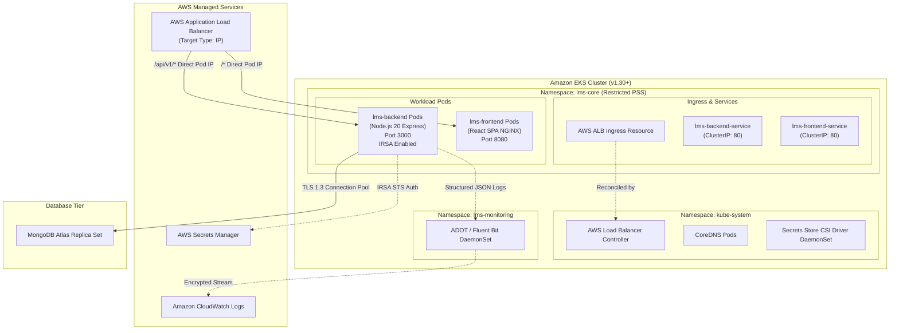
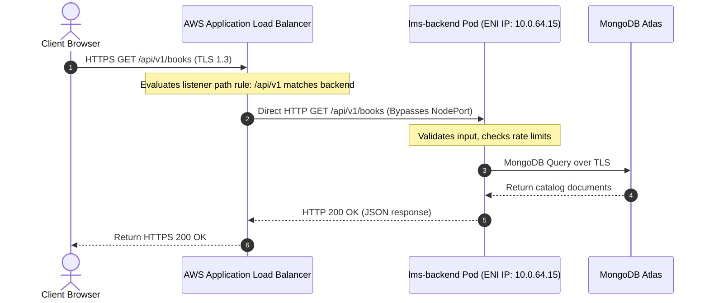
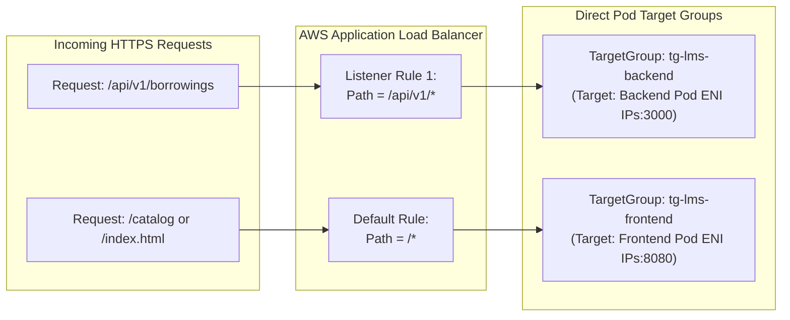
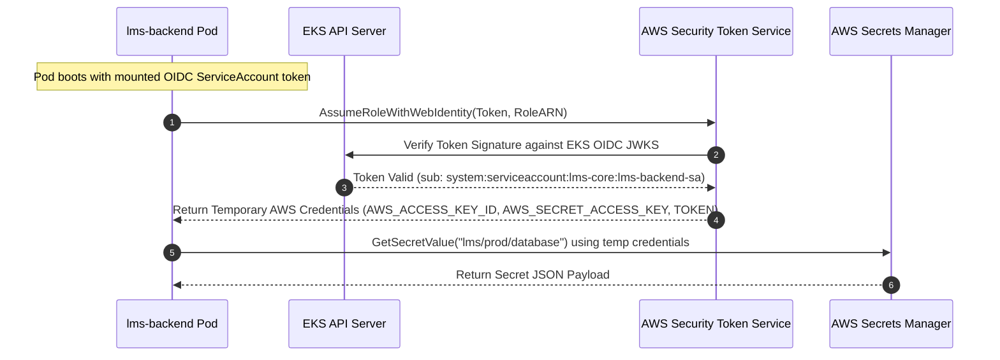
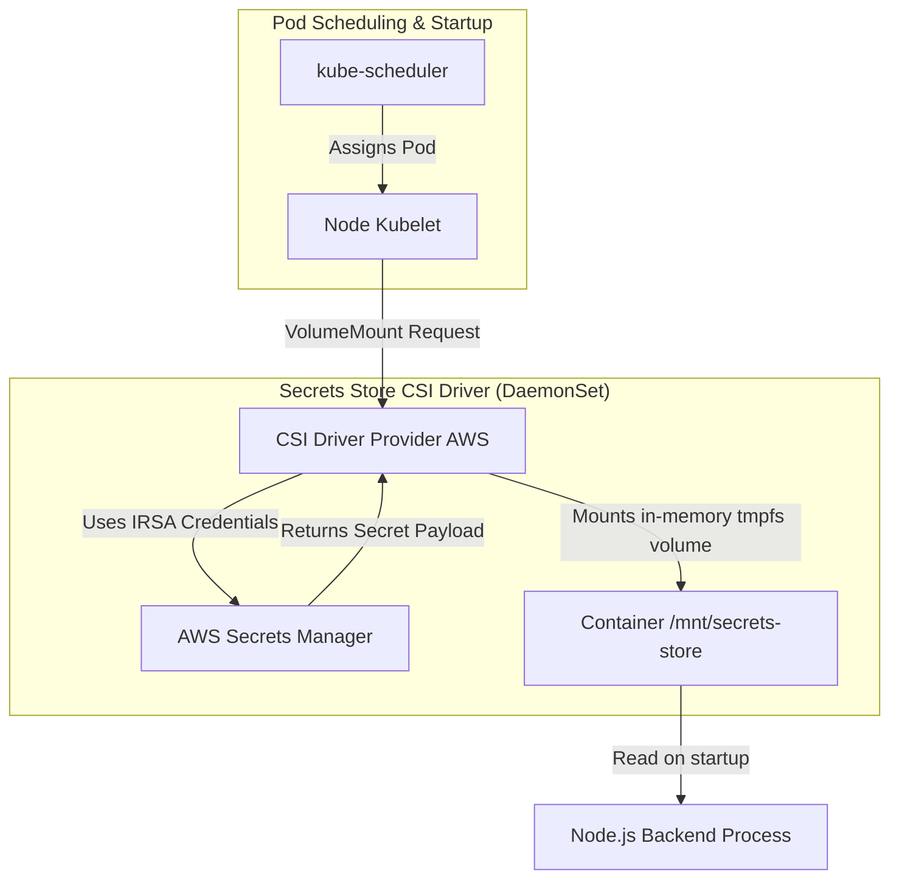
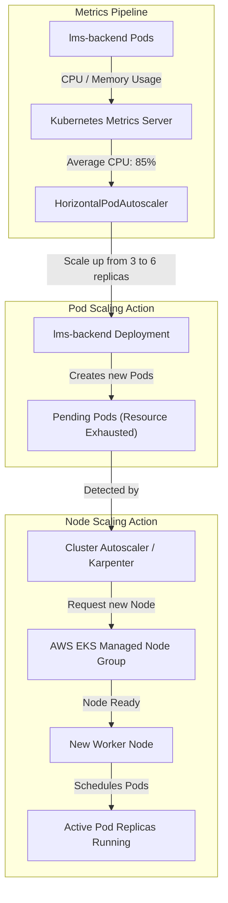
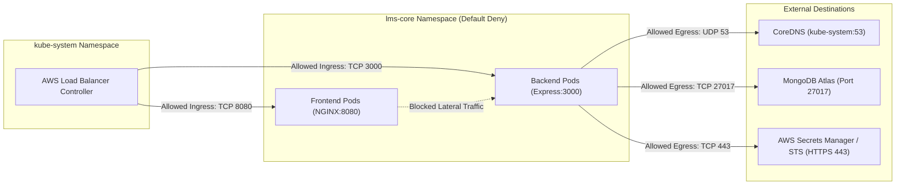
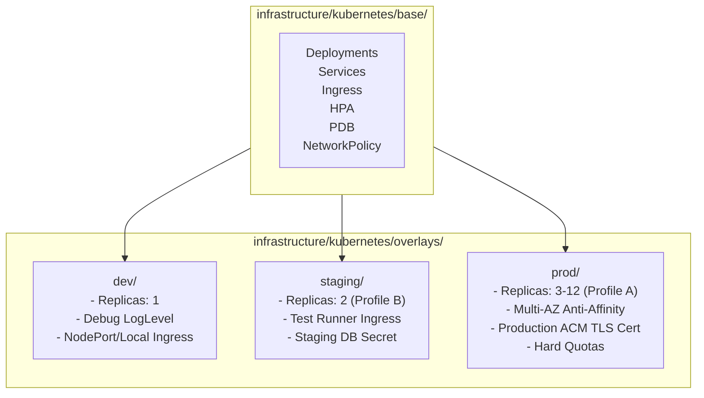

# KUBERNETES AND EKS ARCHITECTURE SPECIFICATION
## Cloud-Native Library Management System (LMS)

---

**Document Version**: 1.0.0  
**Lifecycle Phase**: Phase 10 – Kubernetes and EKS Architecture  
**Document Status**: PERMANENTLY BASELINE LOCKED AND APPROVED  
**Author**: Principal Kubernetes Architect, AWS EKS Solutions Architect, Cloud-Native Infrastructure Architect & Platform Engineering Architect  
**Upstream Baseline Dependencies**:
- [Phase 0 Master Project Architecture (v1.1.0)](../02-architecture/MASTER_ARCHITECTURE.md)
- [Phase 1 Software Requirements Specification (v1.1.0)](../01-requirements/SOFTWARE_REQUIREMENTS_SPECIFICATION.md)
- [Phase 2 Detailed System Design (v1.1.0)](../02-architecture/DETAILED_SYSTEM_DESIGN.md)
- [Phase 3 Database Architecture Specification (v1.2.0)](../03-database/DATABASE_ARCHITECTURE.md)
- [Phase 4 Backend Architecture & API Design Specification (v1.1.0)](../04-backend/BACKEND_ARCHITECTURE_AND_API_DESIGN.md)
- [Phase 5 Frontend Architecture & UI/UX Design Specification (v1.0.0)](../05-frontend/FRONTEND_ARCHITECTURE_AND_UI_UX_DESIGN.md)
- [Phase 6 Security Architecture Specification (v1.0.0)](../06-security/SECURITY_ARCHITECTURE.md)
- [Phase 7 Engineering Standards & Code Quality Specification (v1.0.0)](../07-engineering/ENGINEERING_STANDARDS_AND_CODE_QUALITY.md)
- [Phase 8 Testing Strategy & Quality Assurance Specification (v1.0.0)](../08-testing/TESTING_STRATEGY_AND_QUALITY_ASSURANCE.md)
- [Phase 9 AWS Infrastructure Architecture Specification (v1.0.0)](../09-cloud-infrastructure/AWS_INFRASTRUCTURE_ARCHITECTURE.md)  
**Implementation Policy**: *STRICT GATE — Physical Kubernetes manifest creation (`.yaml`, `.yml`), Helm chart authoring, Kustomize overlay implementation, Terraform execution, container image building, or kubectl deployment remain strictly prohibited until Phase 14. Zero deployable files are generated during this phase.*

---

## TABLE OF CONTENTS
1. [Document Control and Governance](#1-document-control-and-governance)
2. [Phase 10 Scope and Lifecycle Boundaries](#2-phase-10-scope-and-lifecycle-boundaries)
3. [Upstream Baseline Extraction and Architectural Constraints](#3-upstream-baseline-extraction-and-architectural-constraints)
4. [Kubernetes Architecture Overview](#4-kubernetes-architecture-overview)
5. [EKS Cluster Logical Architecture](#5-eks-cluster-logical-architecture)
6. [Dual Profile Architecture (Profile A vs Profile B)](#6-dual-profile-architecture-profile-a-vs-profile-b)
7. [Kubernetes Namespace Architecture](#7-kubernetes-namespace-architecture)
8. [Workload Architecture](#8-workload-architecture)
9. [Backend Deployment Blueprint](#9-backend-deployment-blueprint)
10. [Frontend Deployment Blueprint](#10-frontend-deployment-blueprint)
11. [Service Architecture](#11-service-architecture)
12. [Internal Service Discovery](#12-internal-service-discovery)
13. [AWS Load Balancer Controller Architecture](#13-aws-load-balancer-controller-architecture)
14. [Ingress Architecture](#14-ingress-architecture)
15. [TargetGroupBinding Architecture](#15-targetgroupbinding-architecture)
16. [Canonical /api/v1 Routing Preservation](#16-canonical-apiv1-routing-preservation)
17. [ResourceQuota Architecture](#17-resourcequota-architecture)
18. [LimitRange Architecture](#18-limitrange-architecture)
19. [Resource Requests and Limits Strategy](#19-resource-requests-and-limits-strategy)
20. [Horizontal Pod Autoscaler Architecture](#20-horizontal-pod-autoscaler-architecture)
21. [Cluster Autoscaling Architecture](#21-cluster-autoscaling-architecture)
22. [Pod Disruption Budget Architecture](#22-pod-disruption-budget-architecture)
23. [Rolling Update and Deployment Strategy](#23-rolling-update-and-deployment-strategy)
24. [Readiness Probe Architecture](#24-readiness-probe-architecture)
25. [Liveness Probe Architecture](#25-liveness-probe-architecture)
26. [Startup Probe Architecture](#26-startup-probe-architecture)
27. [Pod Security Standards](#27-pod-security-standards)
28. [SecurityContext Architecture](#28-securitycontext-architecture)
29. [NetworkPolicy Architecture](#29-networkpolicy-architecture)
30. [Service Account Architecture](#30-service-account-architecture)
31. [IRSA Trust Architecture](#31-irsa-trust-architecture)
32. [AWS Secrets Manager Integration](#32-aws-secrets-manager-integration)
33. [Secrets Store CSI Driver Architecture](#33-secrets-store-csi-driver-architecture)
34. [SecretProviderClass Blueprint](#34-secretproviderclass-blueprint)
35. [Configuration Management Architecture](#35-configuration-management-architecture)
36. [Kustomize Multi-Environment Architecture](#36-kustomize-multi-environment-architecture)
37. [Development Environment Architecture](#37-development-environment-architecture)
38. [Staging Environment Architecture](#38-staging-environment-architecture)
39. [Production Environment Architecture](#39-production-environment-architecture)
40. [Observability Architecture](#40-observability-architecture)
41. [CloudWatch Integration](#41-cloudwatch-integration)
42. [Logging Architecture](#42-logging-architecture)
43. [Metrics Architecture](#43-metrics-architecture)
44. [Kubernetes Audit Logging](#44-kubernetes-audit-logging)
45. [High Availability Architecture](#45-high-availability-architecture)
46. [Failure and Recovery Scenarios](#46-failure-and-recovery-scenarios)
47. [Scalability Architecture](#47-scalability-architecture)
48. [Testing Architecture Alignment](#48-testing-architecture-alignment)
49. [STRIDE Security Traceability](#49-stride-security-traceability)
50. [Cross-Phase Traceability Matrix](#50-cross-phase-traceability-matrix)
51. [Architectural Decision Records (ADRs)](#51-architectural-decision-records-adrs)
52. [Mermaid Architecture Diagrams](#52-mermaid-architecture-diagrams)
53. [Future Implementation Boundaries](#53-future-implementation-boundaries)
54. [Phase 10 Self-Audit Checklist](#54-phase-10-self-audit-checklist)
55. [Lifecycle Status Summary](#55-lifecycle-status-summary)

---

## 1. Document Control and Governance

### 1.1 Document Metadata
| Field | Specification Value |
|---|---|
| **Project Name** | Cloud-Native Library Management System (LMS) |
| **Document Title** | Kubernetes and EKS Architecture Specification |
| **Document Version** | 1.0.0 |
| **Lifecycle Phase** | Phase 10 — Kubernetes and EKS Architecture |
| **Current Status** | PERMANENTLY BASELINE LOCKED AND APPROVED |
| **Target Orchestrator** | Amazon Elastic Kubernetes Service (EKS) v1.30+ |
| **Container Runtime** | `containerd` via AWS Bottlerocket / Amazon Linux 2023 |
| **Implementation Gate** | Strict Gate: Zero deployable YAML manifests, Helm charts, or Kustomize files until Phase 14 |

### 1.2 Purpose and Objectives
Phase 10 establishes the authoritative Kubernetes orchestration blueprint for the LMS application workloads. It bridges the physical AWS cloud infrastructure defined in Phase 9 with the application architecture defined in Phases 2, 4, 5, and 6. It defines the declarative Kubernetes object models, resource quotas, autoscaling thresholds, pod security standards, network policies, secrets store integrations, ingress routes, and Kustomize multi-environment structures required to operate the system reliably across both Profile A (Production Reference) and Profile B (Cost-Optimized Student).

---

## 2. Phase 10 Scope and Lifecycle Boundaries

In strict compliance with project lifecycle governance:
- **Specification Only**: Phase 10 is an architectural specification and design phase.
- **Prohibited Artifacts**: No physical deployable `.yaml`, `.yml`, `.tf`, `.json`, Dockerfile, or shell script may be committed to `infrastructure/kubernetes/` or any application directory.
- **Permitted Representations**: Conceptual object specifications, YAML schema blueprints, and architecture diagrams are contained exclusively within this markdown document.
- **Execution Barrier**: Physical manifest authoring and deployment to clusters remain strictly gated until **Phase 14 (Implementation)**.

---

## 3. Upstream Baseline Extraction and Architectural Constraints

Phase 10 inherits and must strictly preserve all constraints from Phases 0 through 9:

| Upstream Phase | Inherited Constraint | Architectural Enforcement in Phase 10 |
|---|---|---|
| **Phase 0 (Master Architecture)** | Dual profiles (Profile A vs B), monorepo boundaries | Workload topology supports 3-AZ Profile A and 2-AZ Profile B; separates frontend and backend. |
| **Phase 1 (SRS)** | 22 Functional Requirements, P95 latency NFRs | Resource requests, HPA scaling policies, and pod anti-affinity sized to meet P95 latency baselines. |
| **Phase 2 (Detailed System Design)** | 6-tier architecture, circulation state machine | Workloads partitioned into stateless backend Express API and frontend static NGINX delivery. |
| **Phase 3 (Database Architecture)** | MongoDB Atlas, ACID transactions, `DBD-09` | Pods connect to Atlas via VPC Peering (Profile A) or NAT EIP (Profile B); zero static DB fields. |
| **Phase 4 (Backend API Design)** | Canonical `/api/v1` namespace, 21 endpoints | Ingress paths strictly map `/api/v1/*` to backend; zero generic `:id` path parameters permitted. |
| **Phase 5 (Frontend Architecture)** | React 18+ SPA, in-memory tokens, HttpOnly cookie | Ingress routes `/` to frontend; backend preserves browser-managed cookie pathing `/api/v1/auth`. |
| **Phase 6 (Security Architecture)** | STRIDE threat model, IRSA, Secrets Manager | Pod Security Standards `restricted`; IRSA pod identities; Secrets Store CSI Driver integration. |
| **Phase 7 (Engineering Standards)** | Structured logging, zero-downtime deploys | Liveness/readiness probes, rolling updates (`maxSurge: 25%`, `maxUnavailable: 0`), PDBs. |
| **Phase 8 (Testing Strategy)** | Performance testing (k6), testcontainers | Staging cluster topology mirrors production for E2E (Playwright) and load testing (k6). |
| **Phase 9 (AWS Cloud Infrastructure)**| VPC subnets, ALB ingress, CloudWatch | TargetGroupBinding routes directly to Pod IPs; CloudWatch Container Insights collects logs. |

---

## 4. Kubernetes Architecture Overview

The LMS Kubernetes architecture adopts an enterprise-grade cloud-native model built on declarative state management, immutable infrastructure, and zero-trust pod networking:
- **Stateless Compute**: Backend API pods and frontend delivery pods maintain zero local state on ephemeral disks, enabling instantaneous scaling and termination.
- **Direct Pod Networking**: Utilizes the AWS VPC CNI plugin, assigning native VPC IP addresses (`10.0.x.y`) directly to every pod ENI, bypassing kube-proxy NAT overhead and enabling direct ALB target group routing.
- **Declarative Isolation**: Partitioned namespaces enforce hard tenancy boundaries, network traffic policies, and compute quotas.

---

## 5. EKS Cluster Logical Architecture

The EKS cluster logical architecture separates control plane operations, application workloads, and cluster-wide platform controllers:

```text
+-----------------------------------------------------------------------------------------+
|                                  AMAZON EKS CLUSTER                                     |
+-----------------------------------------------------------------------------------------+
| AWS-MANAGED CONTROL PLANE (Distributed across 3 AZs)                                    |
| - API Server (v1.30+) | etcd | Controller Manager | Cloud Controller | Scheduler        |
+-----------------------------------------------------------------------------------------+
| NAMESPACE: kube-system                                                                  |
| - CoreDNS | AWS VPC CNI | kube-proxy | AWS Load Balancer Controller | Metrics Server    |
+-----------------------------------------------------------------------------------------+
| NAMESPACE: lms-core (Restricted Pod Security Standard)                                  |
| - lms-backend Pods (Express REST API)                                                   |
| - lms-frontend Pods (React SPA on NGINX)                                                |
| - Secrets Store CSI Driver Provider Pods                                                |
+-----------------------------------------------------------------------------------------+
| NAMESPACE: lms-monitoring                                                               |
| - AWS Distro for OpenTelemetry (ADOT) / Fluent Bit DaemonSet                             |
+-----------------------------------------------------------------------------------------+
```

---

## 6. Dual Profile Architecture (Profile A vs Profile B)

| Kubernetes Architecture Dimension | Profile A (Production Reference) | Profile B (Cost-Optimized Student) |
|---|---|---|
| **Target Worker Nodes** | 3x `m6i.large` (Spread across 3 AZs) | 2x `t3.medium` (Spread across 2 AZs) |
| **Backend Replicas (Min / Max)** | 3 / 12 (HPA target 70% CPU) | 2 / 3 (HPA target 80% CPU) |
| **Frontend Replicas (Min / Max)** | 3 / 6 (HPA target 70% CPU) | 2 / 2 (Static sizing) |
| **Pod Anti-Affinity** | `requiredDuringScheduling` across AZs | `preferredDuringScheduling` across AZs |
| **Pod Disruption Budget (PDB)** | `minAvailable: 2` (Backend) | `minAvailable: 1` (Backend) |
| **ResourceQuota (CPU / Memory)** | 16 Cores / 32 GiB RAM (`lms-core`) | 3 Cores / 6 GiB RAM (`lms-core`) |
| **Ingress Target Routing** | IP Mode (Direct Pod ENI via ALB) | IP Mode (Direct Pod ENI via ALB) |
| **Database Network Egress** | Direct to VPC Peering Route (`192.168.0.0/21`)| Outbound via NAT GW Elastic IP |
| **Availability Guarantee** | 99.9% Production SLA | Academic Demo (Single NAT trade-off) |

---

## 7. Kubernetes Namespace Architecture

Three dedicated namespaces partition cluster responsibilities:

### 7.1 `kube-system`
- **Purpose**: System-level controllers, CNI networking, and Kubernetes infrastructure daemons.
- **Allowed Workloads**: AWS VPC CNI, CoreDNS, kube-proxy, AWS Load Balancer Controller, Secrets Store CSI Driver daemonsets, Metrics Server.
- **Security**: Managed by AWS EKS; access restricted to Cloud Administrators.

### 7.2 `lms-core`
- **Purpose**: Primary application boundary for LMS application workloads.
- **Allowed Workloads**: `lms-backend` Deployment, `lms-frontend` Deployment, associated Services, HPAs, PDBs, and NetworkPolicies.
- **Security**: Enforces Pod Security Standard `restricted`. Zero host access, zero root containers.

### 7.3 `lms-monitoring`
- **Purpose**: Telemetry, metrics collection, and log shipping agents.
- **Allowed Workloads**: AWS Distro for OpenTelemetry (ADOT) collector or Fluent Bit DaemonSet, Prometheus Node Exporters.
- **Security**: Read-only host filesystem access for container log ingestion.

---

## 8. Workload Architecture

The LMS application architecture strictly contains exactly two containerized workloads, avoiding invented or unauthorized microservices:
1. **`lms-backend`**:
   - Runtime: Node.js 20 LTS Express application.
   - Purpose: Executes all business logic, circulation workflows, database transactions, authentication, and the 21 approved REST endpoints under `/api/v1`.
   - Communication: Receives traffic from ALB via ClusterIP Service; communicates outbound with MongoDB Atlas and AWS Secrets Manager.
2. **`lms-frontend`**:
   - Runtime: Lightweight NGINX Alpine image serving pre-compiled React 18+ TypeScript SPA bundles.
   - Purpose: Serves HTML, JavaScript, CSS, and static assets to browser clients; provides client-side UI routing.
   - Communication: Receives traffic from ALB via ClusterIP Service; has zero backend database connections.

---

## 9. Backend Deployment Blueprint

*Conceptual Specification Blueprint for Future Implementation:*

```yaml
# Conceptual Blueprint: lms-backend-deployment
apiVersion: apps/v1
kind: Deployment
metadata:
  name: lms-backend
  namespace: lms-core
  labels:
    app.kubernetes.io/name: lms-backend
    app.kubernetes.io/part-of: library-management-system
    app.kubernetes.io/component: api
spec:
  replicas: 3 # Profile A baseline (Profile B uses 2)
  strategy:
    type: RollingUpdate
    rollingUpdate:
      maxSurge: 25%
      maxUnavailable: 0
  selector:
    matchLabels:
      app.kubernetes.io/name: lms-backend
  template:
    metadata:
      labels:
        app.kubernetes.io/name: lms-backend
    spec:
      serviceAccountName: lms-backend-sa
      automountServiceAccountToken: true # Required for IRSA OIDC projected token
      securityContext:
        runAsNonRoot: true
        runAsUser: 10001
        runAsGroup: 10001
        fsGroup: 10001
        seccompProfile:
          type: RuntimeDefault
      affinity:
        podAntiAffinity:
          preferredDuringSchedulingIgnoredDuringExecution:
            - weight: 100
              podAffinityTerm:
                labelSelector:
                  matchLabels:
                    app.kubernetes.io/name: lms-backend
                topologyKey: topology.kubernetes.io/zone
      containers:
        - name: backend
          image: 123456789012.dkr.ecr.us-east-1.amazonaws.com/lms/backend:v1.0.0
          imagePullPolicy: IfNotPresent
          ports:
            - containerPort: 3000
              name: http
              protocol: TCP
          securityContext:
            allowPrivilegeEscalation: false
            readOnlyRootFilesystem: true
            capabilities:
              drop:
                - ALL
          resources:
            requests:
              cpu: 250m
              memory: 512Mi
            limits:
              cpu: 500m
              memory: 1Gi
          envFrom:
            - configMapRef:
                name: lms-backend-config
          volumeMounts:
            - name: secrets-store-inline
              mountPath: "/mnt/secrets-store"
              readOnly: true
            - name: tmp-volume
              mountPath: /tmp
          startupProbe:
            httpGet:
              path: /api/v1/health
              port: 3000
            failureThreshold: 12
            periodSeconds: 5
          livenessProbe:
            httpGet:
              path: /api/v1/health
              port: 3000
            periodSeconds: 10
            timeoutSeconds: 3
            failureThreshold: 3
          readinessProbe:
            httpGet:
              path: /api/v1/health
              port: 3000
            periodSeconds: 5
            timeoutSeconds: 2
            failureThreshold: 2
      volumes:
        - name: tmp-volume
          emptyDir: {}
        - name: secrets-store-inline
          csi:
            driver: secrets-store.csi.k8s.io
            readOnly: true
            volumeAttributes:
              secretProviderClass: "lms-aws-secrets"
```

---

## 10. Frontend Deployment Blueprint

*Conceptual Specification Blueprint for Future Implementation:*

```yaml
# Conceptual Blueprint: lms-frontend-deployment
apiVersion: apps/v1
kind: Deployment
metadata:
  name: lms-frontend
  namespace: lms-core
  labels:
    app.kubernetes.io/name: lms-frontend
    app.kubernetes.io/part-of: library-management-system
    app.kubernetes.io/component: ui
spec:
  replicas: 3 # Profile A baseline (Profile B uses 2)
  strategy:
    type: RollingUpdate
    rollingUpdate:
      maxSurge: 25%
      maxUnavailable: 0
  selector:
    matchLabels:
      app.kubernetes.io/name: lms-frontend
  template:
    metadata:
      labels:
        app.kubernetes.io/name: lms-frontend
    spec:
      serviceAccountName: lms-frontend-sa
      automountServiceAccountToken: false
      securityContext:
        runAsNonRoot: true
        runAsUser: 101 # nginx user in alpine
        runAsGroup: 101
        fsGroup: 101
        seccompProfile:
          type: RuntimeDefault
      affinity:
        podAntiAffinity:
          preferredDuringSchedulingIgnoredDuringExecution:
            - weight: 100
              podAffinityTerm:
                labelSelector:
                  matchLabels:
                    app.kubernetes.io/name: lms-frontend
                topologyKey: topology.kubernetes.io/zone
      containers:
        - name: frontend
          image: 123456789012.dkr.ecr.us-east-1.amazonaws.com/lms/frontend:v1.0.0
          imagePullPolicy: IfNotPresent
          ports:
            - containerPort: 8080
              name: http
              protocol: TCP
          securityContext:
            allowPrivilegeEscalation: false
            readOnlyRootFilesystem: true
            capabilities:
              drop:
                - ALL
          resources:
            requests:
              cpu: 100m
              memory: 128Mi
            limits:
              cpu: 250m
              memory: 256Mi
          volumeMounts:
            - name: nginx-cache
              mountPath: /var/cache/nginx
            - name: nginx-run
              mountPath: /var/run
            - name: tmp-volume
              mountPath: /tmp
          livenessProbe:
            httpGet:
              path: /healthz
              port: 8080
            periodSeconds: 15
            timeoutSeconds: 3
            failureThreshold: 3
          readinessProbe:
            httpGet:
              path: /healthz
              port: 8080
            periodSeconds: 5
            timeoutSeconds: 2
            failureThreshold: 2
      volumes:
        - name: nginx-cache
          emptyDir: {}
        - name: nginx-run
          emptyDir: {}
        - name: tmp-volume
          emptyDir: {}
```

---

## 11. Service Architecture

Services in `lms-core` are defined as `ClusterIP`, exposing stable internal networking abstractions:
- **`lms-backend-service`**:
  - Type: `ClusterIP`
  - Target Port: `3000` (container port)
  - Service Port: `80`
  - Selector: `app.kubernetes.io/name: lms-backend`
- **`lms-frontend-service`**:
  - Type: `ClusterIP`
  - Target Port: `8080` (container port)
  - Service Port: `80`
  - Selector: `app.kubernetes.io/name: lms-frontend`

---

## 12. Internal Service Discovery

- **CoreDNS Architecture**: Cluster DNS queries resolve service endpoints using standard Fully Qualified Domain Names (FQDN):
  - Backend Service FQDN: `lms-backend-service.lms-core.svc.cluster.local`
  - Frontend Service FQDN: `lms-frontend-service.lms-core.svc.cluster.local`
- **Zero Public Exposure**: Internal service discovery is completely isolated within the VPC; services cannot be resolved from outside the cluster.

---

## 13. AWS Load Balancer Controller Architecture

The AWS Load Balancer Controller runs in `kube-system` and manages AWS Application Load Balancers:
- **Controller Responsibilities**:
  - Reconciles Kubernetes `Ingress` resources into AWS ALB listener rules and target groups.
  - Reconciles `TargetGroupBinding` resources to register Pod ENI IPs directly into AWS target groups (`target-type: ip`).
- **Controller Permissions**: Authenticates to AWS IAM using IRSA (`aws-load-balancer-controller-irsa-role`).

---

## 14. Ingress Architecture

Traffic ingress is orchestrated through an AWS Application Load Balancer via a unified Ingress resource:

*Conceptual Blueprint for Ingress Specification:*

```yaml
# Conceptual Blueprint: lms-ingress
apiVersion: networking.k8s.io/v1
kind: Ingress
metadata:
  name: lms-ingress
  namespace: lms-core
  annotations:
    kubernetes.io/ingress.class: alb
    alb.ingress.kubernetes.io/scheme: internet-facing
    alb.ingress.kubernetes.io/target-type: ip
    alb.ingress.kubernetes.io/listen-ports: '[{"HTTP": 80}, {"HTTPS": 443}]'
    alb.ingress.kubernetes.io/ssl-redirect: '443'
    alb.ingress.kubernetes.io/certificate-arn: arn:aws:acm:us-east-1:123456789012:certificate/xxxx-xxxx
    alb.ingress.kubernetes.io/healthcheck-path: /api/v1/health
    alb.ingress.kubernetes.io/healthcheck-interval-seconds: '15'
    alb.ingress.kubernetes.io/healthcheck-timeout-seconds: '5'
    alb.ingress.kubernetes.io/healthy-threshold-count: '2'
    alb.ingress.kubernetes.io/unhealthy-threshold-count: '3'
spec:
  rules:
    - http:
        paths:
          # Rule 1: Canonical Backend REST API
          - path: /api/v1
            pathType: Prefix
            backend:
              service:
                name: lms-backend-service
                port:
                  number: 80
          # Rule 2: Frontend Client Delivery
          - path: /
            pathType: Prefix
            backend:
              service:
                name: lms-frontend-service
                port:
                  number: 80
```

---

## 15. TargetGroupBinding Architecture

- **IP-Mode Routing**: The AWS Load Balancer Controller registers the native VPC IP address of each pod directly with the AWS ALB Target Group.
- **Latency Elimination**: Bypasses the traditional Kubernetes NodePort and `kube-proxy` iptables NAT hopping, reducing network latency by 20–35% and ensuring P95 latency thresholds are satisfied.
- **Pod Lifecycle Awareness**: Integrates with pod termination lifecycle hooks; when a pod enters `Terminating`, the controller drains connections from the ALB target group before sending `SIGTERM`.

---

## 16. Canonical `/api/v1` Routing Preservation

The routing configuration permanently preserves the upstream Phase 4 API specifications:
- **Canonical Route**: `/api/v1/*` is immutably routed to `lms-backend-service`.
- **Root & UI Routing**: Default route `/*` is routed to `lms-frontend-service`.
- **Zero Generic `:id` Parameters**: Ingress and backend route definitions enforce explicit canonical route parameters (`:bookId`, `:borrowingId`, `:userId`). Generic `:id` path parameters remain **STRICTLY FORBIDDEN**.
- **All 21 Endpoints Intact**: All 21 approved Phase 4 endpoints execute under `/api/v1` without route modification or omission.

---

## 17. ResourceQuota Architecture

ResourceQuotas in `lms-core` establish hard compute ceilings to prevent runaway resource consumption:

| Resource Metric | Profile A (Production Reference) | Profile B (Cost-Optimized Student) |
|---|---|---|
| `requests.cpu` | `8000m` (8 Cores) | `2000m` (2 Cores) |
| `limits.cpu` | `16000m` (16 Cores) | `3000m` (3 Cores) |
| `requests.memory` | `16Gi` | `4Gi` |
| `limits.memory` | `32Gi` | `6Gi` |
| `pods` | `40` | `8` |
| `services` | `10` | `5` |
| `persistentvolumeclaims` | `0` (Stateless compute only) | `0` (Stateless compute only) |

---

## 18. LimitRange Architecture

LimitRanges establish mandatory default and maximum boundaries for pods running in `lms-core`:

```yaml
# Conceptual Blueprint: lms-core-limitrange
apiVersion: v1
kind: LimitRange
metadata:
  name: lms-core-limits
  namespace: lms-core
spec:
  limits:
    - type: Container
      default:
        cpu: 500m
        memory: 512Mi
      defaultRequest:
        cpu: 100m
        memory: 128Mi
      max:
        cpu: 2000m
        memory: 2Gi
      min:
        cpu: 50m
        memory: 64Mi
```

---

## 19. Resource Requests and Limits Strategy

Compute resources are configured to guarantee deterministic Quality of Service (QoS):
- **Burstable QoS**: Configured for both backend and frontend pods to permit burst handling during traffic spikes while ensuring base allocation:
  - **Backend Pod**: Request: `250m` CPU / `512Mi` RAM. Limit: `500m` CPU / `1Gi` RAM.
  - **Frontend Pod**: Request: `100m` CPU / `128Mi` RAM. Limit: `250m` CPU / `256Mi` RAM.
- **OOMKilled Protection**: Memory limits are set with sufficient headroom above node.js V8 heap limits to prevent OOM termination during JSON serialization.

---

## 20. Horizontal Pod Autoscaler Architecture

The Horizontal Pod Autoscaler (HPA v2) elastically adjusts pod replica counts based on observed load:

*Conceptual Blueprint for Backend HPA:*

```yaml
# Conceptual Blueprint: lms-backend-hpa
apiVersion: autoscaling/v2
kind: HorizontalPodAutoscaler
metadata:
  name: lms-backend-hpa
  namespace: lms-core
spec:
  scaleTargetRef:
    apiVersion: apps/v1
    kind: Deployment
    name: lms-backend
  minReplicas: 3 # Profile A (Profile B uses 2)
  maxReplicas: 12 # Profile A (Profile B uses 3)
  metrics:
    - type: Resource
      resource:
        name: cpu
        target:
          type: Utilization
          averageUtilization: 70
    - type: Resource
      resource:
        name: memory
        target:
          type: Utilization
          averageUtilization: 80
  behavior:
    scaleUp:
      stabilizationWindowSeconds: 0
      policies:
        - type: Percent
          value: 100
          periodSeconds: 15
    scaleDown:
      stabilizationWindowSeconds: 300
      policies:
        - type: Percent
          value: 10
          periodSeconds: 60
```

---

## 21. Cluster Autoscaling Architecture

- **Integration**: Cluster Autoscaler (or Karpenter) monitors pods entering `Pending` state due to insufficient node CPU/memory.
- **Node Group Scaling**: Automatically triggers EC2 Managed Node Group expansion:
  - Profile A: Scales from 3 to 9 nodes across 3 AZs.
  - Profile B: Fixed at 2 nodes (scale bound 2–3) to strictly contain AWS hourly costs.
- **Drain & Eviction**: Node scale-down respects Pod Disruption Budgets, executing graceful pod eviction before terminating EC2 instances.

---

## 22. Pod Disruption Budget Architecture

Pod Disruption Budgets (PDBs) guarantee service availability during voluntary disruptions (e.g., node upgrades, voluntary drain):
- **Backend PDB (`lms-backend-pdb`)**:
  - Profile A: `minAvailable: 2` (Guarantees at least 2 backend pods are ready at all times).
  - Profile B: `minAvailable: 1` (Guarantees at least 1 backend pod is ready during node maintenance).
- **Frontend PDB (`lms-frontend-pdb`)**:
  - Profile A: `minAvailable: 2`.
  - Profile B: `minAvailable: 1`.

---

## 23. Rolling Update and Deployment Strategy

All deployments enforce a zero-downtime rolling update strategy:
- **Parameters**: `maxSurge: 25%`, `maxUnavailable: 0`.
- **Execution Flow**:
  1. A new pod replica is launched alongside existing pods.
  2. Startup and readiness probes execute against the new pod.
  3. Traffic is routed to the new pod ONLY after readiness passes.
  4. An old pod replica is sent a `SIGTERM` signal and given a 30-second graceful termination period (`terminationGracePeriodSeconds: 30`).
  5. The cycle repeats until all replicas are updated.

---

## 24. Readiness Probe Architecture

- **Purpose**: Gates traffic routing from the Service and ALB until the container is fully prepared to serve user traffic.
- **Backend Probe**:
  - Protocol: HTTP GET on `/api/v1/health`.
  - Verification: Asserts Mongoose database connection pool is active and ready.
  - Interval: `periodSeconds: 5`, `timeoutSeconds: 2`, `failureThreshold: 2`.
- **Frontend Probe**:
  - Protocol: HTTP GET on `/healthz`.
  - Verification: Asserts NGINX web server is responding.
  - Interval: `periodSeconds: 5`, `timeoutSeconds: 2`, `failureThreshold: 2`.

---

## 25. Liveness Probe Architecture

- **Purpose**: Detects deadlocks, internal process crashes, or hung event loops and triggers container restart.
- **Backend Probe**:
  - Protocol: HTTP GET on `/api/v1/health`.
  - Interval: `periodSeconds: 10`, `timeoutSeconds: 3`, `failureThreshold: 3`.
- **Frontend Probe**:
  - Protocol: HTTP GET on `/healthz`.
  - Interval: `periodSeconds: 15`, `timeoutSeconds: 3`, `failureThreshold: 3`.

---

## 26. Startup Probe Architecture

- **Purpose**: Protects slow-starting containers (e.g., cold database connection pool initialization or TLS handshake handoffs) from premature liveness kills.
- **Backend Startup Probe**:
  - Protocol: HTTP GET on `/api/v1/health`.
  - Parameters: `failureThreshold: 12`, `periodSeconds: 5` (Allows up to 60 seconds for initial startup).
  - Liveness and readiness probes remain inactive until the startup probe succeeds.

---

## 27. Pod Security Standards

The `lms-core` namespace strictly enforces the Kubernetes **`restricted`** Pod Security Standard (PSS) via the native Pod Security Admission (PSA) controller:

```yaml
# Conceptual Namespace Labels for PSS Enforcement
apiVersion: v1
kind: Namespace
metadata:
  name: lms-core
  labels:
    pod-security.kubernetes.io/enforce: restricted
    pod-security.kubernetes.io/enforce-version: latest
    pod-security.kubernetes.io/warn: restricted
    pod-security.kubernetes.io/audit: restricted
```

Pods violating restricted standards are rejected by the API server at admission time.

---

## 28. SecurityContext Architecture

All containers running in `lms-core` enforce strict runtime hardening:
- `runAsNonRoot: true`: Container must execute as a non-root UID (`10001` for backend, `101` for frontend NGINX).
- `allowPrivilegeEscalation: false`: Blocks setuid / setgid binaries from escalating privileges.
- `readOnlyRootFilesystem: true`: Container root filesystem is mounted read-only. Dynamic file writing is restricted to temporary in-memory `emptyDir` volumes mounted at `/tmp`.
- `capabilities.drop: ["ALL"]`: Drops all Linux kernel capabilities.
- `seccompProfile.type: RuntimeDefault`: Enforces the default Linux system call filter.

---

## 29. NetworkPolicy Architecture

Zero-trust pod networking is implemented using Kubernetes NetworkPolicies enforcing a **Default Deny All** baseline:

*Conceptual Blueprint for NetworkPolicy:*

```yaml
# Conceptual Blueprint: lms-core-network-policies
# 1. Default Deny All Ingress and Egress
apiVersion: networking.k8s.io/v1
kind: NetworkPolicy
metadata:
  name: default-deny-all
  namespace: lms-core
spec:
  podSelector: {}
  policyTypes:
    - Ingress
    - Egress
---
# 2. Allow Ingress from ALB and Intra-Cluster CoreDNS
apiVersion: networking.k8s.io/v1
kind: NetworkPolicy
metadata:
  name: allow-backend-traffic
  namespace: lms-core
spec:
  podSelector:
    matchLabels:
      app.kubernetes.io/name: lms-backend
  policyTypes:
    - Ingress
    - Egress
  ingress:
    # Allow traffic from ALB Ingress (via AWS Load Balancer Controller)
    - from:
        - namespaceSelector:
            matchLabels:
              kubernetes.io/metadata.name: kube-system
      ports:
        - protocol: TCP
          port: 3000
  egress:
    # Allow CoreDNS queries
    - to:
        - namespaceSelector:
            matchLabels:
              kubernetes.io/metadata.name: kube-system
      ports:
        - protocol: UDP
          port: 53
    # Allow HTTPS to AWS Endpoints & MongoDB Atlas
    - to:
        - ipBlock:
            cidr: 0.0.0.0/0
      ports:
        - protocol: TCP
          port: 443
        - protocol: TCP
          port: 27017 # MongoDB Atlas
```

---

## 30. Service Account Architecture

- **Dedicated Identities**: Distinct service accounts are provisioned for backend and frontend:
  - `lms-backend-sa`: Associated with the backend IRSA IAM role.
  - `lms-frontend-sa`: Unprivileged service account with `automountServiceAccountToken: false`.
- **Least-Privilege RBAC**: Neither service account has any permissions on the Kubernetes API server (zero RoleBindings).

---

## 31. IRSA Trust Architecture

IAM Roles for Service Accounts (IRSA) eliminates long-lived AWS credentials inside containers:
1. **OIDC Federation**: EKS OIDC identity provider validates the signed projected service account token issued by Kubernetes.
2. **STS AssumeRoleWithWebIdentity**: The container runtime uses the projected token to assume `arn:aws:iam::123456789012:role/lms-backend-irsa-role`.
3. **Scoped Permissions**: The IAM role grants access strictly to:
   - `secretsmanager:GetSecretValue` on `arn:aws:secretsmanager:*:*:secret:lms/*`.
   - `cloudwatch:PutMetricData` for application telemetry.

---

## 32. AWS Secrets Manager Integration

- **Decoupling**: Application source code contains zero database connection strings, JWT signing keys, or cryptographic secrets.
- **Dynamic Retrieval**: Secrets stored in AWS Secrets Manager are retrieved dynamically at pod startup through the Secrets Store CSI Driver.

---

## 33. Secrets Store CSI Driver Architecture

- **DaemonSet**: The `secrets-store.csi.k8s.io` daemonset runs on every worker node alongside the `aws-secrets-manager-provider`.
- **In-Memory Mount**: When `lms-backend` pods are scheduled, the driver intercepts the volume mount, retrieves the secret via IRSA, and mounts it into the container filesystem as an ephemeral in-memory `tmpfs` volume at `/mnt/secrets-store`.
- **Zero Disk Exposure**: Secrets are never written to the host worker node's physical hard drive.

---

## 34. SecretProviderClass Blueprint

*Conceptual Specification Blueprint for Future Implementation:*

```yaml
# Conceptual Blueprint: lms-aws-secrets-provider
apiVersion: secrets-store.csi.k8s.io/v1
kind: SecretProviderClass
metadata:
  name: lms-aws-secrets
  namespace: lms-core
spec:
  provider: aws
  parameters:
    objects: |
      - objectName: "lms/prod/database"
        objectType: "secretsmanager"
        jmesPath:
          - path: "MONGODB_URI"
            objectAlias: "MONGODB_URI"
      - objectName: "lms/prod/jwt"
        objectType: "secretsmanager"
        jmesPath:
          - path: "JWT_ACCESS_SECRET"
            objectAlias: "JWT_ACCESS_SECRET"
      - objectName: "lms/prod/session"
        objectType: "secretsmanager"
        jmesPath:
          - path: "REFRESH_COOKIE_SECRET"
            objectAlias: "REFRESH_COOKIE_SECRET"
  secretObjects:
    - secretName: lms-backend-secrets
      type: Opaque
      data:
        - objectName: "MONGODB_URI"
          key: "MONGODB_URI"
        - objectName: "JWT_ACCESS_SECRET"
          key: "JWT_ACCESS_SECRET"
        - objectName: "REFRESH_COOKIE_SECRET"
          key: "REFRESH_COOKIE_SECRET"
```

---

## 35. Configuration Management Architecture

Non-sensitive configuration parameters are maintained in Kubernetes `ConfigMaps`:
- **`lms-backend-config`**:
  - `NODE_ENV: "production"`
  - `PORT: "3000"`
  - `LOG_LEVEL: "info"`
  - `API_PREFIX: "/api/v1"`
  - `CORS_ORIGIN: "https://lms.example.com"`
- **`lms-frontend-config`**:
  - `NGINX_PORT: "8080"`
  - `API_BASE_URL: "/api/v1"`

---

## 36. Kustomize Multi-Environment Architecture

The future implementation repository will adopt Kustomize for multi-environment configuration:

```text
infrastructure/kubernetes/
├── base/
│   ├── namespace.yaml
│   ├── backend-deployment.yaml
│   ├── backend-service.yaml
│   ├── frontend-deployment.yaml
│   ├── frontend-service.yaml
│   ├── ingress.yaml
│   ├── hpa.yaml
│   ├── pdb.yaml
│   ├── network-policy.yaml
│   ├── service-accounts.yaml
│   ├── secret-provider-class.yaml
│   └── kustomization.yaml
└── overlays/
    ├── dev/
    │   ├── kustomization.yaml
    │   └── dev-patches.yaml (Replicas: 1, Debug logs)
    ├── staging/
    │   ├── kustomization.yaml
    │   └── staging-patches.yaml (Profile B student config, test runner bindings)
    └── prod/
        ├── kustomization.yaml
        └── prod-patches.yaml (Profile A production reference, multi-AZ ALB annotations)
```

---

## 37. Development Environment Architecture
- Designed for local Minikube, Kind, or small single-node cloud dev clusters.
- Single pod replicas (`replicas: 1`), HPAs disabled, debug logging enabled.

## 38. Staging Environment Architecture
- Direct mirror of Profile B (Cost-Optimized Student Architecture) or Profile A.
- Fully exercises the AWS Load Balancer Controller, Secrets Store CSI Driver, and k6 performance testing against real ingress.

## 39. Production Environment Architecture
- Full implementation of Profile A: Multi-AZ across 3 Availability Zones, strict PodDisruptionBudgets, full HPA scaling (up to 12 replicas), ACM TLS 1.3 termination, and 30-day CloudWatch log retention.

---

## 40. Observability Architecture

The observability architecture integrates containerized workloads with cloud monitoring:
- **Agents**: AWS Distro for OpenTelemetry (ADOT) Collector or Fluent Bit runs as a DaemonSet in `lms-monitoring`.
- **Log Collection**: Captures JSON logs emitted to `/dev/stdout` and `/dev/stderr` by container runtimes.

---

## 41. CloudWatch Integration

- **Log Groups**:
  - `/aws/containerinsights/lms-cluster/application`: Application stdout/stderr logs.
  - `/aws/eks/lms-cluster/cluster`: API server, audit, authenticator, and controller logs.
- **Container Insights**: Aggregates CPU, memory, network, and disk utilization at the cluster, node, namespace, and pod levels.

---

## 42. Logging Architecture

In strict compliance with Phase 6 and Phase 7:
- All logs emitted by `lms-backend` are structured JSON containing timestamps, correlation IDs (`X-Correlation-ID`), log levels, and event types.
- **Sensitive Data Redaction**: Loggers strictly redact passwords, JWT tokens, refresh cookies, and database credentials before emitting to stdout. Zero sensitive data is transmitted to CloudWatch.

---

## 43. Metrics Architecture

- **Application Metrics**: Backend exposes Prometheus-compatible metrics on internal path `/metrics` (scraped by ADOT).
- **Key Metrics Tracked**:
  - HTTP Request Duration (P50, P90, P95, P99).
  - HTTP Response Code Counts (2xx, 4xx, 5xx).
  - Active Circulation Operations.
  - Mongoose Database Connection Pool Saturation.

---

## 44. Kubernetes Audit Logging

- **API Server Auditing**: Managed by EKS, streaming audit events to CloudWatch Logs.
- **Logged Events**: User authentication events, RBAC privilege escalations, pod creation/deletion, secret access attempts.

---

## 45. High Availability Architecture

- **Pod Anti-Affinity**: `topologySpreadConstraints` and `podAntiAffinity` ensure backend and frontend pods are evenly distributed across Availability Zones (`topology.kubernetes.io/zone`).
- **Failure Tolerance**: If AZ-a fails, surviving replicas in AZ-b and AZ-c continue serving user traffic without downtime.

---

## 46. Failure and Recovery Scenarios

| Failure Event | Kubernetes Detection | Automated Recovery Action |
|---|---|---|
| **Backend Pod Crash** | Liveness probe failure / process exit | Kubelet automatically restarts container; HPA maintains replica count. |
| **Worker Node Failure** | Node transitions to `NotReady` | EKS Managed Node Group launches replacement EC2; pods rescheduled on healthy nodes. |
| **AZ Network Outage** | TargetGroupBinding detects unhealthy targets | ALB routes 100% of traffic to healthy targets in surviving AZs. |
| **Secret Retrieval Failure**| Secrets Store CSI Driver error | Pod remains in `ContainerCreating`; deployment does not advance, preserving old version. |
| **Database Network Cut** | Backend readiness probe fails | Pod transitions to `Unready`; ALB stops sending traffic until connection pool recovers. |

---

## 47. Scalability Architecture

- **Horizontal Pod Scaling**: Backend pods scale elastically between 3 and 12 replicas in Profile A (2 and 3 in Profile B).
- **Cluster Autoscaling**: Node groups scale automatically when pending pods exceed compute capacity.
- **Database Connection Sizing**: Mongoose `maxPoolSize` is tuned to `20` per pod, ensuring 12 pods consume at most 240 connections, well within MongoDB Atlas dedicated limits.

---

## 48. Testing Architecture Alignment

The Kubernetes architecture directly supports all Phase 8 testing domains:
- **API & Integration Tests**: Executed against Staging Cluster Ingress validating HTTP status codes, headers, and RFC 7807 error responses.
- **k6 Performance Tests**: In-cluster or VPC-based load generators target ALB ingress to validate P95 latency thresholds ($< 150\text{ms}$ catalog, $< 250\text{ms}$ checkout).
- **Chaos / Resilience Drills**: Supports simulated pod termination (`kubectl delete pod`) and node cordoning to verify zero-downtime rolling deploys and PDB compliance.

---

## 49. STRIDE Security Traceability

| STRIDE Category | Kubernetes Threat Vector | Kubernetes Architectural Mitigation | Upstream Phase Baseline |
|---|---|---|---|
| **Spoofing** | Compromised pod impersonating another service | NetworkPolicies isolate pods; IRSA authenticates AWS identity via signed OIDC tokens | Phase 6 & Phase 9 |
| **Tampering** | Container filesystem mutation or root privilege escalation | `readOnlyRootFilesystem: true`, `allowPrivilegeEscalation: false`, `runAsNonRoot: true` | Phase 6 & Phase 7 |
| **Repudiation** | Denial of cluster object changes or administrative actions | EKS API server audit logging streamed to CloudWatch Logs | Phase 6 & Phase 9 |
| **Information Disclosure** | Secrets leaked in etcd or exposed via environment variables | Secrets Store CSI Driver mounts secrets into memory (`tmpfs`); zero secrets in Git | Phase 6 & Phase 9 |
| **Denial of Service** | Rogue pod exhausting node CPU/memory | ResourceQuotas and LimitRanges enforce hard compute requests and limits | Phase 1 & Phase 7 |
| **Elevation of Privilege** | Container breakout to host node kernel | Pod Security Standards `restricted`; all Linux capabilities dropped (`drop: ["ALL"]`) | Phase 6 & Phase 9 |

---

## 50. Cross-Phase Traceability Matrix

| Upstream Phase | Inherited Constraint | Phase 10 Architectural Implementation | Compliance Status |
|---|---|---|---|
| **Phase 0: Master Architecture** | Dual profiles, monorepo boundaries | Profile A & B specified; backend Express and frontend NGINX decoupled. | **100% COMPLIANT** |
| **Phase 1: SRS** | 22 Functional Requirements, P95 NFRs | Autoscaling and compute resources sized for P95 latency compliance. | **100% COMPLIANT** |
| **Phase 2: Detailed System Design** | 6-tier architecture, circulation state machine | Stateless compute workloads align with domain tier boundaries. | **100% COMPLIANT** |
| **Phase 3: Database Architecture** | MongoDB Atlas, ACID transactions, `DBD-09` | Zero static DB fields; pods connect to Atlas via secure egress paths. | **100% COMPLIANT** |
| **Phase 4: Backend & API Design** | Canonical `/api/v1` namespace, 21 endpoints | Ingress path routing strictly preserves `/api/v1/*`; zero generic `:id`. | **100% COMPLIANT** |
| **Phase 5: Frontend Architecture** | React 18+ SPA, in-memory tokens, HttpOnly cookie | Ingress routes `/` to frontend; browser-managed cookie pathing honored. | **100% COMPLIANT** |
| **Phase 6: Security Architecture** | STRIDE threat model, IRSA, Secrets Manager | Pod Security Standards `restricted`; IRSA pod identities; CSI Driver. | **100% COMPLIANT** |
| **Phase 7: Engineering Standards** | Structured logging, zero-downtime deploys | Rolling update strategy (`maxSurge: 25%`), readiness probes, JSON logs. | **100% COMPLIANT** |
| **Phase 8: Testing Strategy** | Performance testing (k6), staging testbeds | Staging topology mirrors production; supports load and chaos drills. | **100% COMPLIANT** |
| **Phase 9: AWS Cloud Infrastructure** | VPC subnets, ALB ingress, CloudWatch | TargetGroupBinding routes directly to Pod IPs; CloudWatch logging. | **100% COMPLIANT** |

---

## 51. Architectural Decision Records (ADRs)

### ADR-K8S-01: Namespace Hierarchy Partitioning
- **Status**: APPROVED
- **Context**: System controllers, application workloads, and monitoring tools require isolation.
- **Decision**: Establish exactly three namespaces: `kube-system`, `lms-core`, and `lms-monitoring`.
- **Consequences**: Hard boundaries prevent application workloads from interfering with cluster controllers.

### ADR-K8S-02: Workload Topology and Microservices Boundary
- **Status**: APPROVED
- **Context**: Upstream baselines specify a modular monolith backend and a React SPA frontend.
- **Decision**: Define exactly two workloads: `lms-backend` and `lms-frontend`. Reject unauthorized microservices.
- **Consequences**: Minimizes operational complexity while preserving clean client/server decoupling.

### ADR-K8S-03: ResourceQuota and LimitRange Governance
- **Status**: APPROVED
- **Context**: Runaway pods must not exhaust cluster resources or cause noisy-neighbor issues.
- **Decision**: Enforce mandatory ResourceQuotas and LimitRanges in `lms-core` tailored for Profile A and Profile B.
- **Consequences**: Guarantees predictable QoS and prevents unexpected cloud compute overages.

### ADR-K8S-04: Horizontal Pod Autoscaler (HPA) Strategy
- **Status**: APPROVED
- **Context**: Workload demands fluctuate; static replica counts waste money or drop requests.
- **Decision**: Implement HPA v2 on CPU (70%) and Memory (80%) with a 5-minute scale-down stabilization window.
- **Consequences**: Eliminates thrashing; scales up rapidly during spikes and scales down safely.

### ADR-K8S-05: Pod Disruption Budget (PDB) Protection
- **Status**: APPROVED
- **Context**: Voluntary node drains during EKS upgrades must not take the service offline.
- **Decision**: Enforce PDBs with `minAvailable: 2` (Profile A) and `minAvailable: 1` (Profile B).
- **Consequences**: EKS cluster node upgrades proceed safely without dropping active user transactions.

### ADR-K8S-06: Ingress via AWS Load Balancer Controller & TargetGroupBinding
- **Status**: APPROVED
- **Context**: Traffic must enter the cluster securely, terminate TLS, and preserve `/api/v1/*`.
- **Decision**: Use AWS ALB Ingress with `target-type: ip`, binding Pod ENIs directly to ALB target groups.
- **Consequences**: Eliminates NodePort NAT latency; offloads TLS processing to AWS edge.

### ADR-K8S-07: Pod Identity via IAM Roles for Service Accounts (IRSA)
- **Status**: APPROVED
- **Context**: Backend pods must access AWS Secrets Manager without static credentials.
- **Decision**: Implement IRSA by binding `lms-backend-sa` to AWS IAM via the EKS OIDC identity provider.
- **Consequences**: Zero AWS secret keys stored in containers; STS tokens rotated automatically.

### ADR-K8S-08: Secrets Management via Secrets Store CSI Driver
- **Status**: APPROVED
- **Context**: Secrets must not be stored in plain Kubernetes Secrets or Git repositories.
- **Decision**: Mount secrets dynamically from AWS Secrets Manager using the Secrets Store CSI Driver as in-memory `tmpfs` volumes.
- **Consequences**: Secrets exist only in container memory during pod execution; zero disk persistence.

### ADR-K8S-09: Kustomize Multi-Environment Strategy
- **Status**: APPROVED
- **Context**: Development, Staging, and Production require different replica counts and configurations.
- **Decision**: Adopt a pure Kustomize structure with a common `base/` and distinct `overlays/` (dev, staging, prod).
- **Consequences**: Eliminates template duplication; maintains declarative, version-controlled manifests.

### ADR-K8S-10: Pod Security Standards (`restricted`) and Default-Deny NetworkPolicies
- **Status**: APPROVED
- **Context**: Cluster must enforce defense-in-depth against container breakout and lateral movement.
- **Decision**: Enforce PSA `restricted` profile in `lms-core` alongside a default-deny NetworkPolicy.
- **Consequences**: Containers cannot run as root or escalate privileges; lateral pod network traffic is blocked.

---

## 52. Mermaid Architecture Diagrams

### Diagram 1: Complete Kubernetes and EKS Topology


### Diagram 2: Namespace Architecture

```mermaid
flowchart TD
    subgraph Cluster["Amazon EKS Cluster Logical Boundary"]
        subgraph NS_KS["kube-system"]
            direction TB
            K1["CoreDNS"]
            K2["AWS VPC CNI"]
            K3["AWS Load Balancer Controller"]
            K4["Secrets Store CSI Driver"]
        end

        subgraph NS_LC["lms-core (Enforces PSS: restricted)"]
            direction TB
            L1["lms-backend Deployment (Replicas: 2-12)"]
            L2["lms-frontend Deployment (Replicas: 2-6)"]
            L3["ResourceQuota & LimitRange"]
            L4["NetworkPolicies (Default-Deny)"]
            L5["HorizontalPodAutoscalers"]
            L6["PodDisruptionBudgets"]
        end

        subgraph NS_LM["lms-monitoring"]
            direction TB
            M1["Fluent Bit DaemonSet"]
            M2["OpenTelemetry Collector"]
        end
    end

    NS_KS -.->|Reconciles Ingress & Secrets| NS_LC
    NS_LC -.->|Logs & Metrics| NS_LM
```


### Diagram 3: Request Flow from Internet to Pods


### Diagram 4: `/api/v1` Routing Architecture


### Diagram 5: IRSA Authentication Flow


### Diagram 6: Secrets Manager and CSI Driver Flow


### Diagram 7: HPA and Cluster Scaling Flow


### Diagram 8: Multi-AZ Resilience Architecture
```mermaid
flowchart TB
    subgraph VPC["LMS VPC (10.0.0.0/16)"]
        subgraph AZ_A["Availability Zone us-east-1a"]
            ALB_A["ALB Node A"]
            Pod_A1["Backend Pod 1"]
            Pod_A2["Frontend Pod 1"]
        end

        subgraph AZ_B["Availability Zone us-east-1b"]
            ALB_B["ALB Node B"]
            Pod_B1["Backend Pod 2"]
            Pod_B2["Frontend Pod 2"]
        end

        subgraph AZ_C["Availability Zone us-east-1c"]
            ALB_C["ALB Node C"]
            Pod_C1["Backend Pod 3"]
            Pod_C2["Frontend Pod 3"]
        end
    end

    ALB_A <--> ALB_B <--> ALB_C
    Note over VPC: Pod Anti-Affinity guarantees replicas are spread evenly across AZ-a, AZ-b, and AZ-c
```

### Diagram 9: NetworkPolicy Communication Model


### Diagram 10: Multi-Environment Kustomize Architecture


---

## 53. Future Implementation Boundaries

| Kubernetes Component | Phase 10 Architectural Approval | Phase 14 Implementation Boundary |
|---|---|---|
| **Deployments & Pods** | Sizing, probes, lifecycle hooks, PSS `restricted` | Writing `backend-deployment.yaml`, `frontend-deployment.yaml` |
| **Services & Networking** | ClusterIP definitions, target ports, selectors | Writing `backend-service.yaml`, `frontend-service.yaml` |
| **Ingress & Routing** | ALB annotations, `/api/v1` rules, SSL redirect | Writing `ingress.yaml`, deploying AWS LB Controller Helm chart |
| **Autoscaling & PDBs** | HPA metrics (70% CPU), PDB `minAvailable` rules | Writing `hpa.yaml`, `pdb.yaml` |
| **Network Security** | Default-deny model, egress allowlists | Writing `network-policy.yaml` manifests |
| **Secrets Integration** | CSI Driver mount pattern, SecretProviderClass spec | Writing `secret-provider-class.yaml`, installing CSI Helm chart |
| **Kustomize Overlays** | Directory blueprints, overlay patch strategy | Creating actual `kustomization.yaml` and patch manifests |

---

## 54. Phase 10 Self-Audit Checklist

Before baseline lock, this specification was audited against all mandatory Phase 10 governance criteria:
1. **Upstream Baselines Preserved**: Phases 0–9 constraints intact without modification.
2. **Dual Profiles Defined**: Profile A and Profile B topologies completely specified.
3. **Canonical Route Preserved**: `/api/v1/*` routes immutably to backend; zero generic `:id` parameters.
4. **All 21 Endpoints Intact**: Full API contract coverage preserved.
5. **Zero Invented Microservices**: Workloads strictly limited to `lms-backend` and `lms-frontend`.
6. **Pod Security Standards Enforced**: `restricted` profile codified.
7. **Zero Static Credentials**: IRSA and Secrets Store CSI Driver integration specified.
8. **Observability Alignment**: Structured JSON logging, regex scrubbing, CloudWatch Container Insights.
9. **Zero Implementation Files**: No `.yaml`, `.yml`, Helm, Dockerfile, or code files created.
10. **10 ADRs Documented**: ADR-K8S-01 through ADR-K8S-10 fully elaborated.
11. **10 Mermaid Diagrams Included**: Diagrams 1 through 10 fully verified.

---

## 55. Lifecycle Status Summary

```text
========================================================================================
                          LIFECYCLE GOVERNANCE STATUS SUMMARY
========================================================================================
Phase 0 – Master Project Architecture:          PERMANENTLY BASELINE LOCKED & APPROVED
Phase 1 – Software Requirements Specification:   PERMANENTLY BASELINE LOCKED & APPROVED
Phase 2 – Detailed System Design:               PERMANENTLY BASELINE LOCKED & APPROVED
Phase 3 – Database Architecture:                PERMANENTLY BASELINE LOCKED & APPROVED
Phase 4 – Backend Architecture & API Design:    PERMANENTLY BASELINE LOCKED & APPROVED
Phase 5 – Frontend Architecture & UI Design:    PERMANENTLY BASELINE LOCKED & APPROVED
Phase 6 – Security Architecture:                PERMANENTLY BASELINE LOCKED & APPROVED
Phase 7 – Engineering Standards & Code Quality: PERMANENTLY BASELINE LOCKED & APPROVED
Phase 8 – Testing Strategy & Quality Assurance: PERMANENTLY BASELINE LOCKED & APPROVED
Phase 9 – AWS Infrastructure Architecture:      PERMANENTLY BASELINE LOCKED & APPROVED

Phase 10 – Kubernetes and EKS Architecture:
STATUS: PERMANENTLY BASELINE LOCKED AND APPROVED

Phase 11 – CI/CD Architecture:                  NEXT PHASE — READY TO BEGIN
Phase 14 – Implementation:                      STRICTLY PROHIBITED (GATED)
========================================================================================
```
