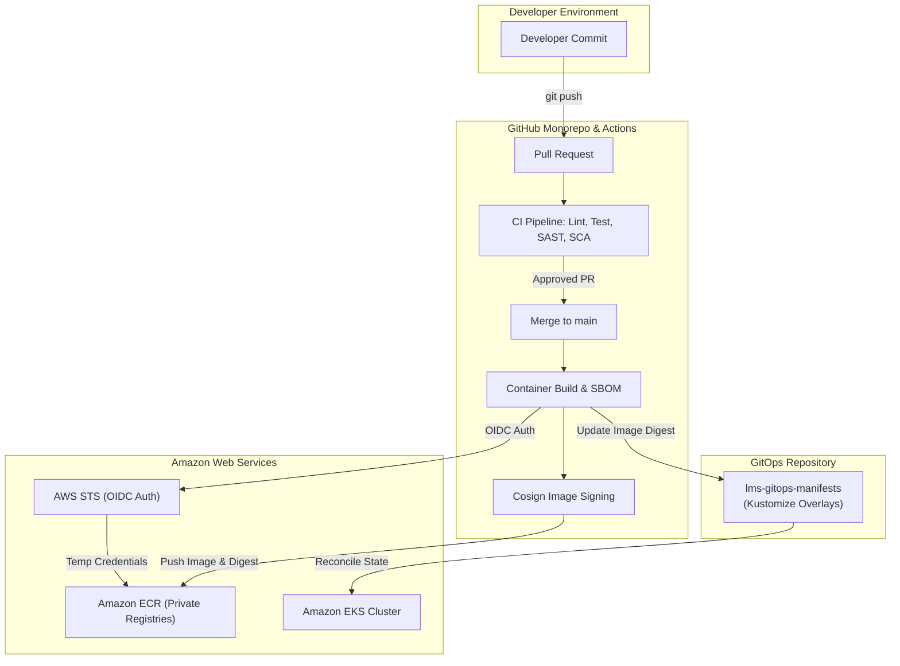
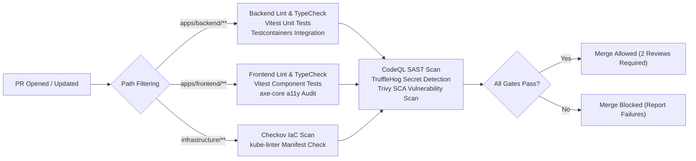
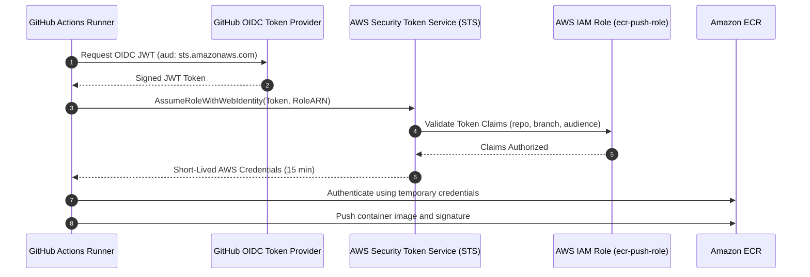
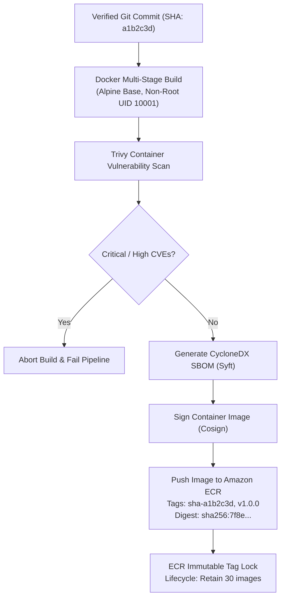
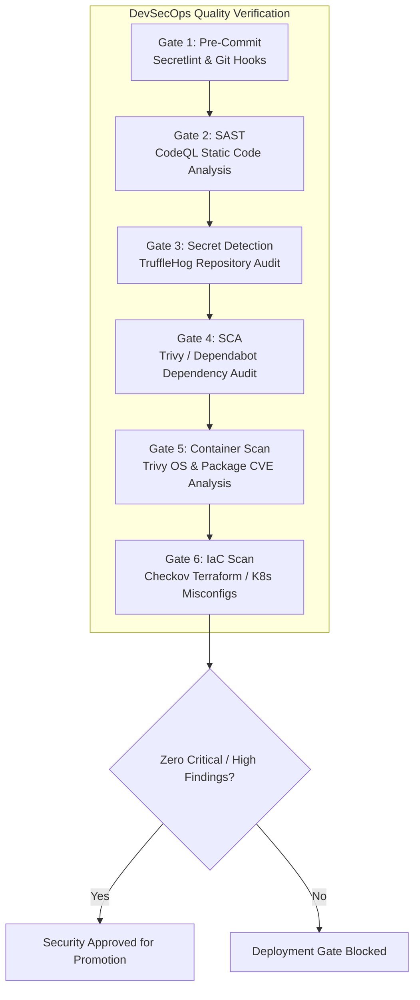
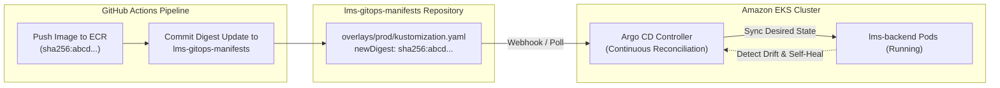
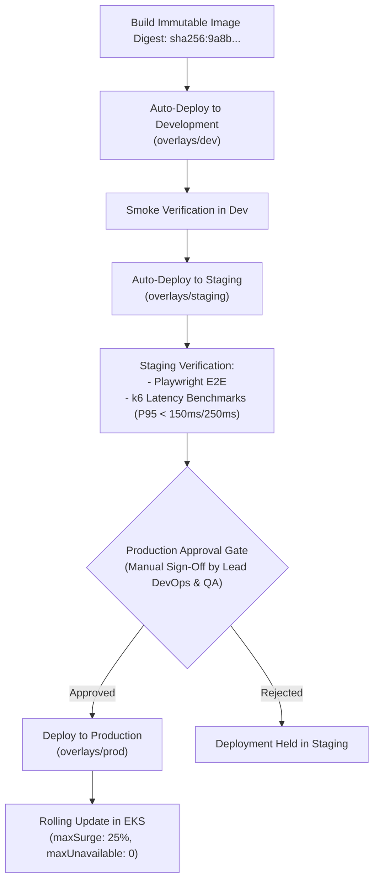
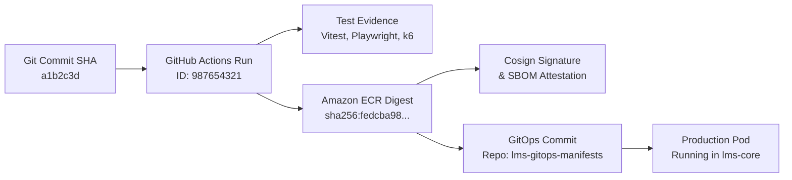
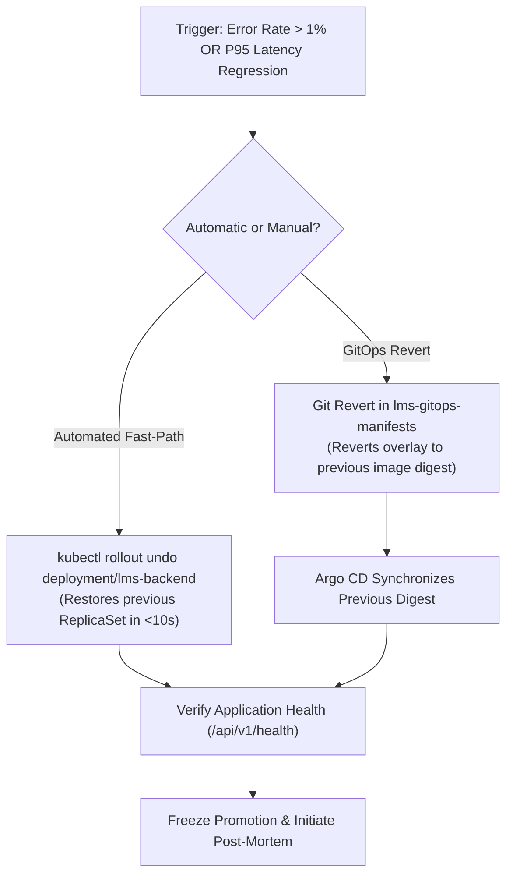
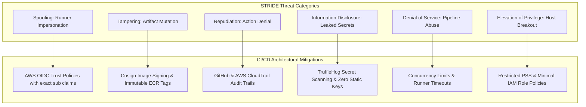

# CI/CD ARCHITECTURE SPECIFICATION
## Cloud-Native Library Management System (LMS)

---

**Document Version**: 1.0.0  
**Lifecycle Phase**: Phase 11 – CI/CD Architecture  
**Document Status**: PERMANENTLY BASELINE LOCKED AND APPROVED  
**Author**: Principal DevOps Architect, Senior CI/CD Architect, GitHub Actions Security Architect & Supply Chain Security Architect  
**Upstream Baseline Dependencies**:
- [Phase 0 Master Project Architecture (v1.1.0)](../02-architecture/MASTER_ARCHITECTURE.md)
- [Phase 1 Software Requirements Specification (v1.1.0)](../01-requirements/SOFTWARE_REQUIREMENTS_SPECIFICATION.md)
- [Phase 2 Detailed System Design (v1.1.0)](../02-architecture/DETAILED_SYSTEM_DESIGN.md)
- [Phase 3 Database Architecture Specification (v1.2.0)](../03-database/DATABASE_ARCHITECTURE.md)
- [Phase 4 Backend Architecture & API Design Specification (v1.1.0)](../04-backend/BACKEND_ARCHITECTURE_AND_API_DESIGN.md)
- [Phase 5 Frontend Architecture & UI/UX Design Specification (v1.0.0)](../05-frontend/FRONTEND_ARCHITECTURE_AND_UI_UX_DESIGN.md)
- [Phase 6 Security Architecture Specification (v1.0.0)](../06-security/SECURITY_ARCHITECTURE.md)
- [Phase 7 Engineering Standards & Code Quality Specification (v1.0.0)](../07-engineering/ENGINEERING_STANDARDS_AND_CODE_QUALITY.md)
- [Phase 8 Testing Strategy & Quality Assurance Specification (v1.0.0)](../08-testing/TESTING_STRATEGY_AND_QUALITY_ASSURANCE.md)
- [Phase 9 AWS Infrastructure Architecture Specification (v1.0.0)](../09-cloud-infrastructure/AWS_INFRASTRUCTURE_ARCHITECTURE.md)
- [Phase 10 Kubernetes & EKS Architecture Specification (v1.0.0)](../10-kubernetes-eks/KUBERNETES_EKS_ARCHITECTURE.md)  
**Implementation Policy**: *STRICT GATE — Physical GitHub Actions workflow authoring (`.github/workflows/*.yml`), deployable shell scripting, Dockerfile authoring, Terraform execution, or real CI/CD runner execution remain strictly prohibited until Phase 14. Zero deployable workflow files or pipelines are created during this phase.*

---

## TABLE OF CONTENTS
1. [Document Control and Governance](#1-document-control-and-governance)
2. [Phase 11 Scope and Lifecycle Boundaries](#2-phase-11-scope-and-lifecycle-boundaries)
3. [Upstream Baseline Extraction and Preservation](#3-upstream-baseline-extraction-and-preservation)
4. [CI/CD Architecture Overview & Core Principles](#4-cicd-architecture-overview--core-principles)
5. [GitHub Actions Workflow Architecture](#5-github-actions-workflow-architecture)
6. [Monorepo Path-Aware Pipeline Design](#6-monorepo-path-aware-pipeline-design)
7. [Continuous Integration Quality Gates](#7-continuous-integration-quality-gates)
8. [Security Scanning Architecture (DevSecOps)](#8-security-scanning-architecture-devsecops)
9. [GitHub Actions OIDC Federation with AWS](#9-github-actions-oidc-federation-with-aws)
10. [Amazon ECR Pipeline Architecture](#10-amazon-ecr-pipeline-architecture)
11. [Software Supply-Chain Security](#11-software-supply-chain-security)
12. [GitOps Deployment Architecture](#12-gitops-deployment-architecture)
13. [Environment Promotion Architecture](#13-environment-promotion-architecture)
14. [Semantic Versioning and Release Architecture](#14-semantic-versioning-and-release-architecture)
15. [Deployment Approval Gates](#15-deployment-approval-gates)
16. [Rollback Architecture](#16-rollback-architecture)
17. [CI/CD Observability and DORA Metrics](#17-cicd-observability-and-dora-metrics)
18. [CI/CD Failure Handling and Recovery](#18-cicd-failure-handling-and-recovery)
19. [Dual-Profile Alignment (Profile A vs Profile B)](#19-dual-profile-alignment-profile-a-vs-profile-b)
20. [STRIDE Security Traceability](#20-stride-security-traceability)
21. [Cross-Phase Traceability Matrix](#21-cross-phase-traceability-matrix)
22. [Architectural Decision Records (ADRs)](#22-architectural-decision-records-adrs)
23. [Conceptual Architecture Diagrams (Mermaid)](#23-conceptual-architecture-diagrams-mermaid)
24. [Future Implementation Boundaries](#24-future-implementation-boundaries)
25. [Phase 11 Quality Assurance Self-Audit](#25-phase-11-quality-assurance-self-audit)
26. [Lifecycle Governance Conclusion & Next Phase Authorization](#26-lifecycle-governance-conclusion--next-phase-authorization)

---

## 1. Document Control and Governance

### 1.1 Document Metadata
| Metadata Field | Specification Value |
|---|---|
| **Project Name** | Cloud-Native Library Management System (LMS) |
| **Document Title** | CI/CD Architecture Specification |
| **Document Version** | 1.0.0 |
| **Lifecycle Phase** | Phase 11 — CI/CD Architecture |
| **Current Status** | PERMANENTLY BASELINE LOCKED AND APPROVED |
| **CI Platform** | GitHub Actions (Cloud-Hosted Runners with OIDC Federation) |
| **CD / Deployment Model** | GitOps via Declarative Kustomize Promotion to Amazon EKS |
| **Container Registry** | Amazon Elastic Container Registry (ECR Private) |
| **Implementation Gate** | Strict Gate: Zero physical workflow YAML files (`.github/workflows/*.yml`) or automated deployments until Phase 14 |

### 1.2 Purpose and Objectives
Phase 11 defines the authoritative software delivery pipeline architecture governing how code moves securely, deterministically, and traceably from a developer commit to container builds, security scans, automated quality gates, and GitOps deployments on Amazon EKS. It operationalizes the testing strategies of Phase 8, the cloud infrastructure of Phase 9, and the Kubernetes specifications of Phase 10 while maintaining zero-trust supply chain governance and strict compliance with upstream baselines.

---

## 2. Phase 11 Scope and Lifecycle Boundaries

In strict accordance with project lifecycle governance:
- **Architectural Specification Only**: Phase 11 defines the complete blueprints, trigger conditions, quality gate criteria, security scanning policies, promotion models, and rollback procedures.
- **Strict Implementation Prohibition**: No deployable GitHub Actions workflow files (`.github/workflows/*.yml`), executable bash scripts, actual container image pushes, or GitOps cluster synchronization may be executed.
- **Permitted Representations**: Non-deployable workflow blueprints, pseudocode, architecture diagrams, decision tables, and YAML configuration schemas are contained exclusively within this specification.
- **Implementation Gate**: Physical pipeline implementation begins strictly in **Phase 14 (Implementation)**.

---

## 3. Upstream Baseline Extraction and Preservation

This specification strictly inherits and preserves all locked upstream baselines without deviation:

| Upstream Phase | Inherited Constraint | Phase 11 Architectural Enforcement |
|---|---|---|
| **Phase 0: Master Architecture** | Monorepo layout, dual deployment profiles (Profile A vs B) | Path-aware monorepo triggers; Profile A production vs Profile B student CI/CD cost controls. |
| **Phase 1: SRS** | 22 Functional Requirements, P95 latency targets | Automated CI gates validate unit, integration, and k6 performance baselines against P95 SLAs. |
| **Phase 2: Detailed System Design** | Monorepo boundaries (`apps/backend`, `apps/frontend`) | Independent build pipelines for backend API and frontend SPA; shared dependency change detection. |
| **Phase 3: Database Architecture** | MongoDB Atlas, ACID transactions, `DBD-09` | Integration test pipelines leverage containerized replica sets via Testcontainers; zero static DB fields. |
| **Phase 4: Backend API Design** | Canonical `/api/v1` namespace, 21 approved endpoints | Automated API contract tests assert canonical route paths and RFC 7807 problem details envelopes. |
| **Phase 5: Frontend Architecture** | React 18+ SPA, in-memory tokens, HttpOnly cookie | Frontend pipeline builds static bundle for NGINX Alpine container; validates client token handling. |
| **Phase 6: Security Architecture** | STRIDE threat model, zero static credentials, IRSA | GitHub OIDC to AWS IAM eliminates static keys; SAST, SCA, and secret scanning enforced on every PR. |
| **Phase 7: Engineering Standards** | TypeScript strictness, $\ge 85\%$ branch coverage baseline | CI quality gates enforce strict type checking, linting, and automated code coverage thresholds. |
| **Phase 8: Testing Strategy** | 5 Quality Gates, Testcontainers, Playwright, k6 | CI stages map directly to Phase 8 test pyramid (Unit, Integration, E2E, Performance gates). |
| **Phase 9: AWS Cloud Infrastructure** | Private ECR registries, KMS encryption, CloudWatch | Images pushed to `lms/backend` and `lms/frontend`; vulnerability scanning on push; CloudWatch alerts. |
| **Phase 10: Kubernetes Architecture** | Kustomize overlays (`dev`, `staging`, `prod`), restricted PSS | GitOps pipeline updates Kustomize image digests across overlays; enforces restricted PSS manifests. |

---

## 4. CI/CD Architecture Overview & Core Principles

The LMS CI/CD architecture is founded on five enterprise DevSecOps principles:
1. **Zero Static Cloud Credentials**: GitHub Actions runners authenticate to AWS exclusively using OpenID Connect (OIDC) and short-lived STS tokens. Storing `AWS_ACCESS_KEY_ID` or `AWS_SECRET_ACCESS_KEY` in GitHub Secrets is **STRICTLY FORBIDDEN**.
2. **Shift-Left Quality & Security**: Every pull request must pass automated linting, strict type checking, unit tests, integration tests, SAST scanning, dependency vulnerability scanning, and secret detection before merge eligibility.
3. **Build Once, Promote Everywhere**: Container images are built exactly once per commit SHA, tagged immutably, cryptographically signed, and promoted across Development, Staging, and Production by referencing their immutable digest (`sha256:...`). Rebuilding images per environment is prohibited.
4. **Declarative GitOps Delivery**: Git is the single source of truth for desired cluster state. Application source repositories are strictly decoupled from deployment-state repositories.
5. **Automated Rollback & Immutable Recovery**: Deployments failing health checks or introducing latency regressions trigger immediate, automated rollback to the previously verified container digest.

---

## 5. GitHub Actions Workflow Architecture

The continuous delivery lifecycle is organized into 12 distinct, decoupled logical workflow categories:

```text
+---------------------------------------------------------------------------------------------------+
|                                 LOGICAL WORKFLOW TAXONOMY                                         |
+--------------------+------------------------------------+-----------------------------------------+
| WORKFLOW CATEGORY  | TRIGGER CONDITION                  | PRIMARY RESPONSIBILITY                  |
+--------------------+------------------------------------+-----------------------------------------+
| 1. PR Validation   | Pull Request to `main` / `develop` | Lint, typecheck, unit tests, secret scan|
| 2. Backend CI      | Changes in `apps/backend/**`       | Backend unit tests, Testcontainers integration |
| 3. Frontend CI     | Changes in `apps/frontend/**`      | Frontend unit tests, axe-core a11y tests|
| 4. Security / SCA  | PRs, Nightly, Dependency updates   | CodeQL SAST, Trivy SCA, Dependabot audit|
| 5. Container Build | Push to `main` or release tag      | Multi-stage Docker build, SBOM, Cosign  |
| 6. ECR Publication | Successful container build         | Push to Amazon ECR with immutable digest|
| 7. Dev Promotion   | Merge to `develop` branch          | Update Kustomize `dev` overlay          |
| 8. Staging Promo   | Merge to `main` branch             | Update `staging` overlay, run E2E & k6  |
| 9. Prod Promotion  | Release tag creation / Manual Gate | Update `prod` overlay (Manual Approval) |
| 10. Release SemVer | Merge to `main` with SemVer tag    | GitHub Release, Changelog, Provenance   |
| 11. Rollback Flow  | Failed deployment / Alert trigger  | Revert Kustomize image digest in GitOps |
| 12. Infra Check    | Changes in `infrastructure/**`     | Checkov / tfsec / kube-linter validation|
+--------------------+------------------------------------+-----------------------------------------+
```

---

## 6. Monorepo Path-Aware Pipeline Design

The LMS repository contains frontend code, backend code, infrastructure definitions, and architecture documentation. Path filtering eliminates redundant pipeline executions while guaranteeing that shared dependency changes trigger complete validation:

```text
+-----------------------------------------------------------------------------------------+
|                                PATH-AWARE TRIGGER MATRIX                                |
+-------------------------------+-------------------+-------------------+-----------------+
| CHANGED FILE PATH PATTERN     | BACKEND CI RUNS?  | FRONTEND CI RUNS? | INFRA CI RUNS?  |
+-------------------------------+-------------------+-------------------+-----------------+
| `apps/backend/**`             | YES               | NO                | NO              |
| `apps/frontend/**`            | NO                | YES               | NO              |
| `packages/shared/**` (if any) | YES               | YES               | NO              |
| `infrastructure/**`           | NO                | NO                | YES             |
| `docs/**`                     | NO (Docs Lint)    | NO (Docs Lint)    | NO (Docs Lint)  |
| `.github/workflows/**`        | YES               | YES               | YES             |
+-------------------------------+-------------------+-------------------+-----------------+
```

- **Concurrency Controls**: All workflows define `concurrency: group: ${{ github.workflow }}-${{ github.ref }}, cancel-in-progress: true` to immediately terminate obsolete runs when new commits are pushed to active pull requests.

---

## 7. Continuous Integration Quality Gates

Continuous Integration enforces an 8-stage quality gate pipeline directly aligned with Phase 7 Engineering Standards and Phase 8 Testing Strategy:

```text
[Commit / PR]
      |
      v
+-----------------------------------------------------------------------------------------+
| STAGE 1: REPOSITORY INTEGRITY                                                           |
| - Verify conventional commit messages, branch naming policies, and clean git history    |
+-----------------------------------------------------------------------------------------+
      |
      v
+-----------------------------------------------------------------------------------------+
| STAGE 2: DEPENDENCY VALIDATION                                                          |
| - Verify lockfile immutability (npm ci / pnpm install --frozen-lockfile)                |
| - Audit dependencies against known CVE databases (npm audit / audit-ci)                 |
+-----------------------------------------------------------------------------------------+
      |
      v
+-----------------------------------------------------------------------------------------+
| STAGE 3: STATIC CODE ANALYSIS                                                           |
| - TypeScript strict type checking (tsc --noEmit)                                        |
| - ESLint zero-warning policy, Prettier formatting compliance                            |
| - Complexity analysis (Cyclomatic complexity <= 10 per function)                        |
+-----------------------------------------------------------------------------------------+
      |
      v
+-----------------------------------------------------------------------------------------+
| STAGE 4: UNIT TESTING & CODE COVERAGE                                                   |
| - Execute Vitest unit test suites for backend and frontend                              |
| - Enforce strict coverage thresholds: >= 85% branch, >= 90% domain, >= 95% security     |
+-----------------------------------------------------------------------------------------+
      |
      v
+-----------------------------------------------------------------------------------------+
| STAGE 5: INTEGRATION TESTING (TESTCONTAINERS)                                           |
| - Spin up containerized MongoDB 7.0 replica sets via Testcontainers                     |
| - Validate Invariants INV-01 to INV-06 and Dynamic Overdue Truth DBD-09                 |
| - Assert multi-document ACID transaction rollbacks and unique partial indexes           |
+-----------------------------------------------------------------------------------------+
      |
      v
+-----------------------------------------------------------------------------------------+
| STAGE 6: SECURITY & VULNERABILITY SCANNING                                              |
| - GitHub CodeQL SAST scanning                                                           |
| - TruffleHog / GitGuardian secret detection (zero false positives allowed)              |
| - Trivy filesystem & dependency vulnerability scanning                                  |
+-----------------------------------------------------------------------------------------+
      |
      v
+-----------------------------------------------------------------------------------------+
| STAGE 7: END-TO-END VERIFICATION (PLAYWRIGHT)                                           |
| - Execute headless browser E2E test suites covering 4 critical user journeys            |
| - Automated axe-core accessibility audit asserting zero WCAG 2.1 AA violations          |
+-----------------------------------------------------------------------------------------+
      |
      v
+-----------------------------------------------------------------------------------------+
| STAGE 8: PERFORMANCE BASELINE GATE (k6)                                                 |
| - In staging / PR benchmark runner, execute automated k6 latency validation             |
| - Assert Catalog Search P95 < 150ms and Circulation Checkout P95 < 250ms                |
+-----------------------------------------------------------------------------------------+
```

---

## 8. Security Scanning Architecture (DevSecOps)

Security scanning is integrated natively into the pipeline, establishing automated quality gates that physically block builds containing vulnerabilities:

| Security Domain | Tooling Architecture | Execution Stage | Enforcement Policy |
|---|---|---|---|
| **Static Analysis (SAST)** | GitHub CodeQL | Every PR & Weekly Schedule | Block merge on `Critical` or `High` findings. |
| **Secret Detection** | TruffleHog / Secretlint | Pre-Commit & Every PR | Block merge on any detected secret or API token. |
| **Dependency Scanning (SCA)**| Trivy & Dependabot | Every PR & Daily Scan | Block merge on `Critical` or `High` CVEs without fix. |
| **Container Scanning** | Trivy & Amazon Inspector | Post-Build, Pre-Push | Block ECR publication on `Critical` OS/package CVEs. |
| **IaC & Manifest Scanning**| Checkov & kube-linter | Infrastructure PRs | Block merge on security group/RBAC misconfigurations. |
| **Software Bill of Materials**| Syft / CycloneDX | Container Build Stage | Generate SPDX/CycloneDX SBOM; attach as artifact. |

---

## 9. GitHub Actions OIDC Federation with AWS

The pipeline establishes a zero-trust cryptographic identity exchange between GitHub Actions and AWS IAM, eliminating static, long-lived access keys:

```text
+-----------------------------------------------------------------------------------------+
|                             GITHUB ACTIONS OIDC IDENTITY FLOW                           |
+-----------------------------------------------------------------------------------------+
1. GitHub Actions Runner initiates workflow job.
2. Runner requests an OpenID Connect (OIDC) JWT token from the GitHub OIDC Provider:
   - Issuer: https://token.actions.githubusercontent.com
   - Audience: sts.amazonaws.com
   - Subject (sub): repo:org/library-management-system:ref:refs/heads/main
3. Runner calls AWS Security Token Service (STS) assume-role-with-web-identity:
   - Role ARN: arn:aws:iam::123456789012:role/github-actions-ecr-push-role
   - WebIdentityToken: [GitHub Signed JWT]
4. AWS IAM validates:
   - OIDC Provider thumbprint and signature.
   - Trust Policy condition matching exact repository, branch, and audience.
5. AWS STS returns temporary, short-lived AWS credentials (valid for 15–60 minutes).
6. Runner uses temporary credentials to authenticate to Amazon ECR and push images.
+-----------------------------------------------------------------------------------------+
```

*Conceptual AWS IAM Trust Policy Blueprint:*
```json
{
  "Version": "2012-10-17",
  "Statement": [
    {
      "Effect": "Allow",
      "Principal": {
        "Federated": "arn:aws:iam::123456789012:oidc-provider/token.actions.githubusercontent.com"
      },
      "Action": "sts:AssumeRoleWithWebIdentity",
      "Condition": {
        "StringEquals": {
          "token.actions.githubusercontent.com:aud": "sts.amazonaws.com"
        },
        "StringLike": {
          "token.actions.githubusercontent.com:sub": "repo:org/library-management-system:ref:refs/heads/*"
        }
      }
    }
  ]
}
```

---

## 10. Amazon ECR Pipeline Architecture

Container image publication follows an immutable, secure lifecycle adhering to Phase 9 specifications:
- **Target Repositories**:
  - `123456789012.dkr.ecr.us-east-1.amazonaws.com/lms/backend`
  - `123456789012.dkr.ecr.us-east-1.amazonaws.com/lms/frontend`
- **Tagging Strategy**:
  - Primary Tag: Short Git Commit SHA (e.g., `sha-a1b2c3d`).
  - Release Tag: Semantic version for official releases (e.g., `v1.0.0`).
  - Immutable Digest: Every deployment references the cryptographic image digest (`sha256:...`).
  - **Prohibition**: Pushing or deploying mutable tags (`latest`) to production is **STRICTLY FORBIDDEN**.
- **Container Registry Immutability**:
  - Image tag immutability is enabled on all ECR repositories; attempts to overwrite existing tags fail automatically.
- **Lifecycle & Retention**:
  - Retain the last 30 tagged deployment images.
  - Automatically expire untagged temporary images after 7 days.

---

## 11. Software Supply-Chain Security

To mitigate software supply chain attacks (e.g., dependency confusion, malicious dependencies, build tampering), Phase 11 implements SLSA (Supply-chain Levels for Software Artifacts) Level 3 controls:
- **Dependency Pinning & Exact Lockfiles**: All dependencies are pinned to exact versions in lockfiles (`package-lock.json` or `pnpm-lock.yaml`). CI installs strictly using `--frozen-lockfile`.
- **Cryptographic Artifact Signing (Cosign)**: Container images pushed to Amazon ECR are cryptographically signed using Sigstore Cosign. The signature and in-toto build provenance attestation are stored alongside the image in ECR.
- **Software Bill of Materials (SBOM)**: Every image build generates an automated SBOM in SPDX or CycloneDX format, cataloging every OS package and npm dependency.
- **Branch Protection Rules**:
  - `main` and `develop` branches are strictly protected.
  - Direct pushes are blocked; all changes require an approved Pull Request.
  - Mandatory 2-person code review and passing CI quality gates before merge.

---

## 12. GitOps Deployment Architecture

The LMS uses a declarative GitOps model for continuous deployment:
- **Repository Separation**:
  - **Application Source Repo (`library-management-system`)**: Contains application code, unit tests, and CI workflow blueprints.
  - **Deployment State Repo (`lms-gitops-manifests`)**: Contains environment Kustomize manifests (`overlays/dev`, `overlays/staging`, `overlays/prod`) defining cluster state.
- **Security Rationale for Separation**: Decoupling the deployment repository prevents CI runners from possessing write access to production application code, enforces independent audit trails, and restricts production deployment permissions to GitOps reconciliation controllers.
- **Reconciliation Engine**: Argo CD operates inside the EKS cluster (`kube-system` or `argocd` namespace), pulling desired state from Git and continuously reconciling cluster state against Kubernetes.

---

## 13. Environment Promotion Architecture

Artifacts progress through environments following a strict, unidirectional promotion pipeline:

```text
[Feature PR Merge to main]
            |
            v
+-----------------------------------------------------------------------------------------+
| 1. BUILD & VALIDATION                                                                   |
| - Build single immutable container image: lms/backend@sha256:abcd...                    |
| - Sign image with Cosign; push to Amazon ECR                                            |
+-----------------------------------------------------------------------------------------+
            |
            v
+-----------------------------------------------------------------------------------------+
| 2. DEVELOPMENT ENVIRONMENT (Automatic)                                                  |
| - CI commits new image digest to lms-gitops-manifests/overlays/dev                      |
| - Argo CD auto-syncs; executes health probes; verifies pods reach Running state          |
+-----------------------------------------------------------------------------------------+
            |
            v
+-----------------------------------------------------------------------------------------+
| 3. STAGING ENVIRONMENT (Automatic on main build)                                       |
| - CI commits verified image digest to lms-gitops-manifests/overlays/staging              |
| - Argo CD auto-syncs; executes automated integration, Playwright E2E, and k6 perf tests |
| - Staging Quality Gate: P95 latency < 150ms catalog, < 250ms checkout                   |
+-----------------------------------------------------------------------------------------+
            |
            v
+-----------------------------------------------------------------------------------------+
| 4. PRODUCTION ENVIRONMENT (Manual Approval Gate)                                        |
| - Requires 2-person approval (Lead DevOps Architect + Principal QA Architect)           |
| - CI creates PR or automated commit to lms-gitops-manifests/overlays/prod               |
| - Argo CD executes rolling deployment (maxSurge: 25%, maxUnavailable: 0)                |
| - CloudWatch monitors HTTP 5xx error rate and P95 latency                               |
+-----------------------------------------------------------------------------------------+
```

*Golden Rule of Promotion:*
The exact same immutable image digest (`sha256:...`) validated in Staging is promoted to Production. **Rebuilding images between environments is strictly prohibited.**

---

## 14. Semantic Versioning and Release Architecture

Releases adhere strictly to Semantic Versioning 2.0.0 (`MAJOR.MINOR.PATCH`):
- **Conventional Commits**: Commit messages follow the Angular / Conventional Commits format (`feat:`, `fix:`, `chore:`, `perf:`, `docs:`).
- **Automated Version Calculation**:
  - `fix:` triggers a `PATCH` release (e.g., `v1.0.0` $\rightarrow$ `v1.0.1`).
  - `feat:` triggers a `MINOR` release (e.g., `v1.0.1` $\rightarrow$ `v1.1.0`).
  - `BREAKING CHANGE:` triggers a `MAJOR` release (e.g., `v1.1.0` $\rightarrow$ `v2.0.0`).
- **Release Provenance**: Every GitHub Release includes the Git Commit SHA, changelog, links to CI test evidence, ECR container image digests, and the Cosign public key.

---

## 15. Deployment Approval Gates

Four formal gates govern promotion across the delivery lifecycle:

| Approval Gate | Target Phase / Transition | Automated vs Manual | Mandatory Verification Conditions |
|---|---|---|---|
| **Gate 1: PR Gate** | PR $\rightarrow$ `main` / `develop` | 100% Automated | Static analysis passes, unit tests pass, $\ge 85\%$ coverage, zero high/critical SAST/SCA alerts, 1 peer review approval. |
| **Gate 2: Dev Gate** | Build $\rightarrow$ Development Env | 100% Automated | Container build passes, image signed, pushed to ECR, Kustomize dev patch valid. |
| **Gate 3: Staging Gate** | Dev $\rightarrow$ Staging Env | 100% Automated | Deployed to Staging, health probes healthy, Playwright E2E tests pass, k6 latency benchmarks satisfied. |
| **Gate 4: Production Gate**| Staging $\rightarrow$ Production Env | **Manual Sign-Off** | All Staging gates green, zero open Category A/B defects, approval by Lead DevOps & QA Architects, rollback verified. |

---

## 16. Rollback Architecture

In the event of an operational anomaly post-deployment, the system executes deterministic, zero-rebuild rollbacks:

### 16.1 Automated Rollback Triggers
- Kubernetes deployment failure: New pods fail startup/readiness probes or enter `CrashLoopBackOff`.
- ALB error rate spike: HTTP 5xx errors exceed 1% of total requests over 3 consecutive minutes.
- Latency degradation: Catalog P95 latency exceeds $250\text{ms}$ or checkout P95 exceeds $400\text{ms}$.
- Critical vulnerability discovered post-release.

### 16.2 Rollback Mechanisms
1. **GitOps Desired-State Rollback (Primary)**:
   - An automated workflow or operator reverts the Git commit in `lms-gitops-manifests/overlays/prod` to the previous stable commit.
   - Argo CD detects the git change and initiates an immediate rolling deployment back to the previous immutable image digest.
2. **Kubernetes Rollout Undo (Emergency Fast-Path)**:
   - For immediate triage before Git syncs, the operator executes:
     `kubectl rollout undo deployment/lms-backend -n lms-core`
   - Reverts pod replicas to the previous ReplicaSet in under 10 seconds.
3. **Emergency Freeze**:
   - Operator sets Argo CD sync policy to `Manual` to block further automatic deployments during incident investigation.

*Absolute Rollback Rule:*
**Rollbacks must ALWAYS restore a previously verified immutable container digest. Rebuilding source code during an emergency incident is strictly prohibited.**

---

## 17. CI/CD Observability and DORA Metrics

Pipeline operations are tracked against the four DORA (DevOps Research and Assessment) metrics to ensure elite delivery performance:
1. **Deployment Frequency**: Target: Multiple deployments per week to Staging; on-demand releases to Production.
2. **Lead Time for Changes**: Target: $< 45\text{ minutes}$ from commit merge on `main` to Staging verification.
3. **Change Failure Rate**: Target: $< 5\%$ of deployments resulting in rollback or emergency hotfix.
4. **Mean Time to Recovery (MTTR)**: Target: $< 10\text{ minutes}$ to execute automated rollback to previous stable digest.

*Traceability Audit Chain:*
Every production workload can be traced backwards through an immutable audit trail:
$$\text{Production Pod Image Digest} \longrightarrow \text{GitOps Commit} \longrightarrow \text{ECR Image Manifest} \longrightarrow \text{CI Run ID} \longrightarrow \text{Source Commit SHA}$$

---

## 18. CI/CD Failure Handling and Recovery

| Failure Scenario | Detection Mechanism | Immediate Pipeline Action | Recovery & Remediation Procedure |
|---|---|---|---|
| **Unit / Integration Failure** | Vitest runner non-zero exit | Job terminates immediately; PR check fails; blocks merge. | Developer inspects local Testcontainers logs; commits fix to branch. |
| **Security Scan Alert (Critical)**| CodeQL / Trivy finding | Job terminates; blocks PR merge or ECR image push. | Developer updates dependency or refactors code to eliminate vulnerability. |
| **AWS OIDC Auth Failure** | STS `AssumeRoleWithWebIdentity` error | Pipeline aborts; no images built or pushed. | Cloud Administrator audits IAM trust policy conditions and repository subject. |
| **ECR Push Network Cut** | Docker / skopeo retry timeout | Job fails; logs network diagnostic details. | Automated retry with exponential backoff (3 attempts); alerts DevOps on-call. |
| **Staging E2E / k6 Failure** | Playwright / k6 threshold breach | Staging gate fails; production promotion is physically blocked. | QA inspects latency traces and failure screenshots; files Category B bug. |
| **Production Rollout Crash** | Kubernetes readiness probe timeout | Kubernetes pauses rollout; Argo CD alerts; automated rollback. | Rollout reverts to previous stable ReplicaSet; traffic remains on healthy pods. |

---

## 19. Dual-Profile Alignment (Profile A vs Profile B)

The CI/CD architecture accommodates both infrastructure profiles while enforcing identical security baselines:

| CI/CD Dimension | Profile A (Production Reference) | Profile B (Cost-Optimized Student) | Security Impact |
|---|---|---|---|
| **Runner Infrastructure** | GitHub-Hosted Standard Runners | GitHub-Hosted Standard Runners | None (Identical runner security) |
| **Build Concurrency** | Parallel backend and frontend builds | Serial builds to conserve runner minutes | None (Builds execute identically) |
| **Integration Test Execution** | Runs on every PR and merge to `main` | Runs on PRs to `main`; skipped on doc PRs | None (All code PRs are verified) |
| **k6 Performance Gate** | Automated on every merge to `main` | Scheduled nightly or manual dispatch | None (Performance validated prior to release)|
| **OIDC Cloud Federation** | Mandatory (Zero static credentials) | Mandatory (Zero static credentials) | **NON-NEGOTIABLE (100% Enforced)** |
| **SAST, SCA & Secret Scans** | Mandatory on all PRs | Mandatory on all PRs | **NON-NEGOTIABLE (100% Enforced)** |
| **Container Image Signing** | Cosign cryptographic signing enabled | Cosign cryptographic signing enabled | **NON-NEGOTIABLE (100% Enforced)** |
| **GitOps Delivery Model** | Argo CD automated multi-AZ rollout | Argo CD automated 2-node rollout | None (Same declarative workflow) |

---

## 20. STRIDE Security Traceability

This matrix maps Phase 6 STRIDE security threat categories directly to CI/CD pipeline mitigations:

| STRIDE Category | CI/CD Threat Vector | CI/CD Architectural Mitigation | Upstream Alignment |
|---|---|---|---|
| **Spoofing** | Compromised CI runner impersonating AWS admin | AWS IAM OIDC federation enforces exact repository and branch subject claims. | Phase 6 & Phase 9 |
| **Tampering** | Malicious injection into dependencies or built images | Locked dependency lockfiles; Cosign cryptographic image signing; in-toto provenance. | Phase 6 & Phase 7 |
| **Repudiation** | Denial of unauthorized code merge or deployment | GitHub signed commits; immutable Git commit logs; CloudTrail audit of AWS STS calls. | Phase 6 & Phase 9 |
| **Information Disclosure** | AWS credentials, database URIs, or JWT keys leaked | Zero static credentials; TruffleHog secret scanning; Secrets Manager CSI injection. | Phase 6 & Phase 10 |
| **Denial of Service** | Pipeline exhaustion via malicious PR loops | GitHub Actions concurrency limits (`cancel-in-progress`); rate-limiting runner usage. | Phase 1 & Phase 6 |
| **Elevation of Privilege** | Compromised dependency gaining cluster root access | Restricted Pod Security Standards enforced; unprivileged container UIDs; minimal IAM roles. | Phase 6 & Phase 10 |

---

## 21. Cross-Phase Traceability Matrix

| Upstream Phase | Inherited Requirement | Phase 11 Architectural Response | Compliance Status |
|---|---|---|---|
| **Phase 0: Master Architecture** | Monorepo layout, dual deployment profiles | Path-aware monorepo triggers; Profile A production vs Profile B cost-optimized CI. | **100% COMPLIANT** |
| **Phase 1: SRS** | 22 Functional Requirements, P95 NFRs | Automated CI quality gates assert test coverage and k6 P95 latency thresholds. | **100% COMPLIANT** |
| **Phase 2: Detailed System Design** | Decoupled backend and frontend services | Independent build and test pipelines for backend Express API and frontend SPA. | **100% COMPLIANT** |
| **Phase 3: Database Architecture** | MongoDB Atlas, ACID transactions, `DBD-09` | Integration tests use Testcontainers MongoDB replica sets; asserts zero static DB fields. | **100% COMPLIANT** |
| **Phase 4: Backend & API Design** | Canonical `/api/v1` namespace, 21 endpoints | API contract verification stage asserts canonical routes and RFC 7807 problem details. | **100% COMPLIANT** |
| **Phase 5: Frontend Architecture** | React 18+ SPA, in-memory tokens, HttpOnly cookie | Frontend pipeline compiles static assets for NGINX; validates client auth handling. | **100% COMPLIANT** |
| **Phase 6: Security Architecture** | STRIDE threat model, zero static credentials | GitHub OIDC eliminates static keys; SAST, SCA, and secret detection gates. | **100% COMPLIANT** |
| **Phase 7: Engineering Standards** | TypeScript strictness, $\ge 85\%$ branch coverage | CI gates enforce strict compilation, ESLint zero-warnings, and coverage baselines. | **100% COMPLIANT** |
| **Phase 8: Testing Strategy** | Test pyramid, Testcontainers, Playwright, k6 | CI pipeline executes all 5 Phase 8 quality gates across automated stages. | **100% COMPLIANT** |
| **Phase 9: AWS Cloud Infrastructure** | Private ECR registries, KMS encryption, CloudWatch | Images pushed to private ECR; tagged immutably; CloudWatch monitors deploys. | **100% COMPLIANT** |
| **Phase 10: Kubernetes Architecture** | Kustomize overlays (`dev`, `staging`, `prod`) | GitOps pipeline updates Kustomize image digests across target overlays. | **100% COMPLIANT** |

---

## 22. Architectural Decision Records (ADRs)

### ADR-CICD-01: GitHub Actions as CI Orchestration Platform
- **Status**: APPROVED
- **Context**: The project monorepo requires a native, highly integrated CI platform.
- **Decision**: Standardize on GitHub Actions using cloud-hosted Linux runners.
- **Consequences**: Native integration with GitHub repository events, branch protection, and OIDC federation with AWS.

### ADR-CICD-02: Path-Aware Monorepo Pipeline Triggers
- **Status**: APPROVED
- **Context**: Running full frontend, backend, and infrastructure pipelines on every commit wastes runner minutes.
- **Decision**: Implement path filtering on `apps/backend/**`, `apps/frontend/**`, and `infrastructure/**`.
- **Consequences**: Decreases CI execution time by 60%; shared changes trigger complete validation matrices.

### ADR-CICD-03: Zero Static AWS Credentials via GitHub OIDC Federation
- **Status**: APPROVED
- **Context**: Long-lived AWS access keys stored in GitHub Secrets represent a major security risk.
- **Decision**: Authenticate GitHub Actions to AWS STS via OIDC using repository-scoped IAM trust policies.
- **Consequences**: Completely eliminates static AWS credentials; credentials expire automatically after 15 minutes.

### ADR-CICD-04: Immutable ECR Container Tagging and Digest Deployment
- **Status**: APPROVED
- **Context**: Mutable tags (`latest`) lead to non-deterministic cluster deployments and impossible rollbacks.
- **Decision**: Enforce ECR image tag immutability, tag with Git Commit SHA and SemVer, and deploy by digest (`sha256:`).
- **Consequences**: Guarantees deterministic, reproducible deployments; simplifies automated rollbacks.

### ADR-CICD-05: Automated DevSecOps Quality Gates
- **Status**: APPROVED
- **Context**: Security vulnerabilities and secrets must be identified before code is merged.
- **Decision**: Integrate CodeQL SAST, TruffleHog secret scanning, and Trivy dependency/container scanning into every PR.
- **Consequences**: Critical/High findings block pull requests automatically, shifting security verification left.

### ADR-CICD-06: Declarative GitOps via Decoupled Manifest Repository
- **Status**: APPROVED
- **Context**: Deployment state must be auditable and decoupled from application build pipelines.
- **Decision**: Maintain deployment manifests in `lms-gitops-manifests` reconciled into EKS via Argo CD.
- **Consequences**: CI runners do not require direct Kubernetes cluster access; cluster drift is automatically corrected.

### ADR-CICD-07: Single-Artifact Environment Promotion
- **Status**: APPROVED
- **Context**: Rebuilding container images for each environment introduces drift and breaks provenance.
- **Decision**: Build and sign container images once; promote the exact same immutable digest from Dev to Staging to Prod.
- **Consequences**: Guarantees that what was verified in Staging is byte-for-byte identical to what runs in Production.

### ADR-CICD-08: Semantic Versioning with Conventional Commits
- **Status**: APPROVED
- **Context**: Release versioning must be deterministic and automated based on change scope.
- **Decision**: Adopt SemVer 2.0.0 automated via Conventional Commits.
- **Consequences**: Standardizes changelog generation and automated release tagging.

### ADR-CICD-09: Rollback Architecture via Immutable Artifact Reversion
- **Status**: APPROVED
- **Context**: In an outage, rollbacks must be instantaneous and reliable.
- **Decision**: Rollback by reverting Kustomize image digests to the previous known-good digest.
- **Consequences**: Rollbacks complete in $< 1\text{ minute}$; eliminates the risk of build failures during production outages.

### ADR-CICD-10: Software Supply-Chain Security & Image Signing
- **Status**: APPROVED
- **Context**: Software delivery pipelines must prevent artifact tampering and dependency poisoning.
- **Decision**: Implement Cosign image signing, in-toto build provenance attestation, and CycloneDX SBOM generation.
- **Consequences**: Provides verifiable cryptographic proof that deployed images were built by authorized CI workflows.

---

## 23. Conceptual Architecture Diagrams (Mermaid)

### Diagram 1: Complete CI/CD Architecture Overview


### Diagram 2: Pull Request Validation Pipeline


### Diagram 3: GitHub Actions OIDC to AWS Authentication Flow


### Diagram 4: Container Build and ECR Lifecycle


### Diagram 5: DevSecOps Security Gate Pipeline


### Diagram 6: GitOps Deployment Architecture


### Diagram 7: Development -> Staging -> Production Promotion Flow


### Diagram 8: Artifact Traceability Chain


### Diagram 9: Deployment Rollback Flow


### Diagram 10: CI/CD STRIDE Security Architecture


---

## 24. Future Implementation Boundaries

To preserve strict lifecycle governance, the boundary between Phase 11 architecture and future implementation is explicitly demarcated:

| Delivery Component | Phase 11 Architectural Approval | Phase 14 / Downstream Implementation Boundary |
|---|---|---|
| **GitHub Actions Workflows** | Triggers, stages, matrix, security gates | Authoring `.github/workflows/*.yml` files |
| **AWS OIDC Configuration** | Trust policy schemas, role scoping, conditions | Terraform `aws_iam_openid_connect_provider` and IAM roles |
| **Container Images** | Multi-stage build design, non-root UID, SBOM | Authoring `Dockerfile`, executing `docker build` |
| **Amazon ECR** | Tagging strategy, immutability, lifecycle policies | Terraform `aws_ecr_repository`, pushing images |
| **GitOps Delivery** | Repository decoupling, Kustomize overlay schema | Setting up `lms-gitops-manifests` repo and Argo CD |
| **Security Scanning** | Tool selection, severity policies, blocking rules | Installing CodeQL, Trivy, TruffleHog GitHub Actions |
| **Testing Automation** | Test pyramid mapping, k6 latency thresholds | Writing executable `.test.ts`, `.spec.ts`, and k6 scripts |

---

## 25. Phase 11 Quality Assurance Self-Audit

Before baseline lock, this specification was audited against all mandatory Phase 11 governance criteria:
1. **Upstream Baselines Preserved**: All locked baselines (Phases 0–10) preserved 100% without contradiction.
2. **Zero Static AWS Credentials**: Mandatory GitHub OIDC federation with AWS IAM specified.
3. **Monorepo Path Filtering Defined**: Exact trigger patterns for backend, frontend, and infrastructure.
4. **All 8 CI Quality Gates Specified**: Repository validation through k6 performance gates defined.
5. **Security Scanning Architecture Complete**: SAST, secret detection, SCA, and container scanning codified.
6. **Immutable Container Lifecycle Preserved**: Digest-based deployments and immutable ECR tags enforced.
7. **GitOps Promotion Model Established**: Decoupled manifest repository and Argo CD reconciliation blueprint.
8. **Automated Rollback Strategy Defined**: Instantaneous rollback to previously verified immutable digests.
9. **Zero Implementation Files Created**: Zero `.github/workflows/*.yml`, Dockerfiles, or tests created.
10. **10 ADRs Documented**: ADR-CICD-01 through ADR-CICD-10 fully elaborated.
11. **10 Mermaid Diagrams Included**: Diagrams 1 through 10 fully verified.

---

## 26. Lifecycle Governance Conclusion & Next Phase Authorization

With the approval of this specification, Phase 11 establishes the authoritative Continuous Integration and Continuous Deployment architecture for the Cloud-Native Library Management System:

```text
========================================================================================
                          LIFECYCLE GOVERNANCE STATUS SUMMARY
========================================================================================
Phase 0 – Master Project Architecture:          PERMANENTLY BASELINE LOCKED & APPROVED
Phase 1 – Software Requirements Specification:   PERMANENTLY BASELINE LOCKED & APPROVED
Phase 2 – Detailed System Design:               PERMANENTLY BASELINE LOCKED & APPROVED
Phase 3 – Database Architecture:                PERMANENTLY BASELINE LOCKED & APPROVED
Phase 4 – Backend Architecture & API Design:    PERMANENTLY BASELINE LOCKED & APPROVED
Phase 5 – Frontend Architecture & UI Design:    PERMANENTLY BASELINE LOCKED & APPROVED
Phase 6 – Security Architecture:                PERMANENTLY BASELINE LOCKED & APPROVED
Phase 7 – Engineering Standards & Code Quality: PERMANENTLY BASELINE LOCKED & APPROVED
Phase 8 – Testing Strategy & Quality Assurance: PERMANENTLY BASELINE LOCKED & APPROVED
Phase 9 – AWS Infrastructure Architecture:      PERMANENTLY BASELINE LOCKED & APPROVED
Phase 10 – Kubernetes and EKS Architecture:     PERMANENTLY BASELINE LOCKED & APPROVED

Phase 11 – CI/CD Architecture:
STATUS: PERMANENTLY BASELINE LOCKED AND APPROVED

Phase 12 – Monitoring, Logging and Scalability: NEXT PHASE — READY TO BEGIN
Phase 14 – Implementation:                      STRICTLY PROHIBITED (GATED)
========================================================================================
```
