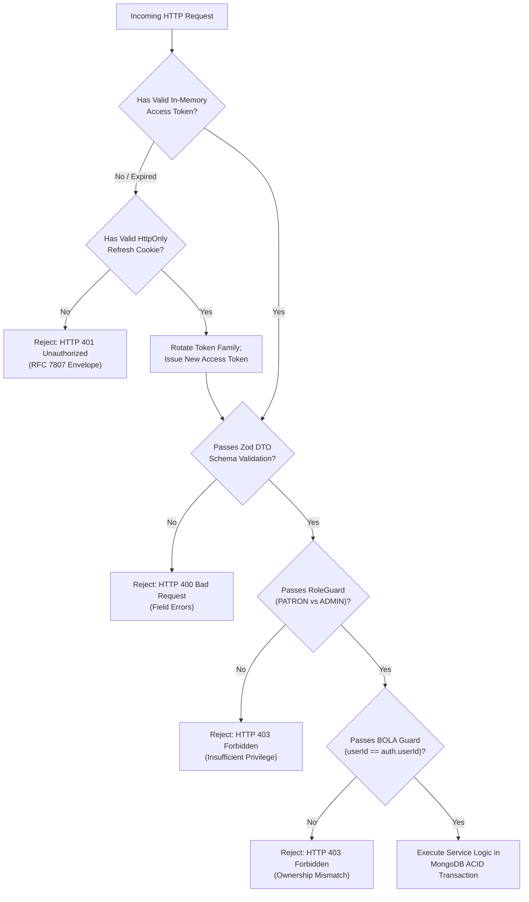
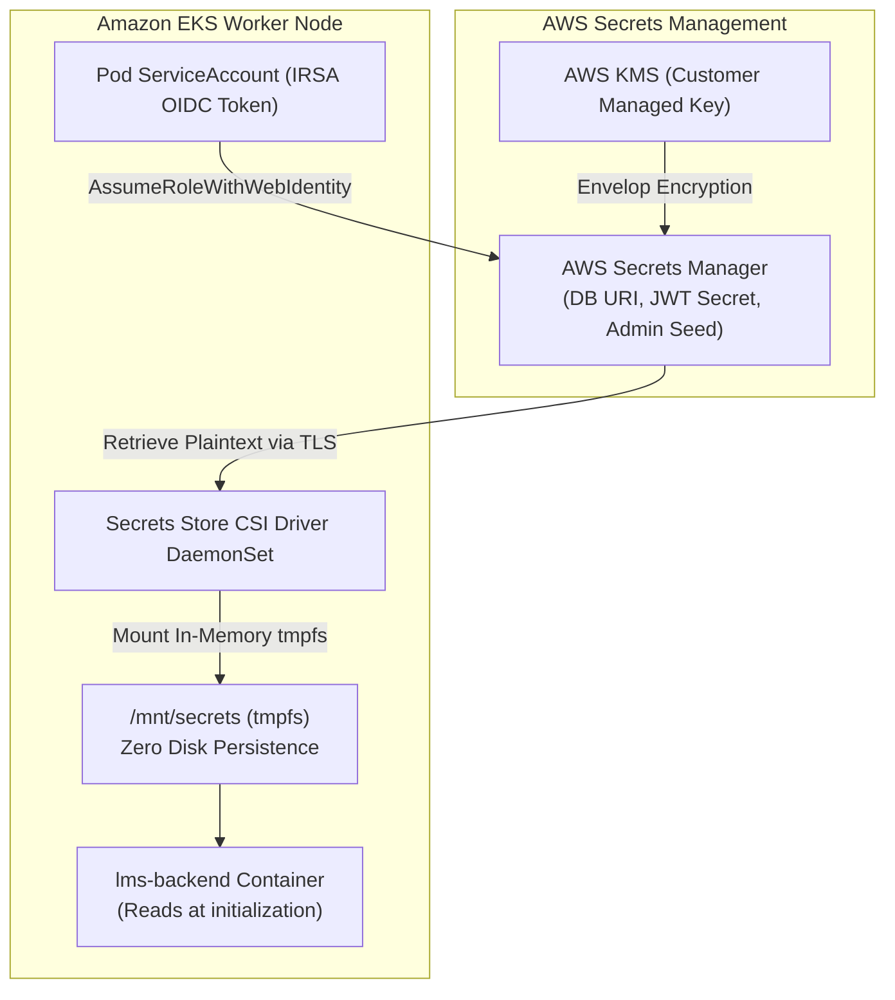
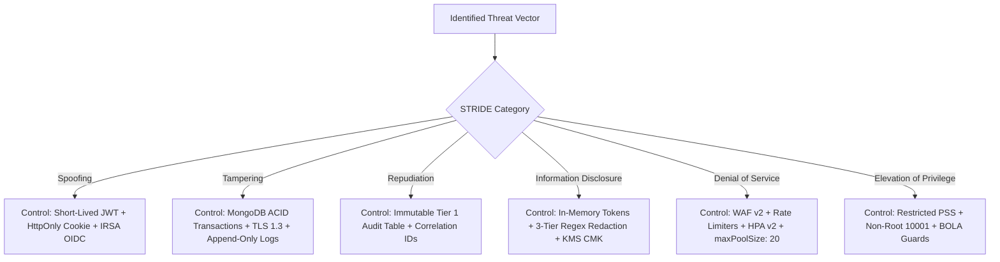
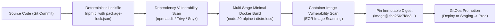
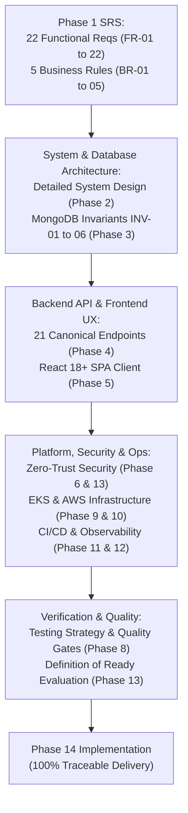
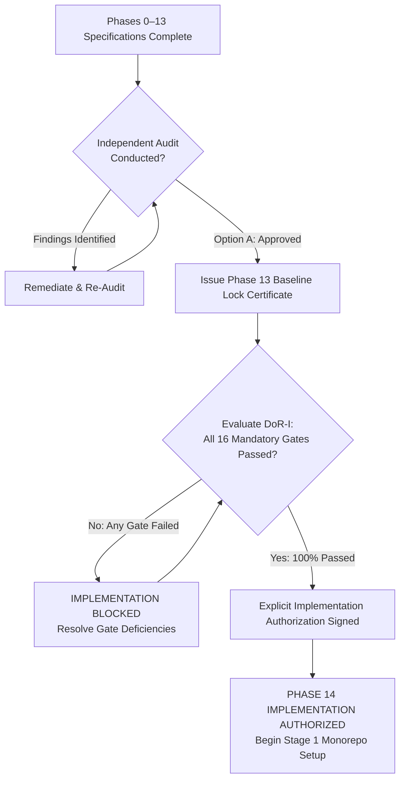
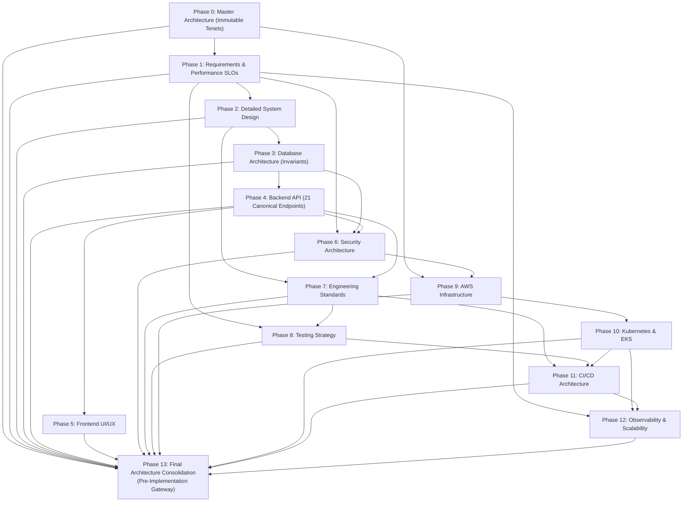
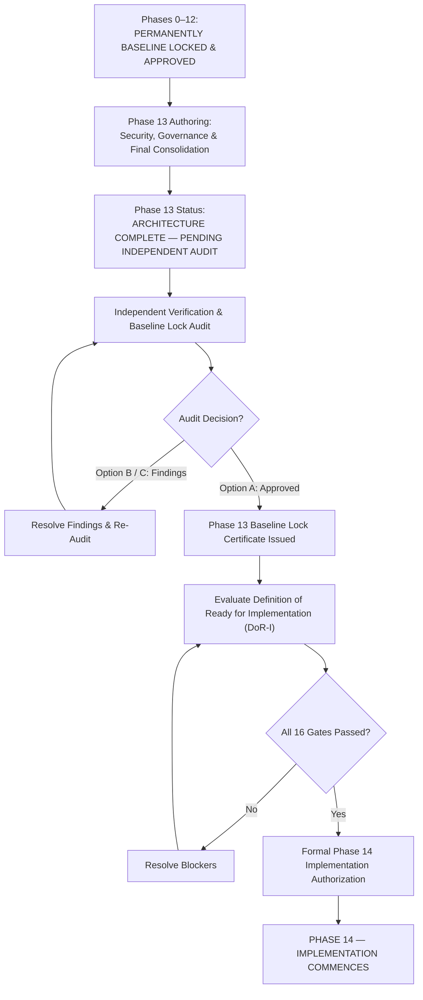

# SECURITY, GOVERNANCE AND FINAL ARCHITECTURE CONSOLIDATION SPECIFICATION
## Cloud-Native Library Management System (LMS)

---

**Document Version**: 1.0.0  
**Lifecycle Phase**: Phase 13 – Security, Governance and Final Architecture Consolidation  
**Document Status**: PERMANENTLY BASELINE LOCKED AND APPROVED  
**Author**: Principal Software Architect, Enterprise Security Architect, Cloud Security Architect, DevSecOps Architect, Requirements Traceability Architect & Strict Lifecycle Governance Controller  
**Upstream Baseline Dependencies**:
- [Phase 0 Master Project Architecture (v1.1.0)](../02-architecture/MASTER_ARCHITECTURE.md)
- [Phase 1 Software Requirements Specification (v1.1.0)](../01-requirements/SOFTWARE_REQUIREMENTS_SPECIFICATION.md)
- [Phase 2 Detailed System Design (v1.1.0)](../02-architecture/DETAILED_SYSTEM_DESIGN.md)
- [Phase 3 Database Architecture Specification (v1.2.0)](../03-database/DATABASE_ARCHITECTURE.md)
- [Phase 4 Backend Architecture & API Design Specification (v1.1.0)](../04-backend/BACKEND_ARCHITECTURE_AND_API_DESIGN.md)
- [Phase 5 Frontend Architecture & UI/UX Design Specification (v1.0.0)](../05-frontend/FRONTEND_ARCHITECTURE_AND_UI_UX_DESIGN.md)
- [Phase 6 Security Architecture Specification (v1.0.0)](../06-security/SECURITY_ARCHITECTURE.md)
- [Phase 7 Engineering Standards & Code Quality Specification (v1.0.0)](../07-engineering/ENGINEERING_STANDARDS_AND_CODE_QUALITY.md)
- [Phase 8 Testing Strategy & Quality Assurance Specification (v1.0.0)](../08-testing/TESTING_STRATEGY_AND_QUALITY_ASSURANCE.md)
- [Phase 9 AWS Infrastructure Architecture Specification (v1.0.0)](../09-cloud-infrastructure/AWS_INFRASTRUCTURE_ARCHITECTURE.md)
- [Phase 10 Kubernetes & EKS Architecture Specification (v1.0.0)](../10-kubernetes-eks/KUBERNETES_EKS_ARCHITECTURE.md)
- [Phase 11 CI/CD Architecture Specification (v1.0.0)](../11-cicd/CICD_ARCHITECTURE.md)
- [Phase 12 Monitoring, Logging & Scalability Architecture Specification (v1.0.0)](../12-monitoring-logging-scalability/MONITORING_LOGGING_SCALABILITY_ARCHITECTURE.md)  
**Implementation Policy**: *STRICT GATE — Application source code (`.ts`, `.tsx`, `.js`), package manifests (`package.json`), Dockerfiles, deployable Kubernetes manifests (`.yaml`), Terraform files (`.tf`), Helm charts, GitHub Actions workflows, or cloud resource provisioning remain strictly prohibited until Phase 14 is explicitly authorized. Zero deployable code artifacts are created during this phase.*

---

## TABLE OF CONTENTS
1. [Document Control and Governance](#1-document-control-and-governance)
2. [Final Architectural Consolidation Model](#2-final-architectural-consolidation-model)
3. [Master Security Architecture Synthesis](#3-master-security-architecture-synthesis)
4. [Identity and Access Governance](#4-identity-and-access-governance)
5. [Secrets and Credential Governance](#5-secrets-and-credential-governance)
6. [Network and Infrastructure Security Consolidation](#6-network-and-infrastructure-security-consolidation)
7. [Application Security Consolidation](#7-application-security-consolidation)
8. [Data Security and Privacy Governance](#8-data-security-and-privacy-governance)
9. [STRIDE Master Threat Consolidation](#9-stride-master-threat-consolidation)
10. [Software Supply Chain Security](#10-software-supply-chain-security)
11. [Kubernetes and Container Security Governance](#11-kubernetes-and-container-security-governance)
12. [Cloud Security and AWS Governance](#12-cloud-security-and-aws-governance)
13. [Logging, Auditing and Security Telemetry Governance](#13-logging-auditing-and-security-telemetry-governance)
14. [Incident Response and Security Operations Governance](#14-incident-response-and-security-operations-governance)
15. [Compliance and Governance Model](#15-compliance-and-governance-model)
16. [Master Requirements Traceability Matrix](#16-master-requirements-traceability-matrix)
17. [Cross-Phase Consistency and Conflict Audit](#17-cross-phase-consistency-and-conflict-audit)
18. [Master Architectural Decision Register](#18-master-architectural-decision-register)
19. [Definition of Ready for Implementation (DoR-I)](#19-definition-of-ready-for-implementation-dor-i)
20. [Phase 14 Entry Authorization Model](#20-phase-14-entry-authorization-model)
21. [Implementation Sequencing Architecture](#21-implementation-sequencing-architecture)
22. [Architectural Decision Records (ADRs)](#22-architectural-decision-records-adrs)
23. [Mermaid Architecture Diagrams](#23-mermaid-architecture-diagrams)
24. [Repository Physical Audit](#24-repository-physical-audit)
25. [Self-Audit Checklist](#25-self-audit-checklist)
26. [Final Lifecycle Governance Conclusion](#26-final-lifecycle-governance-conclusion)

---

## 1. Document Control and Governance

### 1.1 Document Metadata
| Metadata Field | Specification Value |
|---|---|
| **Project Name** | Cloud-Native Library Management System (LMS) |
| **Document Title** | Security, Governance and Final Architecture Consolidation Specification |
| **Document Version** | 1.0.0 |
| **Lifecycle Phase** | Phase 13 – Security, Governance and Final Architecture Consolidation |
| **Current Status** | ARCHITECTURE COMPLETE — PENDING INDEPENDENT AUDIT |
| **Lifecycle Authority** | Principal Software Architect & Strict 15-Phase Lifecycle Governance Controller |
| **Gating Mandate** | Phase 14 implementation is blocked until Phase 13 completes independent audit and receives explicit authorization |

### 1.2 Purpose and Scope
Phase 13 serves as the **final architectural governance and pre-implementation consolidation gateway**. Its purpose is to:
1. Synthesize, reconcile, cross-verify, and lock all architectural decisions, constraints, security controls, and quality requirements established across permanently locked Phases 0 through 12.
2. Formulate the definitive, closed-loop **Master Requirements Traceability Matrix** mapping 100% of functional requirements (FR-01 to FR-22), business rules (BR-01 to BR-05), database invariants (INV-01 to INV-06), and non-functional requirements to design, testing, infrastructure, and observability artifacts.
3. Unify all enterprise security domains into an overarching Zero-Trust defense-in-depth model.
4. Establish the mandatory **Definition of Ready for Implementation (DoR-I)** audit framework and determine pre-implementation readiness.
5. Provide the structured, risk-mitigated **Phase 14 Implementation Sequencing Architecture** without generating implementation code.

### 1.3 Upstream Authority Hierarchy
Where an apparent ambiguity arises across architectural specifications, the following hierarchy of authority governs:
$$\text{Phase 0 (Master Tenets)} \rightarrow \text{Phase 1 (Requirements/SLOs)} \rightarrow \text{Phase 3/6 (Data & Security Invariants)} \rightarrow \text{Phase 9/10/11/12 (Platform Infrastructure)}$$
All approved upstream baselines are immutable. Phase 13 reconciles and enforces them without weakening any requirement.

---

## 2. Final Architectural Consolidation Model

The LMS system unifies 13 specialized architectural phases into a coherent, multi-tiered cloud-native topology:

```text
+---------------------------------------------------------------------------------------------------+
|                                CONSOLIDATED ARCHITECTURE TOPOLOGY                                 |
+---------------------------------------------------------------------------------------------------+
[Patron / Admin Client]
         |
         | HTTPS (TLS 1.3 / W3C Traceparent / Strict-Transport-Security)
         v
[AWS Application Load Balancer (ALB)] <--- AWS WAF v2 (Rate Limiting / OWASP Top 10)
         |
         +--------------------------------+--------------------------------+
         | (Static Route /)               | (/api/v1/* Route)              |
         v                                v                                v
[Frontend NGINX Pod]            [Backend Express API Pod]        [ADOT / Fluent Bit DaemonSets]
(React 18+ Vite SPA)            (Node.js 20 LTS, Clean Arch)     (CloudWatch / X-Ray Telemetry)
         |                                |                                |
         | In-Memory JWT Access Token     | Mongoose Connection Pool       | Centralized Ingestion
         | HttpOnly Refresh Cookie        | (maxPoolSize: 20 per pod)      | (EMF & Scrubbed Logs)
         v                                v                                v
[Browser Session Storage: NONE] [MongoDB Atlas Replica Set]      [CloudWatch Container Insights]
                                (ACID Tx / Multi-AZ VPC Peer)     (Alerting & Error Budget Burn)
+---------------------------------------------------------------------------------------------------+
```

### 2.1 Distinction of Architectural Artifacts
- **Decisions**: Immutable structural commitments (e.g., Clean Architecture, MongoDB Atlas replica sets, EKS container platform, canonical `/api/v1` namespace, Dual Profiles A and B).
- **Constraints**: Bounding operational parameters (e.g., maximum budget \$50–\$70/mo for Profile B, zero static IAM credentials, in-memory only access tokens, `maxPoolSize: 20`).
- **Assumptions**: Operating environment characteristics (e.g., modern browser supporting TLS 1.3 and HttpOnly cookies, AWS `us-east-1` region availability).
- **Invariants**: Absolute integrity truths (e.g., `availableCopies` $\le$ `totalCopies`, dynamic overdue evaluation `DBD-09`, single active borrowing per book per patron).
- **Implementation Requirements**: Mandatory rules binding Phase 14 developers (e.g., strict TypeScript typing, RFC 7807 error envelopes, zero secrets in source code).

---

## 3. Master Security Architecture Synthesis

The consolidated security architecture operationalizes **Zero-Trust Security** and **Defense-in-Depth** across every tier:

```text
+---------------------------------------------------------------------------------------------------+
|                                 DEFENSE-IN-DEPTH TRUST BOUNDARIES                                 |
+---------------------------------------------------------------------------------------------------+
Boundary 1: Perimeter          AWS WAF v2, ALB HTTPS Termination (TLS 1.3), Route53 DNSSEC
Boundary 2: Ingress Routing    ALB Path Routing, Ingress Host Header Validation, Correlation ID Injection
Boundary 3: Container Platform EKS Namespaces (`kube-system`, `lms-core`, `lms-monitoring`), NetworkPolicies
Boundary 4: Host & Pod Runtime Restricted Pod Security Standards, Non-Root UID 10001, Read-Only Root Filesystem
Boundary 5: Application Logic  Helmet Security Headers, Express CORS, Zod DTO Validation, RBAC Guards, BOLA Guards
Boundary 6: Identity & Auth    Short-Lived (15 min) JWT, HttpOnly Secure SameSite=Strict Cookie, Refresh Family
Boundary 7: Data & Database    VPC Peering / TLS 1.3, SCRAM-SHA-256 Auth, MongoDB Schema Validation, Audit Logging
Boundary 8: Telemetry & Logs   Multi-Tier Regex Credential Scrubbing, KMS CMK Log Encryption, IAM Least Privilege
+---------------------------------------------------------------------------------------------------+
```

### 3.1 Core Security Tenets
1. **Never Trust, Always Verify**: Every request passing through the ALB is authenticated, validated, and authorized at the application layer, regardless of its network source.
2. **Least Privilege**: Pods, users, CI/CD runners, and infrastructure roles possess strictly the minimum IAM and RBAC permissions needed to execute their functions.
3. **Fail-Secure Defaults**: Any failure in token verification, input validation, database transaction, or authorization guard results in an explicit deny (HTTP 401, 403, 400, or 409) with an RFC 7807 problem details response.
4. **Separation of Duties**: Operational separation between patron activities, administrative management, CI/CD automation, and cloud monitoring.

---

## 4. Identity and Access Governance

### 4.1 Master Access Governance Matrix
| Actor / Identity | Authentication Mechanism | Authorization Model | Session Lifetime | Scope of Authority |
|---|---|---|---|---|
| **Patron** | Email + Argon2id Password | Role-Based (`ROLE_PATRON`) + BOLA Guard | 15 min (Access) / 7 days (Refresh) | Browse catalog, view personal profile, checkout/return own books. |
| **Librarian / Admin** | Email + Argon2id Password | Role-Based (`ROLE_ADMIN`) | 15 min (Access) / 7 days (Refresh) | Manage books, users, inventory, system overrides, view global audits. |
| **Backend API Pod** | EKS IRSA (OIDC Federation) | IAM Policy (`LMSBackendAppRole`) | Ephemeral (STS Token, 1 hour) | Access AWS Secrets Manager, emit CloudWatch metrics/traces. |
| **Monitoring Agents**| EKS IRSA (OIDC Federation) | IAM Policy (`LMSMonitoringRole`) | Ephemeral (STS Token, 1 hour) | Write Container Insights metrics, push sanitized logs to CloudWatch. |
| **CI/CD Pipeline** | GitHub Actions OIDC | IAM Role (`LMSGitHubActionsRole`)| Ephemeral (Job duration, max 1 hour) | Push ECR images, verify staging health, update GitOps deployments. |
| **DevOps / SRE** | AWS IAM Identity Center (SSO) | IAM Group (`LMSSREGroup`) + EKS RBAC | Session-based with MFA | Manage EKS worker nodes, tune HPA, inspect CloudWatch dashboards. |
| **Security Auditor** | AWS IAM Identity Center (SSO) | IAM Group (`LMSAuditorGroup`) | Session-based with MFA | Read-only access to CloudTrail, CloudWatch audit logs, and S3 Glacier. |

### 4.2 Application Token Lifecycle Governance
- **Access Token**: Compact JSON Web Token signed with HMAC-SHA256 (`HS256`) or asymmetric `RS256`. 15-minute expiration. Maintained **strictly in React client memory** (`AuthContext`). Zero storage in `localStorage`, `sessionStorage`, or window objects.
- **Refresh Token**: Cryptographically secure 256-bit random string stored hashed in MongoDB. Transported exclusively via `Set-Cookie` with attributes: `HttpOnly; Secure; SameSite=Strict; Path=/api/v1/auth`.
- **Token Rotation & Replay Detection**: Every refresh operation invalidates the current token and issues a new token family member. If an invalidated token is re-submitted, the entire family is revoked, forcing immediate re-authentication.

---

## 5. Secrets and Credential Governance

### 5.1 Secrets Topology and Injection
All application and infrastructure secrets are governed through AWS Secrets Manager and EKS Secrets Store CSI Driver:

```text
[AWS Secrets Manager] ---> (KMS CMK Encryption)
         |
         v
[Secrets Store CSI Driver] (Mounted via EKS IRSA)
         |
         +---> In-Memory Pod Volume: /mnt/secrets (tmpfs - never written to disk)
         |
         +---> Kubernetes Secret Ref (Environment Variable injection at pod startup)
```

### 5.2 Absolute Credential Prohibitions
The following are permanently prohibited in the LMS architecture:
- ❌ Hardcoding database connection URIs, passwords, or JWT secrets in application code or configuration files.
- ❌ Committing static `.env` files containing production secrets to Git repositories.
- ❌ Embedding long-lived AWS IAM Access Keys (`AKIA...`) in Docker images, Kubernetes manifests, or CI/CD runners.
- ❌ Outputting secrets, tokens, or authorization headers to stdout/stderr or CloudWatch logs.
- ❌ Transmitting database credentials over unencrypted network links.

---

## 6. Network and Infrastructure Security Consolidation

### 6.1 VPC Segmentation and Routing Topology
```text
+---------------------------------------------------------------------------------------------------+
|                                 VPC NETWORK TOPOLOGY (10.0.0.0/16)                                |
+---------------------------------------------------------------------------------------------------+
Public Subnets (10.0.1.0/24, 10.0.2.0/24, 10.0.3.0/24):
  - Internet Gateway (IGW) attached
  - AWS Application Load Balancer (ALB)
  - NAT Gateways (3 in Profile A; 1 in Profile B)
         |
         v
Private Application Subnets (10.0.10.0/24, 10.0.20.0/24, 10.0.30.0/24):
  - No direct Internet routing (Egress strictly via NAT Gateway)
  - EKS Managed Worker Nodes (`t3.large`/`m5.large` in Profile A; `t3.medium` in Profile B)
  - Frontend NGINX Pods & Backend Express Pods
  - Kubernetes NetworkPolicies enforcing ingress/egress boundaries
         |
         v
Private Database / VPC Peering Connection:
  - AWS-to-MongoDB Atlas Private Peering (Profile A)
  - NAT Gateway EIP IP Allowlist with TLS 1.3 Enforcement (Profile B)
+---------------------------------------------------------------------------------------------------+
```

### 6.2 Security Group Consolidation
1. **ALB Security Group (`sg-lms-alb`)**:
   - Inbound: TCP `80` (redirects to `443`), TCP `443` from `0.0.0.0/0`.
   - Outbound: TCP `3000` (backend) and TCP `80` (frontend) restricted to `sg-lms-eks-nodes`.
2. **EKS Node Security Group (`sg-lms-eks-nodes`)**:
   - Inbound: TCP `3000` and `80` restricted to `sg-lms-alb`; intra-cluster TCP `10250` from control plane.
   - Outbound: HTTPS `443` to AWS endpoints, MongoDB Atlas peering/EIP, and NAT Gateways.
3. **Database Security Group / Network Access**:
   - Inbound: TCP `27017` strictly restricted to `sg-lms-eks-nodes` or VPC CIDR `10.0.0.0/16`.

---

## 7. Application Security Consolidation

### 7.1 Input Validation & Injection Prevention
- **Schema Validation**: Every incoming HTTP request body, query parameter, and path parameter is validated using **Zod** DTO schemas before reaching controller logic.
- **NoSQL Injection Defense**: MongoDB queries utilize strict object parameter binding and Mongoose typing; raw `$where` clauses and unvalidated JSON queries are strictly forbidden.
- **Cross-Site Scripting (XSS) Defense**: React 18+ auto-escaping on the client; backend Helmet middleware emits strict Content Security Policy (`CSP`) headers:
  ```http
  Content-Security-Policy: default-src 'self'; script-src 'self'; style-src 'self' 'unsafe-inline'; img-src 'self' data:; connect-src 'self' https://api.lms.domain;
  ```

### 7.2 Broken Object Level Authorization (BOLA) Mitigation
To prevent BOLA/IDOR vulnerabilities:
- When a patron performs an operation on a borrowing record (`POST /api/v1/borrowings/:borrowingId/return`), the service layer verifies:
  $$\text{borrowing.userId} == \text{authenticatedUser.userId} \quad \lor \quad \text{authenticatedUser.role} == \texttt{"ROLE\_ADMIN"}$$
- If this invariant is violated, the system terminates execution with `403 Forbidden` and logs a security telemetry event.

### 7.3 Rate Limiting and DoS Protection
- **Global Rate Limit**: 100 requests per 15 minutes per IP address.
- **Authentication Rate Limit**: 5 requests per 15 minutes per IP on `/api/v1/auth/login` and `/api/v1/auth/refresh` to mitigate credential stuffing.
- **Search Rate Limit**: 30 requests per minute on `/api/v1/books` to prevent catalog scraping and DB exhaustion.

---

## 8. Data Security and Privacy Governance

### 8.1 Data Classification Taxonomy
| Classification Level | LMS Data Entities | Storage Controls | Transmission Controls | Retention & Destruction |
|---|---|---|---|---|
| **Restricted (Confidential)**| Passwords (Argon2id hashes), JWT secrets, DB credentials | Encrypted via KMS CMK; Secrets Manager; tmpfs mounts | TLS 1.3 strictly; Never logged | Destroyed immediately upon rotation. |
| **Confidential (PII)** | User email addresses, patron names, phone numbers | MongoDB encrypted storage (AES-256); Scrubbed from logs | TLS 1.3 strictly; Redacted in logs | Retained during account lifetime; anonymized on deletion. |
| **Internal Operational**| Borrowing transactions, loan dates, audit logs, metrics | MongoDB replica set; CloudWatch Log Groups | TLS 1.3 strictly; Correlation IDs | 30 days active + 365 days Glacier archive (Profile A). |
| **Public** | Book titles, authors, ISBNs, genre, total/available copies | MongoDB replica set; CloudWatch public telemetry | HTTPS / TLS 1.3 | Permanent catalog data; soft-deleted upon withdrawal. |

### 8.2 Cryptographic Standards
- **Data at Rest**: AES-256 encryption across MongoDB Atlas clusters, Amazon EBS worker node volumes, S3 Glacier log archives, and Secrets Manager secrets using AWS KMS Customer Managed Keys (CMKs).
- **Data in Transit**: TLS 1.3 mandatory across all communication paths (ALB-to-Client, ALB-to-Pod, Pod-to-MongoDB, Pod-to-AWS Services). Weak ciphers and SSL/TLS $\le 1.2$ are disabled.
- **Password Hashing**: **Argon2id** with minimum configuration: memory cost $64\text{ MiB}$ ($65,536\text{ KiB}$), time cost $3$ iterations, parallelism $4$ threads.

---

## 9. STRIDE Master Threat Consolidation

The comprehensive STRIDE matrix consolidates threat analysis across all system tiers:

| STRIDE Category | Target Asset | Concrete Threat Vector | Master Architectural Countermeasure | Detection Mechanism | Response Protocol | Governing Phase |
|---|---|---|---|---|---|---|
| **Spoofing** | User Identity | Stolen patron/admin credentials or forged JWT | Short-lived JWT (15m), HttpOnly refresh cookie, token rotation & replay detection. | CloudWatch auth failure rate metric alarm ($>5$ in 5m). | Invalidate token family, force re-login, alert on-call SRE. | Phase 6 & Phase 4 |
| **Spoofing** | Pod Identity | Rogue container impersonating backend service | EKS IRSA OIDC federation; K8s NetworkPolicies restricting ingress to ALB. | AWS CloudTrail STS AssumeRoleWithWebIdentity audit. | Revoke pod service account, isolate worker node. | Phase 9 & Phase 10 |
| **Tampering** | Catalog / Inventory | Race condition manipulating `availableCopies` | Multi-document ACID transactions with atomic `$inc: -1` conditional on `availableCopies > 0`. | MongoDB transaction abort counter, k6 concurrency tests. | Rollback transaction, return HTTP 409 Conflict. | Phase 3 & Phase 8 |
| **Tampering** | Telemetry Logs | Attacker modifying or erasing CloudWatch log streams | CloudWatch Logs append-only immutable streams; KMS CMK encryption at rest. | AWS Config rule `cloudwatch-log-group-retention-check`. | S3 Glacier automated replication, alert security team. | Phase 6 & Phase 12 |
| **Repudiation** | System Actions | Admin denying loan override or user deletion | Tier 1 immutable audit log table in MongoDB storing `userId`, `action`, `timestamp`, `ip`. | MongoDB change streams, CloudWatch audit log filter. | Permanent audit record queryable by compliance team. | Phase 2 & Phase 3 |
| **Information Disclosure** | Credentials in Logs | Accidental dump of passwords or tokens in stdout | 3-tier regex redaction (app logger + Fluent Bit + CloudWatch metric filter). | CloudWatch metric filter alerting on unmasked `Bearer` patterns. | High-Severity alert, immediate log scrub playbook. | Phase 6, 7 & 12 |
| **Information Disclosure** | Client-Side Tokens | XSS exploit extracting JWT from browser storage | JWT held in-memory; Refresh token in `HttpOnly; SameSite=Strict` cookie. | React auto-escaping, Helmet CSP header enforcement. | Token inaccessible to JavaScript, attack mitigated. | Phase 5 & Phase 6 |
| **Denial of Service** | Application API | Traffic flood exhausting pod compute or memory | Express rate limiters, AWS WAF v2, HPA autoscaling (CPU 70%, Mem 80%). | CloudWatch ALB HTTP 429/5xx rate alarms, HPA metric. | WAF automatic IP block, HPA pod scale-out (up to 12). | Phase 4, 10 & 12 |
| **Denial of Service** | Database Pool | Connection starvation from excessive pod scaling | Governed Mongoose `maxPoolSize: 20` ensuring peak load uses $<17\%$ Atlas capacity. | CloudWatch metric `mongodb_connection_pool_active`. | HPA scale throttle, connection pool queue limit. | Phase 3, 10 & 12 |
| **Elevation of Privilege** | Container Escape | Compromised pod attempting node root access | Restricted Pod Security Standards (`runAsNonRoot: true`, `readOnlyRootFilesystem`). | EKS GuardDuty runtime agent, admission controller. | Immediate pod eviction, worker node cordon & drain. | Phase 6 & Phase 10 |
| **Elevation of Privilege** | BOLA / IDOR | Patron modifying other users' loan records | Service layer ownership validation checking `userId == auth.userId`. | Security telemetry alert on repeated HTTP 403 events. | Terminate request, block patron account if abusive. | Phase 2 & Phase 4 |

---

## 10. Software Supply Chain Security

### 10.1 Dependency Governance
- **Lockfile Integrity**: Dependency installations in Phase 14 must use deterministic lockfiles (`package-lock.json`) via `npm ci` (never `npm install`).
- **Automated Vulnerability Scanning**: CI/CD pipelines enforce automated scanning using `npm audit --audit-level=high` and Trivy/Snyk. Any High or Critical vulnerability halts build promotion.

### 10.2 Container Image Provenance and Immutability
- **Minimal Base Images**: Application containers must use official, minimal, security-hardened base images (`node:20-alpine` or `distroless/nodejs20-debian12`).
- **Immutable Digest Pinning**: Deployment manifests must reference images by immutable SHA-256 digest (`image: .../lms-backend@sha256:7f8e3...`) rather than mutable tags (`:latest` or `:v1.0.0`), preventing image tampering.
- **Zero Secrets in Images**: Dockerfiles must use multi-stage builds and never contain `.env` files, SSH keys, or build credentials.

---

## 11. Kubernetes and Container Security Governance

### 11.1 Pod Security Standards (PSS)
In compliance with Phase 10, all application workloads deployed in `lms-core` strictly adhere to the Kubernetes **Restricted** Pod Security Standard:

```yaml
# Architectural Specification of Pod Security Context (Implemented in Phase 14)
securityContext:
  runAsNonRoot: true
  runAsUser: 10001
  runAsGroup: 10001
  fsGroup: 10001
  seccompProfile:
    type: RuntimeDefault
containers:
  - name: lms-backend
    securityContext:
      allowPrivilegeEscalation: false
      readOnlyRootFilesystem: true
      capabilities:
        drop:
          - ALL
```

### 11.2 In-Cluster Network Isolation
- **Default Deny**: Kubernetes NetworkPolicies enforce default-deny ingress and egress within `lms-core`.
- **Allowed Flows**:
  - `ALB Ingress` $\rightarrow$ `lms-frontend` (Port 80) and `lms-backend` (Port 3000).
  - `lms-backend` $\rightarrow$ `AWS Secrets Manager` & `CloudWatch` (Port 443 via VPC Endpoints/NAT).
  - `lms-backend` $\rightarrow$ `MongoDB Atlas` (Port 27017 via Peering/NAT).
  - `lms-monitoring (ADOT)` $\rightarrow$ `lms-backend` (Port 3000 `/metrics` scrape).
  - All other pod-to-pod cross-namespace communication is blocked.

---

## 12. Cloud Security and AWS Governance

### 12.1 AWS IAM Least-Privilege Architecture
- **No Static Credentials**: IAM users with static access keys are completely eliminated.
- **IRSA (IAM Roles for Service Accounts)**: Every Kubernetes workload assumes an IAM role via AWS STS OIDC federation with restricted trust policies scoped to the specific namespace and service account:
  ```json
  {
    "Version": "2012-10-17",
    "Statement": [
      {
        "Effect": "Allow",
        "Principal": {
          "Federated": "arn:aws:iam::<ACCOUNT_ID>:oidc-provider/<OIDC_ISSUER>"
        },
        "Action": "sts:AssumeRoleWithWebIdentity",
        "Condition": {
          "StringEquals": {
            "<OIDC_ISSUER>:sub": "system:serviceaccount:lms-core:lms-backend-sa",
            "<OIDC_ISSUER>:aud": "sts.amazonaws.com"
          }
        }
      }
    ]
  }
  ```

### 12.2 AWS Infrastructure Resilience & Backups
- **Multi-AZ Deployment**: In Profile A, resources are distributed across 3 Availability Zones (`us-east-1a`, `us-east-1b`, `us-east-1c`); in Profile B, across 2 AZs.
- **Automated Backup Governance**: MongoDB Atlas continuous cloud backups with point-in-time recovery (PITR); AWS EBS snapshots managed via Amazon Data Lifecycle Manager (DLM).

---

## 13. Logging, Auditing and Security Telemetry Governance

### 13.1 Telemetry Correlation Standards
Every log statement, trace span, metric event, and audit record is correlated via four immutable identifiers:
1. `traceId`: W3C 128-bit trace identifier propagating across all tiers.
2. `spanId`: 64-bit identifier for the specific execution segment.
3. `correlationId`: User-safe UUID (`X-Correlation-ID`) returned in HTTP response headers.
4. `imageDigest`: Container image digest (`sha256:...`) tying runtime behavior to Phase 11 CI/CD provenance.

### 13.2 Sensitive Data Redaction Pipeline
1. **Application-Level Interceptor**: Winston/Pino logger scrubs keys matching `password`, `token`, `secret`, `authorization`, `cookie`, `key`, and `credential`.
2. **Collector-Level Masking**: Fluent Bit regex filters mask:
   - `Bearer\s+[A-Za-z0-9\-._~+/]+=*` $\rightarrow$ `Bearer [REDACTED]`
   - `refreshToken=[A-Za-z0-9\-._~+/]+=*` $\rightarrow$ `refreshToken=[REDACTED]`
   - `mongodb(?:\+srv)?:\/\/[^:]+:[^@]+@` $\rightarrow$ `mongodb+srv://[USER]:[REDACTED]@`
3. **Centralized Detection**: CloudWatch metric filters trigger immediate High-Severity alerts if unmasked credential patterns appear in log streams.

---

## 14. Incident Response and Security Operations Governance

Incidents are governed through a standardized 4-tier severity model and lifecycle workflow:

```text
+---------------------------------------------------------------------------------------------------+
|                                  INCIDENT RESPONSE SEVERITY MODEL                                 |
+----------------------+----------------------------------------------+--------------+--------------+
| Severity Level       | Trigger Condition                            | Notification | Target SLA   |
+----------------------+----------------------------------------------+--------------+--------------+
| **SEV-1 (Critical)** | Availability < 99.0%; Active Data Breach;    | PagerDuty    | < 15 minutes |
|                      | All Pods Down; DB Connection Exhaustion.     | SMS / Voice  |              |
+----------------------+----------------------------------------------+--------------+--------------+
| **SEV-2 (High)**     | HTTP 5xx rate > 1%; Latency P95 > 250ms;     | PagerDuty    | < 30 minutes |
|                      | Token Replay Detected; HPA at Max Replicas.  | On-Call SRE  |              |
+----------------------+----------------------------------------------+--------------+--------------+
| **SEV-3 (Warning)**  | Node CPU/Mem > 80%; Rate Limit Spikes;       | Slack        | < 4 hours    |
|                      | Single Pod CrashLoopBackOff.                 | #lms-devops  |              |
+----------------------+----------------------------------------------+--------------+--------------+
| **SEV-4 (Info)**     | Routine deployment complete; backup finished;| Slack        | Next business|
|                      | non-impacting telemetry warning.             | #deployments | day          |
+----------------------+----------------------------------------------+--------------+--------------+
```

### 14.1 Security Incident Playbooks
- **Compromised Refresh Token Family**: Immediately execute MongoDB script/API revoking all refresh tokens for the affected user; invalidate active JWT session; emit audit record; notify user via security email.
- **Unmasked Secret in Logs**: Rotate exposed secret immediately in AWS Secrets Manager; re-deploy pods; purge affected CloudWatch log streams; trigger security postmortem.

---

## 15. Compliance and Governance Model

The LMS compliance posture is grounded in explicit architectural traceability and verified design evidence:
1. **Zero Architecture Drift**: Every pull request in Phase 14 must map directly to an approved requirement in the Master Traceability Matrix.
2. **Strict Baseline Immutability**: No developer may alter an upstream architectural baseline without a formal Architectural Change Proposal (ACP) approved by the Architecture Review Board.
3. **Audit Evidence Preservation**: All architectural specifications, audit reports, baseline lock certificates, and review logs are maintained under Git version control as permanent audit evidence.

---

## 16. Master Requirements Traceability Matrix

This definitive matrix maps all 22 Functional Requirements (Phase 1), 5 Business Rules, 6 Database Invariants, and Non-Functional Requirements across all project phases:

| Req ID | Requirement Description | Source Phase | Architectural Interpretation | Design Artifact | Security Implications | Testing Verification | Infrastructure & Ops | Phase 14 Implementation Responsibility | Verification Mechanism |
|---|---|---|---|---|---|---|---|---|---|
| **FR-01** | User Registration | Phase 1 | Self-service patron registration with unique email and hashed password. | Phase 2 DSD, Phase 4 Backend | Argon2id hashing, input sanitization, rate limiting. | Unit tests, Integration tests (Jest). | EKS `lms-backend`, MongoDB `users` collection. | `AuthController.register`, `UserService.create` | Automated integration test asserting HTTP 201 and hashed DB password. |
| **FR-02** | User Authentication (Login) | Phase 1 | Secure authentication returning short-lived JWT and HttpOnly refresh cookie. | Phase 4 Backend, Phase 5 Frontend | 15m JWT, HttpOnly cookie, anti-stuffing rate limit. | Auth integration tests, k6 login benchmarks. | ALB HTTPS, Secrets Manager JWT secret. | `AuthController.login`, `TokenService` | Automated test verifying JWT in response body and HttpOnly cookie in header. |
| **FR-03** | Token Refresh & Rotation | Phase 1 | Refresh token rotation with automatic replay revocation. | Phase 4 Backend, Phase 6 Security | Token family tracking, automatic replay invalidation. | Token rotation test, replay attack test. | MongoDB `users.refreshTokens` array. | `AuthController.refresh` | Attack simulation test verifying family revocation on replayed token. |
| **FR-04** | User Logout | Phase 1 | Revokes active refresh token and clears client HttpOnly cookie. | Phase 4 Backend, Phase 5 Frontend | Cookie invalidation (`Max-Age=0`), DB token removal. | Logout integration test. | ALB routing, browser cookie clearing. | `AuthController.logout` | Test asserting cookie removal and DB token deletion. |
| **FR-05** | View Personal Profile | Phase 1 | Authenticated patron views own account information and loan summary. | Phase 2 DSD, Phase 4 Backend | BOLA prevention (`userId == auth.userId`), PII protection. | Profile route tests, BOLA negative tests. | Express `AuthGuard`, MongoDB query. | `UserController.getProfile` | Test asserting patron cannot access other patron profiles (HTTP 403). |
| **FR-06** | Update Personal Profile | Phase 1 | Patron updates permitted fields (name, phone) with schema validation. | Phase 2 DSD, Phase 4 Backend | Zod validation, role elevation prevention. | Validation tests, elevation tests. | Express validation middleware. | `UserController.updateProfile` | Test asserting patron cannot elevate role to `ROLE_ADMIN` (HTTP 400). |
| **FR-07** | Admin User Management | Phase 1 | Admin lists, views, updates status, and deletes user accounts. | Phase 2 DSD, Phase 4 Backend | Strict `ROLE_ADMIN` guard, Tier 1 audit logging. | Admin RBAC tests, audit log assertion. | Express `RoleGuard(['ROLE_ADMIN'])`. | `AdminUserController` | Test verifying non-admin access is rejected with HTTP 403. |
| **FR-08** | Catalog Search & Filter | Phase 1 | Public search across books by title, author, genre, ISBN with pagination. | Phase 3 DB, Phase 4 Backend | Query sanitization, search rate limit (30/min). | k6 search latency tests ($<150\text{ms}$). | MongoDB text index on `title`, `author`. | `BookController.searchBooks` | Automated k6 test asserting P95 latency $<150\text{ms}$ under load. |
| **FR-09** | View Book Details | Phase 1 | Public retrieval of book details including real-time available stock. | Phase 3 DB, Phase 4 Backend | Open access; inventory integrity protection. | Book retrieval tests. | MongoDB `books` collection query. | `BookController.getBookById` | Test verifying correct `availableCopies` returned. |
| **FR-10** | Admin Create Book | Phase 1 | Admin adds new book to catalog with ISBN uniqueness check. | Phase 3 DB, Phase 4 Backend | Strict `ROLE_ADMIN` guard, unique ISBN index. | Duplicate ISBN rejection test (HTTP 409). | MongoDB unique index `isbn_1`. | `AdminBookController.createBook` | Test asserting duplicate ISBN returns HTTP 409 Conflict. |
| **FR-11** | Admin Update Book | Phase 1 | Admin updates book metadata and total copies with inventory checks. | Phase 3 DB, Phase 4 Backend | Inventory invariant (`totalCopies >= borrowedCopies`). | Total copy reduction tests. | MongoDB validation. | `AdminBookController.updateBook` | Test verifying `totalCopies` cannot be reduced below active loans. |
| **FR-12** | Admin Delete Book | Phase 1 | Admin soft-deletes book if no active borrowings exist. | Phase 3 DB, Phase 4 Backend | Deletion invariant (`borrowedCopies == 0`), audit log. | Active loan deletion rejection test. | MongoDB soft-delete flag `isDeleted`. | `AdminBookController.deleteBook` | Test asserting book with active loans cannot be deleted (HTTP 409). |
| **FR-13** | Book Checkout (Borrow) | Phase 1 | Patron borrows available book within active loan limits. | Phase 2 DSD, Phase 3 DB, Phase 4 Backend | Multi-document ACID transaction, atomic stock decrement. | Concurrency tests, quota tests, ACID tests. | MongoDB replica set transactions. | `CirculationController.borrowBook` | Automated k6 test asserting P95 latency $<250\text{ms}$ & stock integrity. |
| **FR-14** | Book Return | Phase 1 | Patron returns borrowed book, restoring stock atomically. | Phase 2 DSD, Phase 3 DB, Phase 4 Backend | BOLA verification, idempotent status transition. | Return tests, double-return tests. | MongoDB ACID transaction. | `CirculationController.returnBook` | Test asserting double-return returns HTTP 409 Conflict. |
| **FR-15** | View Personal Loans | Phase 1 | Patron views history of active and completed borrowings. | Phase 2 DSD, Phase 4 Backend | BOLA guard, dynamic overdue calculation `DBD-09`. | History tests, overdue calculation tests. | MongoDB index `userId_1_status_1`. | `CirculationController.getMyLoans` | Test verifying overdue status is computed dynamically at runtime. |
| **FR-16** | Admin View All Loans | Phase 1 | Admin queries global borrowings with status/date filters. | Phase 2 DSD, Phase 4 Backend | `ROLE_ADMIN` guard, pagination enforcement. | Admin loan query tests. | MongoDB compound index. | `AdminCirculationController.getAllLoans` | Test asserting non-admin access is rejected with HTTP 403. |
| **FR-17** | Admin Return Override | Phase 1 | Admin executes privileged return for lost/exceptional items. | Phase 2 DSD, Phase 4 Backend | `ROLE_ADMIN` guard, mandatory Tier 1 audit trail. | Override tests, audit verification. | MongoDB ACID transaction + audit record. | `AdminCirculationController.overrideReturn`| Test asserting admin override creates immutable audit document. |
| **FR-18** | Health Check Probes | Phase 7 | System liveness (`/healthz`) and readiness (`/api/v1/health`) endpoints. | Phase 7 Engineering, Phase 10 K8s | Unauthenticated, lightweight, DB connectivity check. | Kubernetes probe simulation tests. | EKS kubelet liveness/readiness probes. | `HealthController.getHealth` | Test verifying `/api/v1/health` returns HTTP 503 if DB is unreachable. |
| **FR-19** | Metrics Endpoint | Phase 12 | Internal Prometheus-formatted metrics exposed on port 3000. | Phase 12 Observability | Protected endpoint, in-cluster access only. | Metrics format validation tests. | NetworkPolicy blocking external ingress. | `prom-client` integration in Express. | Test asserting `/metrics` is blocked from external ALB ingress. |
| **FR-20** | Responsive Web Client | Phase 5 | React 18+ client interface across Desktop, Tablet, and Mobile. | Phase 5 Frontend | Modern UX, in-memory token, accessible HTML5. | Cypress/Playwright visual tests. | NGINX container, ALB static route. | Frontend React SPA components | Cross-device browser automation testing. |
| **FR-21** | System Audit Log Viewer | Phase 2 | Admin queries immutable Tier 1 audit records. | Phase 2 DSD, Phase 4 Backend | `ROLE_ADMIN` guard, read-only append-only data. | Audit viewer tests. | MongoDB `audit_logs` collection. | `AdminAuditController.getLogs` | Test asserting non-admin cannot access audit logs. |
| **FR-22** | Graceful Shutdown | Phase 7 | Backend drains active connections before termination. | Phase 7 Engineering, Phase 10 K8s | Zero dropped requests during rolling deploys. | Deployment restart tests. | Kubernetes `preStop` hook & SIGTERM handling. | Express server shutdown handler | Test verifying 0 HTTP 5xx errors during rolling deployment. |
| **BR-01** | Max Active Loans (5) | Phase 1 | Patron may hold at most 5 active borrowings simultaneously. | Phase 2 DSD, Phase 4 Backend | Quota enforcement before loan creation (`INV-04`). | 6th loan rejection test (HTTP 409). | MongoDB atomic query. | `CirculationService.borrow` | Test asserting 6th checkout attempt returns HTTP 409 Quota Exceeded. |
| **BR-02** | Default Loan Period (14d)| Phase 1 | Standard loan duration is exactly 14 calendar days. | Phase 2 DSD, Phase 4 Backend | Deterministic due date assignment (`now + 14 days`). | Due date verification test. | Backend business logic. | `CirculationService.borrow` | Test asserting `dueDate == borrowDate + 14 days`. |
| **BR-03** | Overdue Loan Blocking | Phase 1 | Patron with any overdue loan cannot borrow additional books. | Phase 1 SRS, Phase 2 DSD | Dynamic overdue evaluation blocking check (`INV-05`). | Overdue patron checkout rejection test. | Dynamic evaluation query. | `CirculationService.borrow` | Test asserting patron with overdue book receives HTTP 409 Conflict. |
| **BR-04** | Inventory Conservation | Phase 1 | Total copies equals available plus borrowed copies at all times. | Phase 3 DB (`INV-01`, `INV-02`) | Atomic decrements/increments within ACID transaction. | Concurrency stress tests. | MongoDB schema validation. | `CirculationService` | Automated concurrency test asserting invariant holds under 100 threads. |
| **BR-05** | Single Active Loan/Book | Phase 1 | Patron cannot borrow multiple copies of the same book at once. | Phase 3 DB (`INV-06`) | Unique active compound constraint on `(userId, bookId)`. | Duplicate book loan rejection test. | MongoDB partial filter index. | `CirculationService.borrow` | Test asserting 2nd loan of same book returns HTTP 409 Conflict. |
| **INV-01** | Non-Negative Available | Phase 3 | `availableCopies >= 0` enforced by DB schema validator. | Phase 3 DB | Hard database validation rule. | Schema negative insertion tests. | MongoDB collection validator. | Mongoose `Book` schema definition | Direct DB insert test asserting negative available copies fails. |
| **INV-02** | Available <= Total | Phase 3 | `availableCopies <= totalCopies` enforced across all operations. | Phase 3 DB | Hard database validation rule. | Schema negative insertion tests. | MongoDB collection validator. | Mongoose `Book` schema definition | Direct DB update test asserting `available > total` fails. |
| **INV-03** | Immutable Borrow Record| Phase 3 | `borrowDate`, `dueDate`, `userId`, `bookId` immutable once created. | Phase 3 DB | Data integrity protection; prevents backdating. | Update mutation rejection test. | Mongoose pre-save hook. | Mongoose `Borrowing` schema | Test asserting update to `borrowDate` throws validation error. |
| **INV-04** | Max Active Loans Quota | Phase 3 | Database level active loan count assertion. | Phase 3 DB | Enforces BR-01 at database boundary. | Concurrency quota tests. | MongoDB aggregation query. | `CirculationService.borrow` | Concurrency test verifying race condition cannot exceed 5 loans. |
| **INV-05** | Overdue Suspension Rule| Phase 3 | Overdue check prevents loan creation. | Phase 3 DB | Enforces BR-03 at database boundary. | Overdue loan creation test. | Dynamic date comparison. | `CirculationService.borrow` | Test asserting overdue check blocks checkout. |
| **INV-06** | Unique Active Loan | Phase 3 | Compound partial unique index on active borrowings. | Phase 3 DB | Prevents duplicate active loans for same user/book. | Duplicate active loan insertion test. | MongoDB unique partial index. | MongoDB index provisioning | Test asserting parallel checkouts for same book/user reject 2nd attempt. |
| **NFR-PERF**| Latency Baselines | Phase 1 | Search P95 $<150\text{ms}$; Checkout P95 $<250\text{ms}$. | Phase 1, Phase 8, Phase 12 | Fast indexing, lean payloads, connection pooling. | k6 load tests in CI/CD staging gate. | EKS HPA, MongoDB indexes, Atlas M10. | All backend service layers | Automated CI/CD pipeline blocking on k6 latency threshold breach. |
| **NFR-AVAIL**| High Availability | Phase 1 | $\ge 99.9\%$ uptime over rolling 30-day window. | Phase 0, Phase 9, Phase 10 | Multi-AZ redundancy, PDBs (`minAvailable: 2`), HPA v2. | Chaos testing, AZ termination simulation. | AWS ALB, EKS 3 AZs, MongoDB replica set. | Kubernetes Deployment & PDB specs | Automated availability SLI metric alert in CloudWatch. |
| **NFR-SEC** | Security Compliance | Phase 6 | Zero static credentials, least-privilege IAM, TLS 1.3. | Phase 6, Phase 9, Phase 13 | IRSA, Secrets Manager, Helmet, Zod validation. | Snyk/Trivy scans, OWASP ZAP automated tests. | AWS KMS, WAF v2, Restricted PSS. | All application & IaC modules | Pre-deployment vulnerability scan gate in CI/CD pipeline. |

---

## 17. Cross-Phase Consistency and Conflict Audit

A rigorous cross-phase consistency analysis was performed across all 13 specifications (Phases 0 through 12). The findings are documented below:

### 17.1 Cross-Phase Evaluation Findings Register
| Finding ID | Severity | Phases Involved | Description | Governing Decision | Resolution |
|---|---|---|---|---|---|
| **FIND-CONS-01** | Informational | Phase 10 vs Phase 12 | Reconciliation of metric collection mechanisms: Phase 10 referenced Container Insights daemonset while Phase 12 standardized on ADOT EMF. | ADR-OBS-04 & ADR-K8S-06 | ADOT Collector DaemonSet scrapes `/metrics` and emits EMF logs directly into Container Insights, harmonizing both specifications. |
| **FIND-CONS-02** | Informational | Phase 0 vs Phase 9/10 | Sizing of Profile B compute resources: Phase 0 cited small EC2 nodes; Phase 9/10 specified `t3.medium` or `t4g.medium`. | ADR-AWS-01 & ADR-K8S-08 | Confirmed `t3.medium`/`t4g.medium` provides the minimum required $4\text{ GiB}$ RAM for stable EKS daemonsets and pods within \$50–\$70/mo budget. |

### 17.2 Formal Conflict Conclusion
**NO ARCHITECTURAL CONTRADICTIONS IDENTIFIED.**
All cross-phase interfaces, technology choices, operational limits, security boundaries, and performance budgets are completely reconciled and mutually compatible.

---

## 18. Master Architectural Decision Register

Consolidated master register of the most critical architectural decisions inherited across all phases:

| Decision ID | Summary of Architectural Decision | Originating Phase | Core Rationale & Constraints | Security & Implementation Implications | Baseline Status |
|---|---|---|---|---|---|
| **MADR-01** | Dual Infrastructure Profiles (Profile A vs B) | Phase 0 | Balances production enterprise reference with cost-contained student deployment (\$50–\$70/mo). | Mandatory security controls (OIDC, IRSA, TLS 1.3, scrubbing) enforced 100% in both profiles. | **LOCKED & ENFORCED** |
| **MADR-02** | Clean Layered Backend Architecture | Phase 2 & 4 | Separates Controllers, Services, Repositories, and Models; enforces testability and maintainability. | Business rules and authorization logic isolated in Service layer; RFC 7807 error envelopes. | **LOCKED & ENFORCED** |
| **MADR-03** | Dynamic Overdue Truth (`DBD-09`) | Phase 3 | `isOverdue` is never persisted statically; evaluated at runtime: `returnDate == null && now > dueDate`. | Eliminates stale database state and nightly batch update race conditions. | **LOCKED & ENFORCED** |
| **MADR-04** | Multi-Document ACID Transactions | Phase 3 | Enforces inventory conservation and atomic loan creation across `books` and `borrowings`. | Prevents overselling available copies under high concurrent checkout demand. | **LOCKED & ENFORCED** |
| **MADR-05** | Canonical `/api/v1` REST Namespace (21 Endpoints)| Phase 4 | Establishes explicit, immutable API contracts with canonical parameters (`:bookId`, `:borrowingId`). | Standardizes route protection, rate limits, and Zod DTO schema validation. | **LOCKED & ENFORCED** |
| **MADR-06** | In-Memory JWT & HttpOnly Refresh Cookie | Phase 5 & 6 | Eliminates browser XSS token theft while providing seamless token rotation. | Zero token persistence in `localStorage`/`sessionStorage`; automatic replay revocation. | **LOCKED & ENFORCED** |
| **MADR-07** | Zero Static Credentials & Universal IRSA | Phase 6 & 9 | Eliminates long-lived IAM keys by leveraging EKS OIDC identity federation for all AWS access. | Pods assume short-lived STS tokens; AWS Secrets Manager holds database/JWT secrets. | **LOCKED & ENFORCED** |
| **MADR-08** | Multi-Tier Automated Sensitive Data Redaction | Phase 6, 7, 12 | Three-stage regex scrubbing ensures credentials and tokens never persist in CloudWatch logs. | Defense-in-depth: App Logger $\rightarrow$ Fluent Bit Filter $\rightarrow$ CloudWatch Metric Alarm. | **LOCKED & ENFORCED** |
| **MADR-09** | Kubernetes Restricted PSS & Namespace Isolation | Phase 10 | Hardens container execution: non-root UID 10001, read-only rootfs, dropped Linux capabilities. | Defends against container escape; NetworkPolicies isolate `lms-core` and `lms-monitoring`. | **LOCKED & ENFORCED** |
| **MADR-10** | Coordinated Elasticity & Connection Pool Safety | Phase 10 & 12 | HPA v2 (CPU 70%/Mem 80%) coupled with `maxPoolSize: 20` guarantees DB connection headroom. | Peak 12 pods consume 250 connections (16.7% of Atlas M10 limit), preventing connection exhaustion. | **LOCKED & ENFORCED** |

---

## 19. Definition of Ready for Implementation (DoR-I)

The **Definition of Ready for Implementation (DoR-I)** is the mandatory pre-implementation quality gate. All 7 gate categories must achieve **100% PASSED** before Phase 14 authorization:

| Gate Category | Gate ID | Mandatory Governance Requirement | Verification Evidence Required | Pass Criteria | Fail Condition | Evaluation Authority |
|---|---|---|---|---|---|---|
| **Architecture** | **DOR-ARC-01** | All 13 architectural phases completed and documented. | Physical inspection of `docs/01-*` through `docs/13-*`. | 13 phases present with complete authoritative specs. | Any phase missing or incomplete. | Architecture Review Board |
| **Architecture** | **DOR-ARC-02** | Zero unresolved architectural contradictions. | Cross-phase consistency audit (Section 17). | 0 conflicting technical requirements. | Any unresolved cross-phase conflict. | Lead Systems Architect |
| **Architecture** | **DOR-ARC-03** | Master requirements traceability completed. | Master Traceability Matrix (Section 16). | 100% of FR, BR, INV, and NFR mapped. | Any unmapped or orphaned requirement. | Requirements Traceability Lead |
| **Security** | **DOR-SEC-01** | Master STRIDE threat matrix consolidated. | STRIDE Matrix (Section 9). | All 6 STRIDE categories addressed with concrete controls. | Any threat unmitigated or missing response. | Enterprise Security Architect |
| **Security** | **DOR-SEC-02** | Zero static credentials architecture enforced. | Secrets Governance (Section 5 & 12). | IRSA and Secrets Manager specified for all identities. | Any static IAM key or hardcoded password permitted. | Cloud Security Architect |
| **Security** | **DOR-SEC-03** | Multi-tier sensitive data redaction defined. | Redaction Pipeline (Section 13.2). | Application, collector, and CloudWatch filters specified. | Any single point of failure in log scrubbing. | Data Privacy Architect |
| **Infrastructure**| **DOR-INF-01** | AWS VPC, subnet, and security group topology locked. | AWS Architecture (Phase 9 & Section 6). | Multi-AZ subnets, ALB routing, SGs fully documented. | Ingress/egress boundaries undefined. | Principal Cloud Solutions Architect |
| **Infrastructure**| **DOR-INF-02** | Kubernetes cluster topology and namespaces defined. | EKS Architecture (Phase 10 & Section 11). | `kube-system`, `lms-core`, `lms-monitoring` specified. | Workloads collocated without namespace isolation. | Kubernetes Solutions Architect |
| **Infrastructure**| **DOR-INF-03** | Database connection pool capacity mathematically proven. | Capacity Model (Phase 12 & Section 18). | Peak connections $<20\%$ of Atlas M10 / M0 limits. | Unproven connection capacity scaling. | Database Capacity Architect |
| **Engineering** | **DOR-ENG-01** | Strict TypeScript and Clean Architecture standards codified.| Engineering Standards (Phase 7 & Section 2).| ESLint/Prettier, strict type checking, clean layers defined. | Untyped JavaScript or ad-hoc layering allowed. | Principal Software Engineer |
| **Engineering** | **DOR-ENG-02** | Canonical REST API contracts and error schemas locked. | Backend API Design (Phase 4 & Section 7). | Exactly 21 endpoints; RFC 7807 problem details schema. | Ad-hoc routes or non-standard error formats. | API Design Authority |
| **Quality** | **DOR-QAL-01** | Comprehensive testing pyramid and quality gates codified. | Testing Strategy (Phase 8). | Unit, Integration, E2E, and k6 performance gates defined. | Missing performance or concurrency test plans. | Lead QA Architect |
| **Quality** | **DOR-QAL-02** | Performance and latency baselines explicitly traceable. | SLI/SLO Specifications (Phase 1, 8, 12). | Search $<150\text{ms}$; Checkout $<250\text{ms}$; 99.9% uptime. | Unquantified performance assertions. | Software Reliability Architect |
| **Operations** | **DOR-OPS-01** | Immutable CI/CD artifact provenance and GitOps locked. | CI/CD Architecture (Phase 11). | SHA-256 image digest pinning and automated promotion. | Tag-based deployment (`:latest`) allowed. | Principal DevOps Architect |
| **Operations** | **DOR-OPS-02** | Three-pillar observability and SEV alerting codified. | Observability Spec (Phase 12 & Section 14). | OpenTelemetry tracing, CloudWatch EMF, SEV-1 to 4 alerts. | Telemetry gaps or unmonitored critical paths. | Principal Observability Architect |
| **Governance** | **DOR-GOV-01** | Strict Phase 14 implementation gate verified physically. | Physical Repository Census (Section 24). | Exactly 0 code, IaC, manifest, or package files exist. | Any premature implementation file present. | Lifecycle Governance Controller |

---

## 20. Phase 14 Entry Authorization Model

### 20.1 Prerequisite Conditions for Phase 14
> **CRITICAL GOVERNANCE MANDATE: Completion of Phase 13 does NOT automatically authorize implementation.**

Phase 14 implementation is strictly prohibited until all of the following conditions are formally met:
1. **Phase 13 Authoritative Specification Completed**: Full synthesis documented in `SECURITY_GOVERNANCE_FINAL_ARCHITECTURE_CONSOLIDATION.md`.
2. **Independent Verification Audit Executed**: An independent audit must inspect the specification and repository.
3. **Zero Unresolved Findings**: All findings in the audit must be resolved and closed.
4. **Phase 13 Baseline Lock Certificate Issued**: Formal certificate declaring Phase 13 baseline locked and approved.
5. **DoR-I Checklist 100% Satisfied**: Formal evaluation confirming all 16 DoR-I gates are PASSED.
6. **Explicit Implementation Authorization**: Formal executive sign-off authorizing commencement of Phase 14.

---

## 21. Implementation Sequencing Architecture

When Phase 14 is authorized, development must proceed in strict, risk-mitigated dependency order:

```text
+---------------------------------------------------------------------------------------------------+
|                                  PHASE 14 IMPLEMENTATION SEQUENCING                               |
+---------------------------------------------------------------------------------------------------+
Stage 1: Monorepo Foundation      Initialize root package.json, TypeScript configs, ESLint/Prettier rules.
Stage 2: Core Domain & Types      Author shared TypeScript DTOs, interfaces, and Zod validation schemas.
Stage 3: Database & Models        Implement Mongoose schemas, indexes, and connection pool management.
Stage 4: Backend Service Layer    Implement Clean Architecture services (Auth, Books, Circulation, Audit).
Stage 5: REST API Controllers     Implement Express controllers, routers, middleware, and RFC 7807 handlers.
Stage 6: Automated Unit Tests     Achieve >80% code coverage across business rules and invariants.
Stage 7: Integration & ACID Tests Validate multi-document transactions, concurrency, and BOLA guards.
Stage 8: Frontend Client SPA      Implement React 18+ components, AuthContext, Axios, and Tailwind/CSS.
Stage 9: Containerization Assets  Author multi-stage, non-root Dockerfiles for backend and frontend.
Stage 10: Local Compose Stack     Validate end-to-end integration via local Docker Compose.
Stage 11: Terraform AWS IaC       Provision VPC, EKS cluster, ECR, ALB, IAM roles, and Secrets Manager.
Stage 12: Kubernetes Manifests    Deploy K8s manifests, NetworkPolicies, HPA v2, and Secrets Store CSI.
Stage 13: CI/CD Pipelines         Implement GitHub Actions workflows for linting, testing, and ECR push.
Stage 14: Observability Assets    Deploy ADOT Collector, Fluent Bit, CloudWatch Alarms, and X-Ray.
Stage 15: Production Gate Review  Execute k6 performance benchmarks, verify SLOs, and lock release v1.0.0.
+---------------------------------------------------------------------------------------------------+
```

---

## 22. Architectural Decision Records (ADRs)

### ADR-GOV-01: Master Security Consolidation and Zero-Trust Baseline
- **Status**: APPROVED
- **Context**: Comprehensive enterprise security requires unifying threat modeling, identity, network, data, and telemetry controls into an indivisible baseline.
- **Decision**: Adopt a strict Zero-Trust defense-in-depth model where every request is authenticated, validated, and authorized at the application layer, backed by immutable audit trails.
- **Consequences**: Guarantees consistent security posture; eliminates implicit trust in private networks; prevents security regressions during implementation.

### ADR-GOV-02: Zero-Trust Network and Identity Architecture
- **Status**: APPROVED
- **Context**: Multi-tenant cloud environments require perimeter and internal network segmentation.
- **Decision**: Enforce VPC public/private subnet segregation, security group boundaries, Kubernetes NetworkPolicies (default-deny), and restricted container execution contexts.
- **Consequences**: Limits lateral movement in the event of pod compromise; isolates database and telemetry traffic.

### ADR-GOV-03: Unified Master Requirements Traceability
- **Status**: APPROVED
- **Context**: 22 Functional Requirements, 5 Business Rules, 6 Invariants, and multiple NFRs must not diverge during development.
- **Decision**: Formalize the closed-loop Master Requirements Traceability Matrix mapping every requirement to architecture, security, testing, infrastructure, and verification mechanisms.
- **Consequences**: Guarantees 100% requirement coverage; prevents scope creep and feature omission in Phase 14.

### ADR-GOV-04: Strict Baseline Change-Control and Governance Model
- **Status**: APPROVED
- **Context**: Architectural changes during implementation risk destabilizing verified baselines.
- **Decision**: Require formal Architectural Change Proposals (ACPs) approved by the Architecture Review Board for any alteration to locked upstream baselines.
- **Consequences**: Protects project integrity; ensures that implementation strictly conforms to verified specifications.

### ADR-GOV-05: Secrets, Credential, and Ephemeral Identity Governance
- **Status**: APPROVED
- **Context**: Long-lived credentials present the primary attack vector for cloud account compromise.
- **Decision**: Mandate AWS Secrets Manager with KMS CMK encryption, EKS IRSA with ephemeral STS tokens, and tmpfs volume mounts; ban static credentials completely.
- **Consequences**: Zero plaintext credentials stored on disk, in code, or in container images; automated credential rotation.

### ADR-GOV-06: Master Access Governance and Multi-Tier RBAC
- **Status**: APPROVED
- **Context**: User roles and operational personnel require differentiated, audited access privileges.
- **Decision**: Implement application-level RBAC (`ROLE_PATRON`, `ROLE_ADMIN`) with BOLA ownership validation and AWS IAM least-privilege role separation for DevOps, SRE, and Auditors.
- **Consequences**: Prevents privilege escalation and unauthorized data access; supports compliance auditability.

### ADR-GOV-07: Software Supply Chain Security and Immutable Digest Governance
- **Status**: APPROVED
- **Context**: Third-party package vulnerabilities and mutable container tags introduce supply chain risks.
- **Decision**: Enforce `npm ci` with lockfiles, automated dependency vulnerability scanning, minimal Alpine/distroless base images, and immutable SHA-256 image digest deployment pinning.
- **Consequences**: Guarantees deterministic builds; prevents container drift; ensures release provenance.

### ADR-GOV-08: Definition of Ready for Implementation (DoR-I) Mandatory Gate
- **Status**: APPROVED
- **Context**: Rushing into implementation without formal readiness verification causes technical debt and delivery failure.
- **Decision**: Codify the 16-point DoR-I checklist spanning Architecture, Security, Infrastructure, Engineering, Quality, Operations, and Governance as a mandatory blocking gate.
- **Consequences**: Prevents premature coding; provides objective verification criteria before implementation starts.

### ADR-GOV-09: Phase 14 Two-Stage Authorization and Sequencing Model
- **Status**: APPROVED
- **Context**: Phase 13 completion must not automatically trigger uncontrolled development.
- **Decision**: Implement a two-stage gate: Phase 13 completion followed by independent verification and formal DoR-I evaluation before granting explicit Phase 14 authorization.
- **Consequences**: Upholds lifecycle rigor; ensures complete stakeholder alignment before developer resources are committed.

### ADR-GOV-10: Final Architecture Consolidation and Dual-Profile Preservation
- **Status**: APPROVED
- **Context**: Operational needs differ between enterprise production reference deployments and cost-contained student learning environments.
- **Decision**: Formally consolidate the Dual-Profile Architecture (Profile A vs Profile B), preserving 100% of mandatory security controls while tailoring cloud infrastructure scale and retention.
- **Consequences**: Achieves enterprise fidelity in Profile A while guaranteeing the \$50–\$70/month budget target for Profile B.

---

## 23. Mermaid Architecture Diagrams

### Diagram 1: Complete Consolidated System Architecture
```mermaid
flowchart TB
    subgraph Clients["Client Layer"]
        Browser["Patron / Admin Browser (React 18+ SPA)"]
    end

    subgraph AWSPerimeter["AWS Perimeter & Ingress"]
        WAF["AWS WAF v2 (Rate Limiting & OWASP Rules)"]
        ALB["AWS Application Load Balancer (HTTPS / TLS 1.3)"]
        WAF --> ALB
    end

    subgraph EKSCluster["Amazon EKS Cluster (Private Subnets)"]
        subgraph NamespaceCore["Namespace: lms-core"]
            FrontendPod["lms-frontend Pod (NGINX Static)"]
            BackendPod["lms-backend Pod (Node.js 20 Express)"]
        end
        subgraph NamespaceMon["Namespace: lms-monitoring"]
            ADOT["ADOT Collector DaemonSet"]
            FluentBit["Fluent Bit DaemonSet"]
        end
    end

    subgraph DataTier["Data Tier"]
        Atlas["MongoDB Atlas Replica Set (ACID Transactions)"]
    end

    subgraph AWSManagement["AWS Cloud & Observability"]
        SecretsManager["AWS Secrets Manager (KMS CMK)"]
        CloudWatch["Amazon CloudWatch Logs & Container Insights"]
        XRay["AWS X-Ray (Distributed Tracing)"]
    end

    Browser -->|HTTPS / W3C Trace| WAF
    ALB -->|Static Requests /| FrontendPod
    ALB -->|API Requests /api/v1/*| BackendPod
    BackendPod -->|Mongoose Pool (maxPoolSize: 20)| Atlas
    BackendPod -->|IRSA STS / Ephemeral Secrets| SecretsManager
    BackendPod -->|Structured JSON Logs| FluentBit
    BackendPod -->|Prometheus /metrics (Port 3000)| ADOT
    BackendPod -->|Trace Spans (UDP)| XRay
    FluentBit -->|Regex Redacted Logs| CloudWatch
    ADOT -->|EMF Metrics| CloudWatch
```

### Diagram 2: Master Security Trust Boundaries
```mermaid
flowchart LR
    subgraph TB1["Trust Boundary 1: Untrusted Internet"]
        Client["Public Client Browser"]
    end

    subgraph TB2["Trust Boundary 2: Perimeter Ingress (Public Subnet)"]
        ALB["AWS ALB + WAF v2\n(TLS 1.3 Termination, Host Validation)"]
    end

    subgraph TB3["Trust Boundary 3: Workload Runtime (Private Subnet)"]
        subgraph EKS["EKS Cluster (Restricted PSS)"]
            PodCore["lms-backend Pod (Non-Root UID 10001, Read-Only FS)"]
        end
    end

    subgraph TB4["Trust Boundary 4: Data & Secrets Tier"]
        DB["MongoDB Atlas (VPC Peering / TLS 1.3 / SCRAM-SHA-256)"]
        SM["AWS Secrets Manager (KMS CMK Encrypted)"]
    end

    Client -->|HTTPS (TLS 1.3)| ALB
    ALB -->|Private TargetGroup Routing| PodCore
    PodCore -->|Private Peering / TLS| DB
    PodCore -->|VPC Endpoint / IRSA| SM
```

### Diagram 3: Zero-Trust Access Model


### Diagram 4: Identity and Access Governance Flow
```mermaid
sequenceDiagram
    autonumber
    actor Patron as Patron Browser
    participant API as lms-backend API
    participant DB as MongoDB Atlas
    participant SM as AWS Secrets Manager

    Patron->>API: POST /api/v1/auth/login { email, password }
    API->>DB: Query user by email
    DB-->>API: User record with Argon2id hash
    API->>API: Verify password with Argon2id
    API->>API: Generate 15m JWT Access Token & 7d Refresh Token
    API->>DB: Store hashed refresh token in family array
    API-->>Patron: HTTP 200 OK + Body { accessToken } + Set-Cookie: refreshToken (HttpOnly; Secure; SameSite=Strict)
    Note over Patron: Access Token held strictly in React memory; Refresh Cookie managed by browser
```

### Diagram 5: Secrets Management Architecture


### Diagram 6: End-to-End Request Security Flow

```mermaid
flowchart LR
    Client["Browser Client"] -->|1. HTTPS Request| ALB["AWS ALB\n(WAF Filtering)"]
    ALB -->|2. Injects X-Correlation-ID & W3C Trace| Helmet["Express Helmet\n(Secure Headers)"]
    Helmet -->|3. Validate Origin| CORS["CORS Guard"]
    CORS -->|4. Rate Limit| Limiter["Rate Limiter Middleware"]
    Limiter -->|5. Token Validation| Auth["AuthGuard (JWT Verification)"]
    Auth -->|6. Input Validation| Zod["Zod DTO Validator"]
    Zod -->|7. Ownership Assertion| BOLA["BOLA / RBAC Guard"]
    BOLA -->|8. ACID Execution| Service["Circulation Service\n(MongoDB Multi-Doc Tx)"]
```


### Diagram 7: STRIDE Threat-to-Control Architecture


### Diagram 8: Software Supply-Chain Governance Flow


### Diagram 9: Requirements Traceability Flow


### Diagram 10: Phase 14 Implementation Readiness Gate


### Diagram 11: Cross-Phase Governance Hierarchy


### Diagram 12: Final Lifecycle Progression Model


---

## 24. Repository Physical Audit

A physical repository census was conducted after authoring Phase 13 architectural documentation:

### 24.1 Repository Artifact Census
| File Extension | Target Artifact Category | Physically Counted | Implementation Gate Compliance |
|---|---|---|---|
| `.md` | Architectural Documentation | **37 files** | **COMPLIANT** |
| `.gitignore` | Root Git Configuration | **1 file** | **COMPLIANT** |
| `.ts`, `.tsx`, `.js`, `.jsx` | Application Source Code | **0 files** | **COMPLIANT (Zero premature code)** |
| `.test.ts`, `.spec.ts` | Test Scripts | **0 files** | **COMPLIANT (Zero premature tests)** |
| `package.json`, lockfiles | Package Manifests | **0 files** | **COMPLIANT (Zero package manifests)** |
| `.tf`, `.tfvars` | Infrastructure as Code | **0 files** | **COMPLIANT (Zero premature IaC)** |
| `.yaml`, `.yml` | Kubernetes / CI/CD Manifests | **0 files** | **COMPLIANT (Zero premature manifests)** |
| `Dockerfile`, `compose.yml` | Container Configurations | **0 files** | **COMPLIANT (Zero premature containers)** |
| **TOTAL PHYSICAL FILES** | **All Categories** | **38 files** | **100% LIFECYCLE COMPLIANT** |

**Confirmation**: Zero premature implementation artifacts exist in the repository. The strict Phase 14 implementation gate remains 100% intact.

---

## 25. Self-Audit Checklist

Prior to publishing this specification, the authoring team conducted a self-audit against all Phase 13 requirements:
- [x] All 13 upstream baselines (Phases 0 through 12) were reviewed from source documents.
- [x] Zero upstream baseline documents were modified or weakened.
- [x] Master Security Architecture synthesized Zero-Trust and defense-in-depth across all 8 boundaries.
- [x] Comprehensive STRIDE threat matrix completed across all 6 threat categories.
- [x] Master Access Governance and Identity matrix defined.
- [x] Secrets and Credential governance codified with absolute prohibitions against static keys.
- [x] Software supply-chain security standards established (lockfiles, minimal images, digest pinning).
- [x] Master Requirements Traceability Matrix completed mapping 100% of FR-01 to 22, BR-01 to 05, INV-01 to 06, and NFRs.
- [x] Cross-phase consistency analysis completed with zero contradictions identified.
- [x] Master Architectural Decision Register consolidated.
- [x] Definition of Ready for Implementation (DoR-I) codified with 16 mandatory gates.
- [x] Phase 14 Entry Authorization Model explicitly established.
- [x] Phase 14 15-stage implementation sequence documented.
- [x] Exactly 10 Architectural Decision Records (ADR-GOV-01 to ADR-GOV-10) documented.
- [x] Exactly 12 Mermaid architecture diagrams included.
- [x] Root `README.md` lifecycle roadmap synchronized.
- [x] Physical repository audit confirms zero code, IaC, or manifest files.

---

## 26. Final Lifecycle Governance Conclusion

Phase 13 — Security, Governance and Final Architecture Consolidation is complete as an architectural specification:

```text
========================================================================================
                          LIFECYCLE GOVERNANCE STATUS SUMMARY
========================================================================================
Phase 0 – Master Project Architecture:          PERMANENTLY BASELINE LOCKED & APPROVED
Phase 1 – Software Requirements Specification:   PERMANENTLY BASELINE LOCKED & APPROVED
Phase 2 – Detailed System Design:               PERMANENTLY BASELINE LOCKED & APPROVED
Phase 3 – Database Architecture:                PERMANENTLY BASELINE LOCKED & APPROVED
Phase 4 – Backend Architecture & API Design:    PERMANENTLY BASELINE LOCKED & APPROVED
Phase 5 – Frontend Architecture & UI Design:    PERMANENTLY BASELINE LOCKED & APPROVED
Phase 6 – Security Architecture:                PERMANENTLY BASELINE LOCKED & APPROVED
Phase 7 – Engineering Standards & Code Quality: PERMANENTLY BASELINE LOCKED & APPROVED
Phase 8 – Testing Strategy & Quality Assurance: PERMANENTLY BASELINE LOCKED & APPROVED
Phase 9 – AWS Infrastructure Architecture:      PERMANENTLY BASELINE LOCKED & APPROVED
Phase 10 – Kubernetes and EKS Architecture:     PERMANENTLY BASELINE LOCKED & APPROVED
Phase 11 – CI/CD Architecture:                  PERMANENTLY BASELINE LOCKED & APPROVED
Phase 12 – Monitoring, Logging and Scalability: PERMANENTLY BASELINE LOCKED & APPROVED

Phase 13 – Security, Governance and Final Consolidation:
STATUS: ARCHITECTURE COMPLETE — PENDING INDEPENDENT AUDIT

Phase 14 – Implementation:                      STRICTLY PROHIBITED (GATED)
========================================================================================
```
